# 面向购房者和少数族裔的 P2P 贷款

> 原文：<https://towardsdatascience.com/p2p-lending-for-home-flippers-and-minorities-ed9aba6da4cb?source=collection_archive---------12----------------------->

## 从熊猫看美国的 P2P 借贷格局

近年来，个人对个人(P2P)贷款的兴起极大地促进了以前得不到充分服务的人群获得融资的民主化。这类借款人有什么特点，P2P 贷款又有哪些不同类型？

Lending Club 发布特定时期发放贷款的季度数据。我将使用 2018 年 Q1 的最新贷款数据来查看最近一批借款人。可以理解的是，由于数据的新近性，还款信息仍然不完整。将来查看包含更多还款信息的旧数据集或 Lending Club 提供的拒绝贷款数据会很有意思。

看一下 dataframe 形状，可以发现 2018 年 Q1 有 107，868 笔贷款。有 145 列，有些列完全是空的。

一些空列(如 id 和 member_id)是可以理解的，因为它们是个人身份信息。许多变量也与详细的贷款信息有关。出于这种分析的目的，我们关注几个人口统计变量和基本贷款信息。关于变量的更多信息可在[这里](https://github.com/finnqiao/lendingclub_states)获得。

## 缺失数据和数据类型

看看变量的数据类型，它们目前都是非空对象。对于应该表示规模或顺序感的变量，数据应该相应地改变。

单个条目显示，空数据由空字符串对象、非类型对象或字符串“n/a”表示。通过用 NaN 替换它们并运行 missingno，我们看到‘EMP _ length’下有大量缺失的字段。

删除丢失数据的记录会产生 98，424 行，而不是对初始数据的大量稀释。

根据单个变量的性质，它们必须转换为以下数据类型，以便在任何后续分析中使用:

**整数数据类型:**
- loan_amnt(申请的贷款金额)
- funded_amnt(资助的贷款金额)
- term(贷款的支付次数)
- open_acc(开放的信用额度数)
- total_acc(已知信用额度总数)
- pub_rec(贬损公共记录数)

**Float 数据类型:**
- int_rate(贷款利率)
- dti(债务收入比)

**有序类别数据类型:**
-等级(贷款等级 A-G)
- emp_length(任职年限)
- annual_inc(年收入)

整型和浮点型转换相对标准，通过简单的正则表达式去掉了复杂的符号和空格。分类变量可能有点棘手。对于这个用例，我们需要有序的分类变量。

例如，贷款等级为 G 代表质量最低、风险最高的贷款。

使用“cat.codes”将每个条目转换为相应的升序整数。通过同样的过程，我们也可以将就业年限转换成序数变量，因为整个' > 1 年'和' 10 年以上'不能传达必要的信息。

由于年收入中有太多独特的价值，根据它们所属的价值带将它们分成不同的类别会更有用。在这种情况下，我使用 pd.qcut 为每个值范围分配一个 bin。

“qcut”会将物品分开，使每个箱子中的物品数量相等。请注意，还有另一个名为 pd.cut 的方法。cut 根据值将项目分配到箱中，而不考虑每个箱中的项目数量。

虽然我最初倾向于使用 cut 来获得收入范围的更好视角，但事实证明有多个异常值严重扭曲了数据。从每个箱子中的物品数量可以看出，使用“cut”提供了收入数据的平衡视图。

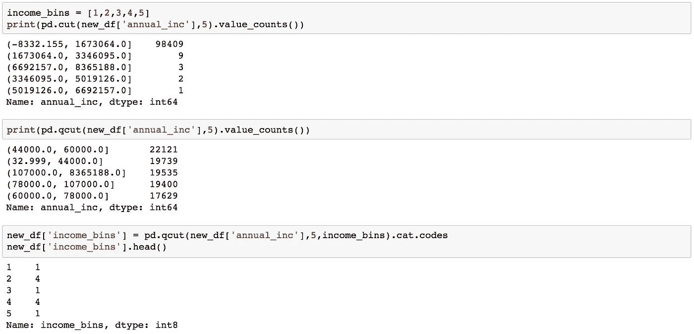

贷款类型或借款人的状态等变量保持不变，我们可以仔细查看每个变量的唯一值。

## 初步分析

那么我们第一眼看到的是什么呢？

令人难以置信的扭曲的债务收入比

Loan amount and interest rate distributions

贷款金额和利率的偏度和峰度偏离正态分布，但非常低。较低的偏斜度值表示两条尾巴的重量没有显著差异。这些值不会向某一特定方向倾斜。较低的峰度值表示两个尾部的组合权重较低，表示存在少量异常值。

有趣的是，贷款金额的峰值出现在 5000 美元的区间内。鉴于这种对整数的偏好，分步定价策略可能吗？

此外，在收益率低于 10%时，利率会出现一个明显的峰值。鉴于高收益公司债券徘徊在 7.5%左右，P2P 贷款必须以更高的利率来证明其风险状况，这似乎是有道理的。

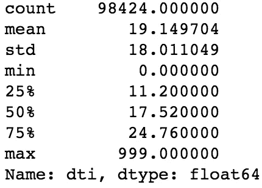

债务与收入比率的分布明显偏斜，尾部非常重。考察个别异常案例，了解贷款是如何发放给这些高风险个人的，将会很有意思。

**修罗和脚蹼**

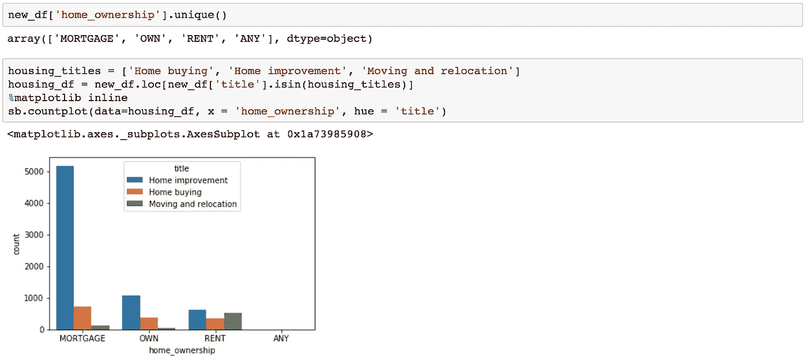

从贷款类型来看，有一些特别突出的与房屋相关的贷款类型。考虑到有借款人房屋所有权状况的信息，我创建了一个新的房屋特定贷款数据框架来寻找有趣的趋势。

乍看之下，绝大多数有抵押贷款的借款人都在申请房屋装修贷款，几乎相当于房主和租房者的 5X。他们也是为了买房而贷款最多的群体。

抵押贷款的房主真的喜欢重新粉刷房子和安装吊灯吗？一种解释可能是，这些住房改善不是为了自己，而是为了在转手之前增加房产价值。这些固定和翻转操作并不新鲜，在 [Attom](https://www.attomdata.com/news/market-trends/flipping/q1-2018-home-flipping-report/) 有关于这种现象的深入报道。一个公开的跨州房屋转手活动数据集将有助于更深入地了解这种 P2P 贷款的借款人构成。

另一个有趣的发现是针对租房者的“搬迁”贷款。虽然这种贷款的数量对其他群体来说几乎可以忽略不计，但房屋租赁者由于其居住安排的短期性质，对这种贷款有更多的需求。

**债务整合中的高额贷款集中**

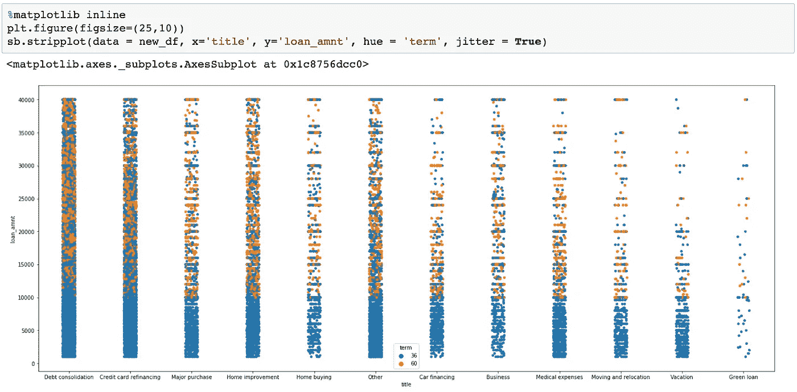

Quick tip: the use of jitter=True prevents overlapping points and provides more information around individual data points

在债务合并、信用卡再融资和房屋装修类别中，似乎集中了高于中值的高价值贷款。鉴于债务合并通常是指个人与高水平的无担保贷款或太多的信贷设施，高贷款额是有道理的。

从色调的分布来看，大额贷款的期限明显集中在 60 个月。这将可靠地符合借款人更愿意分期偿还大笔贷款的假设。

**加州爱 P2P 贷款**

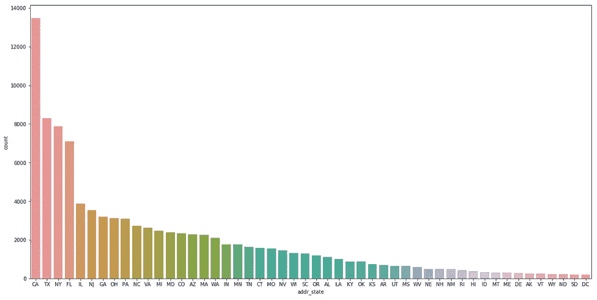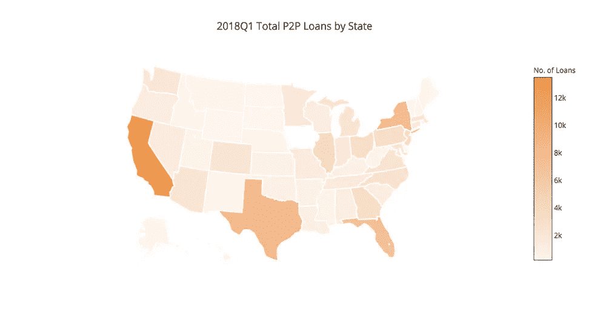

贷款数量和 P2P 贷款总额的图表显示，加州对这种形式的信贷有着贪婪的胃口。它获得的 P2P 贷款比排名第二的德克萨斯州多 40%。这种巨大的差距有几种解释。

有报告显示，较富裕的州通常倾向于承担更多的债务。加州的债务收入比是各州中最高的，这在我们的数据中也很明显。

此外，加州是美国技术最娴熟的州之一，可能会更多地接触 P2P 贷款平台等替代融资解决方案。事实上，P2P 贷款总额最高的州包括两个现有的顶级金融科技生态系统(加利福尼亚州，纽约州)和两个增长最快的金融科技中心(德克萨斯州，佛罗里达州)。

## 是什么决定了跨州的 P2P 贷款使用情况？

鉴于各州 P2P 贷款数量的概况，为什么不更进一步呢？

《赫芬顿邮报》上有一篇关于美国房地产危机的很棒的文章，有一个有趣的观察，在租金和房价上涨的情况下，由于种族财富差距，非裔美国人倾向于非传统贷款。由于信用评分和收入水平较低等原因，他们更有可能被这些贷款来源拒绝。

几个问题突然出现在我的脑海里:
1。他们会转向其他替代融资来源吗？比如说，P2P 贷款来获得与房屋相关的贷款？
2。其他州特有的因素会影响住房贷款的数量吗？

**搜集时间**
我去了[www.census.gov](http://www.census.gov)搜集了各州层面的数据，从人口统计到经济数据。

在 Google Chrome 的网络选项卡中，我发现人口普查表上呈现的大部分数据来自另一个网站，链接类似于此:[https://www . census . gov/quick facts/fact/table/DC，US/PST045217？ajax=true#qf-headnote-c](https://www.census.gov/quickfacts/fact/table/dc,US/PST045217?ajax=true#qf-headnote-c)

此外，这些页面中的每一个都包含了到 csv 文件的另一个链接，这些数据看起来像这样:[https://www.census.gov/quickfacts/fact/csv/dc,US/PST045217](https://www.census.gov/quickfacts/fact/csv/dc,US/PST045217)

不同州的链接之间的唯一区别似乎是链接中的州代码。假设我的数据集的‘addr _ state’列中有所有唯一的州代码，我编写了一个循环来为每个州创建到每个 csv 的不同链接。一旦所有的数据都被提取出来，一个数据框架就会被创建出来，其中只包含与种族、住房和收入相关的变量。

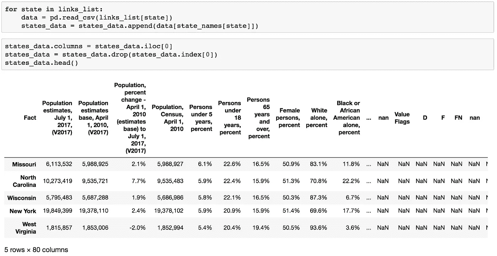

所有带有 NaN 的列都被删除，并根据索引中的州名添加了一个附加列' addr_state'。这是为了能够根据州代码合并数据帧。

我还从 FRED 那里获得了 2016-2018 年各州房价指数的另一个数据集。利用这个数据集，我在一个新的数据框架中创建了一个新列，用于显示 2016 年至 2018 年房价指数的百分比变化。

鉴于这只是对与住房相关的贷款的观察，我们基于相关 P2P 贷款的贷款计数创建了一个新的数据框架。

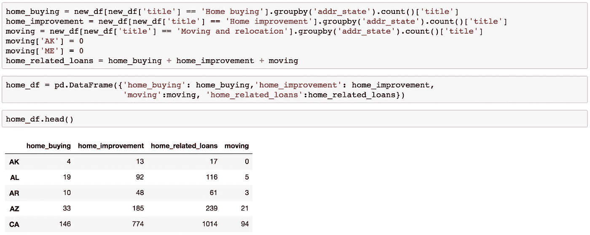

通过将数据框架合并在一起，从三个不同的来源创建了所需变量的主数据框架。房屋相关贷款，房屋购买、改善和移动 P2P 贷款的集合，是模型的结果变量。

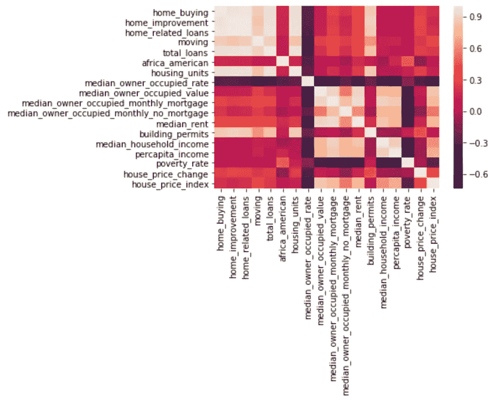

不同变量之间的相关性显示，住房单元和建筑许可与住房相关贷款的结果变量高度相关。

我特别想使用“总贷款”作为控制变量，因为它与房屋相关贷款数量的结果变量和住房单元的独立变量相关。

然而，总贷款和住房相关贷款之间存在内生变量偏差。有更多的住房相关贷款，因为有更多的贷款，还是有更多的贷款，因为有更多的住房相关贷款？除非对这两个变量之间的关系有更清楚的了解，否则将贷款总额作为控制变量是不合适的。

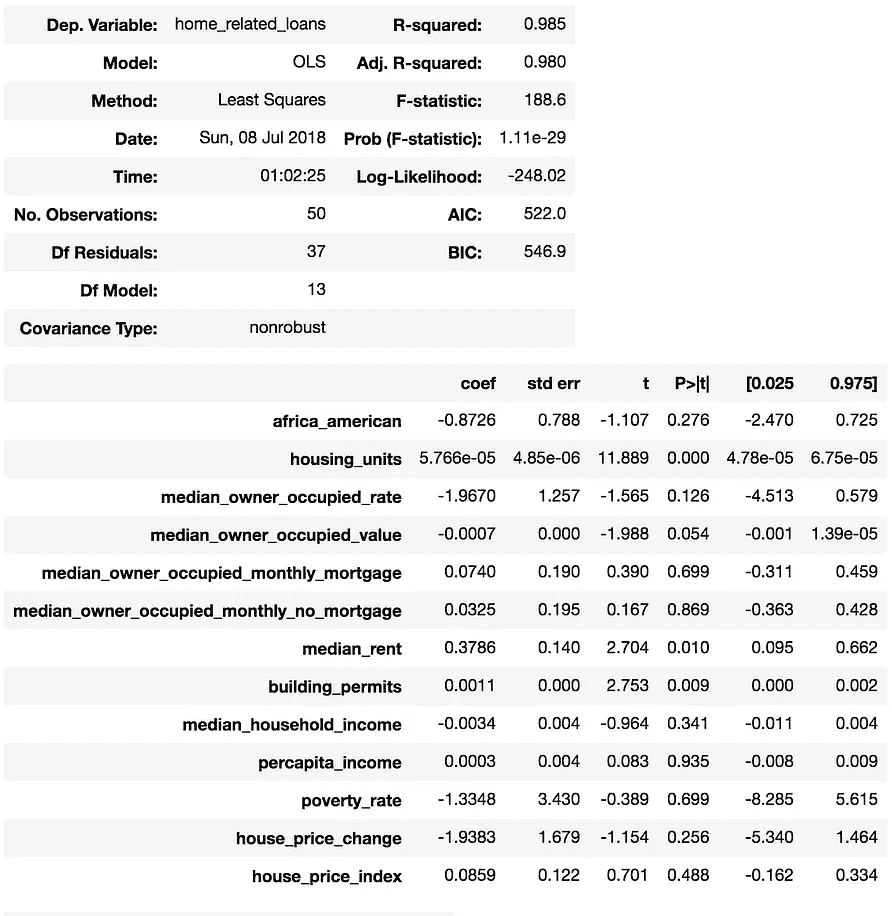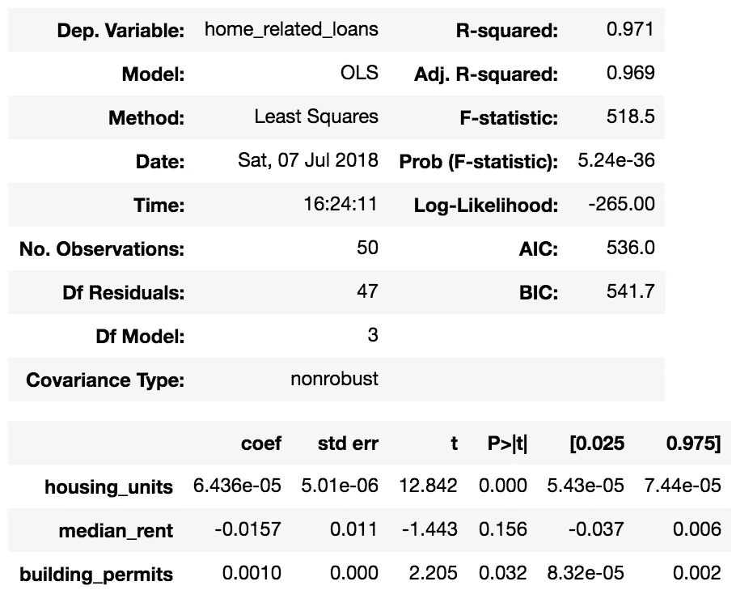

First regression with all variables, second regression with statistically significant variables from first regression

乍一看，从 0.985 的 R 平方值来看，住房相关贷款的大部分可变性可以用现有变量来解释。

尽管住房单元和建筑许可证的系数值低得令人难以置信，但只有住房单元的数量、中位租金和建筑许可证的数量具有统计意义。住房单元和建筑许可证数字都表明住房供应和更多的贷款将被用于抵押或改善住房。较高的租金价格可能表明需要 P2P 贷款来支付这种生活成本，尽管这种贷款可以归类在其他标题下，如“其他”或“债务合并”。

仅针对统计显著变量的第二次回归运行返回了类似的 0.971 的高 R 平方，但将住房单元作为唯一具有无穷小系数值的统计显著变量。

那么…这一切都是徒劳的？

不完全是。尽管数据和提出的问题不匹配，但这里有一些改进的要点和想法:

**贷款用途的细分**——当前与住房相关的贷款类型主要面向房主和购房者。《赫芬顿邮报》文章中提到的贷款是为接近贫困线的非裔美国人和少数族裔提供的。此类贷款可能反映了用于支付租金和其他直接生活费用的发薪日贷款，可以归类为“债务合并”和“其他”类。对贷款用途进行更细致的分析，可以更准确地反映非裔美国人使用替代融资的情况。

**低 P2P 市场份额**——这里看到的住房单元和许可证的微小系数可以归因于替代融资来源所占的抵押贷款市场的微小部分。P2P 贷款平台不太可能是住房供应的显著受益者。

**缺乏可靠的种族代理人**——各州的非裔美国人人口并不是该种族群体贷款的最佳代理人。从 P2P 或抵押贷款记录中获取更多关于个人贷款种族的个人贷款信息将会改进该模型。

**包含更多特征变量**——本文选择了贷款变量和状态变量的一个选定子集，尽管实际上，对变量组的仔细重新设计可能会产生其他有用的变量来改进模型。这种包含大量新变量的做法不可避免地导致了维数灾难，但那是另一天的争论。

**缺乏替代融资意识的指标**——意识指数或跨种族和州的替代贷款来源知识的其他替代物会极大地改善该模型，因为它会令人难以置信地描述贷款人如何考虑和使用这种新的融资资源。例如，拥有更多 STEM 毕业生或技术孵化器的州更有可能了解 P2P 贷款的可用性。

**合并数据帧的不同方式**——还有其他一些重塑和合并来自其他来源的数据的替代方式，这些方式会导致不同的模型。例如，一个热编码可以用来指示不同的状态。另一个例子是从逐个贷款的基础上构建模型，而不是像现在这样逐个州地构建模型。

**时间序列分析**——所运行的回归模型只是时间上的一个快照。如果能够收集过去 5 年每个财务季度的数据点，结果将更具代表性。

**对现有的抵押贷款数据集进行逆向工程以进行竞赛**——如果有外部抵押贷款数据集具有与贷款俱乐部数据集相似的特征变量，则可能创建一个预测模型来标记贷款俱乐部的贷款。虽然肯定不如实际标签准确，但考虑到数据隐私，这可能是下一个最佳选择。

感谢阅读，您可以在这里找到相关代码和其他试用型号[！](https://github.com/finnqiao/lendingclub_states)