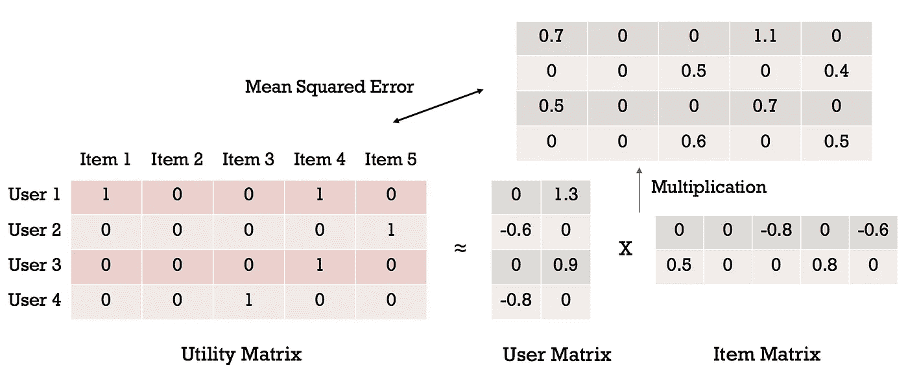
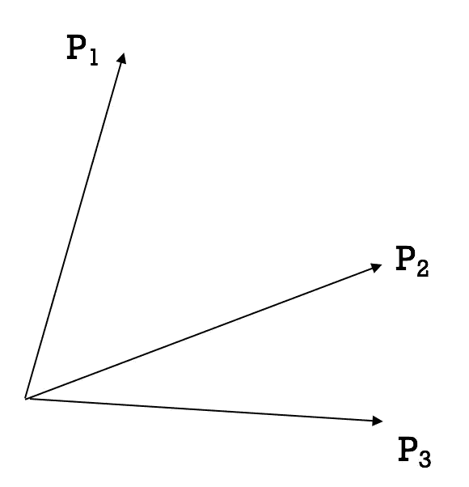
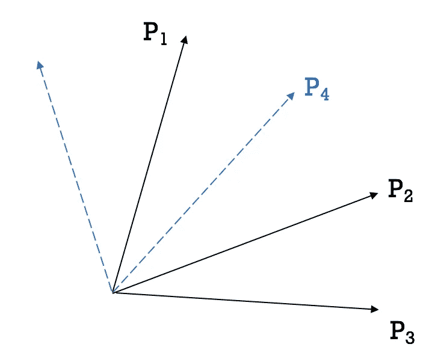
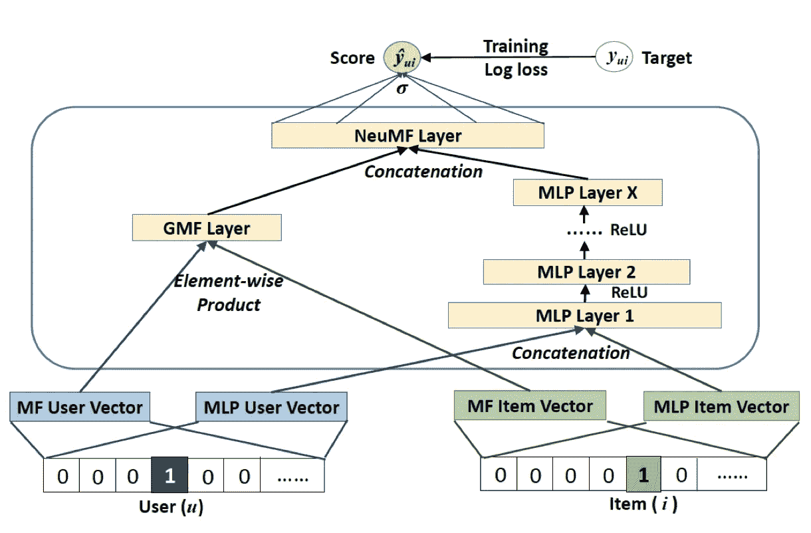
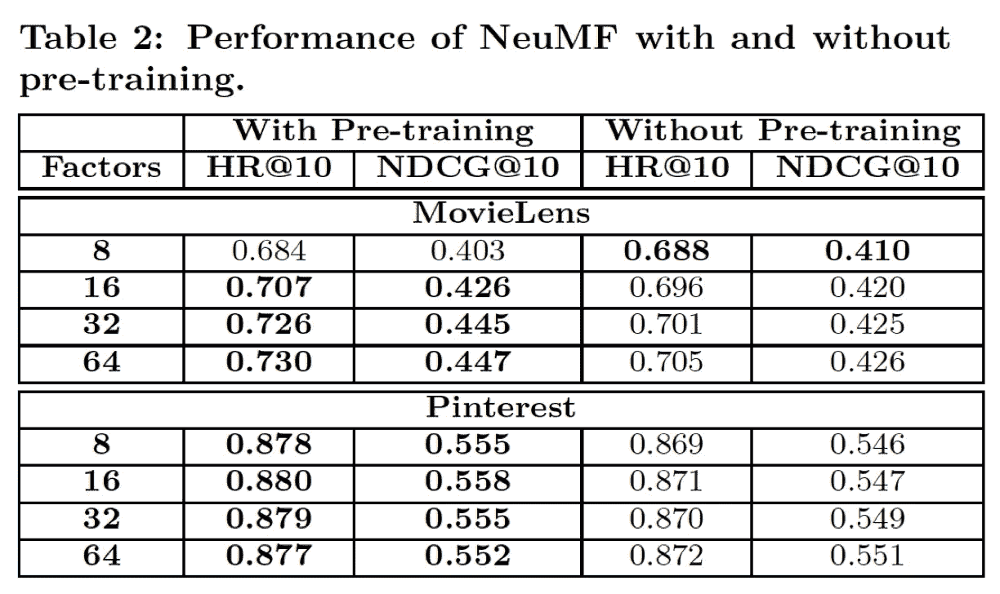

# 论文综述:神经协同过滤的解释和实现

> 原文：<https://towardsdatascience.com/paper-review-neural-collaborative-filtering-explanation-implementation-ea3e031b7f96?source=collection_archive---------4----------------------->

Figure Source: Pixabay

神经协同过滤(Neural Collaborative Filtering，NCF)是新加坡国立大学、哥伦比亚大学、山东大学、德克萨斯 A&M 大学于 2017 年发表的论文。它利用神经网络的灵活性、复杂性和非线性来构建推荐系统。证明了矩阵分解这种传统的推荐系统是神经协同过滤的特例。此外，它还显示了 NCF 在两个公共数据集上优于最先进的模型。本文将解释 NCF 的概念，并演示如何在 Pytorch 中实现它。

**视频版本:**

Video

# 先决条件

在深入研究之前，你应该知道什么是推荐系统，以及一些基本的推荐系统。你可以阅读我的[上一篇文章](https://hackernoon.com/introduction-to-recommender-system-part-1-collaborative-filtering-singular-value-decomposition-44c9659c5e75)，快速装备自己相关知识。

# 矩阵分解

让我们从矩阵分解开始。它将效用矩阵分解成两个子矩阵。在预测期间，我们将两个子矩阵相乘以重构预测的效用矩阵。效用矩阵被因式分解，使得这两个矩阵的乘积与真实效用矩阵之间的损失最小化。一种常用的损失函数是均方误差。

本质上，每个用户和项目都被投射到一个潜在空间，由一个潜在向量表示。两个潜在向量越相似，对应的用户偏好就越相关。因为我们将效用矩阵分解到同一个潜在空间中，所以我们可以用余弦相似度或点积来度量任意两个潜在向量的相似度。事实上，每个用户/项目条目的预测是通过相应潜在向量的点积来计算的。

The prediction equals the inner product of latent vectors

然而，该论文认为点积限制了用户和项目潜在向量的表达能力。让我们考虑下面的情况。我们首先关注效用矩阵的前三行。

设 S{x，y}表示用户 x 和用户 y 之间的相似性。通过计算用户 1、2 和 3 之间的余弦相似性，我们知道 S{2，3} > S{1，2} > S{1，3}。不失一般性，我们将用户映射到如下的二维潜在空间。

现在，我们考虑用户 4。与其他相似性比较，我们得到 S{1，4} > S{3，4} > S{2，4}。然而，无论我们把潜在向量 P4 放在 P1 的左边还是右边，它都不可避免地比 P3 更靠近 P2。

因此，这个例子显示了内积在完全模拟潜在空间中用户和项目之间的交互方面的局限性。

# 神经协同过滤

论文提出了如下图所示的神经协同过滤。在输入层，用户和项目是一次性编码的。然后，用相应的嵌入层将它们映射到隐藏空间。神经 FC 层可以是任何种类的神经元连接。例如，多层感知器可以放在这里。它声称，由于神经 CF 层中的复杂连接和非线性，该模型能够恰当地估计潜在空间中用户和项目之间的复杂交互。

NCF architecture

那么，NCF 是如何推广矩阵分解的呢？让我在下图中展示给你看。我们首先将神经 CF 层替换为乘法层，它对两个输入执行逐元素乘法。然后，我们将从乘法层到输出层的权重设置为 K 乘 1 的固定单位矩阵(全为 1 的矩阵)，采用线性激活函数。

然后，我们有下面的等式。

未观察到的相互作用ŷ_ui 的预测表示重构的效用矩阵上(u，I)项的预测值。l 是线性激活函数，而⊙表示逐元素乘法运算。p_u 和 q_i 分别是用户和项目的潜在向量，J 是维数为(K，1)的单位矩阵。由于 J 是单位矩阵，所以线性函数内部变成了潜在向量 p_u 和 q_i 之间的内积，而且由于线性函数的输入和输出是相同的，所以归结到最后一行。预测标签是相应用户和项目潜在向量的内积。该等式与矩阵分解部分所示的等式相同。因此，这证明了矩阵分解是 NCF 的特例。

# NeuMF

为了引入额外的非线性，提出的最终模型 NeuMF 除了广义矩阵分解(GMP)层之外，还包括多层感知器(MLP)模块。

GMF 和 MLP 模块的输出被级联并与 sigmoid 激活输出层连接。

# 表演

本文用留一法评价了 NCF 模型和其他模型。也就是说，每个用户的最后一次交互被保留下来进行评估。考虑两个评估指标，命中率为 10，NDCG 为 10。命中率@ K 表示给定每个用户 10 个推荐的预测命中的分数。假设我们为每个用户推荐 10 件商品，10 个用户中有 4 个与我们推荐的商品进行了交互，那么命中率@ 10 = 0.4。另一方面，NDCG 可以被视为命中率的扩展，只是它考虑了命中的顺序。这意味着，如果你击中发生在较高的建议，NDCG 将更高。

性能比较如下图所示。在所有情况下，NeuMF 的表现都优于其他模型。

此外，本文还展示了对 NeuMF 的各个模块进行预训练的有效性。在分别训练了 GMF 和 MLP 之后，他们将训练后的 GMF 和 MLP 的权重设置为 NeuMF 的初始化。

# 履行

在这一节中，我将向您展示如何在 Pytorch 中轻松实现 NeuMF。您只需要为每个模型指定两个函数，一个是指定模型结构的 **__init__()** 函数，另一个是定义如何前馈输入张量的 **forward()** 函数。

该论文声称对 MLP 和 GMF 使用单独的嵌入层会产生更好的性能。因此，我们为这两个模块定义了指定的嵌入层。此外，ModuleList 还用于构建多层感知器。

**forward()** 函数相当简单。我们只是让用户和物品索引流过 **__init__()** 中定义的网络。需要特别注意的一点是，我在 GMP 和 MLP 模块的末尾添加了 Dropout 层，因为我发现这有助于调整网络并提高性能。

# 结论

您已经学习了神经协同过滤的概念以及如何在 Pytorch 中实现它。如果您有任何问题，请查看顶部的 Youtube 视频，或者在下面留下您的评论。