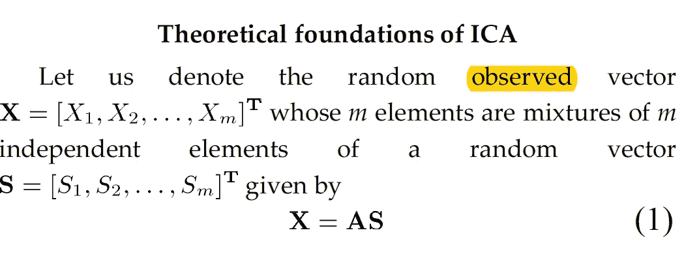
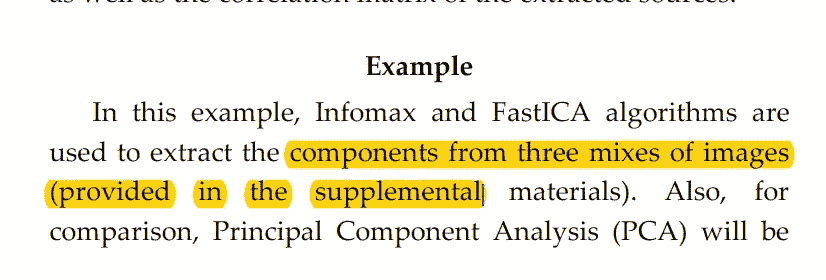

# 【论文摘要】独立分量分析导论:InfoMax 和 FastICA 算法

> 原文：<https://towardsdatascience.com/paper-summary-an-introduction-to-independent-component-analysis-infomax-and-fastica-algorithms-7b44d18ab393?source=collection_archive---------9----------------------->

GIF from this [website](https://giphy.com/gifs/imadeit-qKltgF7Aw515K)

> **请注意，这篇帖子是给未来的自己看的，用来回顾和复习这篇论文上的材料。**

Paper from this [website](http://mail.tqmp.org/RegularArticles/vol06-1/p031/p031.pdf)

**摘要**

本文介绍了不同于主成分分析的独立成分分析。其中优化了给定数据统计独立性。

**简介**

现在，进行某种数据分析是非常容易的，并且有各种各样的方法，如 pca 或因子分析。与此相关的一个重要概念是给定数据的分布，特别是分布的正态性。原因是因为这决定了某些方法在分解某些数据时是否会成功。如上所述，取决于方法和假设的分布，一些方法将成功地正确识别独立信号，而其他方法则失败。(注意 ICA 也有其自身的局限性，与排列或符号有关，但我们也有一种称为独立向量分析的方法。)

**独立成分分析的理论基础**

在这一节中，作者简要讨论了 ICA 的基本原理，例如寻找混合矩阵的逆的非混合矩阵。作者提出了关于 ICA 的 5 个假设。
1)来源在统计上是独立的。
2)混合矩阵为正方形，满秩。
3)不应有外部噪声
4)数据为零均值
5)源信号不得具有高斯概率密度函数。(至少其中一个。)

*统计独立性*

当我们有两个随机变量 x1 和 x2 时，我们可以通过下面的等式定义这两个变量之间的不相关性。

另一方面，我们可以将统计独立性定义为下面的等式。

并且在特定情况下，当联合 pdf 是高斯不相关时，不相关等同于独立。作者介绍了两种度量独立性的方法，即最小化互信息法和最大化非高斯性法。(这是相同的解决方案。)

*互信息最小化*

当我们有两个变量 X 和 Y 时，互信息可以被视为在观察到 Y 之后关于变量 X 的不确定性的减少。因此，通过具有寻求最小化互信息的算法，我们正在搜索最大程度独立的分量(潜在变量)。(InfoMax 是算法的名字)。

*非高斯性最大化*

当我们有两个变量 X 和 Y 时，我们可以通过迫使它们尽可能远离正态分布来实现独立性。为了做到这一点，我们用负熵来度量非高斯性。(这是高斯性的一个积极量度。).并且我们计算近似的负熵而不是直接计算。(FastICA 是算法的名字。)

我不打算写任何关于“如何使用 ICA 包”的东西，因为它只是使用高级 api。

**示例/讨论**

本文作者将三幅图像混合，采用不同的独立分量分析方法提取原始信号。

如上所述，我们可以观察到 ICA 方法能够比 PCA 更清晰地提取信号(原始图像)。此外，在执行 ICA 时，必须考虑多个概念，比如白化数据。FastICA 和 InfoMax 都很健壮，但是必须事先提供正确的分布类型。

**参考**

1.  (2018).Mail.tqmp.org。检索于 2018 年 9 月 4 日，来自 http://mail.tqmp.org/RegularArticles/vol06-1/p031/p031.pdf