# 【论文摘要】基于好奇心的内在动机引发结构化行为

> 原文：<https://towardsdatascience.com/paper-summary-emergence-of-structured-behaviors-from-curiosity-based-intrinsic-motivation-3d2b49f516f1?source=collection_archive---------6----------------------->

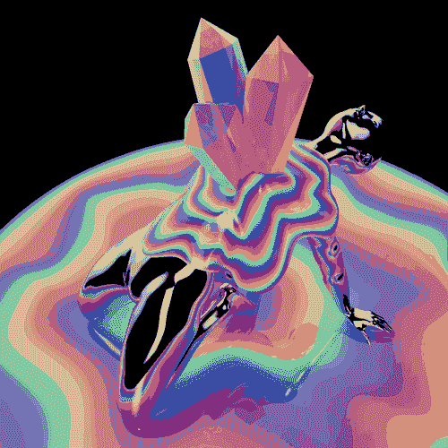

GIF from this [website](https://giphy.com/gifs/heart-crystal-reiki-xThuWl7sV12hg7TXWg)

我从 Carlos E. Perez ( [自我意识深度学习中的自我运动](https://medium.com/intuitionmachine/ego-motion-in-self-aware-deep-learning-91457213cfc4))的一篇博客文章中看到了这篇论文，我立刻就想读它。另外，如果你有时间，我强烈建议你阅读这篇博文，因为它非常有趣。

> **请注意，这篇文章是为我未来的自己写的，目的是回顾这篇论文上的内容，而不是从头再看一遍。**

Paper from this [website](https://arxiv.org/pdf/1802.07461.pdf)

**摘要**

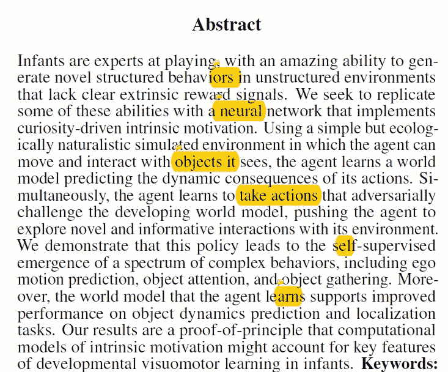

婴儿是在非结构化环境中产生新的结构化行为的专家，在这种环境中没有明确的奖励系统。(我不知道这到底是什么意思，但一般来说，我的理解是，当婴儿出生时，他们通过观察周围的人或事物开始不断学习。他们慢慢地但肯定地获得了世界是如何在他们周围构建的知识。问题是，当婴儿学习时，没有明确的解释或奖励系统，但不知何故，他们或我们能够学习。)

作者通过使用神经网络复制了这些能力，神经网络是一种由好奇心驱动的代理。

**简介**

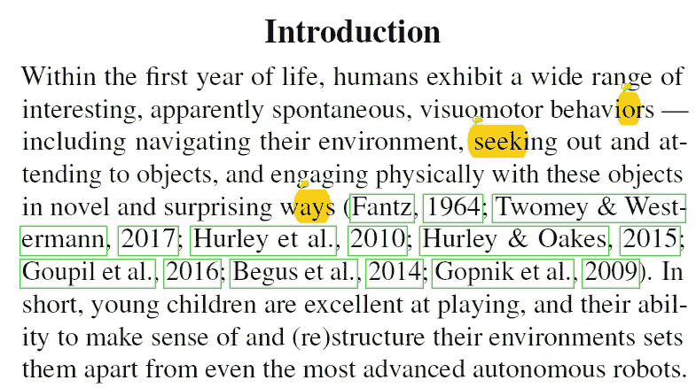

从出生的那一刻起，我们人类就擅长驾驭我们的环境。(而这些环境可以是随机的、自发的、缺乏一般结构的。)换句话说，我们非常擅长模拟我们周围的世界，谢天谢地，与最先进的机器人相比，即使是婴儿在这方面也做得更好。(所以他们还没有接管世界。)

但是主要的问题是我们怎样才能学会这样做？总的来说，我们有非常强大的内置系统(如物体注意/定位和数字感等)，帮助我们完成对周围世界建模的任务。另一个想法(本文研究的)是，我们的动机是对周围世界的好奇。以及通过探索新任务(其中的任务是新颖的，但仍然可以理解)。)我们能够围绕我们的周围开发出一个非常好的模型。这里要指出的另一个重要事实是循环的概念，一旦我们习惯了这个任务，我们就会寻找更多新的令人兴奋的东西。由于这种循环，我们能够将我们的模型发展成更复杂的模型，所以这是自我监督的学习。另外，作者介绍了“婴儿床里的科学家”这个主题，我找到了一个与这个主题相关的好视频。(见下图)

Video from [ECETP](https://www.youtube.com/channel/UCU1csP9quygVRsPQuAfNEZQ)

最后，作者介绍了论文的主要主题，其中他们创建了一个由基于好奇心的内在动机驱动的代理。

神经网络 A →训练预测代理行为的结果
神经网络 B →训练对抗挑战模型的当前状态(代理策略)(我猜这就是作者所说的好奇心)

通过成功地训练所有的网络，作者证明了创造一个能够理解自我产生的自我运动的代理是可能的，在这种运动中，他们有选择地关注、定位和与物体互动，而不必内置任何这些概念。

**代理架构和环境**

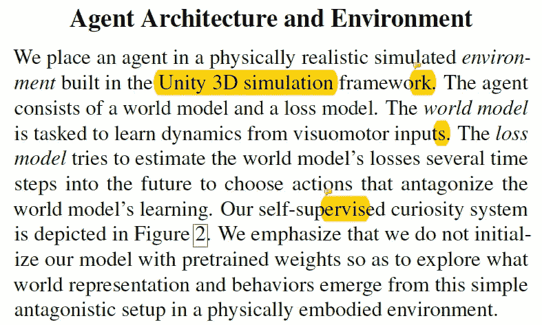

作者使用 [Unity](https://unity3d.com/) 来训练一个智能体，其中它有一个世界模型，试图理解智能体周围世界的动态，还有一个损失模型，试图逼近未来时间戳的世界模型损失，以对抗世界模型的学习。最后，作者没有加载任何预先训练的权重，使代理从零开始学习。

**交互环境**

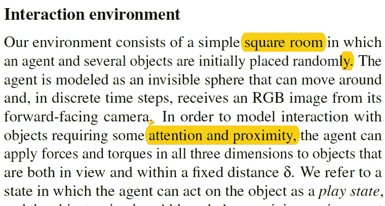

在这一节中，作者描述了实验是如何设置的。例如，代理是一个正方形房间中的球体，它接收离散时间戳中的 RGB 图像等……此外，作者还详细介绍了他们如何定义状态空间(在时间戳 t 和 t -1 捕获的图像)和动作空间(x，y，z 力/扭矩和向前/向后运动)。

**世界模特**

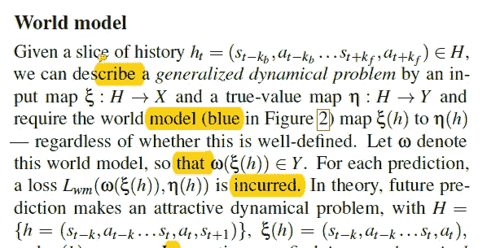

(这部分对我来说很难，因为我不知道什么是广义动力学问题。)首先，给定状态和动作的历史片段(H ),有两个函数。A(H) →输入映射函数// T(H) →真实映射函数并且其中一个神经网络正在尝试将 A(H)映射到 T(H)。总之，代理正试图学习一个与真实世界相似的世界模型。最后，作者强调他们把问题公式化为逆动力学预测。与其预测未来，不如填写缺失的动作。

**损失模型**

在这一节中，作者描述了他们如何创建一个损失模型。它由卷积神经网络构成，在 CNN 的最后几层增加了多层感知。他们使用 softmax 交叉熵损失进行分类。然而，我现在还不能 100%确定有哪些不同的职业。(所以我将不得不学习更多的 RL 并回到这个问题上来，如果任何人确切地知道他们在谈论什么，请在下面评论。)

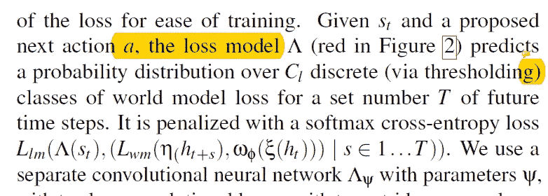

**行动策略**

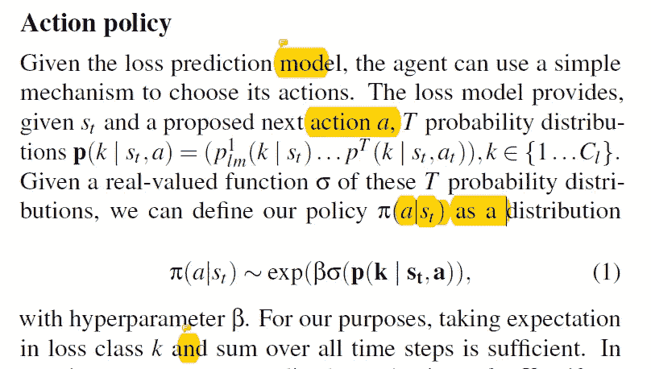

在这里，作者描述了模型的动作策略。我们知道，当给定 T 中的状态以及建议的下一个动作 a 时，损失函数能够为我们提供 T(概率分布)。似乎作者创造了另一个函数σ，它接受这些分布并给出一个实值。接下来，我们将通过一些β项来缩放真实值，最后取最终结果的指数。(这部分和损失模型对我来说很难理解。)

**实验**

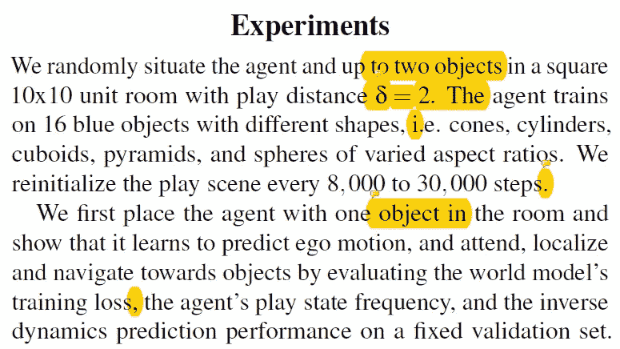

实验从将试剂随机放置在 10*10 平方的房间中开始。(有一定的播放距离，场景每 8000 到 30000 步重置一次。).关于这个实验的一个非常有趣的事实是，随着(一个代理可以与之交互的)对象数量的增加，代理实际上更喜欢与所有的对象进行交互。(我猜这就是好奇心的动力来源，例如，在玩了圆形之后，代理可以移动到球形，然后移动到三角形。因为它是由新的令人兴奋的形状等激发的。)最后，作者将学习权重/好奇心策略(LW/CP-40)与随机权重/随机策略(RW/RP)和学习权重/随机策略(LW/RP)进行了比较。

**自我运动学习**

如上所述，RW/RP(绿线)不能很好地学习，损失值很高。LW/RP 能够快速收敛到一个较低的值，因为它从一个恒定的随机分布中学习，而没有对抗性的策略。(无对抗性政策)。但是 LW/CP-40 是两者的混合，首先它能够收敛到一个较低的值，但是由于敌对政策，损失增加。

**物体注意的出现**

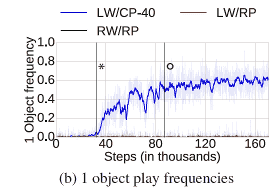

随着 LW/CP-40 损失值的增加，其目标播放频率也增加，如上所示。(出于好奇)。我们可以观察到其他权重和策略根本不与对象交互。

**改进的逆动力学预测**

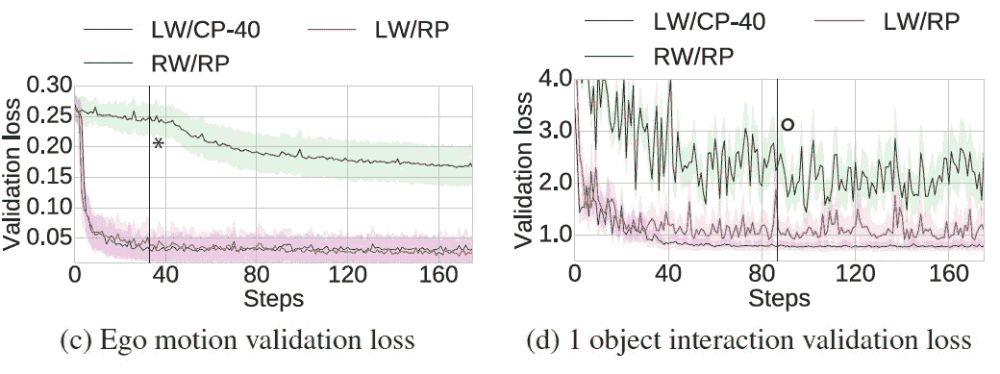

如上所述，当作者测量不同代理在 1)自我运动确认损失 2)对象动作上的表现时，我们可以清楚地观察到 LW/CP-40 优于这两个任务。(不是因为自我运动验证损失，因为 LW/RP 也具有相当低的值。)

**改进的目标检测和定位**

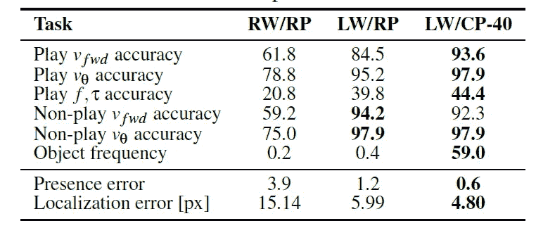

此外，为了证明 LW/CP-40 在目标定位和存在方面的性能优势，他们训练了一个线性/逻辑回归模型。(训练/验证数据都来自代理所处的环境。)如上所述，LW/CP-40 策略具有最低的误差，表明代理能够学习更好的视觉特征。

**导航和规划**

此外，为了证明代理的导航和规划能力，作者已经可视化了损失地图，如上所示。当红色区域表示更多更高的损失时，接受过 LW/CP-40 政策培训的代理将实际采取更接近目标的行动。(非常有趣，尽管错误率很高，但代理实际上会朝那个方向移动…)

**多对象交互的出现**

最后，即使对于两个对象交互实验，我们也可以观察到，在 LW/CP-(40 或 20)策略上训练的代理倾向于与不同的对象进行交互。(而且他们似乎更乐于接受学习新东西的想法。)具体来说，我们可以看到 LW/CP-40 策略比 LW/CP-20 策略更好地学会了使用 2 个对象。

**讨论及未来工作**

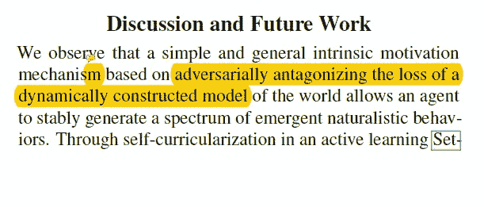

总之，作者能够创建一个由好奇心驱动的代理，通过自我监督学习系统，代理能够适应周围的复杂世界。例如，在开始时，代理人集中精力学习自己的自我运动的动力学。之后，它开始学习物体的存在或定位，因此放弃了无聊的自我运动预测任务，接受新的挑战。

此外，作者还指出了当前工作的一些不足之处。(例如适当具体化的带有手臂的代理，以模拟更真实的交互或更好的策略等)

**遗言**

作为强化学习的初学者，我发现这篇论文上的材料非常难掌握。我迫不及待地想深入研究 RL :D。另一篇与这个主题相关的好论文是“[学习使用内在激励的自我意识代理](https://arxiv.org/pdf/1802.07442.pdf) s”

如果发现任何错误，请发电子邮件到 jae.duk.seo@gmail.com 给我，如果你想看我所有写作的列表，请在这里查看我的网站。

同时，在我的 twitter [这里](https://twitter.com/JaeDukSeo)关注我，并访问[我的网站](https://jaedukseo.me/)，或我的 [Youtube 频道](https://www.youtube.com/c/JaeDukSeo)了解更多内容。我还实现了[广残网，请点击这里查看博文 pos](https://medium.com/@SeoJaeDuk/wide-residual-networks-with-interactive-code-5e190f8f25ec) t。

**参考**

1.  自我意识深度学习中的自我运动-直觉机器-媒介。(2018).中等。检索于 2018 年 6 月 17 日，来自[https://medium . com/intuition machine/ego-motion-in-self-aware-deep-learning-91457213 CFC 4](https://medium.com/intuitionmachine/ego-motion-in-self-aware-deep-learning-91457213cfc4)
2.  北达科他州哈伯市、姆罗卡特区、飞飞市和亚明斯特区(2018 年)。基于好奇心的内在动机的结构化行为的出现。Arxiv.org。检索于 2018 年 6 月 17 日，来自 https://arxiv.org/abs/1802.07461
3.  婴儿床里的科学家。(2018).YouTube。检索于 2018 年 6 月 17 日，来自 https://www.youtube.com/watch?v=HnRVbWsqHLw
4.  (2018).Arxiv.org。检索于 2018 年 6 月 17 日，来自[https://arxiv.org/pdf/1802.07442.pdf](https://arxiv.org/pdf/1802.07442.pdf)
5.  团结。(2018).团结。检索于 2018 年 6 月 18 日，来自[https://unity3d.com/](https://unity3d.com/)