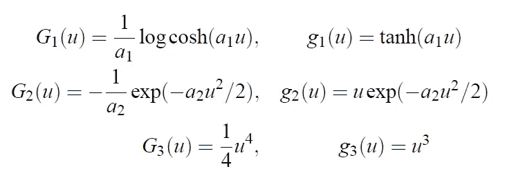

# 独立分量分析的快速鲁棒定点算法

> 原文：<https://towardsdatascience.com/paper-summary-fast-and-robust-fixed-point-algorithms-for-independent-component-analysis-6f3991ff5514?source=collection_archive---------8----------------------->

GIF from this [website](https://giphy.com/gifs/independent-XFYnh5fSGVLRm)

这篇论文已经这么有名了，我想我不需要提供什么解释了。

> **请注意，这篇帖子是为了我未来的自己复习这篇论文上的材料，而不是从头再看一遍。**

Paper from this [website](https://www.cs.helsinki.fi/u/ahyvarin/papers/TNN99new.pdf)

**摘要**

独立成分分析，将给定的数据分解成尽可能独立的成分。本文作者使用了两种方法来获得这一结果，即 Comon 的信息论方法和投影寻踪方法。并且使用最大熵近似，作者引入了新的目标函数。(我们将互信息最小化。)

**简介**

寻找合适的表示是神经网络以及统计等其他领域的中心问题。这些表示通常被认为是原始数据的线性变换。(有一些方法可以找到这些表示，如 PCA、因子分析等……)。ICA 两个应用是盲源分离和特征提取。ICA 的特征提取受到神经科学的启发，神经科学表明冗余减少的相似原理解释了大脑早期处理感觉数据的一些方面。本文引入了新的目标函数，认为问题是最小化互信息。

**ICA 的对比功能**

看待 ICA 的另一种方式是对上面看到的数据的以下生成模型的估计。(其中 S 是独立的潜在向量，X 是原始数据，最后 A 是学习的变换矩阵，而 W 是 A 的逆)。Comon 展示了如何获得更一般的 ICA 公式，如下所示，其中我们从随机向量 y 定义了差分熵 H。(这个概念是基于互信息的。)

上述方程可以归一化为负熵，它对于线性变换是不变的。(负熵也可以解释为非高斯性的度量。)

最后，使用微分熵的概念，我们可以定义 n(标量)随机变量之间的互信息 I 如下。

使用上面显示的所有概念，本文的作者已经将 ICA 问题定义为 s = Wx，其中 W 是学习的权重，使得变换分量 s 的互信息最小化。(这也等于找到负熵最大化的方向。)

*通过负熵近似的对比函数*

为了使用上述概念来执行 ICA，我们首先需要找到一个简单的负熵估计。从其他文献中，作者告诉我们，我们可以使用上述函数，其中 G 是非二次函数，C 是常数，V 是标准化变量，y 是均值和单位方差为零的随机变量。为了找到单个独立分量，我们可以使用下面的等式。(注意，如果我们多次迭代下面的方案，我们可以估计多个独立分量。)

并且当分量的负熵之和最大化时，互信息最小化。因此，我们可以将问题重新表述为优化问题，如下所示。(带有附加约束。)

**估计量的分析和对比函数的选择**

在本节中，作者已经证明了几个事实，例如
***a. W 是 ICA 数据模型中一个分量的一致估计量。*** (如果 W 是向量)
***b .当非二次函数 G 的形式如下所示时，W 的渐近方差最小。(fi(。)是 si 的密度函数，k1，k2，k3 是任意常数)***

***c .如果函数 G 有界，那么学习到的 W 对于异常值是鲁棒的***

*对比功能的实际选择*

上述三个函数是函数 G 的一个很好的选择，作者方法的一个巨大优势是它们提供了适用于独立分量的任何分布和对比函数的任何选择的估计量。

**独立分量分析的定点算法**

在这一节中，作者提供了执行 ICA 的完整算法，关于最小化互信息。本文提出的方法也可以通过梯度下降来求解，但是用户必须注意这样的事实，即学习速率可以中断或使收敛。为了克服这个问题，作者使用了定点迭代算法，在该算法中，计算是成批进行的，并且具有并行、分布式、计算简单和需要很少存储空间的优点。

为了估计单个独立分量，我们可以使用如上所示的定点迭代算法。(详情请阅读论文。)并且上面的方法可以转换成梯度下降法，如下所示。(下面的方法更稳定。)

最后，如果原始数据之前没有被白化，我们可以使用下面的算法。

*多个单位的定点算法*

现在，作者介绍了一种算法来为多个单元执行 ICA，这里需要注意的一点是，为了防止不同的神经元收敛到相同的最大值，我们必须对每一步的输出进行去相关。(同样，如果原始数据已经被白化，那么符号 C 可以省略。)

第一种方法是逐个找到单个组件，并重新规范化它们。

其他两种方法涉及对称装饰关系，其不具有任何比其他向量优先的向量。不动点算法的一些性质是收敛更快，没有超参数，更稳健，并且能够逐个或批量估计独立分量。

*模拟和实验结果*

经过多次实验，作者证明了这种方法对异常值更鲁棒、更有效、更快(收敛)的事实。

**结论**

本文作者提出了一种通过最小化互信息实现独立分量分析的定点算法。并且该算法可以应用于原始数据或白化数据。此外，通过使用对称装饰关系，还可以批量估计独立分量。

**遗言**

这是一种执行 ICA 的巧妙方法。

如果发现任何错误，请发电子邮件到 jae.duk.seo@gmail.com 给我，如果你想看我所有写作的列表，请[在这里查看我的网站](https://jaedukseo.me/)。

同时，在我的 twitter [这里](https://twitter.com/JaeDukSeo)关注我，并访问[我的网站](https://jaedukseo.me/)，或我的 [Youtube 频道](https://www.youtube.com/c/JaeDukSeo)了解更多内容。我也实现了[广残网，请点击这里查看博文 pos](https://medium.com/@SeoJaeDuk/wide-residual-networks-with-interactive-code-5e190f8f25ec) t。

**参考**

1.  (2018).Cs.helsinki.fi 于 2018 年 8 月 17 日检索，来自[https://www.cs.helsinki.fi/u/ahyvarin/papers/TNN99new.pdf](https://www.cs.helsinki.fi/u/ahyvarin/papers/TNN99new.pdf)