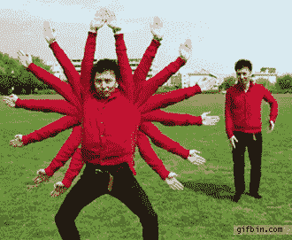
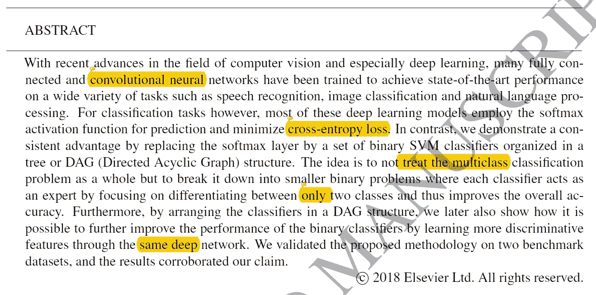
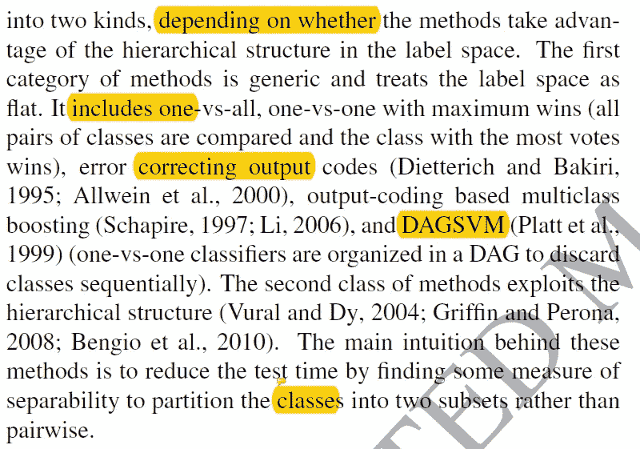
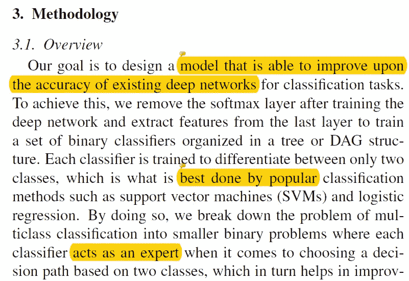
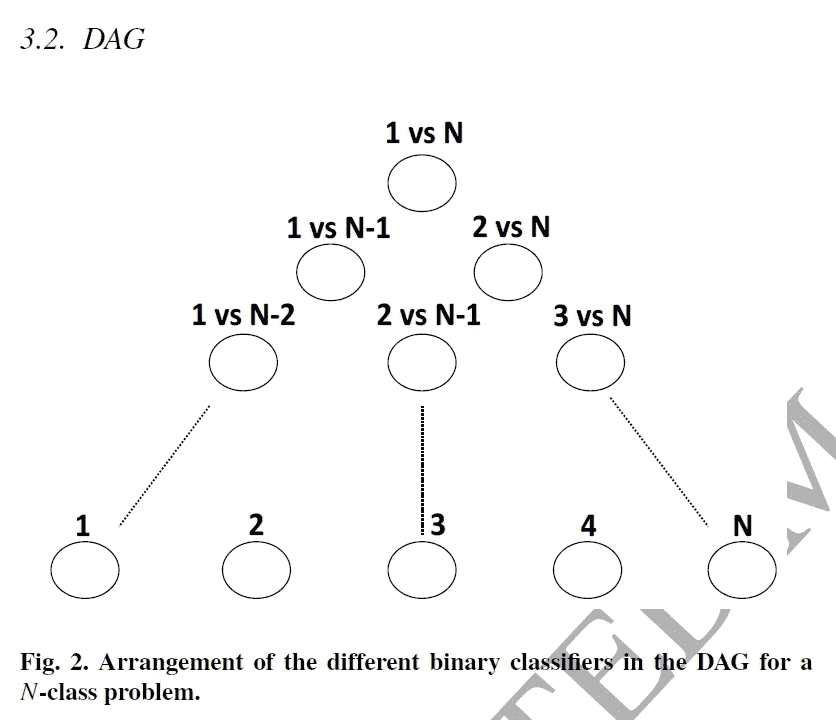
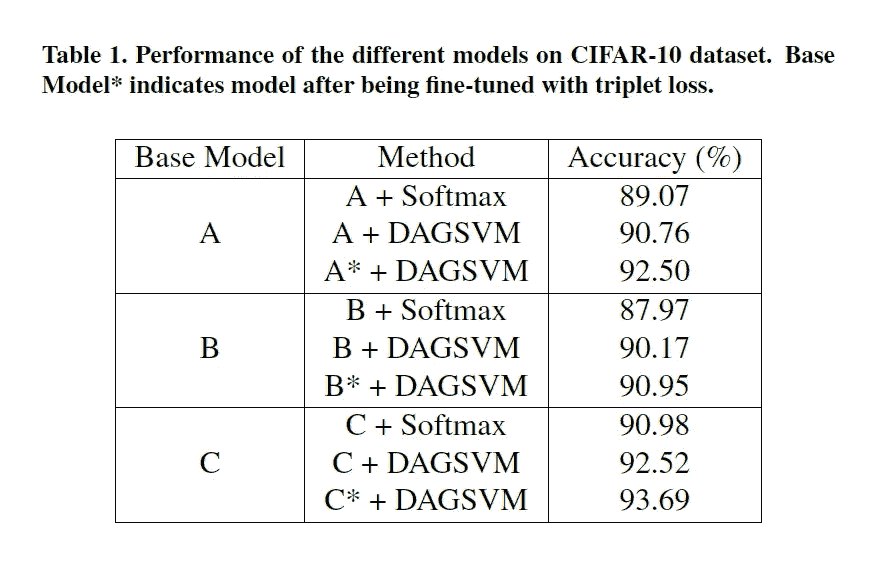
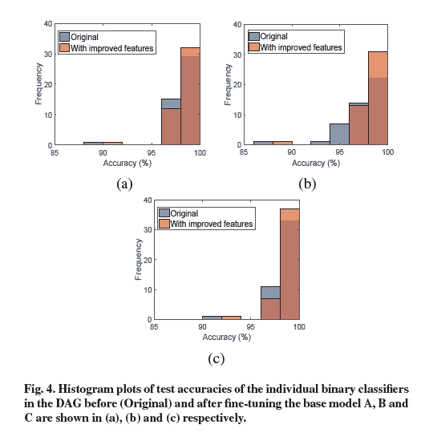

# [论文摘要]使用 DAGSVM 和三元组丢失改进深度网络的多类分类

> 原文：<https://towardsdatascience.com/paper-summary-improving-multi-class-classification-by-deep-networks-using-dagsvm-and-triplet-19edb947c408?source=collection_archive---------5----------------------->

GIF from this [website](https://giphy.com/gifs/trick-arms-multiple-uyuOzVbO8bene)

有趣的多类分类方法。

> **请注意，这篇帖子是为了我未来的自己复习这篇论文上的材料，而不是从头再看一遍。**

Paper from This [website](https://www.sciencedirect.com/science/article/pii/S0167865518302745)

**亮点**

本文提出了一种提高多类分类精度的新方法。主要通过替换 softmax 函数并具有三重损耗。

**摘要**

在大多数多类分类任务中，许多研究者使用 softmax 函数作为一个整体来处理分类任务。但是在这篇论文中，作者提出了一种新的方法来做同样的事情。主要是将 softmax 函数替换为以树或 DAG(有向无环图)结构组织的一组二进制 SVM 分类器。因此，每个 SVM 侧重于对两个类别进行分类。

**简介**

许多论文使用 softmax(多项逻辑回归)作为最终分类层来进行多类分类。多类分类是机器学习中最重要的任务之一。这里，作者提出了一种方法，其中网络的早期层不变，仅最外层发生变化。(所以 N 个多类分类问题变成 N(N-1)/2 个二元问题。主要是将 softmax 替换成 DAG 结构中的二元分类器。(这通过学习更多的成对区分特征来提高准确度。)主要思想可以在上图中看到。

**相关工作**

有不同方法来执行多类分类，例如，一对一对所有、一对一对最大获胜、纠错输出编码、基于输出编码的多类提升和 DAGSVM。这里，作者关注 DAG 方法，因为它允许模型学习更多的区别特征，并且它具有较低的时间复杂度。与其他方法的一个不同之处在于，作者将问题分解为一个更简单的二元分类任务。

**方法论**

作者方法背后的主要思想是，每个分类器都成为区分特征的专家，因此与使用 softmax 输出层作为最终分类层相比，模型的整体准确性要高得多。这种方法的另一个优点是，每个单独的分类器可以被微调，以进一步提高模型的准确性。(我觉得这挺酷的)。

***DAG***

如上所述，DAG 是以分层结构组织的节点的排列，当每个节点代表一个 SVM 时，它被称为 DAGSVM。对于 N 类问题，DAG 有 N(N-1)/2 个节点。本文的作者说他们不会改变上图中的体系结构，但是他们知道可以使用不同类型的体系结构来提高模型的性能。

***学习更多的判别特征***

使用三重损失(如上所示)是在最近邻分类法的背景下产生的。并且当与不同类别进行比较时，该损失函数利用网络将相似类别的图像分组在一起。

**实验结果**

该论文的作者使用了三种不同的模型来观察所提出的方法的性能。a)具有修改的 VGG 型网络，B)具有修改的 NIN，C)具有修改的 ResNet。此外，mini batch 设置为 128，并使用 SGD。每个网络的训练曲线如下所示。

在所有的基础网络被训练(使用 Softmax 分类)之后，最后一层(softmax)通过 DAGSVM 被替换，并且再次被训练以提高性能。

上面是一个分类器的准确性直方图，我们可以观察到，微调每个分类器是非常可能的。从而提高整个模型的性能。

对于 STL10 数据集，作者使用了不同的网络，称为小网络 1、小网络 2 和一个大网络。

S1 由具有 64 和 128 个滤波器的两个卷积层组成，随后是两个全连接层，每个层具有 256 和 10 个神经元。

S2 由四个卷积层组成，分别具有 64、128、256 和 512 个滤波器，其后是两个全连接层，每个层具有 512 和 10 个神经元。

L1 与用于 CIFAR 10 数据集的网络 A 相同。而训练曲线可以看到下图。

同样，当使用具有三重损失的 DAGSVM 进行微调时，我们可以观察到网络的性能能够提高。

**讨论**

所执行的实验的一个有趣的事实是，对于较大的网络，与较小的网络相比，DAGSVM 能够以较大的裕度提高模型的性能。这可能是因为在更大的网络中有更多的权重可以被微调。此外，如下所示，我们可以观察到，随着二元分类器的平均精度增加，模型的整体精度也增加。

**结论和未来工作**

总之，本文作者提出了一种将多类分类问题转化为更小的二元分类问题的方法。这种方法不仅通过学习更多的区别特征来提高性能，而且能够对网络进行微调。这种方法的一些限制是，它对于大量的类在计算上是不可行的，并且它不是端到端的训练系统。

**遗言**

我感兴趣的一个领域是不同类型的损失函数。

**参考**

1.  Agarwal、v . Balasubramanian 和 c . Jawahar(2018 年)。使用 DAGSVM 和三元组丢失通过深度网络改进多类分类。模式识别字母。doi:10.1016/j . patrec . 2018 . 06 . 034