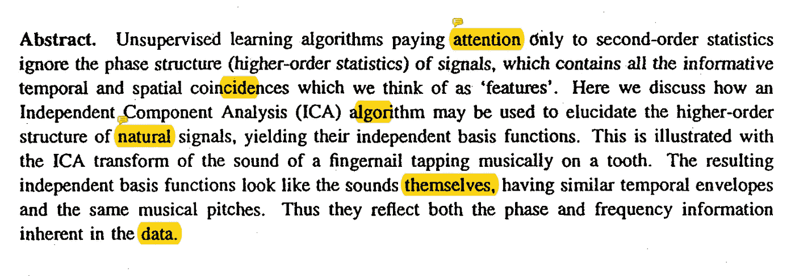
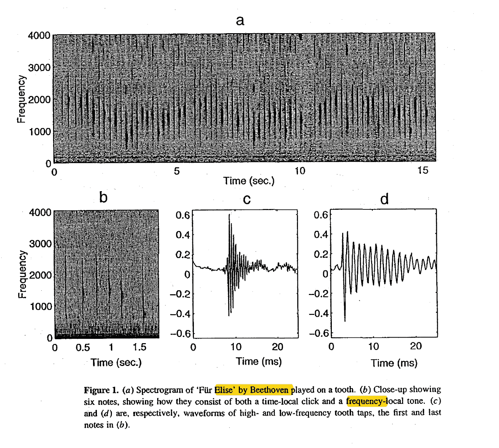
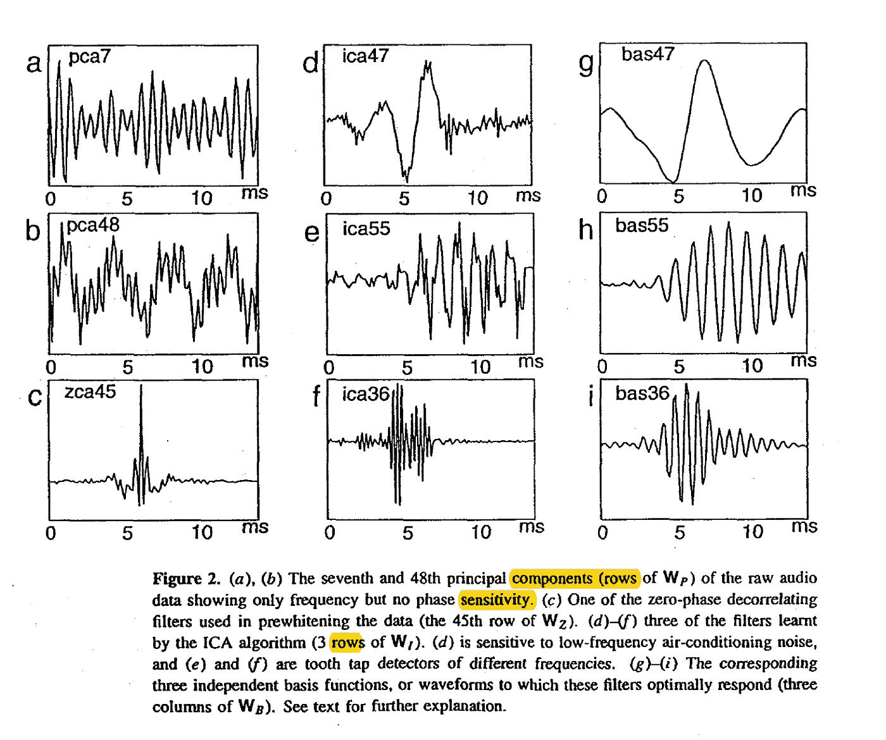
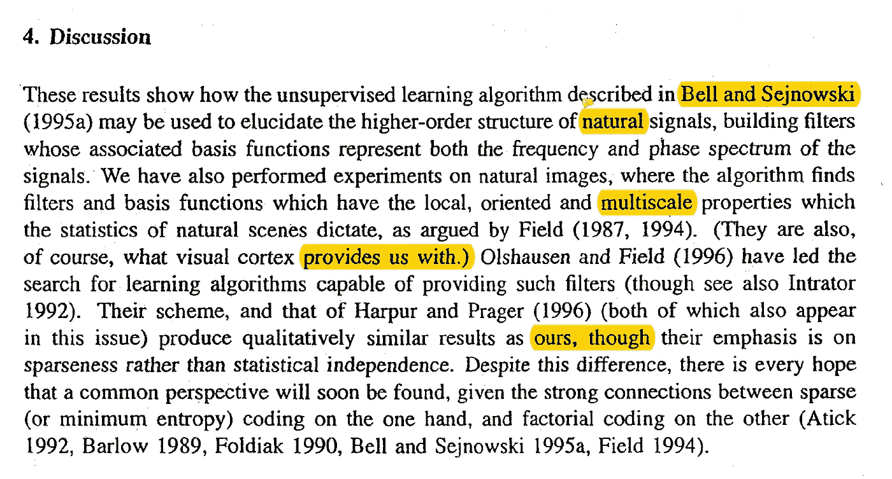

# 【论文摘要】学习自然声音的高阶结构

> 原文：<https://towardsdatascience.com/paper-summary-learning-the-higher-order-structure-of-a-natural-sound-1efc77b2f270?source=collection_archive---------11----------------------->

Photo by [Aaina Sharma](https://unsplash.com/photos/rI2MXeP6sss?utm_source=unsplash&utm_medium=referral&utm_content=creditCopyText) on [Unsplash](https://unsplash.com/search/photos/sound-waves?utm_source=unsplash&utm_medium=referral&utm_content=creditCopyText)

当我发现这篇论文时，我想知道如何在自然声音数据中学习高阶结构。

> **请注意，这篇帖子是给未来的自己看的，回顾这篇论文上的材料，而不是从头再看一遍。**

Paper from this [website](https://pdfs.semanticscholar.org/b524/1dd7d74602186dd65fe05435fc65eae797e4.pdf)

**摘要**

仅关注二阶统计量的无监督学习算法忽略了相位结构(高阶统计量),其中保留了我们称为特征的所有有用信息。为了提取自然声音的高阶结构，作者对声音数据的独立分量分析进行了讨论和实验。

**贫困的二阶统计**

自然信号具有跨越空间和时间的特征统计依赖性，因此人们认为我们的感觉系统必须通过使用某种过滤器来揭示这些依赖性。人们已经研究了多种基于相关性的方法来寻找这些滤波器(早在 1996 年)，但是这些方法中的许多方法对二阶统计敏感。但是诸如图像中的边缘的信息特征是涉及不仅仅两个，而是几十甚至几百个像素或时间点之间的关系的特征。

如果我们检查通过这些基于相关性的方法学习的滤波器，我们可以观察到产生的滤波器是全局的，并且对局部特征不敏感。总之，基于相关的方法对我们不认为有用的信号特征(如幅度)很敏感，而忽略了我们认为最有意义的部分(如相位)。为了克服这个悖论，我们需要一种对高阶统计量敏感的方法。(但是这些高阶有无穷多个。).但是这篇论文的作者描述了一种考虑所有高阶的方法。

**去相关、独立分量分析和独立基函数**

在描述该算法之前，作者定义了什么是去相关操作，即利用矩阵 W 变换平均向量/矩阵，使得结果矩阵具有对角矩阵作为其协方差矩阵。产生所需结果的三种方法是主成分分析、白化操作和独立成分分析(包括独立基函数)。对于完整的(ICA ),我们可以使用如下所示的学习规则来学习矩阵 w(假设我们使用 sigmoid 函数。)

E is entropy

如果我们采取随机梯度下降操作，我们可以得到如下所示的权重更新规则。

最后，如果我们想使用自然梯度，我们可以使用下面的权重更新规则。

**攻丝实验**

使用指甲敲击牙齿产生的声音(上面显示的声谱图)，作者进行了实验来寻找过滤器。他们首先计算协方差矩阵，然后计算 PCA 和白化操作。最后使用白化数据，他们使用自然梯度学习规则进行独立分量分析。

正如预期的那样，使用 PCA 的学习滤波器没有反映任何相位信息，我们认为这是信息性的。相反，它显示了记录信号的更全面的表示。另一方面，通过 ICA 和独立基函数学习的滤波器反映了在时间和频率上都是局部化的信息。

**讨论**

当作者使用自然图像数据完成类似实验时，他们再次发现通过使用 ICA 学习的滤波器具有局部、定向和多尺度属性，这些属性是自然场景的统计。其他研究人员关注独立分量分析的稀疏性。

如果发现任何错误，请发电子邮件到 jae.duk.seo@gmail.com 给我，如果你希望看到我所有写作的列表，请[在这里查看我的网站](https://jaedukseo.me/)。

同时，在我的推特[这里](https://twitter.com/JaeDukSeo)关注我，并访问[我的网站](https://jaedukseo.me/)，或我的 [Youtube 频道](https://www.youtube.com/c/JaeDukSeo)了解更多内容。我也实现了[广残网，请点击这里查看博文 pos](https://medium.com/@SeoJaeDuk/wide-residual-networks-with-interactive-code-5e190f8f25ec) t。

**参考**

1.  (2018).Pdfs.semanticscholar.org。检索于 2018 年 9 月 1 日，来自[https://pdfs . semantic scholar . org/b524/1dd 7d 74602186 DD 65 Fe 05435 fc 65 EAE 797 e 4 . pdf](https://pdfs.semanticscholar.org/b524/1dd7d74602186dd65fe05435fc65eae797e4.pdf)

Photo by [Kelly Sikkema](https://unsplash.com/photos/HwU5H9Y6aL8?utm_source=unsplash&utm_medium=referral&utm_content=creditCopyText) on [Unsplash](https://unsplash.com/search/photos/music?utm_source=unsplash&utm_medium=referral&utm_content=creditCopyText)