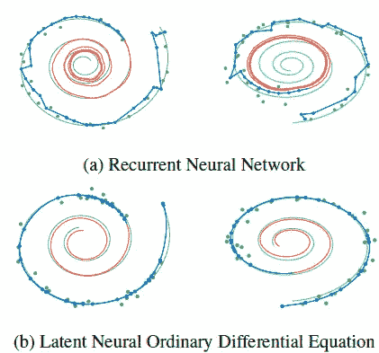

# 论文摘要:神经常微分方程

> 原文：<https://towardsdatascience.com/paper-summary-neural-ordinary-differential-equations-37c4e52df128?source=collection_archive---------0----------------------->

NIPS 2018(加拿大蒙特利尔)，或者现在被称为 NeurIPS，已经结束了，我想借此机会剖析一下在这个久负盛名的会议上获得最佳论文奖的论文之一。论文名为*神经常微分方程* ( [arXiv 链接](https://arxiv.org/abs/1806.07366))，其作者隶属于著名的多伦多大学矢量研究所。在这篇文章中，我将尝试解释这篇论文的一些主要观点，并讨论它们对深度学习领域未来的潜在影响。由于这篇论文相当先进，涉及到诸如*常微分方程* ( **ODE** )、*递归神经网络* ( **RNN** )或*归一化流* ( **NF** )等概念，如果您不熟悉这些术语，我建议您仔细阅读，因为我不会详细讨论这些术语。不过，我会尽可能直观地解释这篇论文的观点，这样你可能会明白主要概念，而不会过多地涉及技术细节。如果你感兴趣的话，你可以在原文中仔细阅读这些细节。这篇文章被分成多个部分，每个部分解释论文中的一个或多个章节。

# 从变换序列到神经微分方程

今天，多种神经网络架构，如 RNNs 或残差网络，包含重复的层块，能够保留顺序信息，并通过学习的功能在每一步中改变它。这种网络通常可以用下面的等式来描述

在此， *hₜ* 是时间步长 *t 的“隐藏”信息，f(hₜ，θₜ)* 是当前隐藏信息和参数 *θₜ* 的学习函数。本文提出的中心问题是，我们是否可以通过逐渐减小步长*【t，t+1】*来改善这些网络的当前最先进结果。我们可以将此想象为逐渐增加 RNN 中的评估数或增加残差网络中的残差层数。如果我们这样做，我们将最终得到上述方程的无穷小(微分)版本:

这样的方程被称为**常微分方程** (ODE)，因为解是一个函数，即函数 **h(t)** 。换句话说，通过解方程，我们得到了想要的隐藏状态序列。我们将不得不在每次评估中求解这个方程，从初始状态 *h₀.开始*这样的问题也叫**初值问题。**

# 用伴随方法计算微分方程求解器的梯度

数值求解一个常微分方程通常是通过积分来完成的。多年来已经发明了多种积分方法，包括简单的欧拉方法和龙格-库塔方法的高阶变体。然而，所有这些都是计算密集型的。在训练过程中尤其如此，这需要对积分步骤进行区分，以便能够将网络参数 *θₜ* 的所有梯度相加，从而导致高存储成本。

在本文中，作者提出了一种计算常微分方程梯度的替代方法，即使用庞特里亚金的所谓*伴随方法*。这种方法通过求解**第二个时间上向后扩展的 ODE 来工作，**可用于所有 ODE 积分器，并且具有较低的内存占用。让我们考虑最小化 ODE 求解器结果的成本函数，即

(很遗憾，作者在本节中用 *z(t)* 交换了 *h(t)* ，但不要让自己被这个迷惑了)。在第二步中，使用 ODE 的解的定义，在第三步中，引入 *ODESolve* 操作作为求解 ODE 的操作符。如前所述，这个运算符依赖于初始状态 *z(t₀)* ，函数 *f* ，起始和结束时间 *t₀* 和 *t₁* 以及搜索到的参数 *θ* 。伴随方法现在确定损失函数相对于隐藏状态的梯度:

这个量现在跟在增强的颂歌后面

计算梯度 *∂L/∂z(t₀)* (上述方程所需的第一梯度)现在可以通过在时间上向后求解扩充的 ODE 来完成。为了完整起见，下面的等式说明了如何计算相对于神经网络函数参数的梯度:

作者提出的整个梯度计算算法在伪代码中如下进行:

如果你对这个复杂计算的数学细节感兴趣，请参考原始论文，甚至是关于伴随方法的原始论文。这篇论文的作者甚至提供了 Python 代码来轻松计算 ode 求解器的导数。

# 用于监督学习的 ODE 网络

现在我们来看这篇论文最有趣的部分:应用。作者在论文中提到的第一个应用是在监督学习领域，即 MNIST 书面数字分类。目的是表明 ODESolve 方法可以用少得多的参数获得与残差网络相当的性能。本文中用于评估的网络对输入图像进行两次下采样，然后应用 6 个残差块。总而言之，该网络包含大约。0.6M 参数。ODESolve 网络用一个 ODESolve 模块代替了 6 层。此外，作者测试了一个 RK-网络，除了它直接使用龙格-库塔法反向传播误差之外，它是类似的。如上所述，您可以将传统神经网络中的层数与 ODE-Net 中的评估数联系起来。这两个网络的参数数量是 0.22M。重要的结果是，RK-网络和 ODE-网络以大约 1/3 的参数实现了与剩余网络大致相同的性能。另外 ODE-Net 的内存复杂度是常数(对比下图)。

此外，可以调整 ODE 解决方案的精度，以最大限度地提高计算性能。例如，可以高精度地执行训练，而在评估期间降低精度(关于进一步的细节，请参考论文)。

# 连续正常化流程

因为我怀疑许多读者不会熟悉规范化流程的概念，所以我将在这里提供一个非常简短的介绍。标准化流是分布的可逆变换。它们使人能够通过一系列非线性转换将简单的概率密度转换为复杂的概率密度，就像在神经网络中一样。因此，他们在分配中使用变量交换公式:

其中 *q0(z0)* 是初始分布， *qK(zK)* 是变换后的分布，变换 *fk，k=0..上述和中的雅可比行列式由此确保分布函数的积分在整个变换中保持为 1。不幸的是，除了一些简单的变换，计算这个行列式的代价相当高。*

归一化流量的一个流行应用是变分自动编码器(VAE)，它通常假设潜在变量是高斯分布的。这种假设恶化了 VAE 的输出，因为它不允许网络学习期望的分布。通过归一化流量，高斯参数可以在被“解码”之前被转换成各种各样的分布，从而提高 VAE 的生成能力。这篇博文详细解释了标准化流程。

我们现在正在讨论的论文提出了将标准化流扩展到连续域的方法。有趣的是，这简化了归一化常数的计算。如果我们使随机变量连续并依赖于时间，时间动态由函数 *f* 描述(f 是 Lipschitz 连续的)，那么对数概率的变化遵循简单的微分方程

因此，行列式的计算在这里被简单的迹运算所代替。此外，如果我们使用变换的和，那么我们只需要对轨迹求和:

作者还为各种转换引入了门控:

他们称这样的变换总和为*连续归一化流* (CNF)。

为了显示 CNF 的有效性，本文测试了概率密度从高斯分布到两种目标分布的转换，如下图所示。

Transformation stages (5–100%) between Gaussian distribution and target distribution using CNF (upper two rows) and NF (bottom row).

通过使用最大似然估计来最大化目标概率分布下的期望值，然后反转模型以从学习的分布中采样，来训练 CNF 和 NF。

# 通过常微分方程生成时间序列模型

论文中提到的第三个应用，可能是最重要的一个，是通过 ODEs 进行时间序列建模。作者开始这项工作的动机之一是他们对不规则采样数据的兴趣，如医疗记录或网络流量。这种数据的离散化通常是不明确的，导致在一些时间间隔内丢失数据或仅仅是不准确的潜在变量的问题。有一些方法将时间信息连接到 RNN 的输入，但是这些方法并不能从根本上解决当前的问题。

基于 ODESolve 模块的解决方案是连续时间生成模型，其给定初始状态 zₜ₀和观察时间 t0…tN，计算潜在状态 z_t1…z_tN 和输出 x_t1…x_tN:

函数 *f* (一个神经网络函数)负责计算从当前时间步长开始的任何时间 *t* 的潜在状态 *z* 。该模型是一个变分自动编码器，它使用 RNN 对初始潜在状态 zₜ₀中的过去轨迹(下图中的绿色)进行编码。如同所有的变分自动编码器一样，潜在状态分布由此通过分布的参数(在这个例子中是具有平均值μ和标准偏差σ的高斯分布)被捕获。从这个分布中，抽取一个样本并通过 ODESolve。

该架构在双向二维螺旋的合成数据集上进行测试，该数据集在不规则的时间点采样并被高斯噪声破坏。下图定性显示了潜在神经 ODE 模型的卓越建模性能:

# 结论

在论文中，提出了一种非常有趣和新颖的思考神经网络的方法。这可能是一篇里程碑式的论文，开启了深度学习的新进化。我的希望是，随着时间的推移，越来越多的研究人员将开始从根本上不同的角度思考神经网络，就像这篇论文一样。

这种方法是否真的适用于各种各样的现有模型，是否能被时间证明是有效的，还有待观察。作者确实提到了他们方法的一些局限性:

*   小批量可能是这种方法的一个问题，因为批量处理多个样本需要一次求解一个微分方程组。这可以大大增加所需评估的数量。然而，作者确实提到，即使在整个实验过程中使用了迷你批处理，评估的数量仍然是可控的。
*   只有当网络具有有限的权重并使用 Lipschitz 非线性(例如 tanh 或 relu，而不是阶跃函数)时，ODE 解的唯一性才能得到保证。
*   前向轨迹的可逆性可能会受到由前向 ODE 解算器中的数值误差、反向 ODE 解算器中的数值误差以及由于映射到相同最终状态的多个初始值而导致的信息丢失所引入的不准确性的影响。

作者也提到他们的方法不是唯一的，残差网络作为近似常微分方程解算器的想法已经很老了。此外，存在试图通过神经网络以及高斯过程来学习不同方程的论文。

本文提出的方法的一个重要优点是，在评估和/或训练过程中，人们可以通过影响数值积分的精度来自由选择快速解和精确解之间的平衡。此外，该方法非常普遍适用(仅要求神经网络的非线性是 Lipschitz 连续的),并且可以应用于时间序列建模、监督学习、密度估计或其他顺序过程。