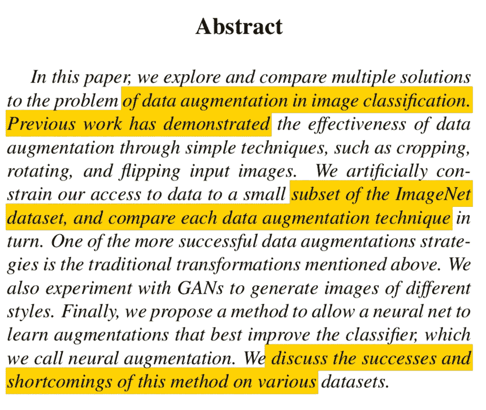
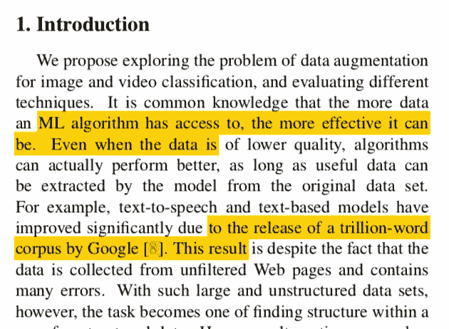
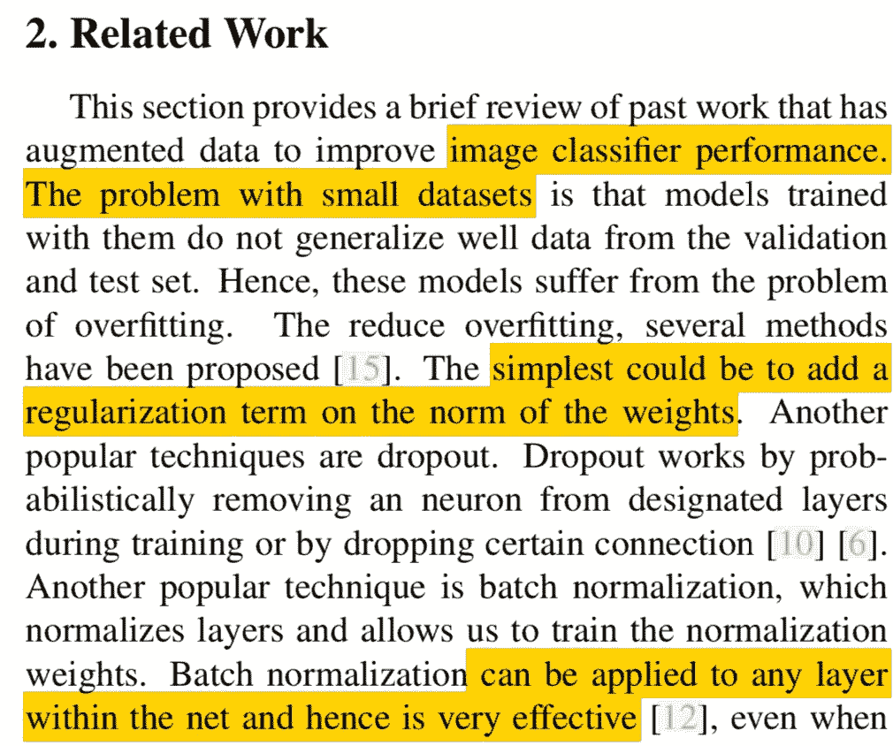
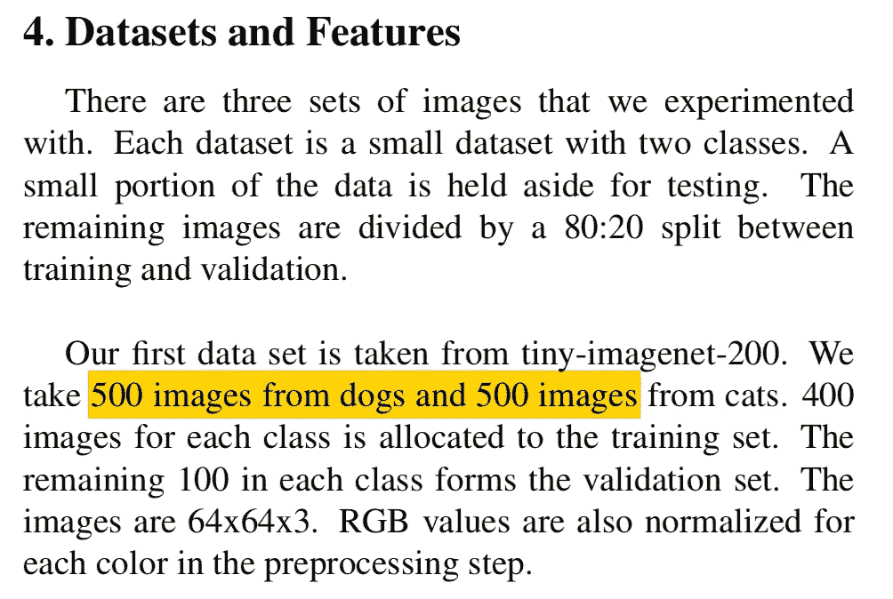
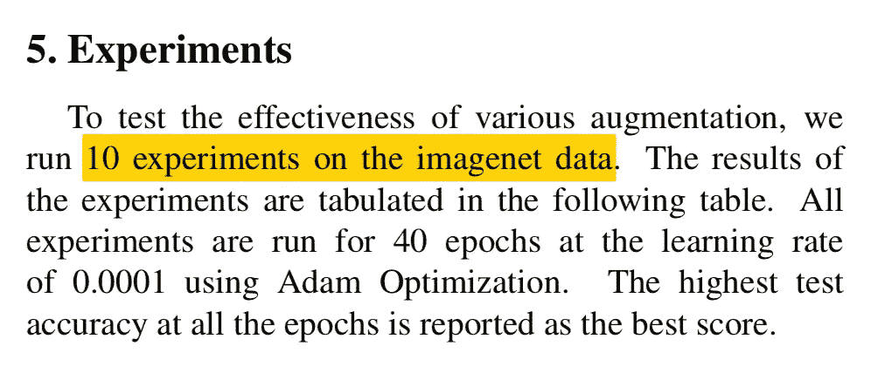
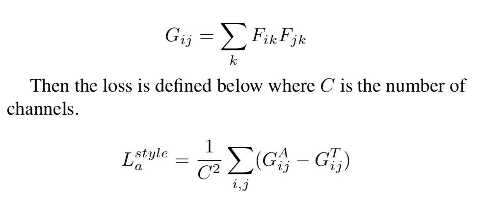
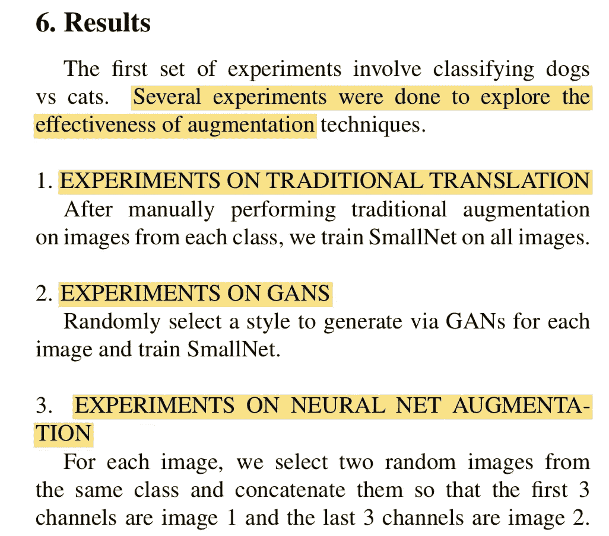
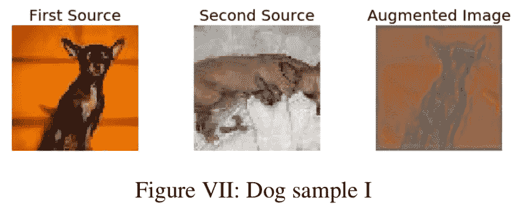
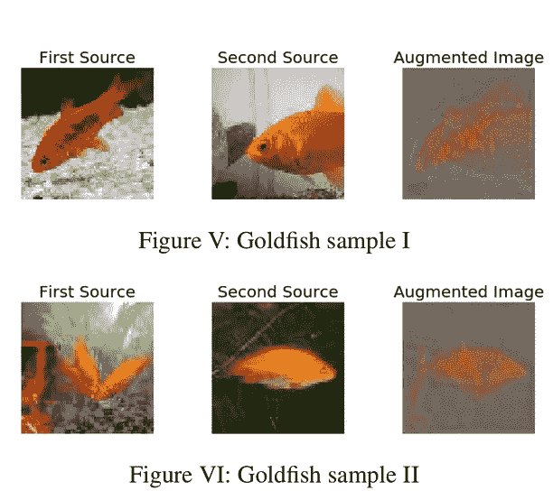
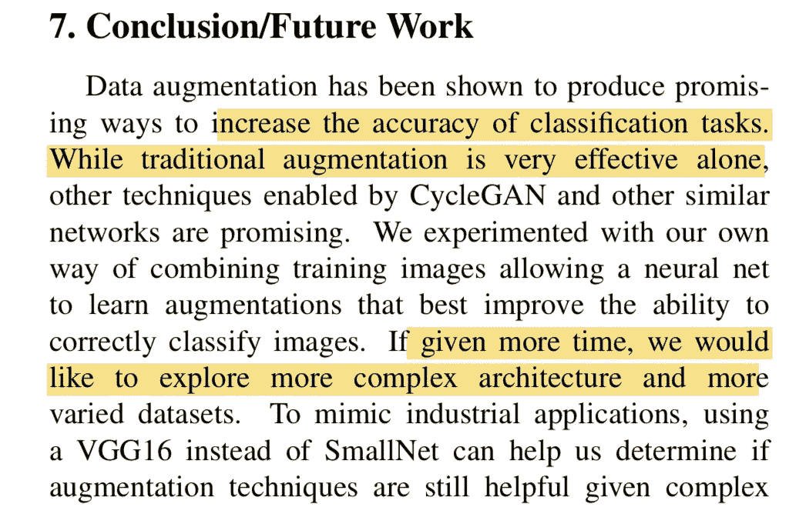

# 【论文摘要】使用深度学习的图像分类中数据增强的有效性

> 原文：<https://towardsdatascience.com/paper-summary-the-effectiveness-of-data-augmentation-in-image-classification-using-deep-9160dc87806b?source=collection_archive---------10----------------------->

Image from this [website](https://pixabay.com/en/statistics-analysis-graph-data-3411311/)

我想知道更多关于数据扩充在多大程度上有助于提高测试/验证数据的准确性。我发现了这篇很棒的论文，想做一个论文总结。

> ****请注意这篇帖子是为了我未来的自己复习这篇论文上的材料，而不是从头再看一遍。**

**摘要**

本文旨在通过使用传统的数据增强技术(如裁剪、旋转)或使用 GAN ( [CycleGAN](https://arxiv.org/abs/1703.10593) )来研究数据增强的有效性。

**简介**

在本节中，作者指出神经网络可以从大量数据中受益匪浅。他们举了一个例子来说明 Google corpus 的发布是如何让文本到语音以及基于文本的模型受益的。作者提出的一个有趣的观点是，对于大量的非结构化数据，任务变成了寻找模式。然而，我们可以采用另一种方法，其中我们有一小组结构化数据并执行增强。最后，作者介绍了他们将要进行实验的数据集，即 [MNIST](http://yann.lecun.com/exdb/mnist/) 和[微小图像网](https://tiny-imagenet.herokuapp.com/)数据

**相关工作**

在本节中，作者回顾了一些用于防止过度拟合的流行方法。方法，如增加一个正则项，辍学，批量规范化和转移学习介绍。此外，作者给出了数据增强技术的简单描述，如几何或颜色增强。(大多是[仿射变换](https://www.mathworks.com/discovery/affine-transformation.html)。).以及如何训练 GAN 的基本描述。

**方法**

这就是超级有趣的地方，作者将采取两种不同的方法。

a)在训练分类器之前增加数据(使用 GAN 或仿射)
b)通过使用分类器网络的前置神经网络实时增加数据。(基本上，他们正在创建一个从扩充网络到分类器网络的数据管道)

作者将使用传统转换或 CycleGAN(风格转换)来执行数据扩充。(如下图)。

最后，对于增强网络，他们创建了一个小型的 5 CNN 网络，使用用于训练网络的各种损失函数来执行增强。(1.内容丢失，2。风格丧失，3。不亏)

**数据集和特征**

作者用三个数据集进行了实验，其中两个数据集来自微图像网，第三个数据集来自 MNIST 数据集。第一数据集仅由狗/猫图像组成，第二数据集由狗/金鱼的图像组成。

**实验**

在这个实验中使用了两个网络，首先是分类网络(SmallNet)和增强网络(Augmentation Network)。两个网络网络架构如下所示。

增强网络的输入是通过连接来自相同类别的两个图像(在它们的通道维度上)来创建附加图像。(这是数据扩充部分。)增强网络仅在训练期间使用，而不在测试期间使用，整个过程如下所示。

最后要考虑的是损失函数，在图像被放大后，作者介绍了三种损失函数。(实际上是两个，因为最终损失函数根本不是损失函数。)

第一个损失是增强图像和目标图像之间的 L2 损失，其中 D 项是增强图像和目标图像的长度

第二种损失是增强图像和目标图像之间的 [Gram 矩阵](https://en.wikipedia.org/wiki/Gramian_matrix)的 L2 损失函数。如上所述，第三损失函数没有损失函数。

**结果**

对于所有数据集，他们进行了不同类型的增强，并得到了以下结果。

乍一看，我们可以假设无损失功能的神经增强与任何其他不同的方法相比表现最佳。(控制方法是当它们将相同的图像提供给增强网络时。)下面可以看到增强网络生成的一些图像。

作者表示，增强网络似乎从两幅图像中提取了一些关键特征，同时平滑了背景像素。

**结论和未来工作**

作者指出，使用更复杂的网络来执行分类和扩充是值得的。且还陈述了传统图像增强方法本身是有效的，同时与 GAN 的或神经增强相比消耗更少的时间。

**最后的话**

这确实是一项有趣的工作，但是在这一点上，我看不到使用 GAN/神经增强来执行数据增强的巨大好处。但是这种方法显示了许多有希望的迹象。

如果发现任何错误，请发电子邮件到 jae.duk.seo@gmail.com 给我，如果你想看我所有写作的列表，请[在这里查看我的网站](https://jaedukseo.me/)。

同时，在我的 twitter 上关注我[这里](https://twitter.com/JaeDukSeo)，访问[我的网站](https://jaedukseo.me/)，或者我的 [Youtube 频道](https://www.youtube.com/c/JaeDukSeo)了解更多内容。我还实现了[广残网，请点击这里查看博文](https://medium.com/@SeoJaeDuk/wide-residual-networks-with-interactive-code-5e190f8f25ec) t。

**参考**

1.  朱，j .，帕克，t .，伊索拉，p .，，埃夫罗斯，A. (2017)。使用循环一致对抗网络的不成对图像到图像翻译。Arxiv.org。检索于 2018 年 5 月 21 日，来自[https://arxiv.org/abs/1703.10593](https://arxiv.org/abs/1703.10593)
2.  佩雷斯，l .，，王，J. (2017)。使用深度学习的图像分类中数据扩充的有效性。Arxiv.org。检索于 2018 年 5 月 21 日，来自[https://arxiv.org/abs/1712.04621](https://arxiv.org/abs/1712.04621)
3.  MNIST 手写数字数据库，Yann LeCun，Corinna Cortes 和 Chris Burges。(2018).Yann.lecun.com。检索于 2018 年 5 月 21 日，来自[http://yann.lecun.com/exdb/mnist/](http://yann.lecun.com/exdb/mnist/)
4.  微型图像网络视觉识别挑战。(2018).Tiny-imagenet.herokuapp.com。检索于 2018 年 5 月 21 日，来自[https://tiny-imagenet.herokuapp.com/](https://tiny-imagenet.herokuapp.com/)
5.  格拉米矩阵。(2018).En.wikipedia.org。检索于 2018 年 5 月 21 日，来自[https://en.wikipedia.org/wiki/Gramian_matrix](https://en.wikipedia.org/wiki/Gramian_matrix)
6.  仿射变换。(2018).Mathworks.com。检索于 2018 年 5 月 21 日，来自[https://www . mathworks . com/discovery/affine-transformation . html](https://www.mathworks.com/discovery/affine-transformation.html)