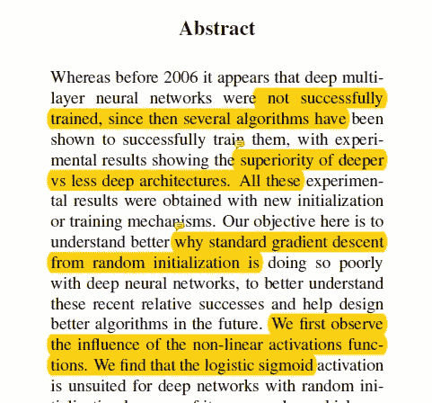
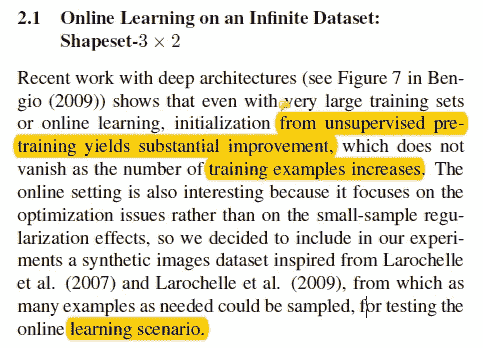
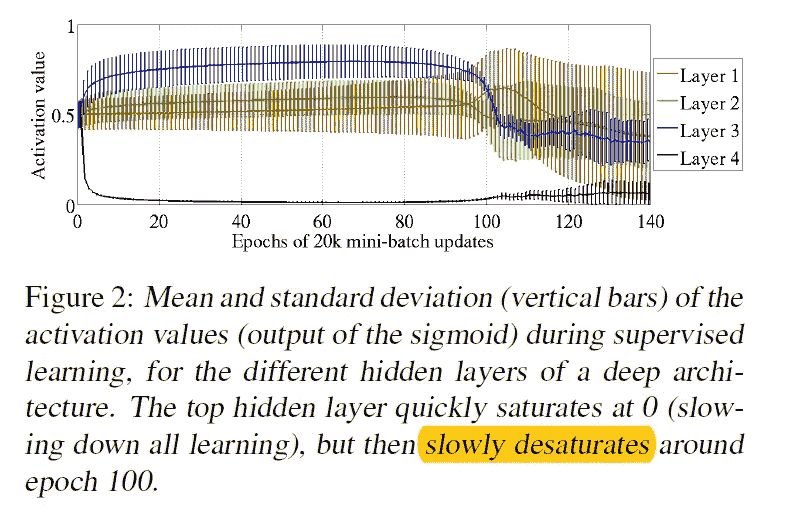
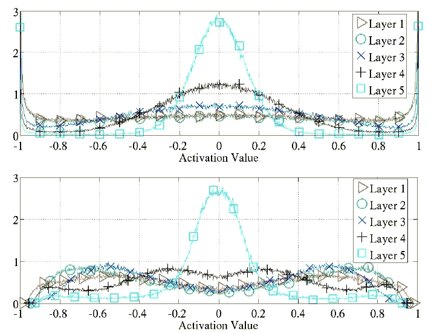
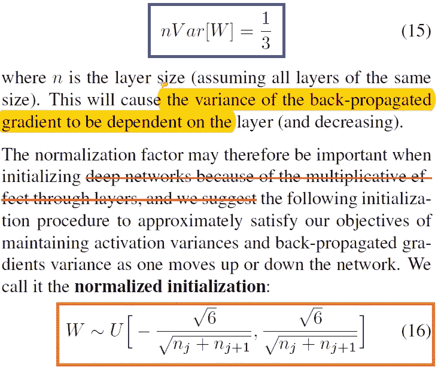
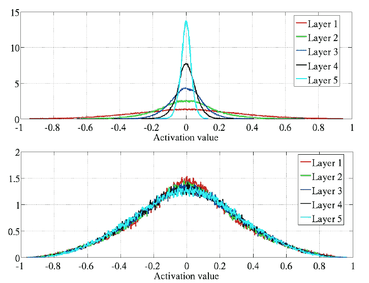
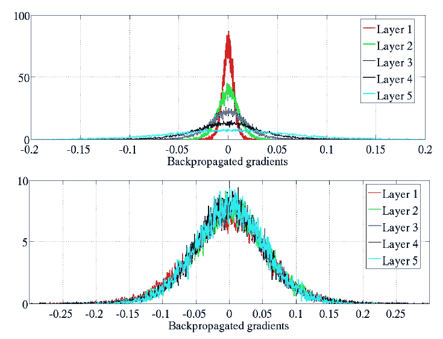
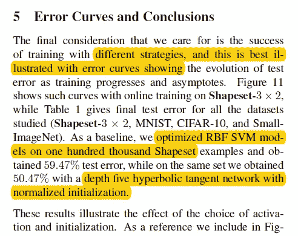

# [论文摘要]理解训练深度前馈神经网络的困难

> 原文：<https://towardsdatascience.com/paper-summary-understanding-the-difficulty-of-training-deep-feed-forward-neural-networks-ee34f6447712?source=collection_archive---------6----------------------->

GIF from this [website](https://giphy.com/gifs/publicartfund-public-art-fund-martin-creed-pafunderstanding-3o7qE8noHnwY7M6pzO)

这是机器学习(ML)社区的另一篇著名论文，我想说这是每个 ML 研究人员需要阅读的基础论文之一。

> **请注意，这篇帖子是为了我未来的自己回顾和复习这篇论文上的材料，而不是从头再看一遍论文。**

**摘要**

主要思想是，较深的网络比浅的网络具有更好的性能。然而，使用特殊的初始化方法而不是随机选择的值(标准初始化方法)来训练更深的网络。本文调查了为什么会发生这种情况的原因，并研究了不同的激活功能如何影响整个训练过程。

**深度神经网络**

作者已经声明，新的初始化方法以及训练方法优于更传统的初始化和训练方法。并给出了一个非常有趣的例子，其中无监督的预训练模型可以充当正则化器，因为它在更好的位置初始化参数。

最后，作者指出，本文将通过跨层和跨训练迭代监控多层神经网络的激活和梯度来研究多层神经网络。(查看哪个隐藏的神经元饱和)

**实验设置和数据集(无限/有限)**

作者介绍了他们将在这个实验中使用的数据集。一个是合成图像(它们可以根据需要生成任意多的图像，因此是无限的)，另一个是著名的 [MNIST 数据集](http://yann.lecun.com/exdb/mnist/)、 [CIFAR 10 数据集](https://www.cs.toronto.edu/~kriz/cifar.html)和[小图像数据集](https://tiny-imagenet.herokuapp.com/) t。最后，作者讨论了他们将要使用的网络架构、成本函数、激活函数。这里需要注意的一件有趣的事情是使用了[软签名激活功能](https://sefiks.com/2017/11/10/softsign-as-a-neural-networks-activation-function/)。(我以前从未想过这个问题。)

**训练期间激活功能和饱和度的影响(Sigmoid)**

对于每个激活函数，有两件事我们需要小心，那就是 1)激活函数的过度饱和，它不会传递梯度，2)过度线性的单位，它不会计算一些有趣的东西。众所周知，Sigmoid 激活函数会减慢学习速度，因为它们的平均值[不为零。在作者的实验中也可以看到这种行为。](https://stats.stackexchange.com/questions/237169/why-are-non-zero-centered-activation-functions-a-problem-in-backpropagation)

如上图，训练开始后第四层很快饱和。并且由于这一事实，梯度不能传递到更早的层中，使得训练更加困难。最终，该层能够脱离饱和区域，然而这仅发生在 100 个时期之后。

**训练期间激活函数和饱和度的影响(Tanh)**

由于围绕零的对称性，tanh()激活函数不会遇到 sigmoid 遇到的相同问题。然而，作者进行的实验中，他们遇到了一种奇怪的现象，其中各层开始按顺序饱和。为什么会发生这种情况仍然是个谜。

**训练期间激活功能和饱和度的影响(软设计)**

如上所述，对于软符号激活函数，我们可以观察到饱和不会像 tanh 或 sigmoid 那样戏剧性地发生。

此外，当我们绘制激活值的直方图时，我们可以很快看到 tanh 激活在梯度不会流动的-1 和 1 区域中有很多值。但是对于软符号，它们中大多数在我们可以观察到更流畅的梯度流的区域之间，因此训练更好。

**成本函数的效果**

在这里，作者强调了一个事实，即对于分类任务，使用逻辑回归或条件对数似然成本函数结合 softmax 输出更好。我从来不知道这一点，但事实证明，许多研究人员在分类任务中使用了二次成本函数。(至少在过去是这样)

**初始化时的梯度**

**蓝框** →标准初始化方法
**橙框** →规格化初始化方法

在本节中，作者介绍了主要称为**规范化初始化**的新型初始化方法，并展示了这种新型初始化方法的有效性。

如上所述，当我们比较常规初始化方法(见顶部)时，我们可以观察到每个层的权重值非常不同，而在归一化初始化方法中，每个层的权重值相似。

类似的行为在训练中也有发生。当作者可视化梯度(使用 Tanh 激活函数)时，他们能够观察到这样的事实，即对于标准初始化方法，每层的梯度显著不同，而在归一化初始化方法中，每层的梯度彼此相似。并且作者已经假设不同层的非常不同幅度的梯度可能会导致不适和较慢的训练。

**误差曲线和结论**

作者
1 得出了几个结论。使用标准初始化
2 时，Sigmoid/Tanh 性能不佳。软签名网络对初始化方法更鲁棒。
3。Tanh 网络可以从规范化的 init 中受益匪浅。
***4。这些实验中的许多观察结果还没有得到详细的解释。***

**最后的话**

除了信息量大之外，这篇论文写得非常好。因为一个不说英语的人也能明白。

如果发现任何错误，请发电子邮件到 jae.duk.seo@gmail.com 给我，如果你想看我所有写作的列表，请[在这里查看我的网站](https://jaedukseo.me/)。

与此同时，请在我的 twitter [这里](https://twitter.com/JaeDukSeo)关注我，并访问[我的网站](https://jaedukseo.me/)，或我的 [Youtube 频道](https://www.youtube.com/c/JaeDukSeo)了解更多内容。我也实现了[广残网，请点击这里查看博文 pos](https://medium.com/@SeoJaeDuk/wide-residual-networks-with-interactive-code-5e190f8f25ec) t

**参考**

1.  x .格洛特和 y .本吉奥(2010 年)。理解训练深度前馈神经网络的困难。PMLR。检索于 2018 年 5 月 28 日，来自[http://proceedings.mlr.press/v9/glorot10a.html](http://proceedings.mlr.press/v9/glorot10a.html)
2.  MNIST 手写数字数据库，Yann LeCun，Corinna Cortes 和 Chris Burges。(2018).Yann.lecun.com。检索于 2018 年 5 月 28 日，来自[http://yann.lecun.com/exdb/mnist/](http://yann.lecun.com/exdb/mnist/)
3.  CIFAR-10 和 CIFAR-100 数据集。(2018).Cs.toronto.edu。检索于 2018 年 5 月 28 日，来自[https://www.cs.toronto.edu/~kriz/cifar.html](https://www.cs.toronto.edu/~kriz/cifar.html)
4.  微型图像网络视觉识别挑战。(2018).Tiny-imagenet.herokuapp.com。检索于 2018 年 5 月 28 日，来自 https://tiny-imagenet.herokuapp.com/
5.  作为神经网络激活函数的软设计。(2017).赛菲克·伊尔金·塞伦吉尔。检索于 2018 年 5 月 28 日，来自[https://sefiks . com/2017/11/10/soft sign-as-a-neural-networks-activation-function/](https://sefiks.com/2017/11/10/softsign-as-a-neural-networks-activation-function/)
6.  反向传播？，W. (2018)。为什么非零中心激活函数是反向传播中的一个问题？。交叉验证。检索于 2018 年 5 月 28 日，来自[https://stats . stack exchange . com/questions/237169/why-are-non-zero-centered-activation-functions-a-problem-in-back propagation](https://stats.stackexchange.com/questions/237169/why-are-non-zero-centered-activation-functions-a-problem-in-backpropagation)
7.  损失函数。(2018).En.wikipedia.org。检索于 2018 年 5 月 28 日，来自[https://en . Wikipedia . org/wiki/Loss _ function # Quadratic _ Loss _ function](https://en.wikipedia.org/wiki/Loss_function#Quadratic_loss_function)