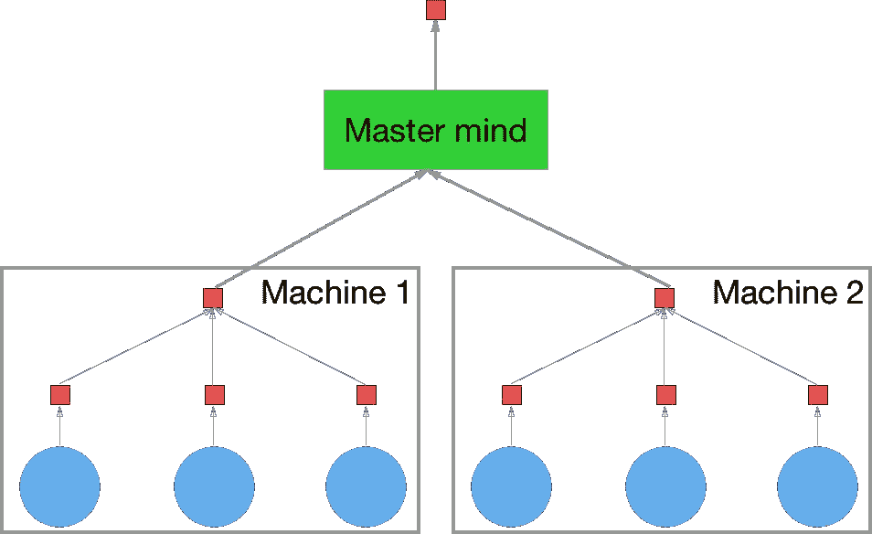

# 并行分布式遗传算法

> 原文：<https://towardsdatascience.com/parallel-and-distributed-genetic-algorithms-1ed2e76866e3?source=collection_archive---------5----------------------->

Image by Pablo Garcia Saldana

进化算法是解决不同优化问题的强有力的方法。进化算法有助于找到合适的解决方案，如果使用严格的方法找到它是如此困难，我们可以说这是不可能的。进化算法最流行的变体之一是遗传算法。你可以在“[遗传算法简介——包括示例代码](/introduction-to-genetic-algorithms-including-example-code-e396e98d8bf3)”一文中读到更多关于遗传算法的内容。

有时，如果一个问题很复杂并且个体很大，那么就不可能实现有效的遗传算法，因为计算需要太多的时间，并且不可能将所有需要的数据存储在内存中。为了克服第二个问题，可以将一些个体存储在磁盘上，一旦需要，就将它们加载到内存中。这并不能解决性能问题，此外，它还带来了另一个问题:从磁盘读取(也可能是反序列化)一个个体到内存可能会使整个系统更慢。此外，算法见过的所有个体都是使用相同的遗传算子创建的，因此可能有太多的共同点，因此算法将在局部最优值附近行走。有办法解决这个吗？有可能，是的:我们可以使用并行或分布式遗传算法。

本文描述了两种旨在提高算法性能的遗传算法:并行和分布式遗传算法。

# 并行遗传算法

并行遗传算法就是这样一种使用多个遗传算法来解决单个任务的算法[1]。所有这些算法都试图解决相同的任务，在它们完成任务后，每个算法中最好的个体被选中，然后它们中最好的被选中，这就是问题的解决方案。这是并行遗传算法最流行的方法之一，尽管还有其他方法。这种方法通常被称为“岛屿模型”，因为种群是相互隔离的，就像现实生活中的生物种群可能生活在不同的岛屿上。图 1 说明了这一点。

Image 1\. Parallel genetic algorithm

这些遗传算法互不依赖，因此它们可以并行运行，充分利用多核 CPU 的优势。每个算法都有自己的个体集，因此这些个体可能不同于另一个算法的个体，因为它们具有不同的变异/交叉历史。

文献[2]描述了一种并行遗传算法，其使用两种独立的算法来提高其性能。这两种算法的区别在于选择变异和交叉个体的方式。此外，一些具有最高拟合度的生物被允许从一种算法“迁移”到另一种算法。虽然有时这可能已经足够了，但是当一个任务很难解决或者一个人是一个复杂的实体时，我们可能需要更多的个体多样性。

为了实现这一点，我们可以使用尽可能多的算法(比如说，两倍于我们拥有的 CPU 核心数),并且改变算法的几乎每一个属性。因此，每个算法都有自己的一组个体，这些个体是使用不同于其他算法的方法创建的。这也是一种“岛屿模式”，尽管“岛屿”之间的差异更大。唯一的限制是所有算法使用相同的拟合函数来评估个体，以便可以比较属于不同算法的个体。因此，这些遗传算法可能在以下方面有所不同:

*   新的个体是如何被创造出来的；
*   个体如何变异，如何被选择变异；
*   个体如何交叉，如何被选择进行交叉；
*   有多少人参加了单个交叉项目，结果又有多少人被创造出来；
*   每次算法迭代后有多少个体存活下来，这些生物是如何被选择出来的；
*   每一代包含多少个体；
*   一个算法要经历多少代。

通过改变这些特征，有可能产生许多不同的遗传算法来解决相同的任务，但是具有完全不同的个体。

值得注意的是，这些独立的遗传算法具有与任何其他传统遗传算法相同的结构，因此它们可以从并行遗传算法中提取出来并独立使用。

## 算法之间的交叉

那么，我们有什么？我们有几个独立运行的遗传算法，它们有自己的个体集。我们可以选择属于不同算法的个体，并将它们杂交。结果，出现在一个算法的个体中的特征将可用于另一个算法。这允许创建这样的个体，这些个体不能由任何算法单独创建，给它们带来更多的多样性并传播便利的特征。

让我们用一个例子来说明这一点。假设我们有三个独立的遗传算法，我们想将它们成对交叉。我们采用第一种算法，随机选择一对中的第二个元素。因此，我们创建了尽可能多的算法对，在每一对中，第一个元素是按顺序选择的，第二个是随机选择的。然后，我们对这两种算法的种群进行交叉，从这两种算法中选取个体。我们以这样一种方式选择个体进行交叉，即来自不同算法的个体被交叉在一起。我们使用由一对算法中的第一个算法使用的交叉机制，并且该算法接收作为交叉的结果而被创建的所有个体；一对算法中的第二个算法只是提供其个体的施主。因此，当新个体是一对中的第一个元素时，每个算法接收新个体。如果一个交叉算法需要两个以上的个体，额外的个体可以从一对算法中的任何一个中选取，这里只建议不要有算法占优势。

当涉及算法之间的交叉时，也可以使用特殊的交叉技术，这仅适用于算法之间的交叉。

建议在过程中间的某个地方(甚至多次)使用算法之间的交叉，而不是在最开始或最后。在最开始的时候，每个算法都有不受突变或交叉影响的新个体，因此它们特定于特定算法的特征没有被清楚地表达。最后，没有更多的世代会影响交叉中产生的新个体，因此它们不会为了决定哪一个更好而与其他个体竞争。

## 结论

并行遗传算法可能比非并行遗传算法花费更多的时间，这是因为并行遗传算法使用多个计算线程，这反过来导致操作系统更频繁地执行上下文切换。然而，并行遗传算法往往比非并行遗传算法产生更好的结果和更优的个体。

尽管并行可能会显著改善结果，但在某些情况下，这可能还不够。在这种情况下，我们可以使用…

# 分布式遗传算法

分布式遗传算法实际上是一种并行遗传算法，其独立的算法运行在不同的机器上。此外，在这种情况下，这些算法中的每一个都可能是并行遗传算法！分布式遗传算法也实现了“岛模型”,每个“岛”与其他“岛”更加隔离。如果每台机器运行一个并行遗传算法，我们可以称之为“群岛模型”，因为我们有岛屿群。实际上，单个遗传算法是什么并不重要，因为分布式遗传算法就是让多台机器运行独立的遗传算法来解决同一任务。图 2 说明了这一点。

Image 2\. Distributed genetic algorithm with parallel components

当我们必须创建许多个体以观察整个领域时，分布式遗传算法也可能有所帮助，但是不可能将它们全部存储在单个机器的存储器中。

当我们讨论并行遗传算法时，我们引入了“算法间交叉”这一术语。分布式遗传算法使我们能够在不同的机器之间进行交叉！

在分布式遗传算法的情况下，我们有一种控制整体进度和协调这些机器的“主思维”。它还控制机器之间的交叉，选择机器如何配对以执行交叉。一般来说，除了个体通过网络从一台机器移动到另一台机器之外，过程与并行遗传算法的情况相同。为了避免两次转移个人，建议将个人发送到机器，该机器将接收由于交叉操作而创建的新个人。“主脑”也从它所连接的、实际运行计算的次级机器的个体中选择最佳个体。因此，这个“大师头脑”是分布式遗传算法的切入点，它与向它寻求解决方案的人进行交流。

## 履行

这篇文章主要致力于理论，但当谈到实现时，有可能有一个“分布式遗传算法框架”，负责控制辅助机器和通过网络转移个体。一般来说，这样的框架能够处理除了需要了解个人内部结构的动作之外的所有事情。因此，用户只需执行几项操作:

*   个人创造和处置；
*   个人交叉；
*   个体突变；
*   评估个人的拟合函数。

其他的都是通用的，都可以在框架内实现。这样的框架能够同时运行多个分布式遗传算法，而不需要实际知道正在解决什么问题。

# 结论

使用并行和分布式遗传算法可以提高使用进化算法的系统的性能。无论如何，我们应该记住，进化算法并不能保证找到一个解决方案，也不能保证找到的方案不会比找到的方案更好。

使用遗传算法时，我们必须处理的一个主要问题是初步收敛到支配他人的个体子集。并行和分布式遗传算法试图解决这一问题，在算法之间引入差异，使它们具有不同的个体集。

使用并行和分布式遗传算法，个体更加分散，因此与使用非并行遗传算法相比，可以创建更少的个体，同时保持相同的解质量。

# 参考

1.  埃里克·坎图-帕斯。并行遗传算法综述
2.  [阿卜丁·哈萨尼，乔纳森·特雷吉斯。标准和并行遗传算法概述](https://pdfs.semanticscholar.org/ff16/8d2d0bb304c1aaf1b5f1a48aa5012e55c7a8.pdf)