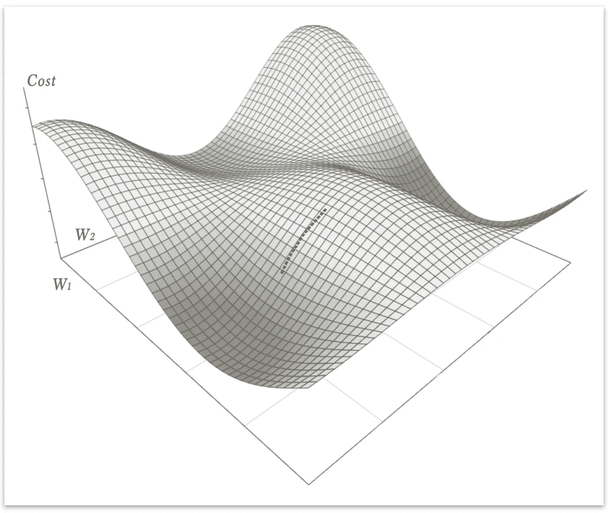
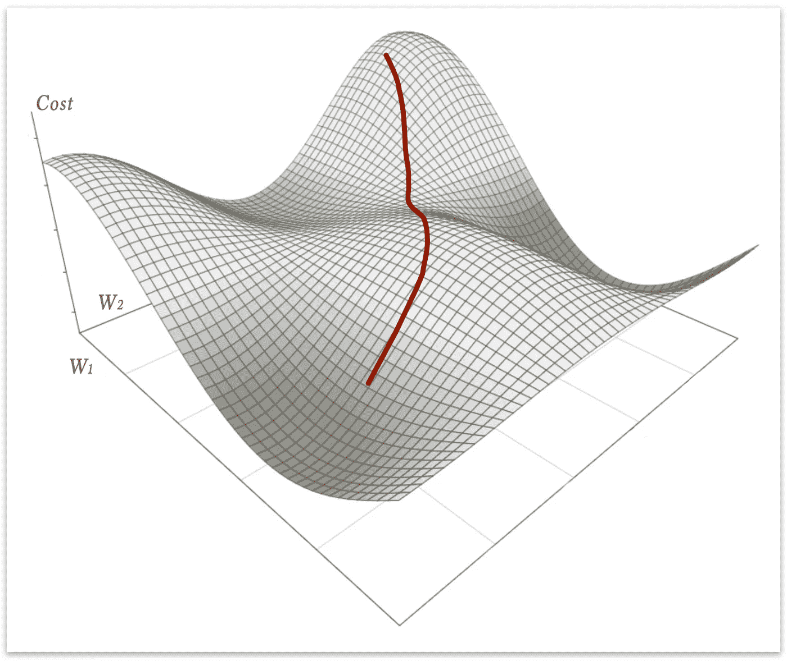

# 第 4 部分:更好、更快、更强

> 原文：<https://towardsdatascience.com/part-4-better-faster-stronger-dd6ded07b74f?source=collection_archive---------20----------------------->

在本文中，我们将建立在[第 3 部分](https://medium.com/@tobias_hill/part-3-implementation-in-java-7bd305faad0)中介绍的基本神经网络基础上。我们将添加一些宝石，这将改善网络。影响巨大的小变化。我们将遇到的概念，如*初始化*、*小批量*、*并行化*、*优化器*和*正则化*无疑是您在学习神经网络时会很快遇到的东西。本文将对*进行实例讲解*。

这是系列文章的第四部分:

*   [第一部分:基础](https://medium.com/@tobias_hill/part-1-a-neural-network-from-scratch-foundation-e2d119df0f40)。
*   [第二部分:梯度下降反传](https://medium.com/@tobias_hill/part-2-gradient-descent-and-backpropagation-bf90932c066a)。
*   [第 3 部分:Java 实现](https://medium.com/@tobias_hill/part-3-implementation-in-java-7bd305faad0)。
*   [第四部分:更好、更快、更强](https://medium.com/@tobias_hill/part-4-better-faster-stronger-dd6ded07b74f)。
*   [第五部分:训练网络阅读手写数字](https://medium.com/@tobias_hill/part-5-training-the-network-to-read-handwritten-digits-c2288f1a2de3)。
*   [额外 1:我如何通过数据扩充获得 1%的更高准确率](https://medium.com/@tobias_hill/extra-1-how-i-got-1-better-accuracy-by-data-augmentation-2475c509349a)。
*   [额外 2:MNIST 游乐场](https://machinelearning.tobiashill.se/extra-2-a-mnist-playground/)。

# 初始化

到目前为止，我们已经看到了如何通过反向传播自动调整*权重*和*偏差*，以改善网络。那么，这些参数的良好初始值是什么呢？

一般来说，您只需将-0.5 和 0.5 之间的参数随机化，取平均值 0，就可以了。

然而，在深层网络中，研究表明如果让权值与连通层(或有时*两个连通层*中的神经元数量成反比，则可以获得更好的收敛性。换句话说:许多神经元的初始权重接近 0。神经元越少越好。您可以在这里和这里更多地了解为什么。

我已经实现了几个比较流行的方法，并且在创建神经网络时可以将它作为一种策略注入(见第 5 行):

实现的初始化策略有:XavierNormal、XavierUniform、LeCunNormal、LeCunUniform、HeNormal、HeUniform 和 Random。还可以通过在创建图层时提供权重矩阵来明确指定图层的权重。

# 定量

在[的上一篇文章](https://medium.com/@tobias_hill/part-3-implementation-in-java-7bd305faad0)中，我们确实简要地提到了这样一个事实，即*只要我们愿意，我们就可以通过网络输入样本，然后根据我们自己的判断，选择***来更新权重*。在 api 中，**evaluate()**-方法(收集学习/印象)和**updateFromLearning()**-方法(让学习深入其中)之间的分离正是为了实现这一点。它让 API 的用户决定使用以下哪种策略:*

# *随机梯度下降*

*在随机梯度下降中，我们在每次评估后更新权重和偏差。记住第二部分中的成本函数依赖于输入和期望:C = C(W，b，Sσ，x，exp)。因此，每个样本的成本情况会略有不同，负梯度将指向每个样本独特情况下的最陡下降方向。*

*现在，让我们假设我们有**总成本景观**，这将是整个数据集的平均成本函数。所有样本。在这种情况下,*随机梯度下降*看起来就像一次混沌漫步。*

**

*只要学习率合理地小，该行走平均来说仍然会下降到局部最小值。*

*问题是 SGD 很难高效地并行化。权重的每次更新都必须是下一次计算的一部分。*

# *批量梯度下降*

*与随机梯度下降相反的是批量梯度下降(有时简称为梯度下降)。在该策略中，在对权重进行更新之前，评估所有训练数据。计算所有样品的平均梯度。当*仔细计算小的下降步骤*时，这将收敛到局部最小值。缺点是对于大型数据集，反馈循环可能会很长。*

**

# *小批量梯度下降*

*小批量梯度下降是 SGD 和 BGD 之间的一种折衷方案——在更新权重之前，通过网络运行 N 个样本的批次。典型地，N 在 16 到 256 之间。通过这种方式，我们得到了在其下降过程中相当稳定的东西(尽管不是最佳的):*

**

*   *与批处理梯度下降相比，我们获得了更快的反馈，并且可以在可管理的数据集上运行。*
*   *与随机梯度下降相比，我们可以使用 CPU、GPU 或 TPU 上的所有内核并行运行整个批处理。两个世界中最好的。*

# *并行*

*只需对[代码库](https://bitbucket.org/tobias_hill/neuralnet/src/Article/)做一些小的改动，就可以并行执行**评估()**方法。一如既往……*国家是并行化的敌人*。在前馈阶段，唯一需要小心处理的状态是每个神经元的输出值被存储在每个神经元中。竞争线程肯定会在数据被用于反向传播之前覆盖这些数据。*

*通过使用[螺纹限制](https://www.quora.com/What-is-Thread-Confinement)，这是可以处理的。*

*此外，权重和偏差的增量累积并最终应用的部分必须同步。*

*有了这些，在处理训练数据时，可以根据需要(或可用)使用任意数量的内核。*

*在神经网络上并行化小批量执行的典型方法如下所示:*

*特别注意将批次中所有样本的处理扩展为第 2 行平行流的结构。*

*这就是全部需要。*

*最棒的是:加速非常显著。*

*这里需要记住的一点是，以这种方式分散执行(在几个并行线程上运行一个批处理)会给计算增加熵，这有时是不希望的。举例说明:当误差增量在 add deltaweights 和 bias 方法中相加时，每次运行时它们可能会以稍微不同的顺序相加。虽然该批中的所有影响术语都是相同的*，但是它们被相加的改变顺序可能会产生很小的差异*，随着时间的推移，在大型神经网络中，这些差异开始显现，导致*不可再现运行*。在这种操场神经网络实现中，这可能很好……但是如果你想做研究，你必须用不同的方式来处理并行性(通常是制作输入批处理的大矩阵，并在 GPU/TPU 上并行所有前馈和反向传播的矩阵乘法)。*

# *优化器*

*在[最后一篇文章](https://medium.com/@tobias_hill/part-3-implementation-in-java-7bd305faad0)中，我们谈到了这样一个事实，即我们将*权重和偏差的实际更新*作为一种策略来实现。原因是，除了基本的梯度下降，还有其他方法。*

*记住，这一点:*

**

*在代码中看起来像:*

*尽管努力下坡，SGD(及其分批变型)受到以下事实的影响:梯度的大小与评估点的坡度成比例。更平坦的表面意味着更短的梯度长度…给出更小的步长。因此，它可能会卡在鞍点上，例如在这条路径的中途:*

**

*(正如你所看到的，在几个方向上有比困在那个鞍点更好的局部最小值)*

*更好地处理这种情况的一种方法是让权重的更新不仅取决于计算的梯度，还取决于上一步中计算的梯度。有点像从之前的计算中合并*回声。**

*一个物理类比是想象一个质量为 T3 的弹球*滚下山坡。这样的弹球可能有足够的动量来保持足够的速度，以覆盖更平坦的部分，甚至爬上小山丘——这样可以逃离鞍点，继续朝着更好的局部最小值前进。**

*毫不奇怪，最简单的优化器之一叫做…*

# *动力*

*在动量项中，我们引入了另一个常数来告诉我们从前面的计算中需要多少回声。这个系数γ叫做动量。上面的等式 1 现在变成:*

**

*如你所见，动量优化器将最后一个增量保持为 ***v*** ，并基于前一个计算新的 ***v*** 。通常情况下， *γ* 可能在 0.7–0.9 的范围内，这意味着 70% — 90%的先前梯度计算对新计算有贡献。*

*在代码中，它被配置为(第 4 行):*

*并像这样应用于动量优化器:*

*我们如何更新权重的这个小变化通常会提高收敛性。*

*我们可以做得更好。另一个简单而强大的优化器是内斯特罗夫加速梯度(NAG)。*

# *内斯特罗夫加速梯度*

*与动量唯一不同的是，在 NAG 中，我们在一个位置计算成本，这个位置已经结合了上次梯度计算的回波。*

**

*从编程的角度来看，这是个坏消息。到目前为止，优化器的一个很好的特性是，它们只在权重更新时应用。在这里，当计算成本函数*时，我们突然需要合并已经存在的最后一个梯度 ***v*** 。*当然，我们可以扩展优化器的概念，并允许它增加*权重查找*。这并不一致，因为所有其他优化器(据我所知)只关注更新。*

*通过一个小技巧，我们可以解决这个问题。通过引入另一个变量***x****=****W****-γ****v***我们可以用 ***x*** 来重写方程。具体来说，这种引入意味着有问题的成本函数将只依赖于 ***x*** ，而不依赖于历史*-值(至少不明确依赖于*)。*-γ****v***部分实际上仍将被使用，但现在隐含地存储在所有权重上)。***

**重写之后，我们可以将 x*重新命名为*，让它看起来更像我们认识的东西。等式变为:****

******

***好多了。现在，内斯特罗夫优化器只能在更新时应用:***

***要阅读更多关于 NAG 如何以及为什么通常比 Momentum 更有效的信息，请查看这里的[和这里的](http://ruder.io/optimizing-gradient-descent/index.html#nesterovacceleratedgradient)和。***

***当然，也有很多其他奇特的优化器可以实现。其中一些通常比 NAG 性能更好，但代价是增加了复杂性。就*改进每行代码的收敛性而言* NAG 击中了一个甜蜜点。***

# **正规化**

**当我刚刚写完神经网络代码的第一个版本时，我渴望测试它。我迅速下载了 MNIST 的数据集并开始玩。几乎是立刻，我就在准确性方面达到了相当惊人的数字。与其他人在等效网络设计上达成的结果相比，我的更好——*好得多*。这当然让我起了疑心。**

**然后我突然想到。我比较了我在*训练数据集*上的统计数据和他们在*测试数据集*上的统计数据。我已经在*训练*数据上无限循环地训练了我的网络，甚至从未加载过*测试*数据集。当我看到的时候，我大吃一惊。我的网络在看不见的数据上完全是垃圾，即使它在训练数据集上接近半神。我刚刚吞下了*过度拟合*的苦果。**

# **过度拟合**

**当你过于积极地训练你的网络时，你可能最终会处于这样一种情况:你的网络已经学会了(几乎记住了)训练数据，但作为一个副作用，它也失去了训练数据所代表的大致内容。这可以通过在网络训练期间，在*训练数据*与*测试数据*上绘制网络准确度来看出。通常，您会注意到*训练数据*的精确度继续增加，而*测试数据*的精确度最初增加，之后变得平稳，然后再次开始下降。**

**这是你走得太远的时候。**

**这里的一个观察是，我们需要能够检测到这种情况何时发生，并在那时停止训练。这通常被称为提前停止，我将在本系列的最后一篇文章[第 5 部分:训练网络读取手写数字](https://medium.com/@tobias_hill/part-5-training-the-network-to-read-handwritten-digits-c2288f1a2de3)中再次提到。**

**但是也有一些其他的方法来降低过度拟合的风险。我将通过展示一个简单但强大的方法来结束这篇文章。**

# **L2 正则化**

**在 L2 正则化中，我们试图避免网络中的个体权重变得太大(或者更精确地说:*离零*太远)。我们的想法是，与其让几个权重对输出产生很大的影响，不如让许多权重相互作用，每个人都做出适度的贡献。基于[第 1 部分:基础](https://medium.com/@tobias_hill/part-1-a-neural-network-from-scratch-foundation-e2d119df0f40)中的讨论，几个更小的权重*(*与*相比更少更大的*)将给出输入数据的更平滑和不太尖锐/多峰的分离似乎并不太牵强。此外，似乎合理的是，更平滑的分离将保留输入数据的一般特征，相反:尖锐和多峰的同上将能够非常精确地去除输入数据的特定特征。**

**那么我们如何避免网络中的个体权重变得太大呢？**

**在 L2 正则化中，这是通过向成本函数添加另一个成本项来实现的:**

****

**如您所见，大重量会导致更高的成本，因为它们是额外成本总和的平方。更小的重量根本没什么关系。**

**λ因子将告诉我们需要多少 L2 正则化。将其设置为零将完全消除 L2 效应。将其设置为 0.5，将使 L2 正则化成为网络总成本的重要部分。实际上，在给定网络布局和数据的情况下，您必须找到最佳的λ。**

**非常坦率地说，我们不太关心作为特定标量值的成本。我们更感兴趣的是当我们通过梯度下降训练网络时会发生什么。让我们看看这个新成本函数对于特定权重 ***k*** 的梯度计算会发生什么。**

****

**正如你所看到的，我们在每次更新中只得到一个额外的术语 ***λwk*** 来减去权重 ***wk*** 。**

****

**在代码中，L2 正则化可以配置为(参见第 9 行):**

**并以这种方式在更新时应用(参见第 3 行和第 4 行):**

**这种微小的变化使得神经网络实现在过拟合时更容易控制。**

**所以，这篇文章到此结束。在理论和实践中，已经出现了几颗小宝石……所有这些，只需要几行代码，就能使神经网络更好、更快、更强。**

**下一篇文章将是本系列的最后一篇，我们将看到网络在经典数据集上的表现——Mnist:[第 5 部分:训练网络阅读手写数字](https://medium.com/@tobias_hill/part-5-training-the-network-to-read-handwritten-digits-c2288f1a2de3)。**

**欢迎反馈！**

***原载于 2018 年 12 月 17 日*[*machine learning . tobiashill . se*](https://machinelearning.tobiashill.se/part-4-better-faster-stronger/)*。***