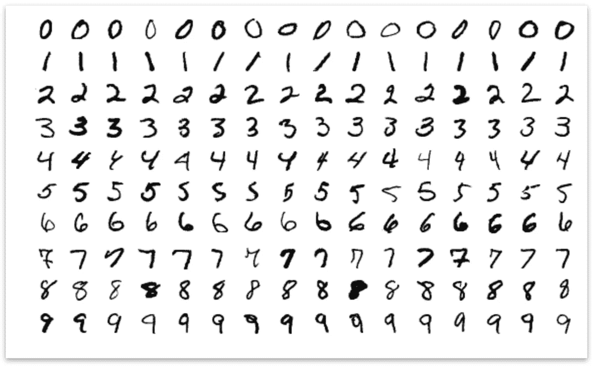
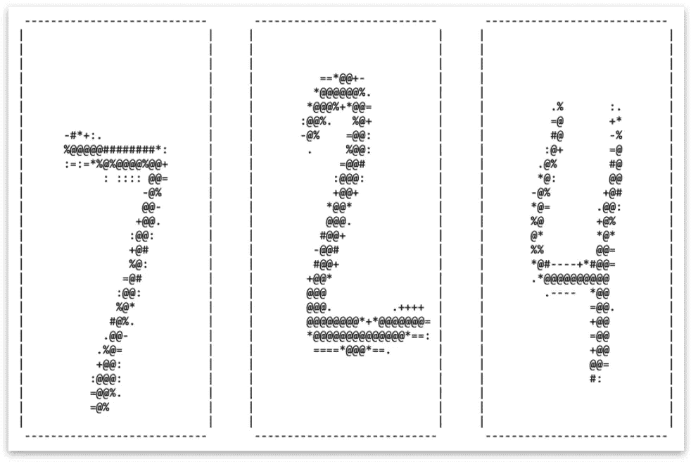
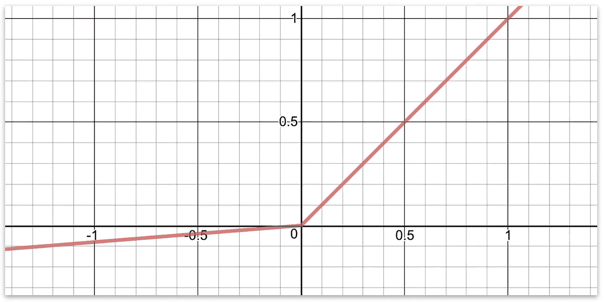
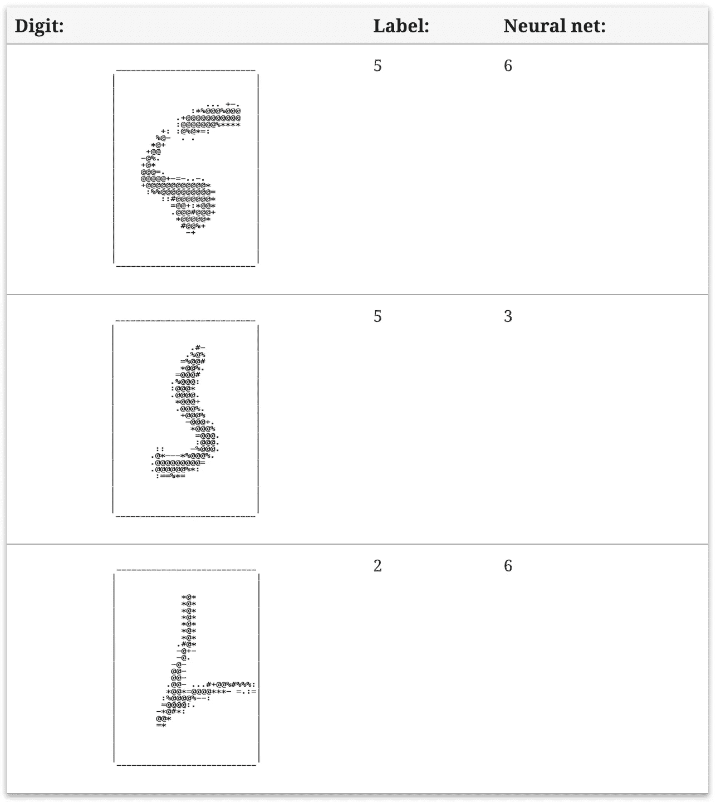

# 第 5 部分:训练网络阅读手写数字

> 原文：<https://towardsdatascience.com/part-5-training-the-network-to-read-handwritten-digits-c2288f1a2de3?source=collection_archive---------12----------------------->

在这最后一篇文章中，我们将看到这种神经网络实现的能力。我们将向它投掷一个最常见的数据集(MNIST)，看看我们是否可以训练一个神经网络来识别手写数字。

这是系列文章的第五部分，也是最后一部分:

*   [第一部分:基础](https://medium.com/@tobias_hill/part-1-a-neural-network-from-scratch-foundation-e2d119df0f40)。
*   [第二部分:梯度下降和反向传播](https://medium.com/@tobias_hill/part-2-gradient-descent-and-backpropagation-bf90932c066a)。
*   [第 3 部分:用 Java 实现](https://medium.com/@tobias_hill/part-3-implementation-in-java-7bd305faad0)。
*   第四部分:更好、更快、更强。
*   [第 5 部分:训练网络阅读手写数字](https://medium.com/@tobias_hill/part-5-training-the-network-to-read-handwritten-digits-c2288f1a2de3)。
*   [额外 1:我如何通过数据扩充提高 1%的准确度](https://medium.com/@tobias_hill/extra-1-how-i-got-1-better-accuracy-by-data-augmentation-2475c509349a)。
*   [号外 2:MNIST 游乐场](https://machinelearning.tobiashill.se/extra-2-a-mnist-playground/)。

# MNIST 数据集

[MNIST 数据库](http://yann.lecun.com/exdb/mnist/)包含手写数字，并具有 60.000 个样本的训练集和 10.000 个样本的测试集。数字在 28×28 像素的固定大小的图像中居中。

这个数据集对于任何只想探索他们的机器学习实现的人来说都是超级方便的。它只需要很少的预处理和格式化工作。

# 密码

这个小实验的所有代码都可以在这里找到。这个项目当然也依赖于[神经网络实现](https://bitbucket.org/tobias_hill/neuralnet/src/Article/)。

用 java 读取数据集很简单。数据格式在 [MNIST 页面](http://yann.lecun.com/exdb/mnist/)中有描述。

称为 DigitData 的类中的每个数字。这个类当然包含数据(即输入)和标签(即期望)。我还添加了一个小技巧来增强 digital data 类的 toString():

调用 toString()实际上给出了数据的 ascii 阴影输出:

这在检查网络将哪些数字与其他数字混淆时非常方便。我们将在本文的最后回到这个问题。

# 网络安装程序

边界层由我们的数据给出:

*   输入层将图像的每个像素作为输入，大小必须为 28 x 28 = 784。
*   输出图层是一个分类。介于 0 和 9 之间的数字，即大小为 10。

隐藏层需要更多的探索和测试。我尝试了一些不同的网络布局，意识到用一个巨大的网络获得好的精确度并不难。因此，我决定减少隐藏神经元的数量，看看是否还能得到不错的结果。我认为，一个受约束的设置将教会我们更多如何获得额外百分比的准确性。我决定将最大隐藏神经元设置为 50，并开始探索我能达到的。

我很早就用一个只有两个隐藏层的漏斗状结构取得了很好的效果，并一直在探索。例如第一个有 36 个神经元，第二个有 14 个神经元。

*784 个输入 36 个隐藏 14 个隐藏 10 个输出神经元*

经过反复试验，我决定使用两个激活函数，这两个函数在本系列的前几篇文章中没有出现过。*漏热路*和*软最大*。

**漏 ReLU** 是 ReLU 的变种。唯一的区别是，对于负输入，它不是完全平坦的。相反，它有一个小的正梯度。

它们最初被设计用来解决 ReLU 的零梯度部分可能会关闭神经元的问题。也可以在 Quora 上看到[这个问题，了解何时以及为什么你想测试 Leaky ReLU 而不是 ReLU 的细节。](https://www.quora.com/What-are-the-advantages-of-using-Leaky-Rectified-Linear-Units-Leaky-ReLU-over-normal-ReLU-in-deep-learning)

**Softmax** 是一个激活函数，通常在分类时用于输出层。softmax 的好处在于它为您提供了*分类概率分布—* 它将告诉您输出图层中每个类的概率。假设我们通过网络发送代表数字 7 的数字数据，它可能会输出如下内容:

如你所见，数字 7 的概率最高。还要注意，概率总和为 1。

当然，Softmax 也可以与阈值一起使用，这样，如果没有一个类别获得高于该阈值的概率，我们就可以说网络没有识别出输入数据中的任何内容。

Softmax 不好的地方在于它不像其他激活函数那么简单。在正向和反向传播过程中，它变得有点难看。它实际上打破了我的激活抽象，在 softmax 的引入之前，我只能将激活定义为向前传递的函数本身 fn()和向后传播的函数的导数步骤 dFn()。

Softmax 这样做的原因是，它的 dFn() ( **∂ *o/∂i*** )可以利用链式法则的最后一个因子，***【c/∂o****，*使计算更清晰/容易。因此，必须扩展激活抽象来处理计算 ***∂C/∂i*** 乘积。

在所有其他激活功能中，这只是一个乘法:

但是在 softmax 中是这样的(见下面的 dCdI()-function):

点击阅读[更多关于 Softmax 的信息，点击](https://github.com/Kulbear/deep-learning-nano-foundation/wiki/ReLU-and-Softmax-Activation-Functions)阅读[如何计算 Softmax 的导数。](https://eli.thegreenplace.net/2016/the-softmax-function-and-its-derivative/)

总而言之，我的设置通常是:

准备就绪后，让我们开始训练吧！

# 训练循环

训练循环很简单。

*   我在每个时期之前混洗训练数据(一个*时期*是我们称之为*的所有可用训练数据*的完整训练回合，在我们的例子中是 60.000 个数字)并且通过网络馈送它，其中训练标志被设置为真。
*   在每第 5 个时期之后，我也通过网络运行测试数据并记录结果，但是在这样做的同时不训练网络。

代码如下所示:

整个数据集的运行是成批并行完成的(正如上一篇文章中已经展示的那样):

上述循环中唯一缺少的部分是知道何时停止…

# 提前停止

如前所述(当[引入 L2 正则化](https://medium.com/@tobias_hill/part-4-better-faster-stronger-dd6ded07b74f)时)，我们真的想避免过度拟合网络。当这种情况发生时，训练数据的准确性可能仍然会提高，而测试数据的准确性开始下降。我们用 StopEvaluator 对其进行跟踪。这个实用程序类保存了测试数据的错误率的移动平均值，以检测错误率何时确实开始下降。它还存储了网络如何看待最佳测试运行(试图找到这个测试运行的峰值)。

代码如下所示:

# 结果

使用如上所示的网络布局(50 个隐藏神经元，内斯特罗夫和 L2 配置:如上所述),我一直将网络训练到大约 2.5% 的**错误率。**

记录运行的错误率只有 2.24%，但我不认为这是相关的，除非我的大部分运行都在这个比率左右。原因是:来回调整超参数，试图让*在测试数据上打破记录*(虽然很有趣)也可能意味着我们让*过度适应测试数据*。换句话说:我可能发现了一个幸运的参数组合，它碰巧表现得非常好，但在看不见的数据上仍然不是那么好。

# 混乱

因此，让我们来看看网络通常会混淆的几个数字:

这些只是几个例子。其他几种边界情况也是可用的。网络发现很难对这些进行分类，这是有道理的，原因可以追溯到我们在本系列第一部分[的结尾部分](https://medium.com/@tobias_hill/part-1-a-neural-network-from-scratch-foundation-e2d119df0f40)中讨论的内容:784D 空间中的一些点距离它们的数字组太远，可能更接近其他一些点/数字组。或者用自然语言来说:它们看起来更像其他数字，而不是它们应该代表的数字。

这并不是说我们不关心这些棘手的案件。恰恰相反。这个世界是一个真正模糊的地方，机器学习需要能够处理模糊性和细微差别。你知道，要少一点机器味(“肯定”)，多一点人性(“没问题”)。但我认为这表明解决方案并不总是在手边的数据中。通常情况下，上下文给出了人类正确分类(或理解)某事物所需的线索……比如一个写得很糟糕的数字。但这是另一个大而有趣的话题，不在本文的介绍范围之内。

# 包裹

这是本系列的第五部分，也是最后一部分。写这篇文章的时候我学到了很多，我希望你通过阅读它也能学到一些东西。

欢迎反馈！

# 进一步阅读的好资源

这些是我发现比大多数其他人更好的资源。如果你想有更深一层的了解，请深入研究:

*   [神经网络上的 3 蓝 1 棕精彩视频](https://www.youtube.com/watch?v=aircAruvnKk) (4 集)
*   [迈克尔·尼尔森精彩教程](http://neuralnetworksanddeeplearning.com/chap1.html)(几章)
*   [斯坦福课程 CS231n](http://cs231n.github.io/) 。

*原载于 2018 年 12 月 28 日*[*machine learning . tobiashill . se*](https://machinelearning.tobiashill.se/part-5-training-the-network-to-read-handwritten-digits/)*。*