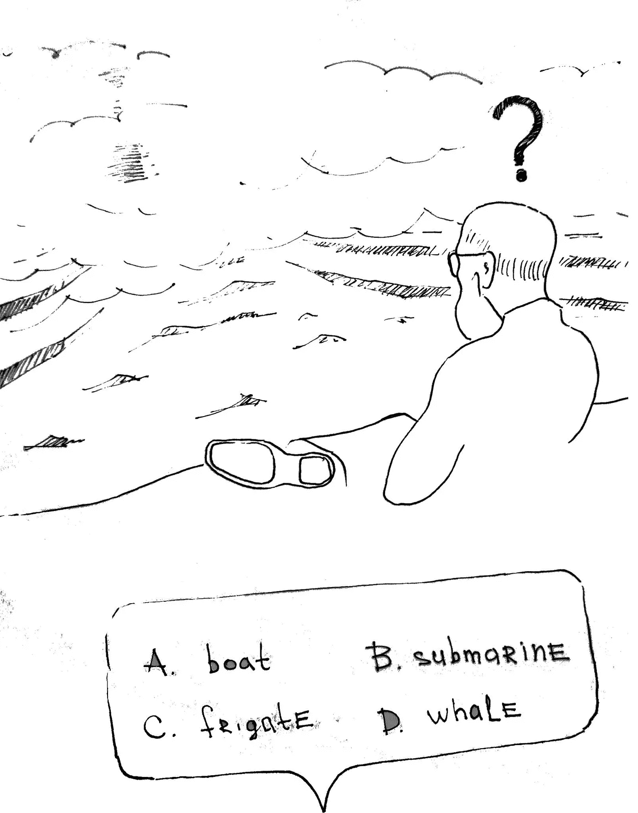

# 惩罚间接推理

> 原文：<https://towardsdatascience.com/penalized-indirect-inference-b867c13a792b?source=collection_archive---------6----------------------->

我想告诉大家我们与我的朋友和同事弗朗西斯科·布拉斯克斯合作的新出版物。我们引入一种新的估计方法叫做[惩罚间接推理](http://duplinskiy.com/penii.pdf)。我将从一个例子开始，耐心等待，开始观想。

Figure 1\. Nice weather.

夏日呼吸，海鸥尖叫，夏日阳光灿烂。

假设你正坐在沙滩上，看着大海，这时有一艘船驶过。你看到它的形状和高度，认出旗帜的颜色，观察从船上掀起的波浪。你可以相当肯定地猜测这是一艘渔船还是一艘油轮，以及它来自哪里。

Figure 2\. Foggy weather.

现在假设你坐在同一个海滩上，看着大海，但是你看不到大海的远处——有雾——你唯一能看到的是海浪:它们有多大，它们的形状。你注意到从你面前传来的波浪与右边 10 米处的不同，所以你决定有一艘船，但你不知道是哪一艘。如果浪小，你估计应该是渔船而不是油轮。

在第一种情况下，你根据对船的直接观察、形状、颜色和大小做出决定。在第二种情况下，你推断出船看着波浪的信息。这个例子可以帮助我们解释完全信息估计方法和有限信息估计方法的区别。

## 从呼吸到行动

假设我们抛硬币，想要估计正面的概率，参数 p 完全描述了抽奖的分布。一旦我们观察到多次投掷硬币，我们就可以通过最大化似然函数来估计参数 p。假设我们把硬币抛 10 次，得到 9 个头和 1 条尾巴。如果投掷是独立的，在这种情况下，可能性是观察到 9 个头和 1 个尾巴的概率，数学上是 p⁹ ×(1-p)。使该函数最大化的值 **p̂** 是该模型的 p 的最大似然估计。

当我们详细知道参数是如何进入数据的联合概率分布的，并且可以显式地计算出似然函数时，我们就可以通过最大化似然来估计模型的参数。这种方法利用所有的信息，并导致最精确的估计。然而，对于某些模型，很难根据这种直接信息建立估算过程。

例如，这种可能性可能无法通过分析获得。在这种情况下，我们可以采取间接的方式。如果每个参数的选择意味着均值和方差的某个值，我们可以构造一个矩估计的方法。改变对参数的猜测，并选择使观察到的力矩和理论上隐含的力矩之间的差异最小化的值。

间接推断方法可以被视为矩方法的推广，其中我们用来确定它是什么船的波不必是矩，而是任何辅助统计。此外，我们可以模拟给定参数选择的数据，并使用模拟的数据计算辅助统计，而不是从理论上计算矩。好像我们有很多资源，可以建造不同类型的船，让它们在我们身边航行，观察它们产生的波浪！所以，我们有了间接推论。

现在，假设你在一个区域，你知道某些类型的船只不能巡航，要么该区域是军用的，民用船只不能进入，要么海底太近。当你猜测你看到的是哪种类型的船时，你可能会想要使用这个信息。

这是我们论文的核心，我们引入了一个惩罚项，允许研究者对估计结果进行控制。这个想法类似于在使用贝叶斯估计方法时有一个信息丰富的先验。这在估计结构经济模型时特别有用，因为否则，参数估计很难根据基本的经济理论来解释。

我们还建立了估计量在正确和错误模型下的渐近性质，以及在强参数和弱参数识别下的渐近性质。并进行蒙特卡罗研究，揭示罚函数在形成估计量的有限样本分布中的作用。我们强调了在最新动态随机一般均衡模型的实证研究中使用该估计量的优势。

全文链接在这里，感谢我的朋友斯坦尼斯拉夫·达维多夫的插图。如果你有任何问题或想讨论论文，我很乐意讨论！