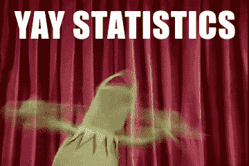
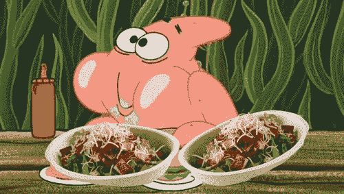
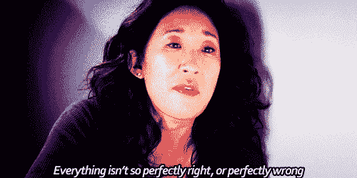
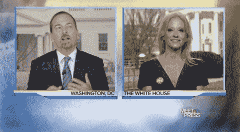

# 人们在谈论“再现性危机”和“p 值”，我觉得我应该理解，但我的眼睛已经呆滞了…你能帮忙吗？

> 原文：<https://towardsdatascience.com/people-are-talking-about-reproducibility-crises-and-p-values-and-i-feel-like-i-should-28b5d5fbe70a?source=collection_archive---------4----------------------->

我不知道回答这样的问题有多大的市场，但如果有人知道，也许我会成为数据科学领域的“[亲爱的艾比](http://www.uexpress.com/dearabby)”。*(“亲爱的斯塔西”有些潜力。)*

I’m excited to use this GIF.

## 撇开蹩脚的笑话不谈，让我们来谈谈这个“复制危机”或“复制危机”这是什么，我为什么要关心？

在许多科学进步中，验证研究结果的过程通常来自所谓的“同行评审过程”。

比方说，我已经开发了一种治疗关节炎的药物，我相信这种药物优于目前医生使用的药物。我召集了一群人，给他们中的一些人服用“马特的药物”，给他们中的一些人服用“目前的药物”，然后跟踪观察关节炎的影响在“马特的药物”组和“目前的药物”组之间是如何变化的。如果“马特的药物”组似乎关节炎疼痛较少，我可能会尝试公布我的结果，让每个人都知道我的药物对人们更好。

但是等等。也许你患有关节炎，或者你的伴侣或父母或朋友患有关节炎。你没有理由相信我的发现。事实上，你很可能会怀疑。你只想给你的家人和朋友最好的，但我可能想通过出售我的药物发财…所以你怎么知道我所做的是为了你和你家人的最大利益？

这就是“同行评审过程”发挥作用的地方。如果我想在医学杂志上发表我的结果，会有真正的[裁判](http://ccnmtl.columbia.edu/projects/mmt/frontiers/web/chapter_3/9112.html)阅读我的作品，以确保我遵循了最佳实践。

Who knew that academics could be so… sporty?

这些裁判可能会问这样的问题:

*   作者在这里是否有任何可能影响他/她写文章的利益冲突？
*   这个实验的设计有意义吗，或者看起来这个实验不是以一种低于标准的方式设计的？
*   分析[是公平和平衡的](https://www.google.com/search?q=fair+and+balanced&rlz=1C5CHFA_enUS733US734&oq=fair+and+balanced&aqs=chrome..69i57j69i60l3j69i59j69i61.1600j1j7&sourceid=chrome&ie=UTF-8)吗，或者结果是经过精心挑选的，有利于特定的结果？

在一篇文章被“审阅”(并且可能被修改)足够多次之后，一篇文章可能会被发表，这样每个人现在都可以阅读它。读者可以继续“非正式地评审”这些文章，这样如果一篇不太完美的文章通过了评审过程，原始文章的作者或发表文章的期刊可以修改文章或完全编辑它。根据不同的杂志，[真正阅读一篇文章的人数通常很少](http://www.straitstimes.com/opinion/prof-no-one-is-reading-you)。

从理论上讲，如果我发表了结论，认为“马特的药物”明显优于现有的药物，你应该能够对一组类似的患者进行相同的研究，并得到类似的结果。(在统计学术语中，我们指的是来自同一“[抽样人群](https://definedterm.com/sampled_population)的患者。))

术语“[再现性危机](https://en.wikipedia.org/wiki/Replication_crisis)”指的是这样一个事实，当我们试图再现实验**时，我们经常观察不到相同的结果**。

This is a problem.

如果我用相同的设置运行两个实验，并得出两个不同的结论…这是非常有问题的。基本上，发生了两件事之一:

*   我们最初的实验结论是错误的。
*   我们重复实验的结论是错误的。

因为除了参与者的选择之外，没有任何东西可以区分这两个实验，所以不可能确定上面两件事情中的哪一件确实发生了。

如果一个效应不能被复制，我们现在不得不质疑我们最初的结论是否合理。如果我们不能相信最初的结论，那么那个结论和任何基于那个结论的研究现在都成了问题。

## 等等。所以…

没错。不幸的是，同行评议的期刊充满了我们不希望复制的结果。

## 那么我们能做什么呢？

嗯，我们想找到一些方法来阻止这场危机。有许多[建议的方法来防止这种情况发生](https://en.wikipedia.org/wiki/Replication_crisis#Addressing_the_replication_crisis)，但是一个非常公开的建议涉及…*p*-值。

WOO!

# 呃。马特。

我知道，我知道。跟着我。

## 那么，什么是 p 值呢？

超级正式地…如果我们运行一个实验，那么一个*p*-值是这样的概率，如果零假设为真，我们重新运行我们的实验，我们得到一个与我们在最初的实验中观察到的一样极端或者更极端的测试统计。

## 嗯。你能让它不那么正式吗？

假设我说，平均来说，我一周吃四个墨西哥卷饼。你觉得那是 ***荒谬可笑还有各种各样的事情*** 但是你连续十周跟着我，跟踪我吃的东西。比方说，在这十个星期里，我平均每周吃 3.5 个墨西哥卷饼。

p-值是我们说的一种方式，假设我说我平均每周吃四个墨西哥卷饼是真的，你观察了我十周，发现我平均只吃了 3.5 个卷饼，这有多极端？P 值允许我们量化我们观察到的结果(平均 3.5 个墨西哥卷饼)与我最初声称的结果(平均 4 个墨西哥卷饼)的差异。

Me eating an average of four Chipotle burritos per week is, sadly, not unrealistic.

## 非正式的呢？

p-数值简单地衡量实验结果的极端程度。

*   大的 p 值意味着我们的实验结果符合我们的预期。
*   小的 p 值意味着我们的实验结果与我们的预期大相径庭。

小 p 值用来表示实验结果在统计上是显著的，这是一个神奇的术语，我们用它来表示我们有足够的证据来对我们试图研究的东西做出一些结论。

## 你说的“小 p 值”或“大 p 值”是什么意思

嗯，社会需要某种方式来决定“这里有足够的证据来断定我们 ***相信*** 为真的东西实际上是*真的吗？”人类非常擅长遵循明确的规则，但不太擅长仅凭“感觉”做决定。*

*正因为如此，我们历史上有一些阈值来规定“是的，我们的*p*-值足够小，可以得出结论”或“不，我们的*p*-值太大，不能得出这些结论。”[过去，我们使用 5%作为阈值。](https://en.wikipedia.org/wiki/Ronald_Fisher)有些字段使用不同的值，我们可以深入兔子洞讨论[*p*——黑客](https://projects.fivethirtyeight.com/p-hacking/)和[多重测试](http://home.uchicago.edu/amshaikh/webfiles/palgrave.pdf)，但这超出了本文的范围。*

**

*The p-value was popularized by Ronald Fisher.*

*[罗纳德·费雪](https://en.wikipedia.org/wiki/Ronald_Fisher)，“现代统计学之父”(如果我的[硕士论文导师算作我的学术母亲](http://www.genealogy.ams.org/id.php?id=22352)，也是我的学术高曾祖父)，推广了*p*-值和“显著性”的 5%阈值*

*   *你运行一个实验，得到 4%的 p 值。你的结果很好，你想要的结论是正确的！你要出版了！*
*   *你做了一个实验，得到了 7%的 p 值。你的结果并不重要，你想要的结论一定是错的。*

## *所以，听起来不错。有什么问题？*

**

*Cristina Yang of Grey’s Anatomy fame is always right.*

*嗯，两件事:*

*   *首先，[由于*p*-值如何表现](https://stats.stackexchange.com/questions/10613/why-are-p-values-uniformly-distributed-under-the-null-hypothesis)，如果我们使用 5%作为这个阈值，我可以预期我将在 20 次中检测到一些重要的结果，而*实际上并不是一个重要的结果。因此，如果每年有 5000 项外科研究应该有不重要的发现，并使用这 5%的阈值，我预计其中 250 项将被错误地解释为重要。如果我明天就要去做手术——无论是作为病人还是医生——这些听起来都不像是惊人的几率。**
*   *第二，*p*-值不能测量正确的东西。*

## *等等。什么？！我不得不记住一些统计课的荒谬定义。我一直坚持看完这篇文章。你说费希尔是现代统计学之父“他是你奇怪的学术亲戚，他使用 p 值。你说 p 值没有测量正确的东西是什么意思？*

*回到我之前的墨西哥卷饼的例子，我告诉你我平均每周吃 4 个墨西哥卷饼。然后你为我写了十周的食物日记，发现我每周平均吃 3.5 个墨西哥卷饼。假设我平均每周吃 4 个卷饼，p 值量化了你碰巧看到我吃 3.5 个卷饼的可能性。*

*也就是说，“假设我**实际上**每周平均吃 4 个卷饼，你看到我在十周内平均吃 3.5 个卷饼的概率是多少？”*

*相反，知道这一点不是很好吗:“假设你看到我在十周内平均吃 3.5 个卷饼，那么我实际上平均每周吃 4 个卷饼的概率是多少？”*

**

*Mind blown.*

*看，我们认为*p*-值实际上类似于我们最初的结论是正确的概率，假设我们观察了一些真实世界的数据。但是*p*-值实际上与观察到这个真实世界数据的概率有关，假设我们最初的假设是正确的。*

*[有 ***很多*** 的概率我现在隐瞒](https://onlinecourses.science.psu.edu/statprogram/node/138)，但是 TL；DR 版本是，*p*-值近似 A 假设 B 为真的概率，当我们真的要评估 B 假设 A 为真的概率时。*

**p*——价值观并不能衡量我们认为是什么。事物*p*-值测量和我们想要测量的事物 ***彼此相关*** ，但它们并不相同。*

**

*Yeah, I know, there’s only one Lindsay Lohan, but Parent Trap >> Full House.*

## *好吧。所以这似乎有点道理。那么，我们如何改变现状呢？*

*有很多关于如何做到这一点的建议。维基百科对改变事物的五种不同方法有一个坚实、深入的描述。*

*但是最近流行的一个建议是将统计显著性的标准阈值从 5%移动到 0.05%。如果我们这样做，我们将大大减少假阳性的数量。(使用上面的外科手术示例，我们预计在 5000 项研究中只会看到 2.5 项假阳性，而不是我们之前预计的 250 项假阳性。)*

## *但是，等等，我想你说过 p 值并不能衡量我们想要它衡量的东西。*

*没错。没错。这改变不了事实。这是治标不治本。*

*有一大群非常非常聪明的人在推广这个想法。这些作者还认识到，研究人员希望使用不基于 p 值的方法(如贝叶斯因子)，包括许多作者自己！作者只是认为，为那些确实依赖于 *p* 值的人调整这个 *p* 值阈值，将对这种“再现性危机”产生实质性的积极影响。*

## *因此，周围的“假新闻”和“替代事实”会更少！*

***否**。“假新闻”和“替代事实”是人们不想面对真实事实时使用的这些荒谬的政治传播术语。我们需要尽快将它们从我们的词汇中剔除。*

**

*I really dislike Kellyanne Conway. This is not an alternative fact.*

*但是解决再现性危机确实保护我们不依赖于 ***实际上*** 事实上不正确的结论。*

***你可以在这里** **查看我的其他博文** [**。感谢阅读！**](https://medium.com/@matthew.w.brems/)*