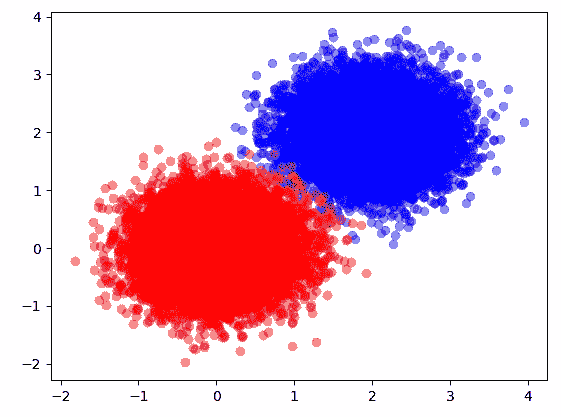

# 也许是有史以来最简单的对立例子介绍

> 原文：<https://towardsdatascience.com/perhaps-the-simplest-introduction-of-adversarial-examples-ever-c0839a759b8d?source=collection_archive---------3----------------------->

在本文中，我们将理解对立例子的直觉，以及如何用 Python 创建它们。

在撰写本文的时候，我只是深入研究了这个公式，并试图根据我为上一篇文章创建的逻辑回归示例([链接](https://medium.com/@kentsui/what-is-logistic-regression-451858f73bcb))对它进行编码。

所以，我可以向你保证我的介绍很简单，非常基础。然而，这里的直觉可以扩展到更高维度和更复杂的模型，如深度学习。

# 一切从最简单的数据开始

回到我在第一篇文章中提出的简单问题，如果我们想要区分红色和蓝色类，我们可以立即知道**决策边界**应该在两个集群的中间，如下所示。在这种情况下，位于右上角区域的任何新数据将被分类为蓝色，位于左下角区域的数据将被分类为红色。

**反面例子**是精心设计的样本，意图让机器学习出错。如果我们不能移动紫色线，我们怎么能让紫色线出错**？**

事实证明，这一点也不难，我们只需要将样本移动到对面区域，使蓝点落在红点区域，红点落在蓝点区域。一点也不意外。

Epsilon 是一个控制对抗性攻击大小的小数字，为了有效但又不太明显，需要选择它。

随着ε的增加，我们可以预见到决策边界无法算出。当ε变为 0.2 时，逻辑回归模型误差从 2.9%增长到 7.6%，当ε变为 0.5 时，增长到 22.6%。

# 快速梯度符号法

上面图形显示的实际上是使用 FGSM。

本质上，FGSM 是添加方向与代价函数相对于数据的梯度相同的噪声(非随机噪声)。噪声按ε缩放，ε通常通过最大范数限制为一个小数值。在这个公式中，梯度的大小并不重要，重要的是方向(+/-)。

# 翻译成 Python 代码

FGSM 可以在 Python 中用几行代码实现。

在梯度下降中，成本相对于权重的梯度为(Y _ Prediction-Y _ True)**X**。

在对立的例子中，成本相对于数据的梯度是(Y _ Prediction-Y _ True)**W**。

这个小小的改变意味着我们可以通过用权重替换数据来回收梯度计算的代码。

# 直觉和外卖

以下是我在试图理解这个公式时问自己的问题。

**直觉 1:为什么公式与成本函数的梯度有关？**

增加模型误差意味着增加成本函数。

**直觉二:看起来像梯度下降优化。不是吗？**

梯度下降是通过获得相对于权重的梯度来更新模型的权重，从而最小化成本函数。**在这种情况下，由于我们无法改变权重，为了增加成本，唯一的办法就是改变数据。**

从某种意义上说，我们是在做成本函数相对于数据的梯度上升来增加成本，从而增加模型误差。

**直觉 3:对立的例子有助于提高逻辑回归的质量吗？逻辑回归如何防御这种攻击？**

从我的直觉来看，使用逻辑回归无法避免这种攻击。如图所示，无论你把紫色线放在哪里，误差仍然会很高，因为对立的例子使两个集群变得模糊。然而，对抗例子对于帮助非线性模型建立对这些攻击的防御是非常有用的。

完整的 python 代码可以在这个[链接](https://github.com/kenhktsui/adversarial_examples)找到。

PS:我不是这方面的专家，但绝对是发烧友。这篇文章不是技术性的，但是我希望从最简单的案例中得到的直觉可以扩展到所有的案例。如果这个介绍有帮助，请鼓掌！