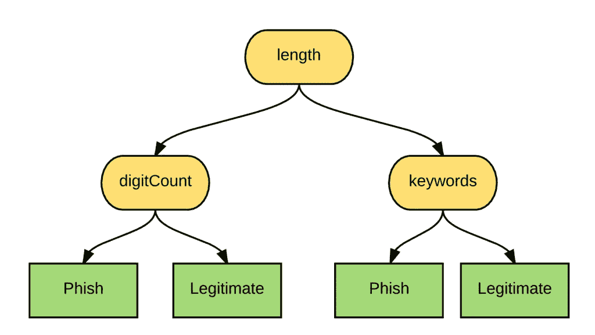
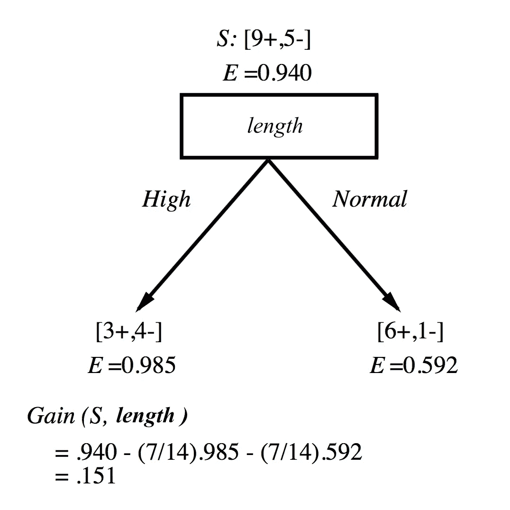

# 使用 ML 检测网络钓鱼 URL

> 原文：<https://towardsdatascience.com/phishing-domain-detection-with-ml-5be9c99293e5?source=collection_archive---------0----------------------->

网络钓鱼是一种欺诈形式，在这种形式中，攻击者试图通过在电子邮件或其他通信渠道中以信誉良好的实体或个人的身份发送来获取登录凭据或帐户信息等敏感信息。

通常，受害者会收到一封看似由已知联系人或组织发送的邮件。该邮件包含针对用户计算机的恶意软件，或者具有将受害者引向恶意网站的链接，以欺骗他们泄露个人和财务信息，如密码、帐户 id 或信用卡详细信息。

网络钓鱼在攻击者中很流行，因为欺骗某人点击看似合法的恶意链接比试图突破计算机的防御系统更容易。邮件正文中的恶意链接旨在使邮件看起来像是发送到了使用该组织徽标和其他合法内容的欺骗组织。

在这篇文章中，我解释了:网络钓鱼域(或欺诈性域)的特征，区分它们与合法域的特征，为什么检测这些域很重要，以及如何使用机器学习和自然语言处理技术来检测它们。

许多用户每天每小时都在不知不觉中点击钓鱼域名。攻击者的目标是用户和公司。根据 2014 年 2 月发布的第三份 Microsoft Computing Safer Index 报告，网络钓鱼每年在全球造成的影响可能高达 50 亿美元。

> ***这个成本的原因是什么？***

主要原因是用户的认知度不够。但安全卫士必须采取预防措施，防止用户面对这些有害的网站。要防止这些巨大的成本，除了建立强大的安全机制，能够检测和防止网络钓鱼域到达用户之外，还可以从提高人们的意识开始。

# 网络钓鱼域的特征

让我们检查 URL 结构，以便清楚地了解攻击者在创建网络钓鱼域时是如何思考的。

统一资源定位符(URL)是为处理网页而创建的。下图显示了典型 URL 结构中的相关部分。

它从用于访问页面的协议开始。完全限定的域名标识托管网页的服务器。它由一个注册域名(二级域名)和我们称之为顶级域名(TLD)的后缀组成。域名部分受到限制，因为它必须向域名注册机构注册。主机名由子域名和域名组成。网络钓鱼者可以完全控制子域部分，并可以设置任何值。URL 还可能包含路径和文件组成部分，这些内容也可能被网络钓鱼者随意更改。域名和路径完全可以被网络钓鱼者控制。在本文的其余部分，我们使用术语 FreeURL 来指代 URL 的这些部分。

攻击者可以注册任何以前没有注册过的域名。URL 的这一部分只能设置一次。网络钓鱼者可以随时更改 FreeURL 来创建新的 URL。安全卫士努力检测钓鱼域名的原因是因为网站域名的独特部分(免费网址)。当一个域被检测为欺诈性时，很容易在用户访问它之前阻止该域。

一些威胁情报公司检测并发布欺诈性网页或 IP 作为黑名单，从而防止其他人获得这些有害资产变得越来越容易。( [cymon](https://cymon.io/) ， [fireho](https://firehol.org/) l)

攻击者必须明智地选择域名，因为目标应该是说服用户，然后设置 FreeURL 使检测变得困难。让我们分析下面给出的一个例子。

虽然真正的域名是 active-userid.com，但攻击者试图通过添加 FreeURL 使该域名看起来像 paypal.com。当用户在 URL 的开头看到 paypal.com 时，他们可以信任该网站并连接它，然后可以将他们的敏感信息分享给这个欺诈网站。这是攻击者经常使用的方法。

攻击者经常使用的其他方法是域名抢注和域名抢注。

域名抢注(也称为域名抢注)是指恶意注册、买卖或使用域名，意图从属于他人的商标商誉中获利。域名抢注者可能会以高价向拥有域名中所含商标的个人或公司出售该域名，或将其用于欺诈目的，如网络钓鱼。例如，你的公司名称是“ABC 公司”，你注册为 abcompany.com。然后，网络钓鱼者可以注册 abcompany.biz，abcompany.biz，abcompany.biz，他们可以使用它进行欺诈。

域名抢注，也称为 URL 劫持，是域名抢注的一种形式，它依赖于互联网用户在网络浏览器中输入网站地址时出现的打字错误或快速阅读时很难注意到的打字错误。用域名仿冒创建的 URL 看起来像一个受信任的域。用户可能会意外输入错误的网站地址或单击看似可信域的链接，这样，他们可能会访问网络钓鱼者拥有的替代网站。

域名仿冒的一个著名例子是**goggle.com**，一个极其危险的网站。另一个类似的东西是 yutube.com 的**，它类似于 goggle.com**的**，除了它的目标是 **Youtube 用户**。类似地，**被错别字为**将用户引向一个兜售打折旅游的网站。其他一些例子；**paywpal.com**，**microroft.com**，**applle.com**，**appie.com**。******

# **用于网络钓鱼域检测的功能**

**在学术文献和商业产品中，有许多用于网络钓鱼检测的算法和各种各样的数据类型。网络钓鱼 URL 和相应的页面有几个可以与恶意 URL 区分开来的特征。比如说；攻击者可以注册长而混乱的域名来隐藏实际的域名 **(** 域名抢注，域名抢注)。在某些情况下，攻击者可以使用直接 IP 地址，而不是使用域名。这种类型的事件超出了我们的范围，但是它可以用于相同的目的。攻击者还可以使用与合法品牌名称无关的短域名，并且没有任何免费网址。但是这些类型的网站也不在我们的讨论范围之内，因为它们与欺诈性域而不是网络钓鱼域更相关。**

**除了基于 URL 的特征之外，还使用了在学术研究的检测过程中的机器学习算法中使用的不同种类的特征。从学术研究中收集的使用机器学习技术进行网络钓鱼域检测的特征分组如下。**

1.  **基于 URL 的功能**
2.  **基于领域的功能**
3.  **基于页面的功能**
4.  **基于内容的功能**

## **基于 URL 的功能**

**URL 是分析一个网站以确定它是否是网络钓鱼的第一件事。正如我们之前提到的，钓鱼网站的网址有一些独特之处。当处理 URL 时，获得与这些点相关的特征。下面给出了一些基于 URL 的功能。**

*   **URL 中的位数**
*   **URL 的总长度**
*   **正在检查 URL 是否被仿冒。(google.com→goggle.com)**
*   **检查它是否包括一个合法的品牌名称(apple-icloud-login.com)**
*   **URL 中的子域数量**
*   **顶级域名(TLD)是常用的域名之一吗？**

## **基于领域的功能**

**网络钓鱼域名检测的目的是检测网络钓鱼域名。因此，与域名相关的被动查询，我们希望将其归类为网络钓鱼或不钓鱼，为我们提供了有用的信息。下面给出了一些有用的基于域的特性。**

*   **其域名或其 IP 地址在知名信誉服务黑名单中？**
*   **自域名注册以来已经过去了多少天？**
*   **注册人姓名是否隐藏？**

## **基于页面的功能**

**基于页面的特征使用关于计算的信誉等级服务的页面的信息。这些特征中的一些给出了关于一个网站有多可靠的信息。下面给出了一些基于页面的特性。**

*   **全球页面排名**
*   **国家网页排名**
*   **在 Alexa 前 100 万网站的位置**

**一些基于页面的功能为我们提供了目标网站上用户活动的信息。下面给出了其中的一些特征。获得这些类型的特征并不容易。有一些付费服务可以获得这些类型的功能。**

*   **估计每天、每周或每月访问该域的次数**
*   **每次访问的平均浏览量**
*   **平均就诊时间**
*   **每个国家的网络流量份额**
*   **从社交网络到给定域的引用计数**
*   **领域的类别**
*   **类似的网站等。**

## **基于内容的功能**

**获取这些类型的特征需要主动扫描目标域。我们会对页面内容进行处理，以检测目标域是否用于网络钓鱼。下面给出了一些关于页面的已处理信息。**

*   **页面标题**
*   **元标签**
*   **隐藏文本**
*   **正文中的文本**
*   **图像等。**

**通过分析这些信息，我们可以收集如下信息:**

*   **需要登录网站吗**
*   **网站类别**
*   **关于观众简介等信息。**

**上面解释的所有特征对于网络钓鱼域检测都是有用的。在某些情况下，使用其中一些功能可能没有用，因此使用这些功能有一些限制。例如，将某些功能(如基于内容的功能)用于正在开发的快速检测机制可能是不合理的，该机制能够分析 100，000 到 200，000 之间的域名数量。另一个例子是，如果我们要分析新注册的域名，基于网页的功能不是很有用。因此，检测机制将使用的特征取决于检测机制的目的。应该仔细选择在检测机制中使用哪些特征。**

# **检波过程**

**检测网络钓鱼域是一个分类问题，因此这意味着我们需要在训练阶段将样本作为网络钓鱼域和合法域的标记数据。将在训练阶段使用的数据集是建立成功的检测机制的非常重要的点。我们必须使用类别确切已知的样本。因此，这意味着，被标记为网络钓鱼的样本必须绝对被检测为网络钓鱼。同样，被标记为合法的样本必须被绝对检测为合法。否则，如果我们使用不确定的样本，系统将无法正常工作。**

**为此，一些公共数据集被创建用于网络钓鱼。其中比较知名的是 [PhishTank](https://www.phishtank.com/) 。这些数据源通常用于学术研究。**

**收集合法域名是另一个问题。为此，通常使用站点信誉服务。这些服务对现有网站进行分析和排名。这种排名可以是全球性的，也可以是基于国家的。排名机制取决于各种各样的功能。排名分数高的网站是经常使用的合法网站。其中一个知名的信誉排名服务是 [Alexa](http://www.alexa.com/) 。研究人员正在使用合法网站 Alexa 的顶级列表。**

**当我们有网络钓鱼和合法网站的原始数据时，下一步应该是处理这些数据并从中提取有意义的信息，以检测欺诈性的域。用于机器学习的数据集实际上必须包含这些特征。因此，我们必须处理从 Alexa、Phishtank 或其他数据资源收集的原始数据，并创建一个新的数据集来用机器学习算法训练我们的系统。特征值应该根据我们的需要和目的来选择，并且应该为每一个特征值进行计算。**

**机器学习算法有很多，每种算法都有自己的工作机制。在本文中，我们解释了 ***决策树算法*** ，因为我认为，这个算法是一个简单而强大的算法。**

**最初，正如我们上面提到的，钓鱼域名是分类问题之一。因此，这意味着我们需要标记实例来建立检测机制。在这个问题中，我们有两个类别: **(1)** 网络钓鱼和 **(2)** 合法。**

**当我们计算选择了我们的需求和目的的特征时，我们的数据集如下图所示。在我们的例子中，我们选择了 12 个特征，并对它们进行了计算。因此，我们生成了一个数据集，该数据集将用于机器学习算法的训练阶段。**

****

**决策树可以被认为是一种改进的嵌套式 if-else 结构。每个特征将被逐一检查。下面给出了一个示例树模型。**

**生成树是检测机制的主要结构。黄色和椭圆形代表特征，这些被称为节点。绿色和有角的代表类，这些被称为叶子。当一个示例到达时，检查*长度*，然后根据结果检查其他特征。当样品的旅程完成时，样品所属的类别将变得清楚。**

****

**现在，关于决策树最重要的问题还没有答案。问题是，**将作为根定位哪个特性？**和**哪些必须跟在根后面？**智能选择特征直接影响算法的效率和成功率。**

**那么，决策树算法是如何选择特征的呢？**

**决策树使用信息增益度量，该度量指示给定特征根据训练样本的目标分类来分离训练样本的程度。方法的名字叫**信息增益**。下面给出了信息增益方法的数学方程。**

****

**高增益分数意味着该特征具有高区分能力。因此，具有最大增益分数的特征被选为根。**熵**是信息论中的一种统计度量，它描述了任意样本集合的(不)纯度。熵的数学方程如下所示。**

****

**原始熵是一个常数，相对熵是可变的。低相对熵值意味着高纯度，同样高相对熵值意味着低纯度。当我们沿着树向下移动时，我们希望增加纯度，因为叶子上的高纯度意味着高成功率。**

**在训练阶段，通过比较特征值将数据集分成两部分。在我们的例子中，我们有 14 个样本。“+”符号代表网络钓鱼类别，而“-”符号代表合法类别。我们根据*长度*特征将这些样本分成两部分。其中七个在右边，另外七个在左边。如下图所示，树的右边部分具有高纯度，因此它意味着低熵值(E)，同样树的左边部分具有低纯度和高熵值(E)。所有的计算都是根据上面给出的方程进行的。关于*长度*特征的信息增益得分为 0，151。**

****

**决策树算法为每个特征计算该信息，并选择具有最大增益分数的特征。为了增长树，叶子被改变为代表特征的节点。随着树往下长，所有的叶子都会有很高的纯度。当树足够大时，训练过程就完成了。**

**通过选择最显著的特征而创建的树代表了我们的检测机制的模型结构。创建成功率高的机制依赖于训练数据集。为了系统成功的一般化，训练集必须由取自各种数据源的各种各样的样本组成。否则，我们的系统可能在我们的数据集上以高成功率工作，但是它不能在真实世界的数据上成功工作。**