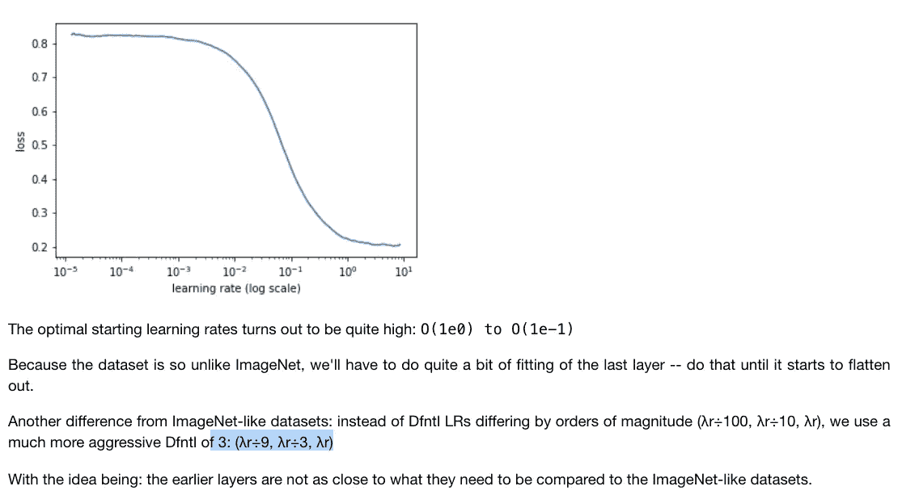
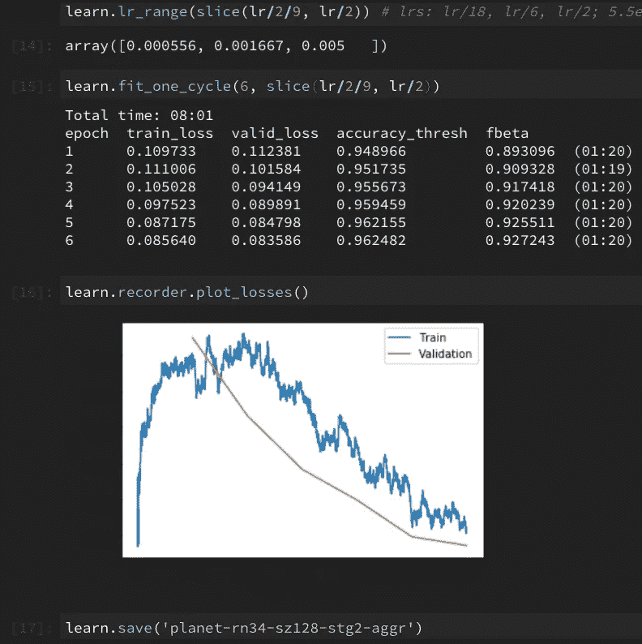
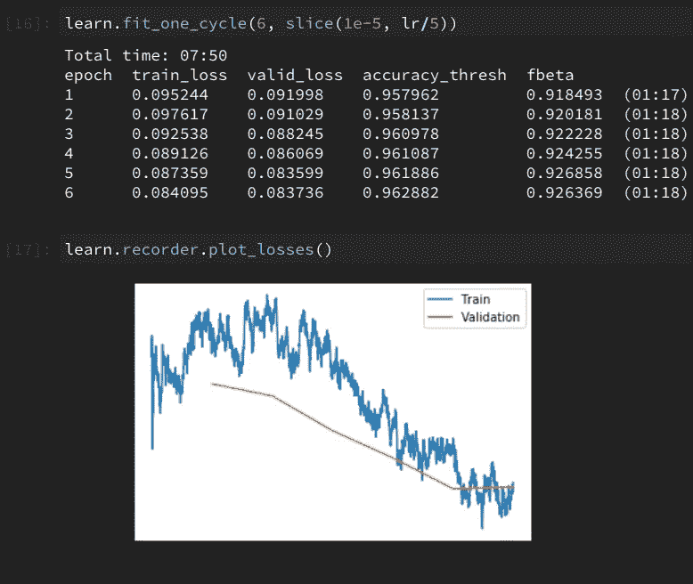
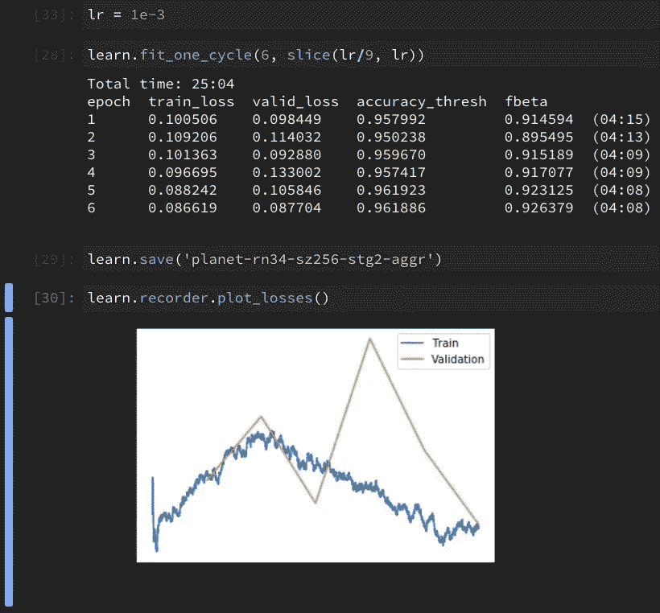
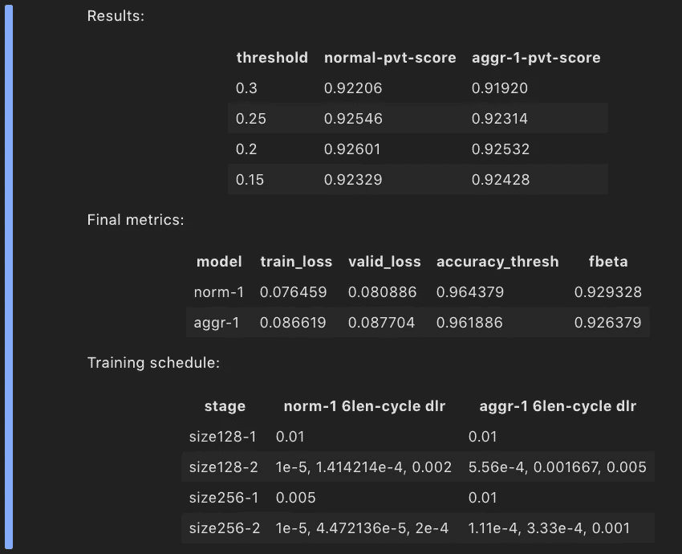
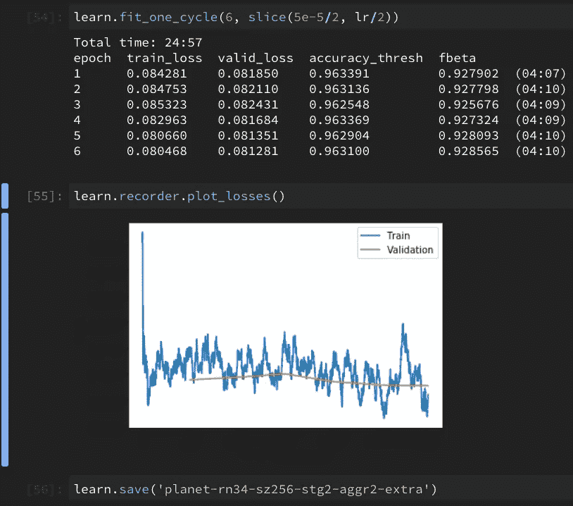
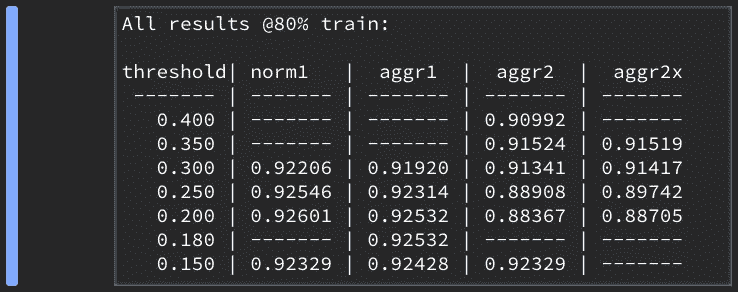

# 星球，重访 2

> 原文：<https://towardsdatascience.com/planet-revisted-2-b47995a8567?source=collection_archive---------19----------------------->

fastai 1.0 卫星影像分析

[ [第一部分](http://medium.com/@nixalo/planet-revisited-ca37faefab45/)

这篇文章有点像实验。莱斯利·史密斯和杰瑞米·霍华德等研究人员的工作质量和数量一直给我留下深刻印象，也让我感到困惑——他们的实验从外表看起来是多么复杂。学习人工智能的最大挑战之一就是简单地跟踪我在做什么以及*为什么*。当你同时进行多个实验并且还有其他事情要做的时候，你如何组织一个项目？*记笔记可能是个好主意……*

为了做更好的实验，这篇文章主要是边工作边记笔记的结果。它已经帮助我发现了一些错误，并磨练了一些想法。首先，回顾一下自上次以来一些重要的工作基础设施的发展。

# 第 1.5 部分:

这是对第 1 部分的一点跳跃。长话短说:为了把行星数据下载到虚拟机上，发生了很多冲突，为了让 Kaggle 的 API 工作，又发生了更多的冲突。这一切都被新的 fast.ai 课程笔记本里的几行代码代替了。稍微修改一下，使设置过程非常快速(这些是在 Linux 机器上的 Jupyter 笔记本中完成的):

在您的环境中安装 Kaggle API:

```
! pip install kaggle --upgrade
```

创建 Kaggle API 密钥后，将其移动到需要的位置:

```
! mkdir -p ~/.kaggle/
! chmod 600 kaggle.json
! mv kaggle.json ~/.kaggle/
```

制作一个数据目录(在`from fastai import *`之后):

```
path = Config.data_path()/'planet'
path.mkdir(parents=True, exist_ok=True)
```

下载数据:

```
! kaggle competitions download -c planet-understanding-the-amazon-from-space -f train-jpg.tar.7z -p {path}
```

(&对`test-jpg.tar.7z`、`train_v2.csv`和`test_v2_file_mapping.csv`做同样的事情)

拉开拉链。zip 是这样的:

```
! unzip {path}/train_v2.csv.zip -d {path}
```

像这样解压. tar.7z 文件:

```
! 7za -bd -y x {path}/train-jpg.tar.7z -o{path}
! tar -xf {path}/train-jpg.tar -C {path}
```

并清除存档文件(这将删除所有。zip、. 7z 和。`{path}`中的 tar 文件，无需确认):

```
! rm -rf {path}/*.zip
! rm -rf {path}/*.7z
! rm -rf {path}/*.tar
```

大概就是这样。其他大的收获是学习如何在 fastai 库中做一些基本的事情，并找到更好的方法来实现快速实验(如指定分类截止阈值，基于这些自动创建提交文件，并上传到 Kaggle)。我想我会就此写一个小帖子，因为机械/基础设施之类的东西在你让它们工作之前是项目中最难的部分，之后看起来如此简单，你几乎会忘记它们。*我这样做的时候会在这里放一个链接*。

# 第二部分:

我们的目标是在继续进入[xfiew](http://xviewdataset.org/)数据集之前，赢得[行星亚马逊 Kaggle](https://www.kaggle.com/c/planet-understanding-the-amazon-from-space/) 竞赛。我的想法是使用[获胜的解决方案](http://blog.kaggle.com/2017/10/17/planet-understanding-the-amazon-from-space-1st-place-winners-interview/)作为起点。但在此之前，我想用 ResNet34 击败一个人工基准: **0.93** (私人排行榜)，只是为了确保我有一个可靠的模型在工作。

起初，我无法在 fast.ai 课程实现上有太多改进。我尝试了“渐进式重新冻结”，这是在解冻模型后锁定层，尽管验证指标看起来不错，但两次都失败了。这导致排行榜分数从大约 0.92 下降到 0.3——如果我玩有门槛的游戏，则为 0.5。从第 100 名下降到第 920 名，总共 938 名。像这样的崩溃通常是由于搞乱了提交文件，但是我还没有测试出到底发生了什么。

我正要继续前进，直到我在一个晚上得到了我的第四个最好成绩*两次*。其中一个分数只训练了 80%的数据。目前是 0.92638 。但是为什么是第四呢？因为在 2017 年跟随该类的一个早期版本，我用 ResNet34 得到了 **0.92873** 。我是如何用同样的模型和 fastai 库更有限的版本(0.7)得到更好的成绩的？

看着那本笔记本，有一个重要的直觉:



[https://github.com/WNoxchi/Kaukasos/blob/master/FADL1/L3CA_lesson2-image-models.ipynb](https://github.com/WNoxchi/Kaukasos/blob/master/FADL1/L3CA_lesson2-image-models.ipynb)

卷积层的训练比正常情况下更加积极，因为它们是在 ImageNet 上预先训练的 ImageNet 不包含任何卫星图像。嗯，有道理。我使用了一个 3 倍的学习速率，而不是典型的每层组 10 倍的变化。以及非常大的初始学习率(`lr=0.2`)。(看起来你也微调线性层更多，但我一开始错过了这一点)

第二天(实际上是今天)我回来测试这个想法。与旧的学习率相比，似乎更积极的区别学习率(DLRs)在早期做得更好。损失下降得很快…但它似乎从一个更高的值下降到另一个更高的值。

> **注意:**我将提到以几种不同方式训练的同一个模型。这样就不那么令人困惑了:`norm-1`在我开始研究更大的学习率之前，这个模型是否经过了“正常”的训练。`aggr-n`是第 n 个训练有素的模特。通常情况下，`aggr`的层组之间的幂差为-3(比如:LR/9，LR/3，LR)，而`norm-1`的幂差为-10。除非另有说明，所有运行总共训练 24 个周期:每个阶段长度为 6±1 个周期(1:线性，2:全 conv)，每个尺寸。

第二阶段积极运行的规模图 128:



f1\. the aggressive model experiences a sharp loss drop, but froma higher starting point

并将其与第一轮(norm-1)的大小 128 第二阶段进行比较:



f2\. the ‘normally-trained’ model has a shallower loss drop, but from and too lower values

积极运行的最终损失图(橙色表示验证):



f3\. final loss plot of the aggressive run, aggr1

与正常运行相比:


f4\. final loss plot of the normally-trained run, norm1

你想要的是类似后者的东西。 [OneCycle](https://sgugger.github.io/the-1cycle-policy.html) 探索“解决方案空间”,给出一个损耗突增，然后稳定在一个接近恒定的低值。这不太符合新一轮的情况…所以要么是我太过于咄咄逼人，要么是我需要更长时间的训练来让事情稍微稳定下来；因为上面的图表看起来像是在不断变化。

> 此外，如果你想知道的话，我在 jupyter 实验室使用了材质黑暗主题。我发现自己使用 jupyter lab 比使用 notebook 多，因为虽然它的有用扩展比 notebook 少，但它内置了视图，所以你可以同时查看多个笔记本或笔记本的多个部分。

向 Kaggle 提交预测后…新模型并没有做得更好。我有一种预感，这是因为我把学习率——所有的学习率— *定得太激进了。对于尺寸为 128 的第二阶段，我使用了`learn.lr_range(slice(lr/2/9, lr/2))` = `lr/2/9, lr/2/3, lr/2`，但是在尺寸为 256 的第二阶段，我使用了:`lr/9, lr/3, lr`。*

将结果转换成可读的形式:



f5\. results for norm-1 and aggr-1

`norm-1`是继 fastai 课程笔记本之后的 ResNet 机型。`aggr-1`是第一款‘进取型’车型。我认为我在新型号中用我的 DLRs 做得太过分了。在某些情况下，我在比以前高 3 个数量级的*LRs 训练。*

但这里有另一个想法:在第一次尝试之后，有多少“积极的微调”需要完成？你能从现实世界到卫星图像“模式”的艰难转向开始调整重量，然后回到“更平静”的训练计划吗？我现在要试试。

> 中场休息

我试过了(aggr-2)，它比 norm-1 或 aggr-1 都差…损失图看起来不错，但我认为它只是没有得到足够的训练。从数字上看，这款车型看起来*不足*。训练损失比验证高 1.8%:0.083386 对 0.081870，阈值准确度下降了百分之一，fbeta 得分从 0.924608 上升了约 0.3%，达到 0.927831。

> **注**:看起来和[原装笔记本](https://github.com/WNoxchi/Kaukasos/blob/master/FADL1/L3CA_lesson2-image-models.ipynb)最大的区别就是*增加了*。除此之外，它似乎遵循每个阶段 6 个时期，每个大小 2 个阶段(冻结，解冻)，训练格式。
> 
> 旧笔记本从 64 号开始，然后是 128 号，然后是 256 号。**我可能想试试这个**。

但是在那之前…关于 aggr2 的额外训练…LRs 减半的额外 6 长度 256 阶段 2 循环…实际上比 aggr2 执行得更好，而不是崩溃。最终的损失图看起来就像你预期的那样:



f6\. final losses of aggr2 trained for an extra cycle at 1/2 DLR

嗯，这很有意思

这里有一些注释。我最初认为`aggr1`的表现优于`norm1`,因为我混淆了这两个值(我在 f5 处向上修正了结果)。事实证明并非如此，但是额外的训练确实对`aggr2x`有持续的帮助。



f7\. private leaderboard results for all models

积极的训练正在起作用，看起来我并没有对 LRs 表现得太积极。尽管过去的经历令人困惑，但在最后训练第二阶段实际上对模型有一点帮助。

现在是时候训练`aggr1`(因为我保存了重量，我可以重新加载)一个额外的周期，看看会发生什么。接下来，我将尝试通过 64–128–256 逐步调整大小。

> 中场休息 …


f8\. That’s an interesting looking plot..

有趣的是，在 96%的准确率下，我们实际上只是在追逐一个数字。这是 96%的准确度，计算方法如下:

`((preds>thresh).float()==targs).float().mean()`

这就创建了一个独热编码张量(例如`[0.,1.,1.,0.,..]`)，只要预测与目标匹配，张量就为 1，其他地方为零。平均值作为精度值返回。

预测是有阈值的:任何更大的概率转换为 1，否则为 0。这与目标(也是 1-hot)相比较。

这也隐藏了一个事实，即模型可以通过学习忽略罕见的类`(0==0)` = `1`来获得非常高的精度。尽管如此，排行榜上[的 F2 分数](https://www.kaggle.com/c/planet-understanding-the-amazon-from-space#evaluation)仍然是+0.92。


不幸的是模型没有改进。我想知道重新加载一个模型，然后进一步训练——正如我在这里所做的——是否会有不同于继续训练你已经在工作的模型的结果。我现在没时间测试这个。相反，是时候用最佳工作模式逐步调整大小了。这至少需要一个小时。我真正喜欢人工智能工作的一点是它如何推动你变得有条理。如果你安排好你的工作，为等待时间做好计划，你会有很多空闲时间。

我认为这是这篇文章的一个很好的结束点。接下来将是从 64 码开始逐步调整大小的结果，将 6 周期模型与 7 周期模型以及两倍长度的第 6 周期模型进行比较。之后，就是“在整个数据集上训练最好的一个，看看你得到了什么”。*之后:*用 ResNet50 再做一次，注意看更大的模型是否能更好地处理更大的学习率。

完成所有这些后，实现去模糊器，看看添加 L2 回归是否值得，这将是一件迫在眉睫的事情。我的目标是后天，也就是周一开始使用 xView，所以我们会看看进展如何。

在查看更长或多个周期(这给了我一些不好的结果)之前，或者参考 2017 年的笔记本，我要看看如果我在 LR/2 和 LR/5(这是“正常”模型的最大值)训练 size256 模型会发生什么。