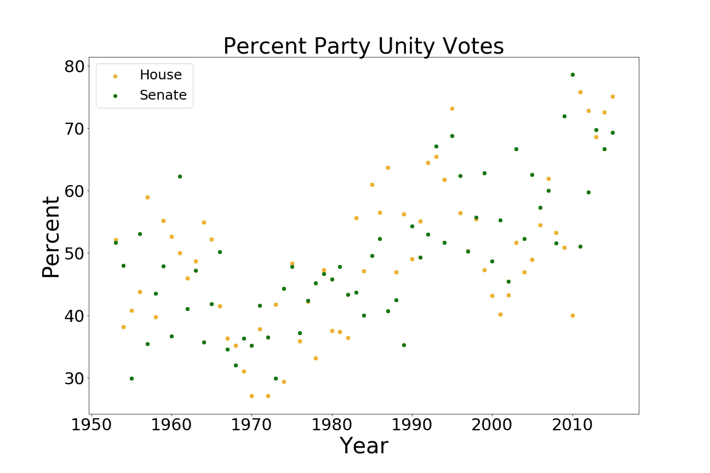
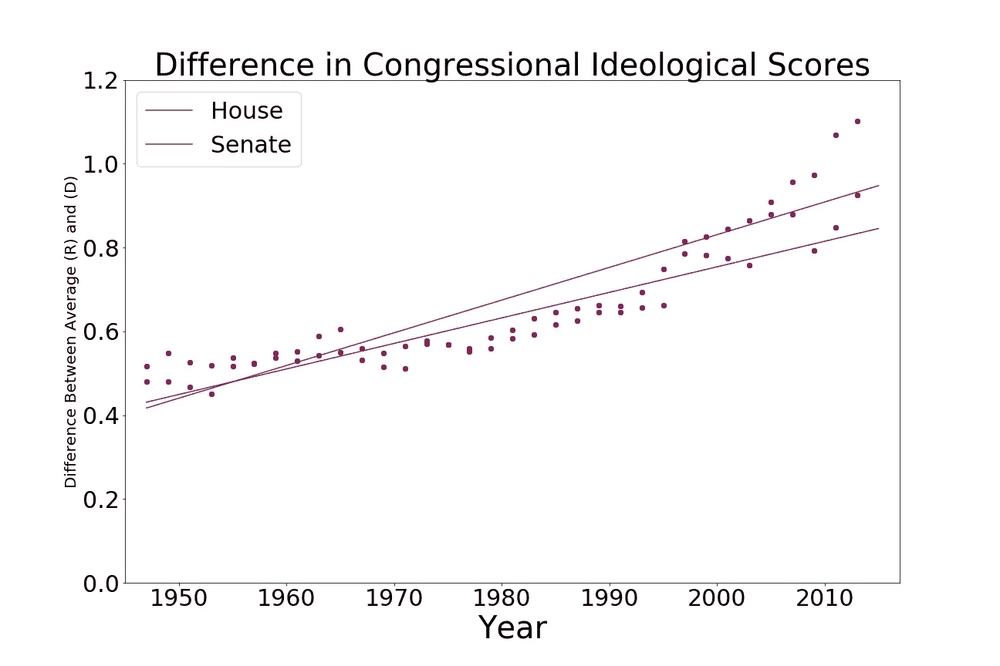

# 政治党派:看看数据

> 原文：<https://towardsdatascience.com/political-partisanship-a-look-at-the-data-e71946199586?source=collection_archive---------1----------------------->

传统观点认为，特朗普时代是近期政治中政治极化最严重的时期。我决定看看一些数据，看看是否真的是这样。利用布鲁金斯学会(Brookings)关于国会的重要统计数据，我研究了 1953 年至 2015 年国会政党投票团结和意识形态得分差异。不出所料，我发现这两个指标都处于历史峰值。当前的政治时刻是人们记忆中党派之争最激烈的时刻。

我在 Jupyter 笔记本上为这篇文章写了代码，你可以在这里看到。

# 国会党派投票团结

民主党人和共和党人多久投票一次？这很容易让人想到著名的党派投票，比如 2010 年 ACA 投票中[每个共和党人都投了反对票](http://www.washingtonpost.com/wp-dyn/content/article/2010/03/21/AR2010032100943.html)。最近，上周参议院未能通过同一 ACA 的“小废除”，每一位参议院民主党人都投了反对票。但看看整体数据，就会发现一幅更复杂的画面。如果我们衡量“党内团结投票”(定义为大多数投票民主党人反对大多数投票共和党人的投票)的百分比，随着时间的推移，似乎没有明显的趋势。

很明显，在过去 5 年左右的时间里，国会的党派投票达到了前所未有的统一水平。但是这种趋势会持续下去吗？90 年代中期(金里奇革命前后)也见证了党派团结投票的高峰，但显然几年后事情平静了下来。为了进行预测，我们需要我们亲爱的朋友线性回归的帮助。

首先，让我们制作一些*预测线*(又名最佳拟合线)。我们将测试的假设是，未来的数据将接近这些线。

在进行测试之前，很明显可以看到过去的数据并不符合这些曲线。肯定有一个微弱的积极趋势，但在某一年，很容易出现比前几年急剧下降的情况。不出所料，一个双边 t 检验揭示了令人难以置信的高置信度(众议院 p=0.9999，参议院 p=1)，我们不得不拒绝未来国会将继续看到更高的政党投票团结水平的预测。

需要注意的是，这个测试范围很窄。这并不是说政党投票的统一性会下降——它可能会停留在这个历史峰值。这也不是一个很好的衡量标准:我使用的数据集将“党内团结投票”计算为大多数民主党人投票反对大多数共和党人的投票——但它忽略了低级别的确认、无意义的重命名事物的法案等常规投票，也没有跟踪从未进入议会的法案。

# 国会意识形态得分

支持党派偏见增加的另一种观点可能指向两党之间日益扩大的意识形态鸿沟。很难量化一名官员的“开明”或“健谈”程度，但一个广泛使用的衡量标准是[普尔-罗森塔尔 DW-提名](https://voteview.com/)分数。在他们的自由-保守轴下，高负分表示高度自由的国会议员，高正分表示保守，接近 0 表示温和。

在这里，数据讲述了一个清晰得多的故事。与政党团结投票的百分比不同，数据点非常接近它们的最佳拟合线。一个简单的相关性测试(我使用了非参数的[斯皮尔曼相关系数](https://en.wikipedia.org/wiki/Spearman's_rank_correlation_coefficient))发现了一个非常强的正相关关系。

众议院和参议院都表现出非常强的相关性，r≈0.98(5*10^(-23 的 p 值))和 r≈0.94(7∗10^(−17 的 p 值)，r=1 是完美的相关性。相比之下，众议院和参议院的政党团结投票率分别为 0.46%和 0.66%，这仍然是一个积极的关系，但要弱得多。

像政党团结投票的百分比一样，这些数据也有局限性。我只使用了 Poole 和 Roosenthal 的意识形态分数的 1 个维度(“自由-保守”轴)，但他们的系统使用了超过 [10 个维度，并得出结论认为 2 维模型是最适合的](https://voteviewblog.com/2017/01/12/the-collapse-of-the-voting-structure-possible-big-trouble-ahead/)。我怀疑更详细的数据会揭示这个故事更复杂。此外，我只研究二战后的数据，当时两党之间的距离处于历史低点。很有可能，这种统一是一种历史异常，一旦没有战争来统一这个国家，这种异常就结束了。

# 结论

从这些数据来看，很明显，党派之争达到了历史最高点。这一趋势是否会继续，在政党团结投票的情况下仍有争议，但意识形态的差距几乎肯定会继续扩大。这种分离的趋势可能会增加国会的僵局和对另一方的不信任，这是一个旨在以共识为基础运作的系统的关键弱点。

当然，党派偏见是否增加是一个简单的问题。更重要的问题是如何应对——我不确定我们是否有数据来回答这个问题。