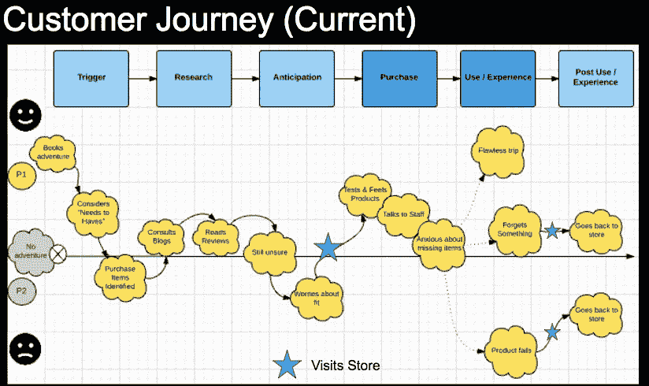
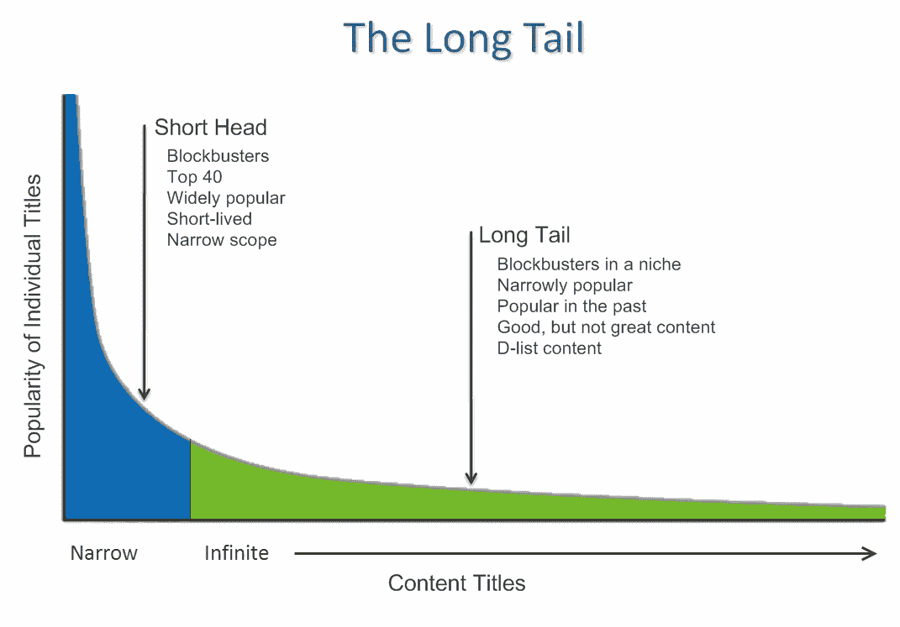

# 再倒一杯咖啡！—为什么所有业务都将成为数据业务

> 原文：<https://towardsdatascience.com/pour-another-coffee-why-all-businesses-will-become-data-businesses-3bb63c943b23?source=collection_archive---------10----------------------->

在我与多个垂直业务领域的首席技术官和首席信息官的多次交谈中，我听到的最常见的主题是: ***“我们的组织落后了，我们需要振兴——我们现在希望成为数据驱动的企业”*** 。如果这听起来很熟悉，要知道你并不孤单，你可以与大量优秀的资源合作，为推动这一转型提供一个平台(想想微软、IBM、亚马逊和谷歌)，以及一系列智能系统集成商(普华永道、埃森哲等)。)来帮助部署。但这不是一场向你灌输产品和解决方案的竞赛，这是求爱之外的第一个阶段，也是共生伙伴关系的开始。**了解你的业务，它是如何运作的，以及对你的客户来说什么是最重要的，这已经成为一次优雅的技术对话的中心**。组织的数据存放在哪里、用于什么目的、如何分析以及谁需要根据数据中的趋势洞察做出决策不再仅仅是 it 部门的事了，现在这些都属于高管层。

根据国际数据公司(IDC)在刚刚过去的 2017 年 3 月发布的研究新闻稿，组织中超过 47%的 IT 支出现在将属于核心运营业务部门，业务线(LoB)支出的复合年增长率为 5.9%。*(关于这笔支出是如何分配的，见下图)*。这在哪些业务领域最为普遍？根据同一项研究，前五大业务线包括: ***【离散制造、医疗保健、媒体、个人和消费者服务以及证券和投资服务】*。**

*(*[*2017 年业务线支出最多的领域:应用、面向项目的服务和外包*](http://www.idc.com/getdoc.jsp?containerId=prUS42405217&pageType=PRINTFRIENDLY) *)*

好吧，所以我们不要开始挑剔它，它们不会很快被机器人取代，它们仍然承载着数据驱动型组织中最重要的业务功能:安全*(它们有助于保护我们的数据免受网络攻击，还记得 Equifax 吗？)*。现在，IT 比以往任何时候都更紧密地融入到企业利用数据的方式中，他们不能/不会独自完成这项工作。但是，当首席技术官&首席信息官致力于为这个多节点技术机场建造一条新跑道时，你作为<插入营销、财务、运营、销售的副总裁>将需要让飞机着陆。

# “首席执行官，您的数据需要您的帮助！”

IBM 的首席执行官 Ginni Rometty 在她的 CES 2016 主题演讲中说了一些让我非常感动的话:

> **“数据是世界上最宝贵的自然资源……80%的数据是黑暗的……挑战在于理解它”** *。*

这种想法是，暗数据，或者说我们生活中每时每刻都可以收集的数据，是一种丰富的资源，只等着那些处于战略地位并有能力这样做的企业来收集。

想一想你一周的典型旅程图*(或者与我们的会议更相关，想一想零售中心的顾客旅程图:见下文)*。周一早上你开车去上班，和同事一起吃午饭，发一些邮件。当然，我们知道我们开了多少英里，吃了多长时间的午餐，但这里缺少了一些有价值的遥测数据:我们在通勤途中听了多少分钟的播客，它如何影响了你从上午 9 点到 11 点的项目效率？在特定时间吃特定的一餐会影响发送的邮件数量、长度或获得快速回复的成功率吗？我们开车的方式和我们走的路线与我们一天的开始或结束有关联吗，通过心率、睡眠习惯等来衡量。为了这些想法，请将隐私放在一边，**想象一下，我们日常生活中的每时每刻背后的遥测技术如何帮助卡车车队减少事故，人力资源提高工作效率或增加员工在工作场所的保留率，并使大学能够构建智能地为最佳学习环境做出更多贡献的课程。**

*(****典型顾客体验之旅图*** *在零售中心购买运动服装:非常感谢我的同事“快乐源于设计”* *团队成员，我在奥斯汀的设计思维商业案例挑战赛中向他们展示了我们的原型，我们的原型获得了第一名。)*

根据全球领先的技术研究和咨询公司 Gartner 的一些预测，到 2022 年，物联网(包括收集环境数据)将每年为消费者和企业节省 1 万亿美元的耗材、服务和维护成本。关键是，我们日常生活中的环境信息可以被捕获并用于绘制模式，以便更深入地了解*(想想 FitBit 让我们可以测量睡眠模式和步行活动)*我们是谁，以及我们如何才能达到/超过最佳基准。这是一个非常宝贵的商业机会，将结构化和非结构化数据收集到一个安全的存储库中，以便对其进行提取、建模和理解，将允许进一步渗透到为您的客户服务的空白领域。当然，人工智能是过去 20 年来科技领域最热门的话题 *(* [*见下文*](http://www.economist.com/news/briefing/21721634-how-it-shaping-up-data-giving-rise-new-economy) *)* 人工智能在公司收益电话会议中的持久性，现在正成为商业领域最热门的话题，但人工智能不能没有大量数据课程，它必须建立在这些数据之上并从中学习。

[微软用“联网牛”做了一件令人兴奋的事情](https://news.microsoft.com/features/connected-cows-help-farms-keep-up-with-the-herd/)。牛群管理公司 SCR Dairy 与微软合作，帮助评估母牛何时发情，以便它们可以在正确的时间进行人工授精，实现最佳的小牛产量。这些数据是在连接到雌性奶牛的物联网设备上收集的，通过人工智能建模确定了雌性奶牛行走的步数与其发情倾向的相关性。事情并没有就此结束，随着所有数据的收集，更多的洞察力被用来创造“黑暗收入”，包括与雌性小牛出生的最高概率(这提供了更大的收入产生)的行走步数、小牛的健康等相关的模式。该系统还设计用于移动部署，以帮助牧场经理在野外进行扩展，从而降低劳动力成本并增加收获的数据。想象一下您自己的组织中可能出现的用例？

# 拉长长尾:从数据故事中获取$美元

随着企业变得更加数字化，他们参与创造额外收入流的能力将变得更加丰富，这要归功于我们的朋友:**长尾**。这一理论认为，当企业专注于特定的战略计划(服务和产品)时，在这些焦点上产生最大的收入，当他们离开这些点并进入他们不熟悉的点时，收入就会下降。尽管随着更多产品和服务的加入，收入现在会通过这些额外的产品和服务矢量进行汇总，如下图所示。当然，这是假设这些额外的新的点不是非常成本高昂或资产沉重(进入数据故事)。亚马逊 vs 沃尔玛，在沃尔玛成为“砖头和点击”之前，是长尾理论在起作用的一个完美例子。沃尔玛可能只想在它的砖臼中储存“前 40 本书”,而亚马逊理论上可以在其庞大的互联仓库网络中储存任意多的书籍。尽管亚马逊提供的利基“猫书”并不是最畅销的，但这些书的广泛可用性沿着尾巴向下延伸，增加了更大的收入。

*(* )——感谢马丁·福特，在他的书中提出了这些观点:[《机器人的崛起》](https://www.nytimes.com/2015/05/17/books/review/rise-of-the-robots-and-shadow-work.html?mcubz=3)。

**回数据**。让我们以汽车制造商为例。传统汽车制造商的重点领域可能包括几个不同的收入来源，主要是汽车销售和服务(即通用汽车的安吉星)。现在，如果通用汽车将自己定位为战略性地利用其数据资产，利用数据提供更多的创收服务，这些服务单独来看并不令人印象深刻，但累积起来会提供令人印象深刻的产品/服务流“长尾”，当然还有收入。基于从多年的历史和流式(IoT)服务数据中生成的关于轮胎磨损和刹车使用的预测分析，构建一个移动平台，以便在用户的车辆需要维护时联系他们。使用相同的数据来预测客户何时会来进行特定的维护项目，为连接的供应链提供及时的交付，智能的劳动力调度，或规定地建议销售团队为特定的汽车 **/** 加满油，并为客户来进行例行维护做好试驾准备。这些数据是否可以用来计算客户按月付费的多层消费模式会员资格，并驾驶一个**【共享】**车队？

在这里，我们相互问了很多问题，我们也涉及了很多领域——总的来说，技术有很多不同的方式从成本中心发展到增长中心。它发生得非常快。

现在，您可以在本季度开始做些什么，以确保您的业务更多地成为经济驱动力，并拥有数据驱动的副驾驶员？

请随时联系我进行更多讨论，也可以在 LinkedIn 上关注我。