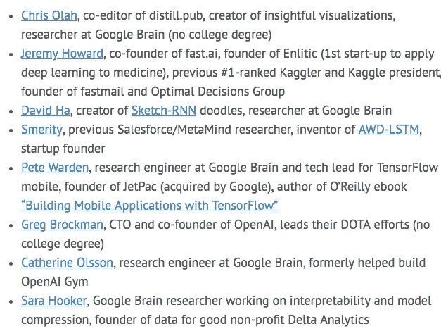

# 数据科学写作的实用建议

> 原文：<https://towardsdatascience.com/practical-advice-for-data-science-writing-cc842795ed52?source=collection_archive---------5----------------------->

([Source](https://www.pexels.com/photo/adult-book-business-cactus-297755/))

## 撰写数据科学项目的有用技巧

写作是每个人都想做的事情，但是我们经常发现很难开始。[我们知道写关于数据科学项目的文章](https://medium.com/p/50715f37833a?source=your_stories_page---------------------------)可以提高我们的沟通能力，打开大门，让我们成为更好的数据科学家，但是我们经常纠结于我们的文章不够好或者我们没有必要的背景或教育。

我自己也一直在与这些感觉作斗争，在过去的一年里，我已经形成了一种克服这些障碍的心态，以及关于数据科学写作的一般原则。虽然写作没有一个秘诀，但有一些实用的小技巧可以让你更容易养成高效的写作习惯:

1.  **目标达到 90%** :完成的不完美的项目比你从未完成的完美项目要好
2.  **一致性有助于**:你写得越多，就越容易
3.  **不要担心证书:**在数据科学中，没有任何障碍阻止你贡献或学习任何你想学的东西
4.  **最好的工具是完成工作的工具**:不要过度优化你的写作软件、博客平台或开发环境
5.  **广泛而深入地阅读:**借鉴、混合和改进他人的想法

在这篇文章中，我们将简要地讨论每一点，并且我将谈到我是如何实现它们来提高我的写作水平的。在几十篇文章的过程中，我犯了很多错误，你可以从我的经历中学习，而不是自己犯同样的错误。

# 完美被高估了:目标是 90%

我必须克服的最大的精神障碍，也是我经常听到其他人与之斗争的想法是“我的写作/数据科学技能不够好。”这可能会使人变得虚弱:当考虑一个项目时，人们会合理化，因为他们不能达到完美，他们甚至还不如不开始。换句话说，他们让 [*完美成为了*](https://en.wikipedia.org/wiki/Perfect_is_the_enemy_of_good) *善的敌人。*

> 这里的谬误是，只有完美的项目才值得分享。然而，一个粗略完成的项目要比一个永远无法完成的理想化项目好得多。

虽然在某些领域，完美的表现是可以预期的——你希望你的汽车刹车每次都能正常工作——但写博客不在这些领域之内。回想一下您最近一次阅读数据科学文章的情形。我猜(尤其是如果你读了我的一篇文章)它至少有一些错误。然而，你可能还是完成了这篇文章，因为重要的是内容的价值。只要文章有引人注目的内容，我们愿意忽略一些错误。

当我写作时，我的目标是让我的文章可读，并做一些编辑，但我不再要求它们完全没有错误。实际上，我的目标是 90%,超过 90%就是额外奖励。发布一篇有一些错误的文章总比一点错误都没有要好(如果你关心语法/风格，我推荐免费的语法工具)。

这种态度不仅限于编写数据科学项目本身。总会有另一种方法可以尝试，或者进行另一轮模型调整。在某一点上，这项工作的[回报将少于投入的时间](https://en.wikipedia.org/wiki/Diminishing_returns)。知道何时停止优化是一项重要的技能。不要让这成为一个半途而废的项目的借口，但是不要强调试图达到不可能的 100%。如果你犯了几个错误，那么你有机会通过把你的工作拿出来征求反馈来学习。

> 愿意完成不完美的工作，积极回应建设性的批评，这样下次你就不会犯同样的错误。

# 做一次事情不会让你变得更好:一致性很重要

虽然[10000 小时法则已经被揭穿](https://www.brainpickings.org/2014/01/22/daniel-goleman-focus-10000-hours-myth/)(事实证明，当你练习时专注，被称为[“刻意练习”，](https://www.inc.com/ken-sterling/the-6-ways-to-master-skills-with-deliberate-practi.html)至少和你练习多少一样重要)对于在一项任务中积累更多的经验还是有好处的。[写作不是一项需要特殊能力的活动](https://www.amazon.com/Bird-Some-Instructions-Writing-Life/dp/0385480016)，而是一个[需要反复掌握的过程。](https://www.salon.com/2016/04/10/malcolm_gladwell_got_us_wrong_our_research_was_key_to_the_10000_hour_rule_but_heres_what_got_oversimplified/)

> 写作也许从来都不简单，但随着练习，它会变得越来越容易。此外，写作是一个正反馈循环:随着你继续写作，它会变得更容易，你的写作也会变得更好，从而让你想写更多。

我写作的一个重要障碍是开始，我喜欢把它看作是激活能量。随着你写得越来越频繁，开始写作的障碍就越来越低，开始写作所需的摩擦也就越来越少。一旦你开始了，你通常会度过最困难的部分。

如果你坚持写作，你可以把你的心态从“现在我要去*让*从这个活动中抽出时间来写”转变为“现在我已经完成了这个项目，是时候像往常一样写了。”[即使是写失败的项目也会很有价值。对每个项目进行写作强化了这样一个概念，即写作不是一件额外的苦差事，而是数据科学管道的一个关键部分。](https://medium.com/@skyetetra/so-your-data-science-project-isnt-working-7bf57e3f12f1)

写作往往不仅仅意味着分享文章。当你在进行分析时，试着在你的 Jupyter 笔记本上添加更多的文本单元格来解释你的思维过程。这是我最初开始写博客的方式:我开始彻底注释我的笔记本，并意识到写一篇文章只需要多做一点工作。此外，当你开始向你的代码添加解释时，你未来的自己和看你作品的同事会感谢你。

写我的前几篇文章确实感觉像是一件苦差事，但当我习惯了这不会是一次性的事情的想法，它变得容易得多，直到我达到了它是我工作流程中被接受的一部分的地步。[习惯极其强大](https://www.amazon.com/Power-Habit-What-Life-Business/dp/081298160X)，*写作和其他习惯一样*都是可以习得的。

# 头衔在数据科学中毫无意义:不要担心证书

想想你上一次安装 Python 包或者从 GitHub 派生 repo 的时候。你搜索过拥有高等学位的作者吗？你只看了专业软件工程师写的代码吗？当然不是:您甚至在检查作者的证书之前就已经查看了存储库的内容(如果您愿意的话)。

同样的概念也适用于数据科学文章:对它们的评判是基于工作的质量，而不是作者的资历。在互联网上——不管是好是坏——出版没有任何障碍。不需要任何证书，不需要攀登象牙塔，不需要通过考试，也没有门卫阻止您学习和撰写任何数据科学方面的内容。虽然某方面的大学学位是有用的(我有一个机械工程学位，尽管从未使用过，但我并不后悔)，但对数据科学做出贡献肯定是不必要的(T2)。

[在这篇出色的文章](http://www.fast.ai/2018/08/27/grad-school/)中，专业机器学习研究人员 Rachel Thomas 给出了她的观点，即为什么即使在深度学习中，高级学位也不是必要的。以下是她列出的没有博士学位的深度学习贡献者的部分列表:

A partial list of contributors to deep learning who don’t have a PhD. ([Source](http://www.fast.ai/2018/08/27/grad-school/))

在数据科学中，你获取新知识的能力比你的教育背景更重要。如果你对某个科目没有信心，那么有很多资源可以让你学习你需要知道的东西。我个人可以推荐 Udacity，Coursera，还有 Scikit-Learn 和 TensorFlow 的优秀的[动手机器学习作为我最喜欢的资源，但是还有](http://shop.oreilly.com/product/0636920052289.do)[无数其他的。虽然 MOOCS 没有在所有科目上完全“民主化教育”,但它们在数据科学上取得了成功。](https://www.ngdata.com/top-data-science-resources/)

不要因为你认为自己没有背景而阻止自己接受一个项目。我最初担心我的资历，但在我从读者的角度思考之后——人们在网上阅读他们的文章之前不会考虑某人的头衔——我发表文章变得容易多了，不用担心我的背景。此外，一旦你意识到你的教育来自哪里并不重要，你会发现学习起来容易得多，因为你可以不再认为正规教育是唯一的信息宝库。对于数据科学，你可以从互联网上了解你需要的一切，通常比你在教室里学到的要快得多。

保持开放的心态也很重要:当我不完全确定我是否使用了正确的方法时，我会在文章中承认，并且我总是欢迎任何纠正。做数据科学没有标准的方法，但是你仍然可以从其他有解决类似问题经验的人那里学到很多。

> 认识到你可以学习任何必要的东西来独自承担任何数据科学项目，但也要虚心接受建议。

# 最好的工具是完成工作的工具

Windows vs MacOS。 [R vs Python](https://www.datacamp.com/community/tutorials/r-or-python-for-data-analysis) 。崇高 vs 原子 vs 皮查姆。媒体 vs 你自己的博客。这些争论都是无益的。正确的回答是使用任何能让您解决问题的工具(在您的环境范围内)。此外，具有更多选项的[工具并不总是更好的](https://en.wikipedia.org/wiki/The_Paradox_of_Choice)。

虽然更多的功能听起来很棒，但它们经常会妨碍你的工作。一般来说，我尽量让事情简单。当人们问我关于写作平台的建议时，我说中等，因为它的功能有限。当我写作时，我想把注意力集中在内容上，而不是花时间试图按照我想要的格式编排每一件事。

> 更多的定制选项意味着更多的时间来定制这些选项，而更少的时间来做你应该做的事情——写作或编码。

我以前陷入过工具优化循环:我被说服转而使用新技术，花时间学习新功能，却被告知这项技术已经过时，下一个*将会让我更有效率。不久前，我停止了 ide(集成开发环境)之间的切换，只选择了 Jupyter + Sublime Text，因为我意识到额外的东西只会妨碍编写代码。*

当论点足够有力时，我并不反对转换工具，但是仅仅为了新奇而转换工具并不是提高生产力的良方。如果你真的想开始，挑一叠坚持下去。如果你开始一个项目，并注意到你的工具中缺少一些东西，那么你可以开始寻找你需要的东西。不要轻信承诺更多功能的华而不实的新工具，直到你知道你需要那些功能(这也适用于买车)。换句话说，不要让工作程序的优化妨碍工作。

Choose a strategy and stick with it! ([Source](https://xkcd.com/1445/))

# 从哪里获得你的想法:广泛而深入地阅读

伟大的想法不会脱离所有其他想法而自行涌现。相反，它们是通过将旧的概念应用到新的问题中来创造的，[混合两种现有的想法](https://www.everythingisaremix.info/watch-the-series/)，或者改进一个已被证实的设计。想知道该写些什么的最好方法是阅读其他数据科学家正在写的东西。当我陷入一个问题或者需要一些新的写作想法时，我不可避免地开始阅读。

此外，如果你对自己的写作风格不自信，可以从模仿你最喜欢的作家开始。看看他们文章的结构，以及他们如何处理问题，并尝试将相同的框架应用到你的项目和文章中。每个人都必须从某个地方开始，建立在别人的技术上并不可耻。最终你会发展出你自己的写作风格，然后其他人可以适应，等等。

我建议广泛阅读*和深入阅读*，以平衡探索与开发。[探索/利用问题](https://medium.com/@dennybritz/exploration-vs-exploitation-f46af4cf62fe)是机器学习中的一个经典，特别是在强化学习中:我们有一个代理需要平衡对环境的更多学习，*探索，*与选择基于它认为会导致最高回报的行为，*利用*。**

> **通过广泛阅读*，我们探索了数据科学的许多不同领域，通过深入阅读*，我们加深了对特定专业领域的理解。你可以通过练习已经掌握的技能——利用——并经常学习新的技能——探索，将这一点应用到你的写作和数据科学中。****

****我也喜欢将探索/利用的想法应用于选择数据科学项目。这两个极端都可能导致令人不满意的项目:只根据你过去做过的事情来选择一个项目，你可能会发现它已经过时并失去兴趣。如果你选择了一个你不能应用任何先验知识的项目，那么你可能会感到沮丧并放弃。相反，找一些中间的东西，你知道你可以建立那些你已经拥有的技能，但也需要学习一些新的东西。****

****我对选择项目的最后建议是从小处着手。项目只会随着你的工作而成长，无论你分配给项目多少时间，它都会花费更长的时间。承担一个完整的机器学习项目可能很诱人，但如果你仍在尝试学习 Python，那么你可能想一次解决一部分。也就是说，如果你有足够的信心承担整个项目，那就去做吧！没有比练习更有效的学习方法了，尤其是把所有的碎片放在一个问题里。****

# ****结论****

****正如任何延迟长期回报的活动一样，写作有时会很困难。尽管如此，还是有一些具体的行动让这个过程变得更容易，并且[创造了正反馈循环](https://en.wikipedia.org/wiki/Positive_feedback#In_psychology)。写作没有一个秘密，而是一系列的步骤，减少开始写作的摩擦，帮助你坚持下去。当您开始或推进您的数据科学职业生涯时，请记住这些提示，以建立和保持高效的写作习惯。****

****我欢迎关于写作建议、评论和建设性批评的讨论。可以通过推特 [@koehrsen_will](http://twitter.com/@koehrsen_will) 联系到我。****