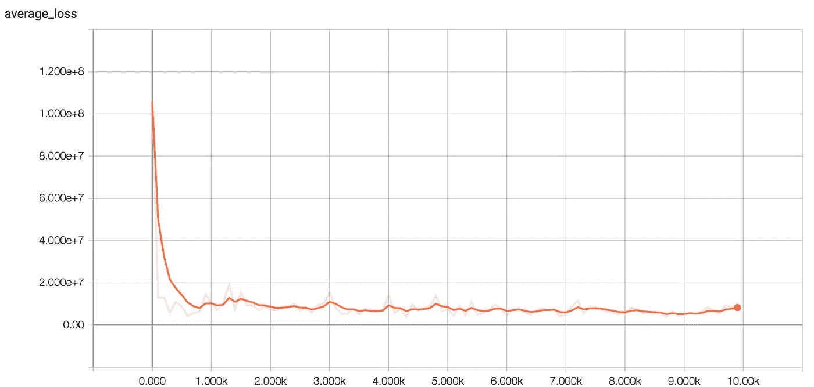
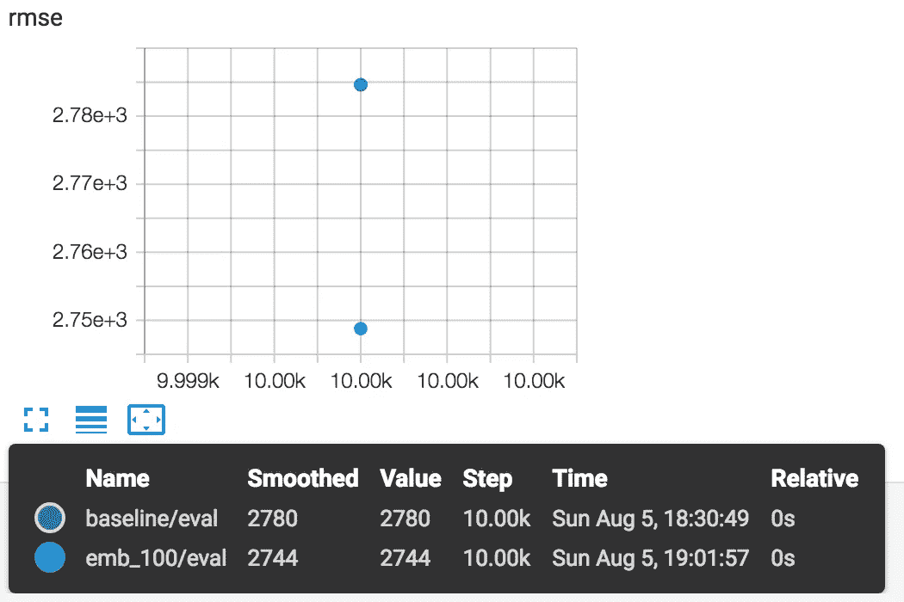
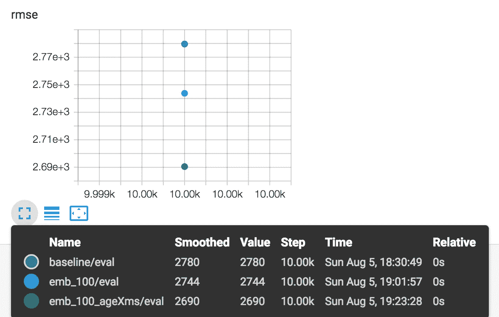
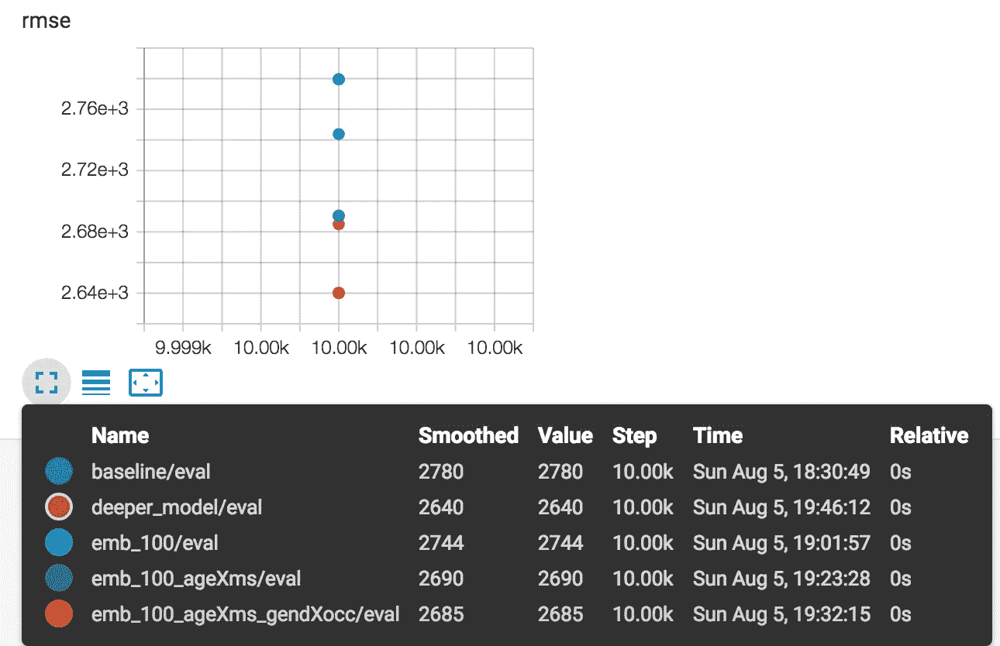

# 使用深度学习预测黑色星期五的客户购买量

> 原文：<https://towardsdatascience.com/predict-customer-purchases-on-black-friday-using-deep-learning-8f9547c1d18d?source=collection_archive---------5----------------------->

也许机器学习在零售业中最明显的应用之一是预测顾客在商店可能会花多少钱。这种预测器对店主具有明显的商业价值，因为它将有助于他们的财务规划、库存管理、营销和广告。

[Analytics Vidhya](https://www.analyticsvidhya.com/) 提供了一个关于黑色星期五顾客购买模式的很好的数据集。我是通过阅读由 [Phani Srikanth](https://medium.com/u/b7f3e4fe28b3?source=post_page-----8f9547c1d18d--------------------------------) 撰写的[帖子](https://medium.com/data-science-analytics/black-friday-data-science-hackathon-4172a0554944)来了解数据集的。Phani 很好地解释了他如何使用随机森林和 XGBoost 构建预测器。我决定将深度学习模型应用于该问题，并看看它们的表现如何。

# 问题陈述

这个数据集的优点是它简单明了的特性。图 1 显示了训练数据集的快照。


Figure 1: A snapshot of the Black Friday dataset.

目标是在给定所有其他特征的情况下预测购买字段。大多数特性都是不言自明的。最后三个描述了产品的可能分类。我用 0 替换了这三个字段中缺少的值。完整的描述。

# 数据探索

我在本[笔记本](https://gist.github.com/mleila/5701935bf0851ed20ce053f051f52ab4)中描述了对数据集的详细探索性分析。这些信息包括:

*   这个数据集中有 50 多万行
*   几乎所有的列都代表分类特征
*   产品类别 2 和 3 有许多缺失值，现在表示为类别 0
*   用数字而不是用类别来表示停留在当前城市的年数可能会有用。
*   特征交叉有很大的实验空间。例如年龄×婚姻状况或性别×职业
*   分别有 5891 和 3623 个不同的用户和产品 id。所以这两个特性都可以从嵌入中受益。

# 黑色星期五预测者

深度神经网络在正确选择超参数和网络架构以及一些特征工程的情况下表现良好。使用深度学习的数据科学家知道，需要大量的实验才能找出最佳配方。

虽然模型设计因问题而异，但建模、训练、评估和部署深度神经网络的整个过程都非常标准。因此，已经开发了一些框架来自动化这一过程并隐藏其复杂性。对于这个问题，我将使用谷歌的框架 Tensorflow，这是建立可扩展和高效的深度学习模型的最佳工具之一。

使用 Tensorflow，我构建了黑色星期五预测器[应用](https://github.com/mleila/blackfriday-predictor)，允许其用户针对这一特定问题快速构建和测试深度神经网络模型。使用该应用程序，您可以指定架构、超参数，甚至使用单个命令来试验特征交叉。然后，您可以使用 tensor board(tensor flow 的另一个强大功能)来比较您的模型，并找出最佳候选对象。要安装和使用该应用程序，请遵循这些[说明](https://github.com/mleila/blackfriday-predictor/blob/master/README.md)。

# 特征工程和建筑

安装应用程序后，创建一个新的目录来存储模型

```
mkdir my-project
cd my-project
```

现在你可以开始实验了！

首先，我们将开始训练一个简单的模型，作为我们其余实验的基线。应用程序自带的默认值应该足够了。使用默认值训练模型相当于运行以下命令

```
train --model-name baseline \--estimator-type DNN_REG \--indicators "Age" "Gender" "Occupation" "City_Category" "Stay_In_Current_City_Years" "Marital_Status" "Product_Category_1" \--embeddings '{"Product_ID":4, "User_ID":4}' \--hidden-units 100 200 100 \--training-steps 10000
```

请注意，此模型省略了 Product_Category_2 和 Product_Category_3 列，没有通过功能交叉构建任何新功能，并且具有相对较少的隐藏单元和仅 3 个隐藏层。尽管如此，它应该提供一个良好的基线，并快速训练。

训练完成后，你应该会发现两个新目录:`my-project`中的`savedmodels`和`tensorboard`目录

要了解您的第一个模型的表现，让我们使用 tensorboard

`tensorboard --logdir tensorboard`



Figure 2: Average loss of the baseline model (tensorboard visualization)

对于基线来说还不错！如果你检查 tensorboard 上的均方根误差(RMSE)部分，你应该看到一个 **2780** 的 RMSE。RMSE 是我们用来比较模型的指标。RMSE 越低，模型越好。

我们有许多方法可以进一步调整模型，使其做得更好。我们可以研究如何表示我们的特征(特征工程)，修改模型的架构，或者改进训练。在这篇博文中，我们将重点讨论前两类。

让我们从试验我们的特性开始。该应用程序旨在使这一过程变得非常简单。这样，我们就专注于实验背后的逻辑，而不是代码。

我们可以做的第一个改进是增加 User_ID 和 Product_ID 列的嵌入维度。每个的默认值是 4 维。让我们试着把这个数字提高到 100(我自己做了几次实验后得出了这个值)。

```
train --model-name emb_100 \--estimator-type DNN_REG \--indicators "Age" "Gender" "Occupation" "City_Category" "Stay_In_Current_City_Years" "Marital_Status" "Product_Category_1" \--embeddings '{"Product_ID":100, "User_ID":100}' \--hidden-units 100 200 100 \--training-steps 10000
```

注意，我给了这个模型一个描述性的名字。这在 tensorboard 中比较不同模型时非常有用。运行此命令，将训练一个新模型，将其存储在“savedmodels”目录中，并将事件文件写入`tensorboard`



Figure 3: RMSE of the embed_100 model vs baseline models (tensorboard visualization)

不错！我们的 RMSE 仅仅通过改变嵌入维数就下降了 40 点。为自己尝试一些价值观，不断尝试。

我们可以通过一起创建新功能来进一步改进我们的模型。这可以通过将特征组合在一起(特征交叉)来实现。有很多方法可以做到这一点，所以检查探索性分析笔记本以获得更多的细节。一个有趣的特征是年龄和婚姻状况。让我们试试看

```
train --model-name emb_100_ageXms \--estimator-type DNN_REG \--indicators "Age" "Gender" "Occupation" "City_Category" "Stay_In_Current_City_Years" "Marital_Status" "Product_Category_1" \--embeddings '{"Product_ID":100, "User_ID":100}' \--crossings '["Age", "Marital_Status", "ind", 1000]' \--hidden-units 100 200 100 \--training-steps 10000
```

有关 crossing 参数的更多详细信息，请查看应用程序[文档](https://github.com/mleila/blackfriday-predictor)和 tensorflow 功能专栏[教程](https://www.tensorflow.org/guide/feature_columns)。

现在让我们看看我们的新功能如何改进我们的结果



Figure 4: Feature crossing age and marital status improves lowers RMSE (tensorbaord visualization)

好多了！将年龄与婚姻状况交叉确实产生了一个具有新信息的特征。我在探索性分析笔记本中提供的跨越这些特性的推理只是一个例子。我们不能真正说出这些特征之间存在什么潜在的关系，但是我们知道它是有效的。

让我们试试另一个？这一次，我将跨越性别和职业

```
train --model-name emb_100_ageXms_gendXocc \--estimator-type DNN_REG \--indicators "Age" "Gender" "Occupation" "City_Category" "Stay_In_Current_City_Years" "Marital_Status" "Product_Category_1" \--embeddings '{"Product_ID":100, "User_ID":100}' \--crossings '["Age", "Marital_Status", "ind", 1000]' '["Gender", "Occupation", "ind", 1000]' \--hidden-units 100 200 100 \--training-steps 10000
```

像往常一样，我们用 tensorboard 找出新模型与其他模型的比较


Figure 5: Feature crossing gender and occupation barely adds any value to our model(tensorbaord visualization)

啊！不是一个令人印象深刻的结果。好了，不要气馁，继续尝试自己的特色穿越组合。思考推理和潜在的关系。当你想出一个有趣的组合时，一定要让我知道！

现在，我们转到改进模型的第二种方法:修改架构。到目前为止，我们使用了默认的简单架构，它由一个 3 层网络组成，每个网络上有 100、200、100 个单元。让我们通过增加一层来加深我们的网络，并将每层的单元数量增加两倍。

```
train --model-name deeper_model \--estimator-type DNN_REG \--indicators "Age" "Gender" "Occupation" "City_Category" "Stay_In_Current_City_Years" "Marital_Status" "Product_Category_1" \--embeddings '{"Product_ID":100, "User_ID":100}' \--crossings '["Age", "Marital_Status", "ind", 1000]' '["Gender", "Occupation", "ind", 1000]' \--hidden-units 200 400 400 100 \--training-steps 10000
```

请注意，我们可以通过修改一行代码来做到这一点(嗯，还可以修改模型的名称，但这不算数！) .现在运行命令，看看这个模型是如何执行的。



Figure 6: Adding an extra hidden layer and increasing the number of neurons per layer lowers RMSE further (tensorboard visualization)

更好！这仅仅是通过加深网络和增加更多的神经元。其他更复杂的方法可能会进一步提高性能。请注意，训练时间将显著增加，因为我们增加了可训练变量(参数)的数量。

# 结论

黑色星期五预测器是一个 tensorflow 应用程序，允许您快速方便地为黑色星期五数据集设计和训练深度学习模型。特征工程和模型架构可以提高模型的性能，但是需要大量的实验来找出最佳方案。现在，您已经知道如何使用该应用程序，并且从探索性分析中对数据集有了很好的直觉，请继续亲自尝试，让我们看看您可以将 RMSE 分数降低多少。玩得开心！