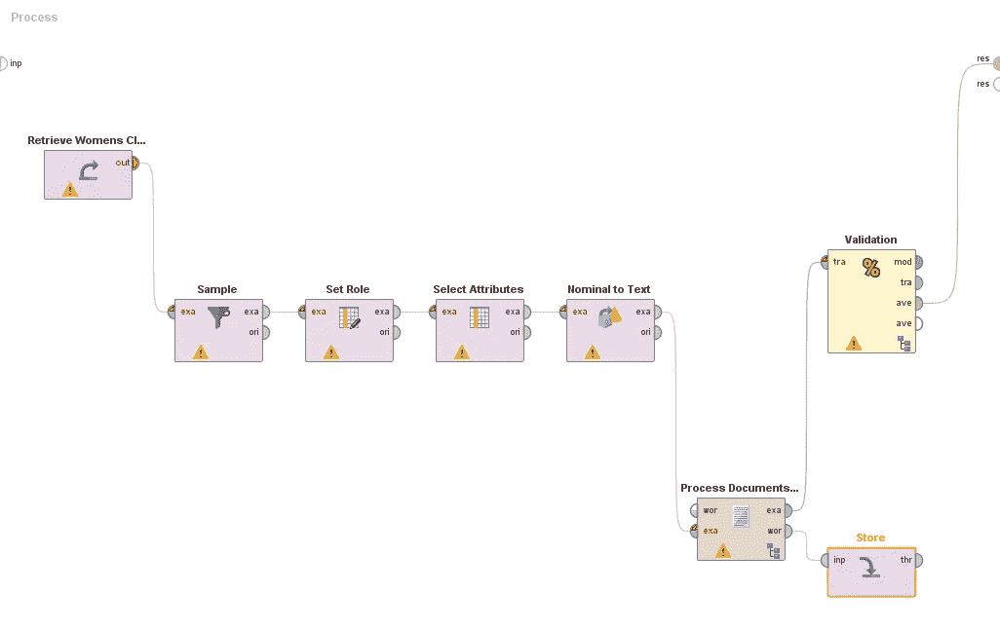
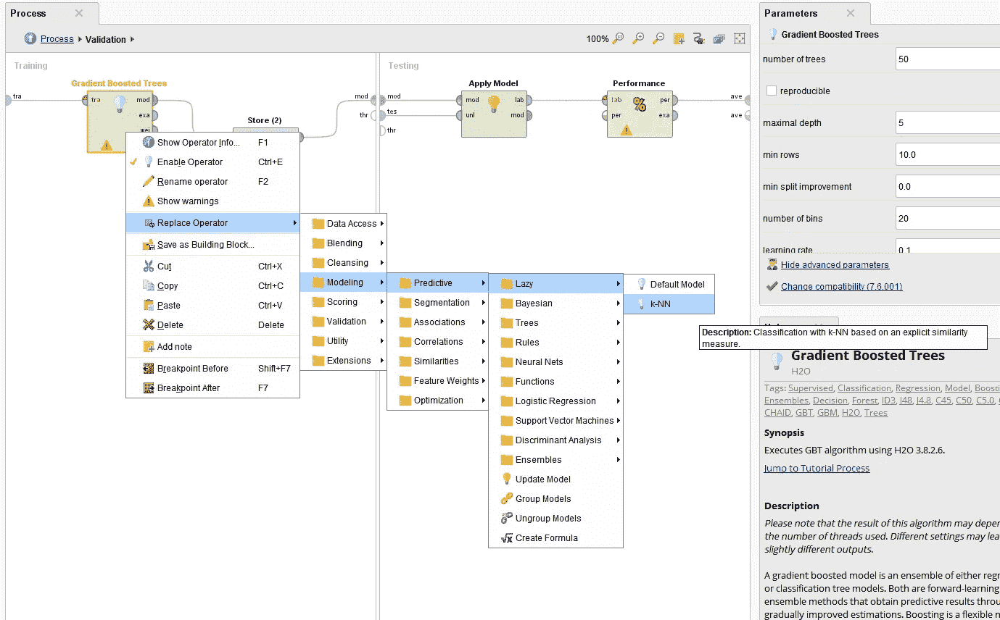
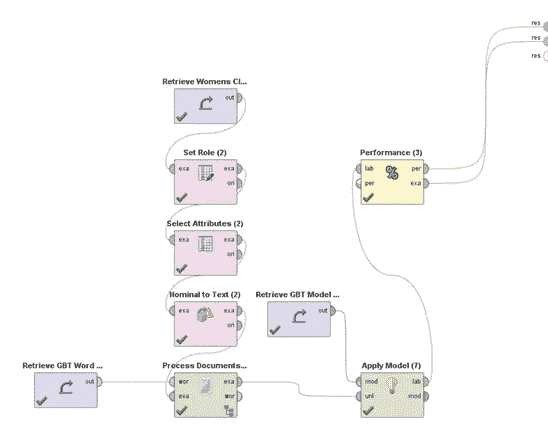

# 使用 NLP 模型预测产品成功

> 原文：<https://towardsdatascience.com/predict-product-success-using-nlp-models-b3e87295d97?source=collection_archive---------9----------------------->

## 预测时尚电子商务下一个趋势的教程

# 先决条件

特定主题的经验:新手

专业经验:无行业经验

机器学习的知识不是必需的，如果读者熟悉基本的数据分析会有所帮助。文章中的所有概念都是为初学者从头开始详细解释的。要跟进，请在此下载样本数据集[。本教程解释了自然语言处理的商业应用，以获得可操作的见解。](https://www.kaggle.com/nicapotato/womens-ecommerce-clothing-reviews)

# 自然语言处理和商业用例介绍

在线上常见的自然语言处理(NLP)的一个非常简单的定义是，它是对自然形式、书面文本或语音中使用的语言应用计算技术，以分析并从中获得某些见解。这些见解可以有很大的不同，从理解一段文字中的情感到识别句子中的主题。

分析的复杂程度也可能从简单到非常复杂。例如，你可能想将文本分类，比如来自 Twitter 的数据，分为正面情绪和负面情绪。另一方面，您可能希望从大型数据集中的产品评论数据中提取产品建议/投诉，以确定新产品发布策略。聊天机器人正在做的工作，理解文本查询并对其做出回应；垃圾邮件检测等。属于 NLP 的范围。

这个领域可能包含许多应用程序，因此也包含许多技术，这使得它成为一个相当大的主题。在这个特别的教程中，我们将详细讨论 NLP 的商业案例应用，以获得电子商务领域中实用且可行的见解。

# 了解业务场景

本教程使用了 Kaggle 上的一个数据集，来自电子商务时尚领域。这可以在[https://www . ka ggle . com/nica potato/women-ecommerce-clothing-reviews](https://www.kaggle.com/nicapotato/womens-ecommerce-clothing-reviews)找到

这个数据集似乎是大多数电子商务市场的典型，因此它是一个很好的代表。这是一个数据集，其中有数字评级数据以及对几件女装的文本评论。这些商品有一个“服装 ID ”,这是一个唯一的标识符。有两种评级——数字 1 到 5 表示产品评级，1 或 0 表示是否推荐产品，二项式属性，即只有两个可能的值。还有其他描述项目类别、评论者年龄等的属性。仔细想想，该数据集中提供的这些属性是大多数此类在线购物门户的典型特征。事实上，这并不仅限于时尚领域，因此这里应用的技术也应该可以扩展到其他领域。

有了这个数据集，探索文本评论是否可以预测该项目是否会成为趋势将是有趣的。这对时装业来说是非常有用的信息。如果这种对产品的洞察是准确的，产品或品类经理就可以对产品的库存策略、促销等做出合理的决策。这是我们的业务问题。

因此，我们的目标是建立一个自动化系统，可以分析客户对新产品最初的一些评论，并预测新推出的产品是否会成功。有了这些信息，就可以建立产品库存，并通过供应链进行销售。通过这种方式，人们可以实施软产品发布，并响应市场对产品的接受度。

本实验使用的两个工具是 Excel 和 Rapidminer。这个工作流程有两个部分。首先在 excel 中执行一些功能工程，然后在 Rapidminer 中执行实际的模型训练和测试。

# 第 1 部分:Excel 中的特征工程

有了给定的数据，我们需要首先得出“趋势产品”的数学定义。在这个阶段，业务领域的知识就派上了用场。我们知道，如果一个产品做得很好，如果客户对它满意，他们会努力写关于它的正面评价。人们通常倾向于写详细的评论，如果他们非常高兴或者非常不满意。如果他们开心，他们倾向于写好的评论，并给予高度评价。此外，做得好的产品会得到很多评论，大多数评论者会对评级高的产品有类似的看法。

用数学方法来解释。产品的成功与评论数量、产品的平均评级有直接关系，与产品评级的标准偏差有反比关系。也就是说，如果市场喜欢它，许多客户往往会在没有太大变化的情况下给予它很高的评价。基于这种理解，我们可以创建一个新的特征。

借用在神经网络训练中使用的 tanh 激活函数，我们可以如下定义新的特征“评级强度”。

***【评级强度=(评级因子)***

在哪里，

其中，“评论比例”是项目从完整数据集
收到的评论的比例，平均值和标准差不言自明。

这将创建一个值介于 0 和 1 之间的新要素。接近 1 的值被分配给有大量评论、评级良好且评级差异非常低的项目，即每个人都给它评级良好。更接近 0 的值被分配给没有产生太多兴奋的项目-评论的数量很少，并且评级很低，差异很大。这个数学定义的主要目的是获得一个代表产品成功的数字特征，最好是 0 到 1 之间的值，而不是未缩放的大值。

这样，您可以创建一个名为“Item_success”的二项式标签，其中有两个可能的值“trending”或“Not trending”，其中“Trending”被分配给评级强度高于某个临界值的项目，而“Not trending”被分配给低于该临界值的项目。对于这个数据集，我选择了临界值 0.00036。这个截止值是通过简单地查看数据集来确定的，但是可以有更好的自动化方法来完成这个任务。然而，这种手动决策是一种非常简单快捷的解决方案。对于使用这些产品的人来说，这是一个相当直接的决定。下面是数据集的一个片段。

Feature engineered dataset (snippet)

根据可用要素在数据集中创建新要素的过程称为要素工程。这是一个有用的步骤，可以部署到机器学习问题。到目前为止，所有的活动都是在 Microsoft Excel 中进行的。下一步是开发一个模型来预测我们创建的这个二项式标签。预测建模部分在 Rapidminer 中进行。

# 第 2 部分:Rapidminer 中的预测建模

# 设置

这一部分是在 Rapidminer 中进行的。问题基本上是语言处理。给定一个新的评论，我们希望预测该项目是否会成为趋势。在评论的语言中肯定包含了一些信息，这些信息可以提供该项目是否会成功的线索。给定过去的数据，我们应该能够预测正在审查的新项目。

本质上，我们需要使用过去的数据来建立一个模型，该模型可以从已知成功产品的评论语言中学习，并在未来产品的新评论中使用这种学习来预测其成功的机会。

Rapidminer 中使用的工艺流程如下所示:

Model training in Rapidminer

Rapidminer 是一个非常易于使用的机器学习平台，非常适合业务经理，他们可能不是数据科学家，但热衷于将这些技术快速应用于他们的业务需求。在 Rapidminer 中，通过将相关操作符拖放到工作空间中，并以图形方式连接输入数据，即可轻松执行每项操作。在上图中，您可以看到每个阶段的数据流和处理过程。

让我们来看一下上面使用的每个运算符:

1.**检索**:我们首先需要检索我们在第 1 部分中创建的数据集。为此，我们可以读取 excel 文件本身，或者首先将数据导入 Rapidminer，然后访问它。在这种情况下，我们采取的是后者。首先必须导入数据，这非常简单，有一个向导可以一步一步地进行导入，您可以通过单击 Rapidminer 中的“添加数据”按钮开始导入。在 Retrieve 操作符的设置中，我们定义了要访问的数据集的名称，该名称是在导入过程中定义的。

2.**示例**:数据集包含近 19500 行。但是我们不想使用完整的数据集。这将耗费时间，并可能导致过度拟合。因此，在样本运算符中，我们可以定义要选择多少样本。我选择了 4500 个样品。

3.**设置角色**:我们需要定义哪个特征是我们感兴趣的，我们想要预测的。对于我们来说，它是“Item_success”列，我们将此功能定义为标签*。标签是需要预测的特征。*

**4。* **选择属性**:在我们的数据集中，我们定义了新的列，如平均评分、评分的标准差、评论的比例等。以达到“项目成功”特征。从将被提供来训练模型的训练数据中移除这些特征是非常重要的。这一点非常重要。这些列将不可用于未来的实时数据，在此包含它们可能会给出错误的准确性级别，并且模型在部署中将不起作用。您可以浏览 excel 文件来更好地理解这些列。所以实际选择的特性如下:
*年龄
类别名称
部门名称
部门名称
项目 _ 成功
评分
推荐 IND
审核文本
标题* 这些特性在部署时都可以用于新数据。*

**5。* **名义到文本**:这是一个数据类型转换器。我们用它将*评论文本*转换成文本数据类型。这对于流程中的下一个操作员是必要的。*

*6.**处理文档**:这是此类文本分类应用的关键步骤。这是一个嵌套运算符，即该运算符中有一个流程，如下所示:*

**

*Process flow to generate n-Grams*

*它将文本分解成符号化的 n 元文法，这里 n 被设置为 2。这些 n 元语法成为单词包的一部分，模型稍后使用该单词包来理解评论中的单词和标签特征之间的关系。对文档进行分词，提取词干并过滤掉停用词(如 a、an 等。)都是标准做法。词干标记都转换为小写，我们过滤掉少于 5 个字符或多于 25 个字符的标记。最后，生成 2 个字母的单词，形成一大袋短语。这是模型学习的主要数据。*

*7.**存储**:存储操作符用于存储流程文档步骤生成的词表。在对新数据应用学习模型时，必须使用这种方法。这是需要记住的重要一点。*

***8。分割验证**:下一个任务是训练和测试模型。拆分验证运算符用于此目的。这也是一个嵌套操作符。它将数据分为训练数据和测试数据，并对测试数据使用训练好的模型。该运算符的内部流程如下所示:*

**

*Split validation sub-process*

*这里使用了梯度增强树，再次使用如上所示的存储操作符来存储训练的模型以供将来使用。应用模型操作符对数据的测试部分应用训练模型，性能二项式分类操作符用于测量模型对测试数据的性能。性能运算符生成一个 2x2 表，其中包含模型预测的分类和实际分类的详细信息。*

# *培训和评估*

*在 Rapidminer 中设置流程后的下一个阶段是尝试各种模型，看看什么能产生好的结果。这是你实际训练你的机器学习模型的部分。*

*有几种算法可以尝试。从 k-NN 这样的简单模型开始通常是很好的做法。k-NN 技术是最简单的可能模型，可以用于几乎所有的机器学习问题。这有助于您建立一个好的基准，然后您可以根据它来尝试更高级的技术。使用 Rapidminer，只需用您选择的任何其他预测模型替换上图所示的梯度增强树模型，只需右键单击运算符并选择替换即可。当然，不是所有的模型都适用于所有的情况。有些模型只接受数字数据。这个阶段最好的方法是试错，通过实践，事情会变得清晰。*

**

*Replacing an operator for trials*

*k-NN 模型获得的结果如下所示。*

**

*k-NN results*

*继续该过程，尝试了以下模型，这些模型的相应结果在下面给出。*

**

*Naive Bayes results*

**

*Decision Tree results*

**

*Random Tree results*

**

*Gradient Boosted Trees’ results*

*梯度推进树(GBT)给出了所有试验模型的最佳结果。对整个数据集的子集进行了反复试验。现在，我们可以重复使用学习过的 GBT 模型，并将其应用于整个数据集，并检查结果如何。检索存储的 GBT 模型和相关单词列表的过程如下所示，重要的是使用在模型训练期间生成的相同单词列表。该步骤有助于检查学习的模型没有过度拟合训练数据；如果它确实过拟合，那么它对于实时应用将不是非常有用。以下流程也可用于将学习到的模型应用于新数据，即在生产中使用该模型——只需用新数据替换第一个操作符，其他一切将保持不变。*

**

*Applying the learnt GBT model to the full dataset*

*较大数据集的 GBT 结果如下所示:*

**

*GBT results for wider dataset*

*能够预测这样的产品的成功机会在计划库存和分销中非常有用。也许可以预测不同人口统计和地理位置的成功率，这对规划正确的产品分销非常有用。与任何模型一样，通过与实时数据并行运行来进一步测试它以进一步优化模型的准确性是非常重要的。这种应用清楚地显示了这种技术的效用，并且它们的普及只会增加。*

*一旦经过训练的模型和单词列表被存储，它可以被重新用于新数据的应用。这将涉及以与训练数据相同的格式获得新产品的审查和评级数据，并在上述应用学习的 GBT 模型的过程中，用新数据替换第一个操作员。运行这个过程，看看预测是什么。处理各种产品的品类经理可以以设定的频率运行这一过程，系统将帮助他在几分钟内找到正确的方向。当然，也有方法将预测数据输出到 excel 文件中，该文件可以分发给团队，以帮助他们对产品的供应链方面做出决策。*

*仍然有办法进一步改进这个系统。也许不需要用数学方法来定义成功的产品，如果可以挖掘出提供产品实际成功或失败的数据，准确性就可以提高。在本教程中，我们创建了一种基于可用数据的技术，人们甚至可以尝试不同的方法来获取丰富的数据，知道可以使用的工作流，这也需要一些工作来实现这样的数据创建和收集，但可能是最准确的。预先了解数据将如何使用以及机器学习系统如何使用 NLP 工作，对于设计数据收集和准备过程非常有用。*

*总之，我们已经实现了一个基于 NLP 的快速模型，它根据产品的文本评论来预测产品的成功几率。这样的系统可以帮助品类经理处理大量的产品和 SKU。将模型应用于新数据所消耗的时间仅仅是几分钟甚至几秒钟的事情，这可以被高频率地利用。Rapidminer 流程、数据集和结果可从这个 [Github 存储库](https://github.com/vinayarun/BUSINESS-USE-CASE-FOR-NLP)获得。*