# 预测 Instagram 上的赞数

> 原文：<https://towardsdatascience.com/predict-the-number-of-likes-on-instagram-a7ec5c020203?source=collection_archive---------1----------------------->

在本文中，我们将展示我们预测 Instagram 帖子点赞数的方法。我们首先回顾一下如何收集数据集和分析数据。然后，我们将提供一个基本模型，而不用使用 XGBoost 查看图像。下一步，将使用自然语言处理(NLP)来提取一些特征。最后，卷积神经网络(CNN)被开发用于从图像中提取特征。

Github 链接:[https://github.com/gvsi/datascience-finalproject](https://github.com/gvsi/datascience-finalproject)

# **一、动机**

*   **目标:**预测给定 Instagram 帖子的赞数。
*   背景:社交媒体影响者从数字营销商那里获得报酬，以推广产品或服务。
*   **应用:**使用在线营销中开发的模型来寻找对给定帖子产生最多印象的影响者。

举一个这样的帖子的例子，这个有影响力的人正在旅行，在这张照片中，她放置了一种产品，一种除臭剂，很可能是公司为此支付的。


[Post by Léa Camilleri:](https://github.com/gvsi/datascience-finalproject) [https://www.instagram.com/p/BRNlFUBAG5i/](https://www.instagram.com/p/BRNlFUBAG5i/?taken-by=leacamilleri__&hl=en)

# **2。数据**

## **构建数据集**

与项目相关的挑战之一是为我们正在处理的用例聚集足够的相关数据。

建立数据集的第一步是收集 Instagram 影响者的名单，也就是说，作为职业的一部分，用户会发布营销 Instagram 帖子。

找到这类信息本身就是一个挑战，因为这类名单不容易被公众获得。

最终，我们遇到了 Inconosquare 指数影响者，这是一个由 2000 多个 Instagram 影响者组成的列表。这个索引可以在[https://influence.iconosquare.com](https://influence.iconosquare.com/)上找到。

我们不得不爬取 70 多页的影响者，以获得他们在可用列表中的句柄。

现在真正的挑战来了:搜集这些用户的 Instagram 资料。这包括从个人资料中读取元数据(关注者/跟随的数量，帖子的数量，个人资料的描述)，从用户那里抓取 17 个最新的图像(JPG 格式的图像，喜欢的数量，评论的数量，时间戳，描述文本)。

最终结果是每个用户的 JSON 文件，如下所示:

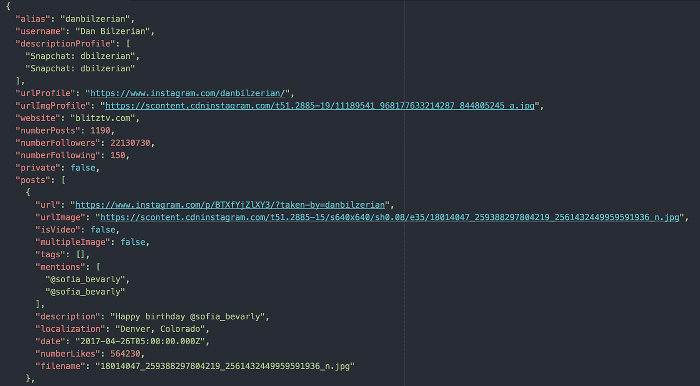

JSON file obtained for a given user

## **刮刀**

Instagram 的 API 对其后端服务器的请求限制为每小时 60 个，这使得它对任何真正的应用程序或数据收集完全无用。官方 API 的替代方法是以编程方式抓取每个页面。

我们使用的 scraper 是用 Selenium 编写的，Selenium 是一个旨在为 web 应用程序构建功能测试的框架。Selenium 在这种情况下用于抓取网页并从中收集数据。

scraper 最初线性扫描用户的最新帖子，然后打开每个帖子来检索与每个图像相关的更细粒度的信息。

下面是铲运机的运行演示:

Scraper in action

收集了来自 972 名 Instagram 影响者的 16539 张图像来训练和测试我们的模型。

## **数据集分析**

关于所收集数据的一些简要数据指标。我们可以看到，点赞数有一个很高的标准差，61 224.20。看起来差距很大，平均值为 24 416.38，但 75%的帖子的赞数少于 18 359。


Dataset summary

下面的直方图证实了表中显示的值，大多数帖子的赞数都低于 20 万。在我们感兴趣的应用程序中，删除拥有大量关注者(超过 1 00 万关注者)和高平均点赞数(超过 20 万)的人是有意义的，因为他们不再被视为有影响力的人，而是名人/明星。这也将有助于减少我们模型的误差。

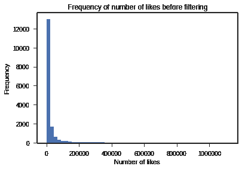

我们过滤了我们的数据集，只保留平均点赞数低于 20 万的 Instagramers，并且他们的粉丝必须少于 1 00 万。经过筛选，我们保留了 746 个 Instagramers，对应 12678 个帖子。点赞数的标准差下降到 9999.27，均值下降到 8306.93。上图右侧显示了点赞数量的直方图。

**关注者数量不一定意味着影响力大**

我们绘制了点赞数和关注数的图表。


有增加的趋势，但是，不显著。它似乎有很多噪音。仅关注者的数量可能不是预测给定帖子的点赞数量的好指标，因为我们可以看到，拥有大量关注者的人不一定有大量的点赞。

# 3.模型

我们将首先开发一个基本模型，其中包含从数据集获得的一些基本特征。然后，我们将添加从自然语言处理(NLP)获得的特征，最后，添加从卷积神经网络生成的特征。

为了比较不同的模型，我们将使用两个性能指标:均方根误差(RMSE)和 R 值。

## **A .基础模型**

基本模型包括以下特征:

给定功能:

*   关注者数量
*   下列数量
*   员额数

提取的特征:

*   网站:我们将用户描述中提供的网站分为不同的类别:Youtube、脸书、Twitter、博客、音乐和其他。然后我们对不同的类别进行一次性编码。
*   星期几:使用每个数据贴的数据，我们对星期几进行了热编码

生成的特征:

*   平均点赞数:我们观察到，关注者的数量不一定会产生高点赞数。不活跃和虚假的追随者会影响结果，一个更好的衡量标准似乎是每个用户的平均点赞数。其余的功能应该根据平均点赞数来增减点赞数。

从生成的特征中，我们发现:

## **网站**

11%的用户拥有 Youtube 频道或视频作为他们的网站，4%的用户拥有脸书个人资料，2%的用户拥有博客，1%的用户拥有与音乐相关的网站(Soundcloud 或 Spotify)。88%的用户在他们的用户档案中有一个网站。

## **星期几**

上传图片数量最多的一天是周日，占 18%，然后是周六和周四，占 15%，周五和周三，占 14%，最后是周一，占 11%。似乎只有两天有不同的统计数据，周日有更多的帖子，周一较少。

## XGB

对这些特征应用具有以下参数的 XGBoost 模型:max_depth=4，learning_rate=0.01，n_estimators=596，我们获得了 2876.17 的 RMSE 和 0.92 的 R。

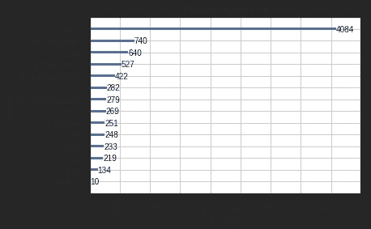

从 XGBoost 给出的特征重要性图中，我们可以看到平均点赞数显著影响了 XGB 模型的结果。F 值 4084，比其他所有特征加起来都大。在基本特征方面，帖子数量、关注人数和关注人数的 F 值较低。就提取的特征而言，星期六似乎比其他日子有更大的影响。或许这表明周六发帖会比其他时间获得更多的赞。之前有人说，一周内的帖子分布比较均匀，周日发布的帖子多，周一发布的帖子少。

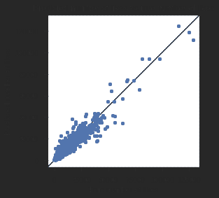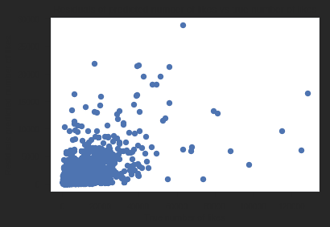

## B.自然语言处理

我们的数据集包含一些我们处理过的文本数据。首先，有用户传记数据。此字段包含用户为介绍自己和其个人资料所写的信息。第二个字段是每篇文章的标题。这个标题还包含用户添加到标题中的任何相关的标签。第三个字段包含帖子中提到的所有用户。最后，有一个字段用于显示 post 发生的位置。

由于我们没有太多的时间，我们决定采取词汇袋的方法。首先，我们清理数据，并使其进入可工作状态。然后，我们删除了文本中所有的标点符号、停用词和表情符号(稍后会详细介绍表情符号)。然后，我们拆分单词，并使用 scikit-learn 函数 CountVectorizer 对文本进行矢量化。我们还尝试对 TF-IDF 使用 scikit 函数，但是，似乎 CountVectorizer 工作得更好。当我们为帖子的标题做这个过程时，我们最终得到了 7000 多个独特的单词。这导致非常稀疏的 16k×7k 矩阵。为了减少矩阵的稀疏性，我们采用了一种技术，在这种技术中，我们只使用文本中顶部的单词，而不是所有的单词。因此，在评估我们的功能时，我们能够使用前 100、200、300 个词。

研究表情符号很有趣，因为在 Instagram 上使用表情符号非常流行。与实际的文本数据不同，我们必须以不同的方式处理表情符号。然而，因为表情符号是 unicode 的，所以我们能够为它们创建自己的 CountVectorizer 函数。然后，像标题文本数据一样，我们能够根据出现的次数，将热门表情符号的子集作为特征。

当试图找出我们将在最终模型中使用的 NLP 特征子集时，我们试图预测给定 NLP 数据子集的帖子的点赞数。我们选择了降低 RMSE 最大的数据子集。在测试了几个子集后，我们发现最好的子集是这样的:来自个人帖子标题的前 500 个单词/标签，以及出现超过 175 次的表情符号(37 个表情符号)。

下面是一些前 500 个单词的例子(我展示的是前 500 个单词中长度超过 5 个字符的子集):

实际上冒险几乎已经总是惊人的另一个任何人任何事物建筑周围可用真棒巴塞罗那美丽的美丽的景点美丽成为落后相信柏林更好的生日早餐加利福尼亚照相机挑战机会改变巧克力科切拉咖啡收藏即将评论社区保护夫妇课程美味的灯杆设计细节不同的复活节足够欧洲每个人都兴奋的体验探索家庭时尚最喜爱的特色感觉最后健身跟随追随者忘记法国星期五朋友地理感恩指南标签健康图像重要的不可思议的灵感激发 insta gram island journey liketk liketkit like know little living location London looking 可爱的 madwhips 杂志化妆制作梅赛德斯百万富翁时刻周一早晨母亲山 natgeo natgeo creative national natural natural natural natural natural natural natural natural nature nothing 官方网上装备人们完美的表演摄影摄影师摄影照片图片地点请 porque pretty prints profile project 真的食谱记得周六季系列分享某人某事有时特别赞助春季开始的故事夏季周日日落支持感谢 photosociety 的事情虽然明天晚上想在一起旅行尝试土耳其度假想穿周末没有狼百万富翁的精彩工作锻炼昨天 youtube

以下是排名前 37 位的表情符号:

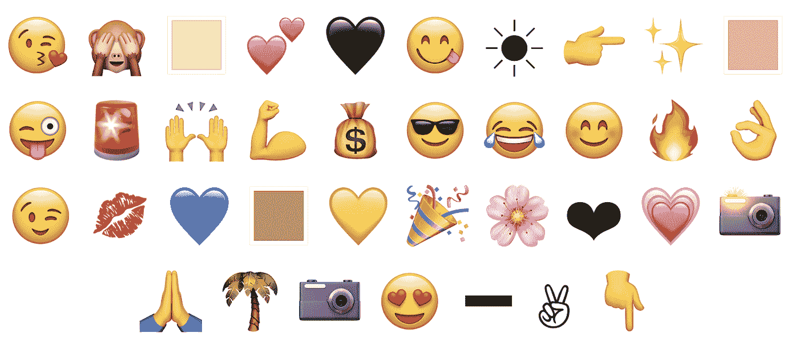

Top 37 emojis

当我们将这些特征添加到基础模型的特征中时，我们的 RMSE 实际上恶化了。事实是，这些额外的 NLP 特征与基本模型特征中的平均特征相比并不重要。由于基础+ NLP 模型较少依赖均值特征来预测喜欢，我们的 RMSE 实际上恶化了。我们的 RMSE 分数上升到 2895.90，我们的 R 分数变成了 0.9163。由于有超过 500 个特性，这个模型的特性重要性图很难读懂。

但是，使用此功能:

```
vec = model_xgb.feature_importances_for i in range(len(vec)):if vec[i] > .01:print(X_train.columns[i])
```

我们发现最重要的自然语言处理特征是单词:*ada amazing AMG code El going to make man thank time*

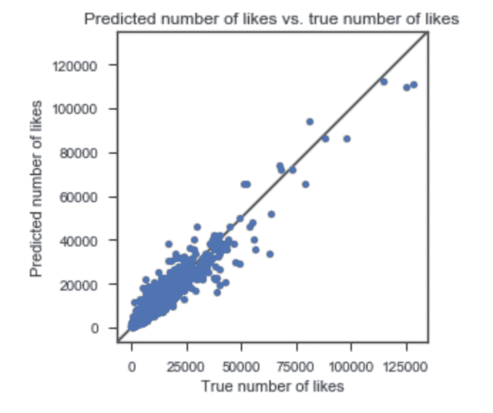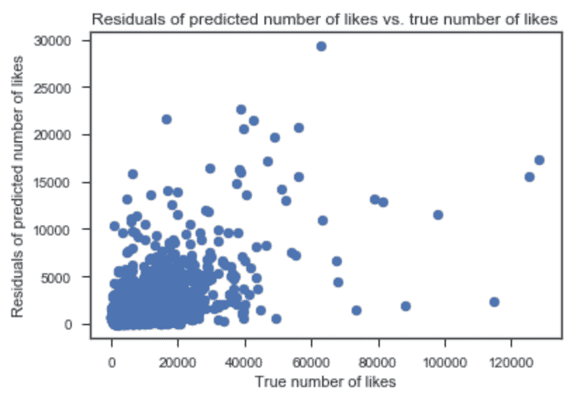

## C.迁移学习

我们采用的另一种方法与图像处理和计算机视觉有关。

目的是识别与图像相关的特征，这些特征可能对确定最终的点赞数有意义。

虽然基本模型中的特性是我们认为在这个回归问题中最有意义的，但我们认为在我们的模型中实现最微小的改进是一个巨大的成功。

迁移学习涉及使用预先训练的深度 ConvNet 的过程，并以此为起点建立考虑图像特征的模型。

有两种使用预训练模型的方法，我们都可以解决:

*   **使用 Inception V3 对 ConvNet 进行微调:**这是采用预训练的 ConvNet 权重，移除最后完全连接的层，并根据需要扩展网络。然后，我们通过继续反向传播来微调预训练网络的权重。我们使用的模型是 Inception v3。最后两个完全连接的层被删除，我们添加了三个额外的层。我们在 EC2 机器上用 GPU 对我们的数据点进行了重新训练。
*   **使用 VGG 的固定特征提取器 19:** 这是移除最后一个完全连接的层，然后将 ConvNet 的剩余部分视为新数据集的固定特征提取器。VGG 19 是一个图像分类网络，在 ImageNet 数据集上的 1400 多万张图像上进行了预训练。移除最后一个完全连接的层为每个图像产生大小为 4096 的特征向量。我们可以使用这个(稀疏)向量作为基础模型中的特征。

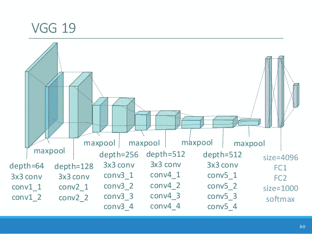

## **结果**

不幸的是，这两种方法都没有对我们的基本模型产生显著的改进。我们将这一点与这样一个事实联系起来，即这些深度网络是在头脑中有一个分类任务的情况下被训练的，这可能不一定适应像我们这样的回归问题。此外，我们的基本分类器使用了一个 XGBoost 模型，我们将其余的特征拟合到该模型中。XGBoost 通常具有混合的结果和非常稀疏的特征矩阵。

## **D .卷积回归神经网络**

## **动机**

我们推测转移学习方法不成功，因为转移网络是为分类问题训练的，而我们有一个回归目标。因此，我们的下一个想法是用谷歌的 TensorFlow 机器学习平台建立和训练我们自己的卷积神经网络(CNN)，这是专门为回归设计的。

## **设计**

像所有 CNN 一样，我们的设计从 *c* 卷积层开始，卷积层被展平成 *f* 全连接层。完全连接的层将过滤成最后一层 1 ReLU 激活的神经元，该神经元将输出喜欢的数量。我们首先想到的是连接我们在基本模型中使用的数字元特征(如关注者数量、数字跟随等。)作为图像分析的控制参数。我们认为这是有帮助的，因为不管图片如何，一个帖子获得的赞数都受到用户帖子的严重影响。例如，一个非常受欢迎的用户可能会发布一个普通物体的图片，比如一把椅子，但仍然会收到相对大量的赞。

## **建筑**

选择神经网络的体系结构是一个艺术过程。在所有的机器学习问题中，模型设计者总是被以正确的方式选择超参数所困扰，既要给模型足够的自由来捕捉数据中的模式，又要对模型进行足够的约束以避免过度拟合。在神经网络设计中，这一问题因以下事实而变得更加复杂，即*一切*都是超参数——层数、层大小、通道数量、卷积滤波器大小、滤波器步幅等。为了解决这个问题，我们以这样一种方式编写代码，即模型初始化参数采用一种描述网络架构的紧凑形式。这使得我们能够非常快速地测试许多不同的架构，而无需重写任何代码。我们架构的标准是，在几个训练时期之后，模型不会很快开始过度拟合，并且 ReLU 激活不会太稀疏。下面是我们选定的架构。它成批接收 256 x 256 个图像，有 4 个卷积层和 5 个全连接层。对于卷积层，方框顶部的数字表示每个通道的输出形状，底部的数字表示通道的数量。对于完全连接的层，该数字简单地描述了该层中神经元的数量。

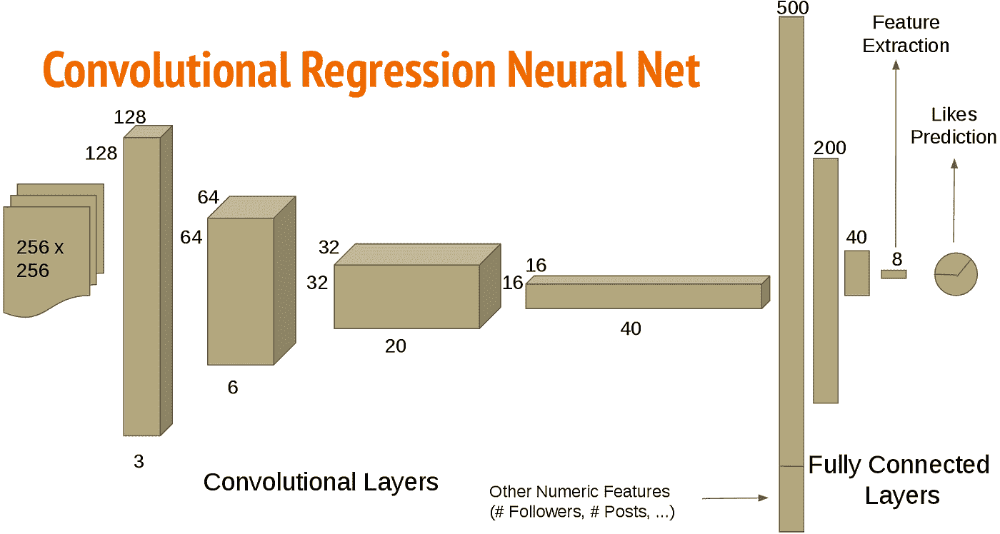

## **结果**

CNN 被训练为一个独立的模型，但是为了将它集成到整个模型中，我们删除了每个图像的最终层的 8 个输出，并将它们用作主 XGBoost 中的功能。不幸的是，正如我们在 NLP 和迁移学习方法中看到的，我们的测试 RMSE 从 2876 增加到 2964。

## **改版**

我们推断 RMSE 的上升可以归因于用户元特征被连接到完全连接的层。因为这些特征比图像本身更具预测性，网络学会了忽略图像，本质上像标准神经网络一样训练这些特征。下一步是简单地从网络中移除这些特征，并仅在图像上进行训练。当只对图像进行训练时，独立模型的 RMSE 预期要差得多。然而，当进行特征提取并与联合模型集成时，我们发现我们的 RMSE 比基本模型从 2876 减少到 2837。当分析联合 XGBoost 回归的重要特征时，我们发现实际上它从图像中发现了一个重要的特征。绘制所有样本的这一特征，我们看到它呈现高斯分布的形状。由此我们推测，它是所有图像的连续特征，如对比度或亮度，而不是离散值，如“这张照片中有一个人吗？”。下面你可以看到标记为“1_”的第二个特征来自卷积神经网络

这是感兴趣的特征的分布，关于所有的样本帖子。

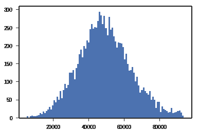

Histogram of NN feature 1_


# 结论

在我们的基础模型上添加不同的子模型，如 NLP 或 CNN，表明除了用户特定的功能外，很难从 instagram 帖子中提取额外的预测能力。此外，即使有了基本模型，那些喜欢远远超出典型范围的用户也被大大低估了，他们丢掉了 RMSE 或者需要过滤。在我们的模型中缺乏帖子敏感性可能是由于每个用户都有一个具有足够独特品味的追随者，我们的模型无法在广泛的范围内概括这些偏好。一些可能的解决方案是创建特定于用户的模型，或者收集大量数据(数百万条帖子，而不是数千条)，试图准确概括所有 instagram。最后，我们所有的模型和子模型都可以进行更优化的调整，希望获得更好的后期灵敏度，但我们的开发时间限制极大地限制了我们找到这个高度复杂问题的创造性解决方案的能力。

Corentin Dugué、Giovanni Alcantara、Joseph Shalabi 和 Sahil Shah。