# 预测新用户将在哪里预订他们的第一次旅行体验

> 原文：<https://towardsdatascience.com/predict-where-a-new-user-will-book-their-first-travel-experience-e6c9ada67cf4?source=collection_archive---------11----------------------->

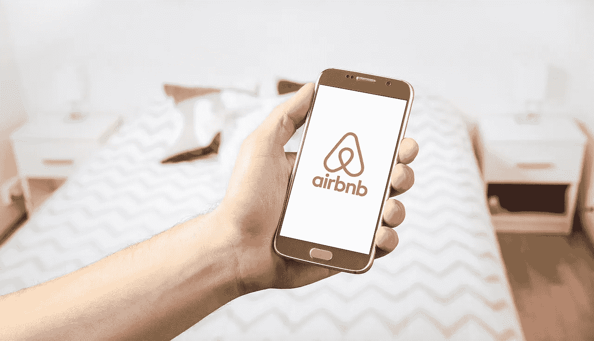

Photo credit: Pixabay

## 用户意图预测，学习排名

Airbnb 网站的核心是它的搜索。其搜索的一个最重要的特点是搜索排名。

Airbnb 显示的搜索结果是个性化的，针对他们预测最适合该用户的列表和体验。

这篇文章详细介绍了对 Airbnb 发布的两个数据集的探索，其目的是预测 Airbnb 用户预订旅行的第一个国家。更具体地说，以相关性递减的顺序预测前 5 个旅游目的地国家。

我们希望通过根据客人的人口统计信息和会议活动推断客人的偏好来实现一定程度的个性化，因为客人通过参与列表和进行查询来计划他们的旅行。

# 数据

数据集可以从 [Kaggle](https://www.kaggle.com/c/airbnb-recruiting-new-user-bookings/data) 下载，我们将使用三个数据集:

*   train _ users.csv
*   测试 _ 用户. csv
*   sessions.csv

有 16 个特征来描述每个用户，它们是:

*   id:用户 id
*   date_account_created:帐户创建日期
*   timestamp_first_active:第一个活动的时间戳，注意它可以早于 date_account_created 或 date_first_booking，因为用户可以在注册之前进行搜索
*   date_first_booking:首次预订的日期
*   性别
*   年龄
*   注册方法
*   注册流:用户注册的页面
*   语言:国际语言偏好
*   affiliate_channel:什么样的付费营销
*   affiliate_provider:营销的地方，如谷歌，craigslist，其他
*   first_affiliate_tracked:用户在注册之前互动的第一个营销是什么
*   注册应用程序
*   第一设备类型
*   第一个浏览器
*   country_destination:这是我们要预测的目标变量

描述每个 web 会话有 6 个特征，它们是:

*   user_id:与 users 表中的列' id '连接
*   行为
*   动作类型
*   行动 _ 详细信息
*   设备类型
*   secs _ elapsed

# 用户探索

```
import pandas as pd
import numpy as np
import seaborn as sns
import matplotlib.pyplot as plttrain_users = pd.read_csv('train_users_2.csv')
test_users = pd.read_csv('test_users.csv')
print("There were", train_users.shape[0], "users in the training set and", test_users.shape[0], "in the test set.")
print("In total there were", train_users.shape[0] + test_users.shape[0], "users.")
```


Figure 1

我们将探索训练和测试数据集中的所有用户。

```
df = pd.concat((train_users, test_users), axis=0, ignore_index=True)
```

## 缺失数据

在性别栏和第一浏览器栏中有“未知”，我们将用“男”填充“未知”。此外，在测试集的 date_first_booking 列中没有任何信息，因此，我们将放弃这个特性。

在此之后，我们可以看到有许多数据丢失。

```
df.gender.replace('-unknown-', np.nan, inplace=True)
df.first_browser.replace('-unknown-', np.nan, inplace=True)
df.drop('date_first_booking', axis=1, inplace=True)
df.isnull().sum()
```

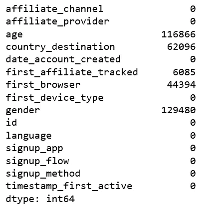

Figure 2

## 用户年龄

```
df.age.describe()
```

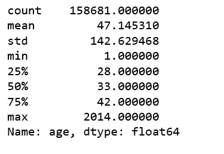

Figure 3

最大年龄是 2014，这是不可能的。好像有些用户填了一年而不是年龄。同样，1 岁的最小年龄听起来很荒谬。根据服役期限，官方规定的最低年龄是 18 岁，但实际上这并不是强制性的。[如果你不满 18 岁，拥有信用卡或借记卡，并且相当有礼貌和成熟，你使用 Airbnb](https://www.quora.com/Is-there-a-minimum-age-to-use-Airbnb) 不会有任何问题。

```
df.loc[df['age'] > 1000]['age'].describe()
```


Figure 4

```
df.loc[df['age'] < 18]['age'].describe()
```

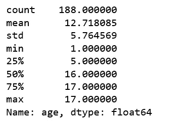

Figure 5

因此，我们将首先纠正每个错误填写的年龄，然后为年龄设置限制，并为异常值设置“NaN”。

```
df_with_year = df['age'] > 1000
df.loc[df_with_year, 'age'] = 2015 - df.loc[df_with_year, 'age']df.loc[df.age > 95, 'age'] = np.nan
df.loc[df.age < 16, 'age'] = np.nandf['age'].describe()
```


Figure 6

看起来更合理。我们现在可以可视化用户的年龄。

```
plt.figure(figsize=(12,6))
sns.distplot(df.age.dropna(), rug=True)
sns.despine()
```

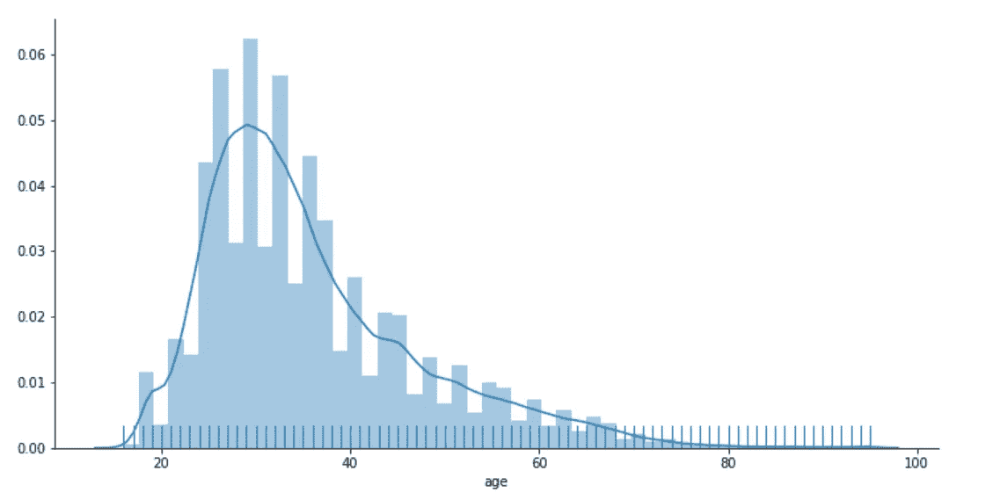

Figure 7

不出所料，Airbnb 用户最常见的年龄在 25 岁到 40 岁之间。

## 用户性别

```
plt.figure(figsize=(12,6))
df["gender"] = df['gender'].fillna('M')
sns.countplot(data=df, x='gender')
plt.xticks(np.arange(4), ("NaN", "Male", "Female", "Other"))
plt.ylabel('Number of users')
plt.title('Users gender distribution')
sns.despine()
```

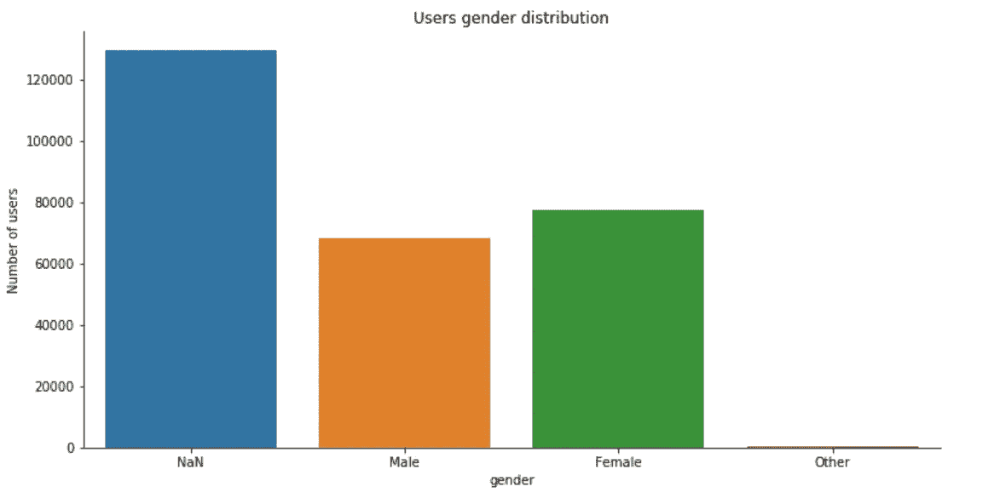

Figure 8

近似的 45%的用户性别未显示。并且在 Airbnb 的平台上，女性和男性用户之间没有显著差异。

## 旅游目的地国家

这是我们将在测试数据中预测的。

```
plt.figure(figsize=(12,6))
sns.countplot(x='country_destination', data=df)
plt.xlabel('Destination Country')
plt.ylabel('Number of users')
sns.despine()
```

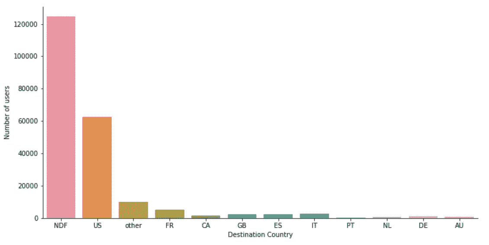

Figure 9

近 60%的用户没有预订任何目的地(NDF)。预订最多的国家是美国(近 30%的用户预订了我们)，因为数据集中的所有用户都来自美国。我们可以说，数据集中的美国旅行者更有可能在美国境内旅行。

从现在开始，我们将只研究至少进行了一次预订的用户。

```
plt.figure(figsize=(12,6))
df_without_NDF = df[df['country_destination']!='NDF']
sns.boxplot(y='age' , x='country_destination',data=df_without_NDF)
plt.xlabel('Destination Country box plot')
plt.ylabel('Age of Users')
plt.title('Country destination vs. age')
sns.despine()
```

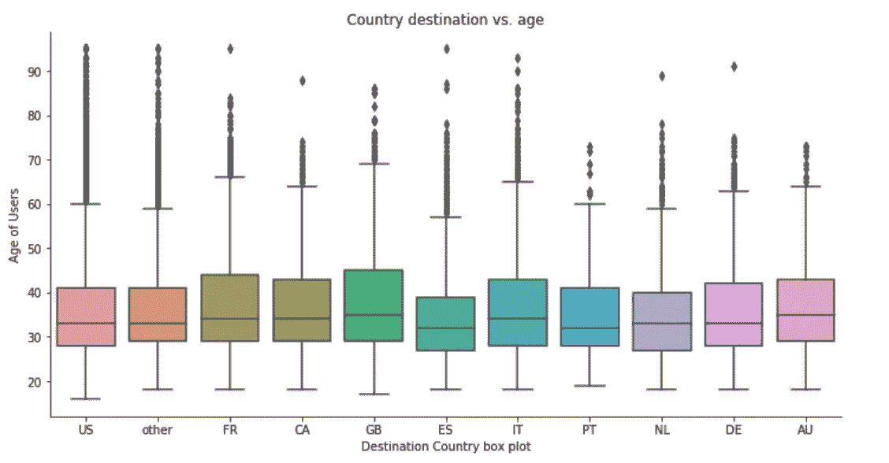

Figure 10

预订不同目的地的用户之间没有明显的年龄差异。然而，预订英国的用户往往比预订西班牙和葡萄牙的用户年龄稍大。

## **用户注册**

```
plt.figure(figsize=(12,6))
df_without_NDF = df[df['country_destination']!='NDF']
sns.countplot(x='signup_method', data = df_without_NDF)
plt.xlabel('Destination Country')
plt.ylabel('Number of users')
plt.title('Users sign up method distribution')
sns.despine()
```

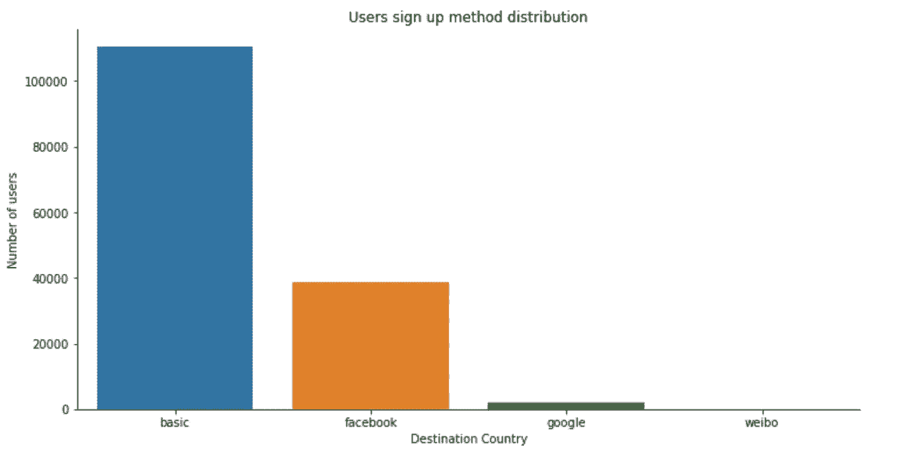

Figure 11

数据中超过 70%的预订者使用基本的电子邮件方式注册 Airbnb，不到 30%的预订者使用他们的 facebook 帐户注册。数据中只有 0.26%的预订者使用他们的谷歌账户注册。

```
plt.figure(figsize=(12,6))
sns.countplot(x='country_destination', data = df_without_NDF, hue = 'signup_method')
plt.xlabel('Destination Country')
plt.ylabel('Number of users')
plt.title('Users sign up method vs. destinations')
sns.despine()
```

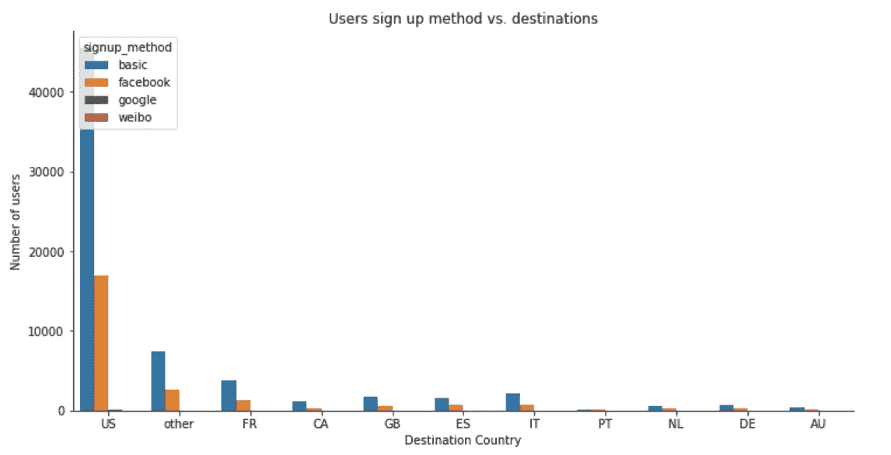

Figure 12

对于至少预订过一次的用户来说，他们中的大多数都是通过基本的电子邮件方式与 Airbnb 签约的，无论他们要去哪个国家旅行。

```
plt.figure(figsize=(12,6))
sns.countplot(x='signup_app', data=df_without_NDF)
plt.xlabel('Signup app')
plt.ylabel('Number of users')
plt.title('Signup app distribution')
sns.despine()
```


Figure 13

数据集中超过 85%的预订者在 Airbnb 的网站上注册，超过 10%的预订者在 iOs 上注册。

```
plt.figure(figsize=(12,6))
sns.countplot(x='country_destination', data=df_without_NDF, hue='signup_app')
plt.xlabel('Destination Country')
plt.ylabel('Number of users')
plt.title('Destinatiuon country based on signup app')
sns.despine()
```

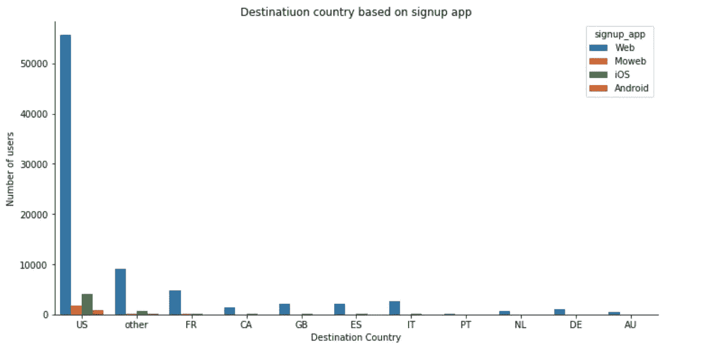

Figure 14

美国旅行者比其他国家的旅行者有更多种类的注册应用。为了看得更清楚，我们去掉了我们。

```
df_without_NDF_US = df_without_NDF[df_without_NDF['country_destination']!='US']
plt.figure(figsize=(12,6))
sns.countplot(x='country_destination', data=df_without_NDF_US, hue='signup_app')
plt.xlabel('Destination Country')
plt.ylabel('Number of users')
plt.title('Destinatiuon country based on signup app without the US')
sns.despine()
```

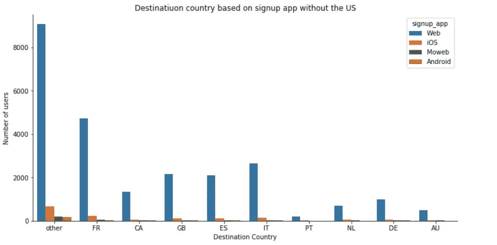

Figure 15

在数据中，通过 Airbnb 网站报名是预订每个目的地国家最常见的报名。

## **关联公司**

```
plt.figure(figsize=(12,6))
sns.countplot(x='affiliate_channel', data=df_without_NDF)
plt.xlabel('Affiliate channel')
plt.ylabel('Number of users')
plt.title('Affiliate channel distribution')
sns.despine()
```


Figure 16

```
plt.figure(figsize=(20,6))
sns.countplot(x='affiliate_provider', data=df_without_NDF)
plt.xlabel('Affiliate provider')
plt.ylabel('Number of users')
plt.title('Affiliate provider distribution')
sns.despine()
```

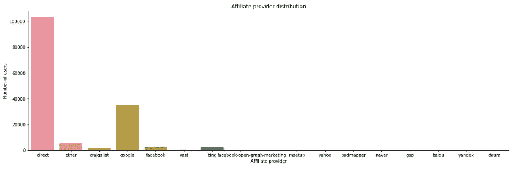

Figure 17

近似的 65%的预订者直接注册，没有任何附属计划，超过 23%的预订者通过谷歌附属计划注册，然而，如果你记得，只有 0.26%的预订者通过他们的谷歌账户注册。

## 第一

```
plt.figure(figsize=(12,6))
sns.countplot(x='first_affiliate_tracked', data=df_without_NDF)
plt.ylabel('Number of users')
plt.title('First affiliate tracked distribution')
sns.despine()
```

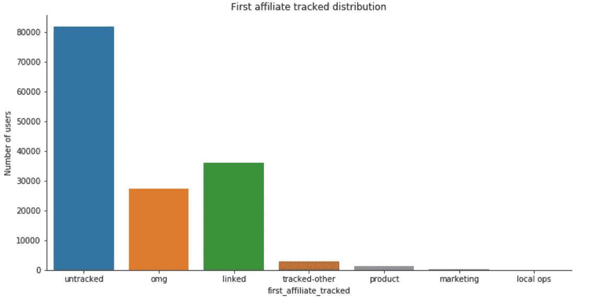

Figure 18

```
plt.figure(figsize=(18,6))
sns.countplot(x='first_device_type', data=df_without_NDF)
plt.xlabel('First device type')
plt.ylabel('Number of users')
plt.title('First device type distribution')
sns.despine()
```

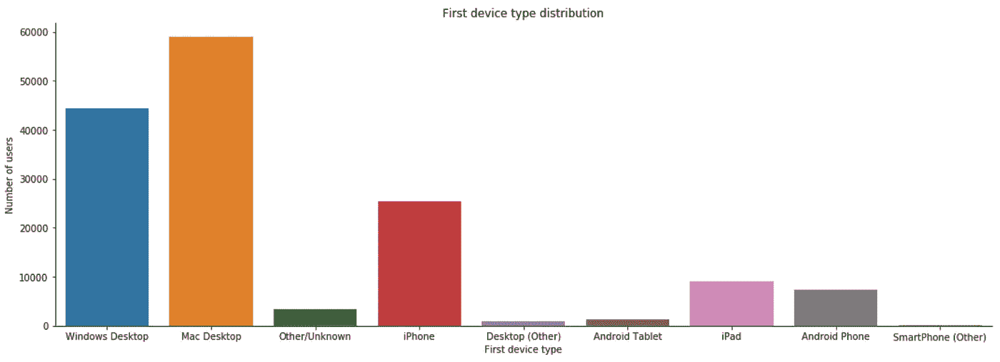

Figure 19

```
plt.figure(figsize=(18,6))
sns.countplot(x='country_destination', data=df_without_NDF, hue='first_device_type')
plt.ylabel('Number of users')
plt.title('First device type vs. country destination')
sns.despine()
```

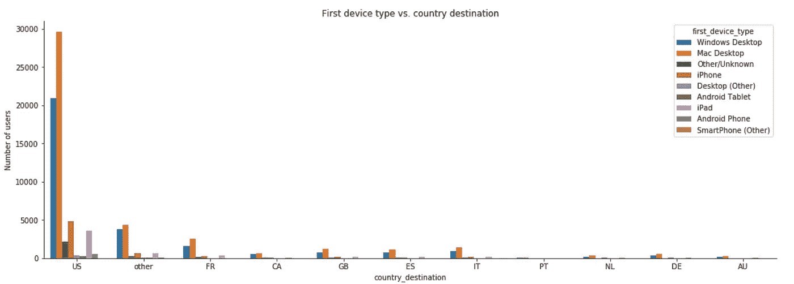

Figure 20

大约 60%的预订者使用苹果设备。尤其是在美国。

```
plt.figure(figsize=(18,6))
sns.countplot(x='country_destination', data=df_without_NDF_US, hue='first_device_type')
plt.ylabel('Number of users')
plt.title('First device type vs. country destination without the US')
sns.despine()
```

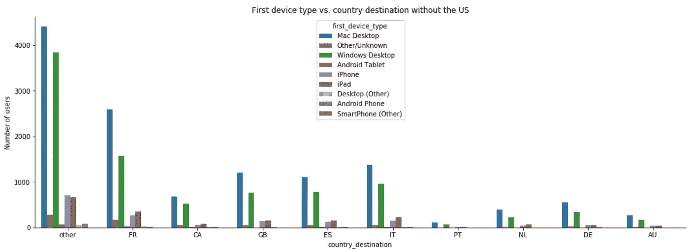

Figure 21

然而，在美国之外，Windows 桌面更加普遍，特别是在加拿大和澳大利亚，Mac 桌面和 Windows 桌面的使用差异很小。

```
plt.figure(figsize=(20,6))
sns.countplot(x='first_browser', data=df_without_NDF)
plt.xlabel('First browser')
plt.ylabel('Number of users')
plt.title('First browser distribution')
plt.xticks(rotation=90)
sns.despine()
```


Figure 22

数据中几乎 30%的预订者使用 Chrome 浏览器。

## **用户的首选语言**

```
plt.figure(figsize=(12,6))
sns.countplot(x='language', data=df_without_NDF)
plt.xlabel('language')
plt.ylabel('Number of users')
plt.title('Users language distribution')
sns.despine()
```

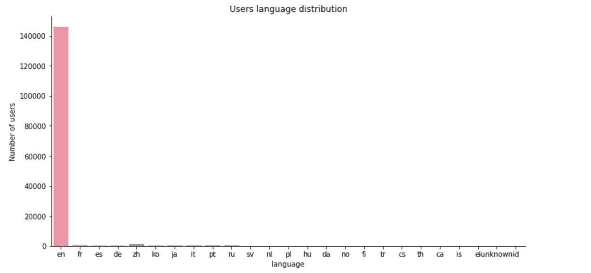

Figure 23

绝大多数预订者的语言偏好是英语，这并不奇怪，因为数据集中的大多数用户来自美国。

```
plt.figure(figsize=(12,6))
sns.countplot(x='language', data=df_without_NDF_US)
plt.xlabel('language')
plt.ylabel('Number of users')
plt.title('Users language distribution without the US')
sns.despine()
```


Figure 24

除了美国，英语仍然是最受欢迎的语言，有趣的是，在数据中，中文是预订者第二受欢迎的语言。

## 日期

为了可视化时间序列，我们首先需要将数据类型转换为日期时间。

```
df_without_NDF['date_account_created'] = pd.to_datetime(df_without_NDF['date_account_created'])
df_without_NDF['timestamp_first_active'] = pd.to_datetime((df_without_NDF.timestamp_first_active // 1000000), format='%Y%m%d')plt.figure(figsize=(12,6))
df_without_NDF.date_account_created.value_counts().plot(kind='line', linewidth=1.2)
plt.xlabel('Date')
plt.title('New account created over time')
sns.despine()
```


Figure 25

```
plt.figure(figsize=(12,6))
df_without_NDF.timestamp_first_active.value_counts().plot(kind='line', linewidth=1.2)
plt.xlabel('Date')
plt.title('First active date over time')
sns.despine()
```


Figure 26

帐户创建日期和首次激活日期之间的模式看起来很相似，这是应该的。从这两个地块可以看出 Airbnb 在 2014 年到 2015 年的成长速度有多快。

```
df_2013 = df_without_NDF[df_without_NDF['timestamp_first_active'] > pd.to_datetime(20130101, format='%Y%m%d')]
df_2013 = df_2013[df_2013['timestamp_first_active'] < pd.to_datetime(20140101, format='%Y%m%d')]
plt.figure(figsize=(12,6))
df_2013.timestamp_first_active.value_counts().plot(kind='line', linewidth=2)
plt.xlabel('Date')
plt.title('First active date 2013')
sns.despine()
```

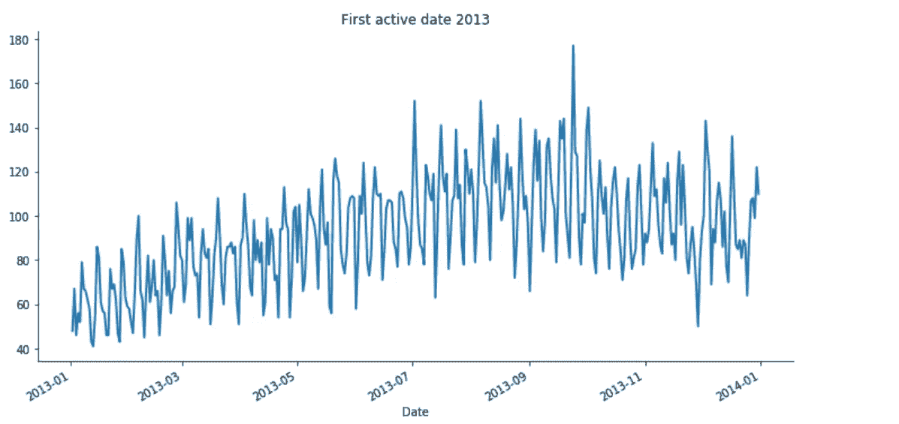

Figure 27

当进入 2013 年时，我们看到 Airbnb 预订者有几个高峰期，如 7 月、8 月和 10 月，而 12 月是 Airbnb 预订者最不活跃的月份。此外，它遵循相似的模式，例如相似距离处的峰值和非峰值。

# **用户会话探索**

```
sessions = pd.read_csv('sessions.csv')print("There were", len(sessions.user_id.unique()), " unique user IDs in the session data.")
```


Figure 28

## **动作类型**

动作类型有“难”和“未知”。所以我们将“未知”改为“南”。

```
sessions.action_type.replace('-unknown-', np.nan, inplace = True)
sessions.action_type.value_counts()
```

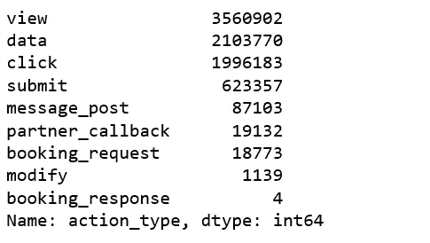

Figure 29

## 行动

```
sessions.action.value_counts().head(10)
```

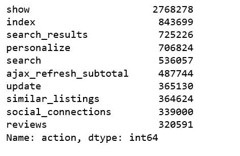

Figure 30

## 行动细节

```
sessions.action_detail.value_counts().head(10)
```

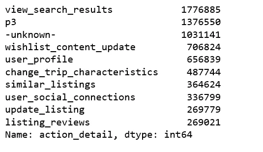

Figure 31

## **设备类型**

```
plt.figure(figsize=(18,6))
sns.countplot(x='device_type', data=sessions)
plt.xlabel('device type')
plt.ylabel('Number of sessions')
plt.title('device type distribution')
plt.xticks(rotation=90)
sns.despine()
```

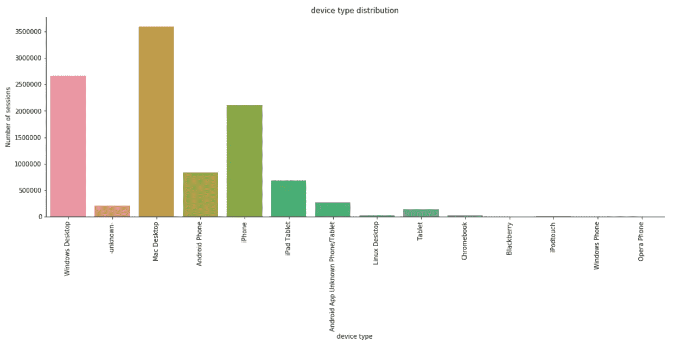

Figure 32

这肯定了之前关于用户的发现。Airbnb 用户中最常见的设备类型是苹果产品。

## **已预订用户的会话**

从前面的分析中，我们知道哪些用户通过 Airbnb 平台进行了预订，所以我们想探索这些 bookers 会话数据。和非预订者有区别吗？

## Bookers 操作类型

```
booker_session = pd.merge(df_without_NDF, sessions, how = 'left', left_on = 'id', right_on = 'user_id')
booker_session.action_type.value_counts()
```

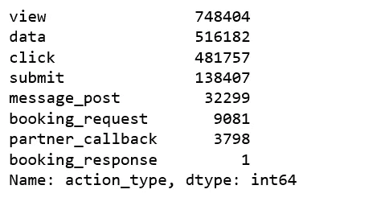

Figure 33

## Bookers 热门活动

```
booker_session.action.value_counts().head(10)
```


Figure 34

不幸的是，预订者和所有用户之间的行为没有显著差异。

## 数据预处理和特征工程

```
train_users = pd.read_csv('train_users_2.csv')
test_users = pd.read_csv('test_users.csv')
df = pd.concat((train_users, test_users), axis=0, ignore_index=True)
df.drop('date_first_booking', axis=1, inplace=True)
```

**日期时间特性**

*   将日期时间列转换为属性日期时间格式。
*   将日期分为日、周、月、年。
*   获取帐户创建日期和首次激活日期之间的差异(时滞)。
*   最后，我们删除不再需要的列。

datetime_features

**年龄特征**

将年份转换为年龄，设置年龄限制，并用-1 填充 NaNs。

age_features

**用户会话动作特征**

有 10，567，737 个记录的会话，数据中有 135，483 个独立用户。

我们将按 user_id 分组，计算每个用户执行操作的次数、操作类型和操作细节。做`groupby.agg(len)`大概比`groupby.size()`快一倍。因此，我使用`groupby.agg(len)`。对于设备类型，我们按 user_id 分组，合计每个用户的总秒数。最后，我们为每个用户最常用的设备添加一个名为“最常用设备”的新列。

sessions_features

**用户会话 secs_elapsed 特性**

我们将从每个用户的 secs_elapsed 特征中提取信息，例如总和、平均值、最小值、最大值、中值、方差，如果 secs_elapsed 的总和大于 86，400 秒，我们考虑 day_pause，如果 secs_elapsed 的总和大于 300，000 秒，我们考虑它是长暂停，如果 secs_elapsed 的总和小于 3，600 秒，我们考虑它是短暂停。之后，我们将会话数据与用户数据合并。

以下脚本借用自 [Kaggle](https://www.kaggle.com/davidgasquez/user-data-exploration) 。

secs_elapsed

**编码分类特征**

```
categorical_features = ['gender', 'signup_method', 'signup_flow', 'language','affiliate_channel', 'affiliate_provider', 'first_affiliate_tracked', 'signup_app', 'first_device_type', 'first_browser', 'most_used_device', 'weekday_account_created', 'weekday_first_active']
df = pd.get_dummies(df, columns=categorical_features)
```

## **归一化贴现累计收益(NDCG)**

NDCG 是[折现累积收益(DCG)](https://en.wikipedia.org/wiki/Discounted_cumulative_gain) 度量的归一化。NDCG 是一个排名措施广泛使用的家庭实践。特别是，NDCG 在评估网络搜索方面非常受欢迎。

有几篇关于 NDCG 的优秀论文可以在[这里](http://proceedings.mlr.press/v30/Wang13.pdf)和[这里](http://hal.in2p3.fr/file/index/docid/726760/filename/07-busa-fekete.pdf)找到。

我们的评估指标是 NDCG @k，其中 k=5。所以我们选择前 5 名，然后取平均值。

ndcg_score

## 使用 Xgboost 进行交叉验证

*   我们将使用训练数据进行交叉验证
*   我们将用-1 填充 NaN。
*   我们如下设置通用参数、树助推器参数和学习任务参数，我们的评价指标是 mlogloss(多类 logloss)。关于如何设置 Xgboost 参数的详细指南可以在[其官方网站](https://xgboost.readthedocs.io/en/latest/parameter.html#general-parameters)上找到。

xgb_cv


Figure 35

从上面的脚本中，我们已经达到的最高平均测试 NDCG 分数是 0.827582。

[Jupyter 笔记本](https://github.com/susanli2016/Machine-Learning-with-Python/blob/master/Airbnb%20New%20User%20Bookings.ipynb)可以在 [Github](https://github.com/susanli2016/Machine-Learning-with-Python/blob/master/Airbnb%20New%20User%20Bookings.ipynb) 上找到。享受这周剩下的时光吧！