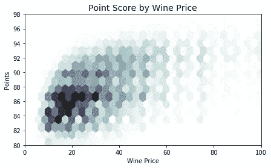
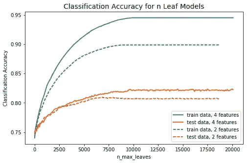

# 用分类和回归树预测 90 多种葡萄酒

> 原文：<https://towardsdatascience.com/predicting-90-wines-with-classification-regression-trees-7a30b4577e4c?source=collection_archive---------4----------------------->

分类回归树(CART)是解决分类问题的灵活工具。它很受欢迎，因为它的适应性和性能很好，几乎不需要调整。我将使用 CART 从葡萄酒评论数据中预测 90+点的葡萄酒，并展示它的特点和陷阱。

我将使用的数据来自《葡萄酒爱好者》杂志，可以在 https://www.kaggle.com/zynicide/wine-reviews 免费获得。它包含了 150，000 种葡萄酒的分数，以及每瓶葡萄酒的价格、酒厂、产区、品种&等信息。对于这个项目，我将只使用美国种植的葡萄酒。

一个合理的假设是，价格较高的葡萄酒比价格较低的葡萄酒更容易获得 90+分。正如下面的 hexbin 图所示，有一些证据支持这一点——但更尖锐的是，有相当多的昂贵葡萄酒根本得不到很高的分数。

另一个假设可能是，某些地区可靠地种植 90 度以上的葡萄酒，而其他地区注定只能种植得分较低的葡萄酒。同样，数据显示了对此的一些支持——但在任何给定的地区，评分结果都有很大的差异。下面的小提琴图描绘了 30 个得分最高的地区的葡萄酒得分密度，每个地区都有 50 种或更多的葡萄酒。

单独使用这些标准中的任何一个，人们都可以开发出一套预测 90+葡萄酒的规则——但这样一个模型的准确性会很差。CART 模型允许跨许多不同特征的直观分类，并且易于在许多不同类型的数据(分类的、定量的)上实现。CART 模型识别将数据分割成越来越同质的组的方式，并且递归地执行这些分割，直到(a)不可能进一步分割或者(b)达到一些用户定义的终止标准。

为了说明这一点，让我们使用 sci-kit learn 的工具在葡萄酒评论数据上训练一个购物车模型:

我的购物车模型由 20，081 个不同的终端“叶子”组成，在这种情况下，每个叶子都由一个或多个来自训练数据的观察结果组成，这些观察结果不能再进一步分割，要么是因为它们是 100%同质的，要么是因为这些观察结果之间不存在特征差异。

上面，我们观察了 CART 模型的主要缺陷:它们很容易过度适应训练它们的数据。当我在一个 30%随机维持数据集(名为“test”)上测试我的 CART 模型时，分类准确率下降了 10%以上。

解决这一缺点的最佳方法是构建不超过必要大小的树。这个标准有点主观，但是本质上在模型复杂性(叶子的数量)和你正在寻找的过度拟合之间有一个平衡。本讨论的其余部分将直接解决这个问题。

CART 模型的一个有用特性是能够比较不同模型特性的“重要性”。这里重要的是每个特征对分类同质性的贡献。

在使用的四个特征中，每种葡萄酒的产地和葡萄酒品种的特征重要性最低。让我们再次运行该模型，这一次删除了这两个特征:

在这里，我们看到训练和测试数据的预测准确率都有所下降，但两者之间的差异也有所下降。这离我们最终要寻找的东西越来越近了:一个可以预测各种数据样本的模型。

除了移除对观察同质性贡献低的特征之外，解决过度拟合的第二个工具是修剪树枝。实际上，修剪是通过在训练模型时设置终止标准来完成的。终止标准可以设置在增长新分割之前所需的最小样本数上，或者设置在模型的最大深度上——起始节点下的子分割数。

对于我的 90+分葡萄酒分类器，我运行了数以千计的购物车模型，每一个我都在增长过程中更快地停止。下图说明了模型精度和我的终止标准(最大叶子数)之间的权衡。

当叶子的数量被限制在大约 7，500 时，CART 模型的准确性开始下降，并且在该点之上相对稳定。但有趣的是，当用于测试数据时，在大约 6000 片叶子以下，4 特征和 2 特征模型之间几乎没有区别。在 2，500 个最大叶子的情况下，仍然有接近 80%的测试样本准确率，并且 2 特征训练和测试样本准确率之间只有大约 5%的差异。

最终，购物车模型标准的选择将取决于手头任务的独特目标。如果对于 90+点的葡萄酒预测，80%是可接受的平均准确率，那么具有大约 2，500 片叶子的 2 特征 CART 模型将为我们提供一个模型，该模型将以合理的确定性在样本间表现一致。

 [## dasotelo/Wine_Classify.py

github.com](https://github.com/dasotelo/Python_Projects/blob/master/Wine_classify.py)