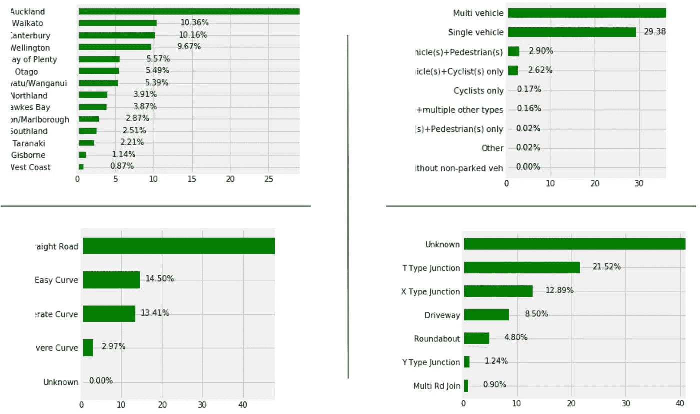
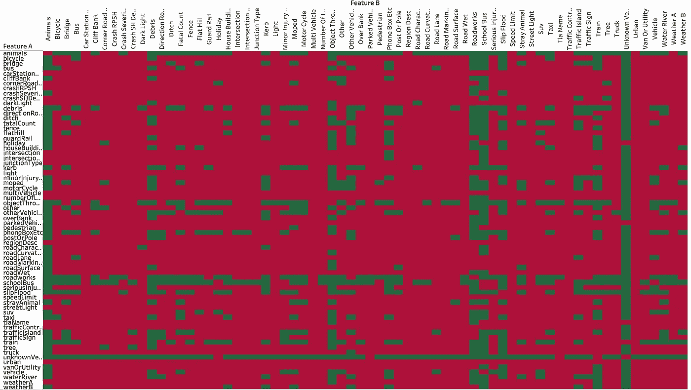
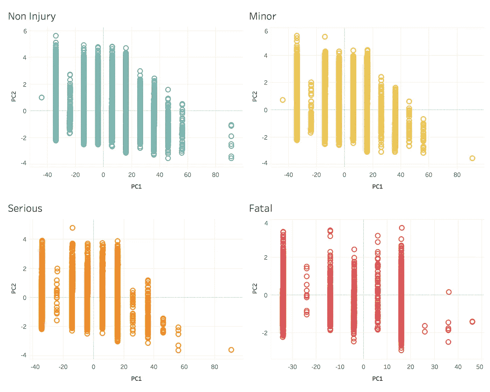
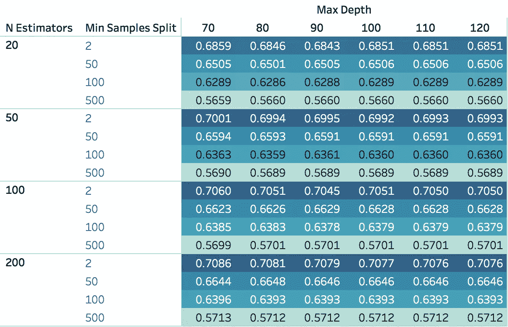
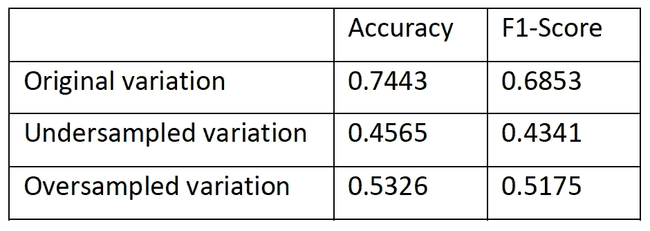
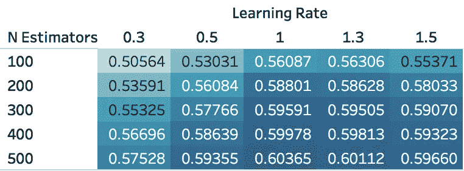
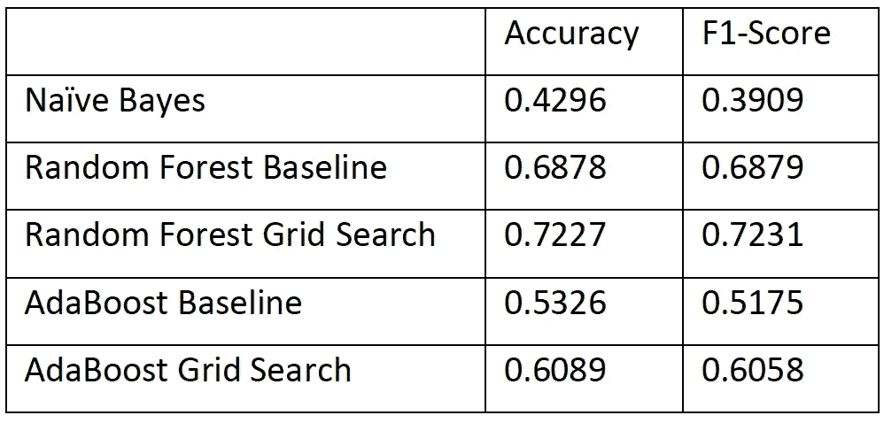

# 预测新西兰道路交通事故的严重程度

> 原文：<https://towardsdatascience.com/predicting-crash-severity-for-nz-road-accidents-6214117e73fb?source=collection_archive---------27----------------------->

## 从技术和业务角度对机器学习项目进行端到端的工作——顶点项目回顾

P values for the Chi2 Test of independence of every (categorical) feature pair in the dataset.

最近看完了 Udacity 的机器学习 Nanodegree。这是一次伟大的经历，以著名的*顶点项目*而告终，在这篇文章中，我想分享我的经历。

# TL；博士:

理解数据及其上下文比选择和调整超参数的算法更重要。这就是 EDA 至关重要的原因。另外，它也是一个很好的第一轮功能选择。

降维并不总是产生有用的结果。

过采样技术通常是克服目标变量类别不平衡的好策略。

有一个基准来比较性能是很重要的。如果这是不可能的，那么理解问题的背景和领域就变得更加重要。

最终，成功应该总是在业务目标、可用时间和追求任何特定想法或分析的成本的背景下定义。

# 首先，简单介绍一下我是谁

这些年来，我一直是各种类型的软件开发人员。我创建了数据密集型的内部网系统，并开发了使用相同数据的网络应用程序。我做过业务、功能和技术分析师；理解并确定这些应用和系统应该做什么以及应该如何做。我一直是企业数字化转型的顾问，这些企业希望通过自动化将数据货币化并简化运营。

目前，我是一名*产品经理和投资组合专员；*创造新产品和服务，将我公司的数据货币化，并利用这些服务推动我们客户各自的业务；也是我们自己的。

我有一个未完成的纯数学学位——这是我最大的爱好，其次是技术。

最后，我未来五年的目标是参与可再生能源、可持续发展和智能城市。我确信这些主题——以及区块链和物联网(IIoT)——将在很大程度上驱动和定义我们未来几十年将生活的社会和世界。

# 关于车祸

车祸和交通事故可能被认为是一个老话题。然而，随着汽车的进步和它们所承载的技术能力，更重要的是要有工具和手段来减少它们的发生，以及它们对所涉及的人的影响和后果。但是预测车祸的严重程度并不容易。即使在可能的情况下，精度水平也会有很大差异，这取决于许多因素，包括可用的数据和问题建模的好坏。

# 数据集

在为我的顶点项目寻找有意义的数据集时，我偶然发现了[*data . govt . NZ*](http://data.govt.nz)*；*由中央政府发布的与新西兰各种活动相关的开放数据集的存储库。所选的数据集直接来自于*新西兰运输署。它包含从 2000 年 1 月 1 日至今的车祸数据，并且每季度自动更新一次。数据集附带一个 pdf 文件，其中包含每个可用要素的清晰定义。*

# 项目大纲

本文的大部分内容摘自该项目的最终报告。该报告连同所有笔记本、代码和数据都可以在我的 GitHub 个人资料[这里](https://github.com/iairrozen/mlnd_capstone_project)找到。此外，还有一个 Tableau 工作簿，我在其中构建了大部分初始 EDA 可视化，我在整个项目以及报告中都使用了它。该工作簿可在我的 Tableau 公共档案[这里](https://public.tableau.com/profile/iair.rozenszajn#!/vizhome/NZCrashAnalysisSystem2000-2018Q2/CrashesperRegion)获得。

我们的目标是预测车祸的严重程度。在数据集中，目标变量称为 *crashSeverity* ，取四个不同的值: *N* 表示*无伤害*， *M* 表示*轻微*， *S* 表示*严重*，以及 *F* 表示*致命*。

为了实现我们的目标，我们将经历以下步骤:

**功能探索(带数据清理)**

**降维**

**模型构建(包括基准和基线模型)**

**优化和最终型号选择**

考虑到我们的问题是一个多类分类问题，我们将使用 F1 分数来评估我们将训练的不同模型的性能。对于每个模型，全局得分的值将依次是每个类别的 F1 得分的平均值。因此，我们将使用*一对一对全部*的方法。不过，我们也会仔细看看*精度*、*精度*和*召回*；因为它们都为理解模型如何运行提供了有价值的见解。

最后，我们将解释并详细说明进一步提高所选模型的整体性能和可解释性的一些可能的后续步骤。

# 功能探索(又名 EDA)

数据集最初总共有 655，697 个样本。每个都有 89 个不同的特征，既有数字的也有分类的。

简单地从上面提到的 pdf 中读取每个特性的定义，我们可以看到有一些特性的值是从其他特性中派生出来的。这些*衍生的*特征并没有给数据集增加内在价值，因为它们被用于，例如，以一种更简洁的方式总结车祸的特征，正如 pdf 所描述的，用于管理目的。因此，我们将移除它们以防止不必要的特征相关性。这同时将有助于将数据集的大小保持在最小，这将有助于模型的训练时间。

另一方面，有一些特性的值是在崩溃被报告和处理后根据其严重性提供的。具体来说，*minorinjuricount*、 *seriousInjuryCount、*和 *fatalCount* (不言自明)就是这样提供的。因此，它们会将数据泄漏到我们的目标变量中，我们必须移除它们。此外，这些功能在首次报告事故时不可用——这是我们的模型进行实时预测的时候——紧急机构需要尽快做出适当的反应。

除了这些特殊的特征，其余的大部分都是绝对的。表明撞车时的状况不同。像 *weatherA* 和 *weatherB，*都用来表示天气的两个不同方面。或*光、道路曲率、交通控制*和*车道数*，用于描述不同的自然光条件、道路曲率水平、是否有交通信号以及道路有哪些车道和车道数；分别是。

最后，大多数数字特征代表指示碰撞中涉及的物体数量的计数器。

在理解了每个特性代表什么之后，我们需要探究它们各自的值，以理解它们的分布，以及它们的定义是否有任何不一致之处。

top left: distribution of crashes by region; top right: distribution by crash type (multiVehicle); bottom left: distribution by road curvature: bottom right: distribution by junction type

对于每个特性，我们需要考虑值不一致和/或缺失的情况。这导致要么输入缺失值，要么丢弃特定样本，甚至完全丢弃某个特性——详细信息可在 GitHub 上的 *EDA* 笔记本中找到。在对每个分类和数字特征做了这些之后，我们最终放弃了 22 个与我们的问题无关的特征；或者由于太多缺失/不一致的值，并且没有明确的方法来估算它们。此外，我们还丢弃了一些样本，这些样本的某些特性的值不一致，而这些特性的行为与预期的不同。

无论如何，我们从这一步中学到的最重要的事情是，对于我们的目标变量来说*存在着巨大的类别不平衡:*

*假定非伤害性*碰撞是最常见的，并且随着碰撞严重性的增加，做出良好预测的重要性也增加；我们需要解决这个问题，如果我们希望产生一个良好的运作模式。为此，我们将求助于欠采样和过采样技术，这将在*模型构建*一节中介绍。

除了这一点，数据集没有呈现任何特定的趋势或模式，让我们能够直观地了解哪些特征最具预测能力。

Distribution for eight different feature. All of them behave similarly, where the only similarity they share is how they behave with regard to the target variable.

既然我们已经单独研究了每个特性，我们需要检查一对特性之间可能的相关性。由于大多数特征是绝对的，我们将通过 Chi2 独立性检验来实现。我们采用 *p 值*来测试每一对特征，并考虑 0.05 阈值的*零* *假设*的独立性。结果汇总在下图中，其中红色表示给定特征对之间的相关性，绿色表示独立性:

我们可以看到，每个功能都依赖于几乎所有其他功能。使得由于相关性而几乎不可能移除它们中的任何一个，因为它们都携带有价值的信息。

因此，我们决定保留所有剩余的功能。

# 主成分分析降维

在完成初始探索之后，我们可以尝试通过应用 PCA 来获得新的特征，以原始特征的线性组合的形式揭示可能的潜在特征，这些潜在特征可能证明是比原始特征更好(和更简单)的预测器。

然而，在用 10 个主成分应用 PCA 之后，我们得到了一个在类之间不可分的数据集。以下是前两个 PC 的每个*碰撞严重度*的分布情况，这两个 PC 占数据可变性的 97%以上:

如您所见，这四个类的分布非常相似。此外，这些课程相互重叠。以至于在一个图表中包含这四个类，除了几个清晰的点之外，您无法区分它们。

此外，即使在对数据进行最小最大缩放后，结果甚至更糟:

这在某种程度上是可以理解的；考虑到具有许多分类特征的数据集的维数减少往往比具有更多数值特征的数据集更棘手。

这在一定程度上是因为我们已经通过一个*热编码*过程运行了数据集。这将原始样本矩阵变成了本质上稀疏的另一个样本矩阵。不仅如此，这个稀疏矩阵大部分是二进制的(除了计数器和很少的连续特征)；这意味着不是 *0* 的条目或单元格实际上是 *1* 。所有这些细节不仅影响应用 PCA 的结果，而且影响分类器本身的开发和实现。例如，如果我们要选择一种依赖于使用某种距离定义的算法，比如 L1(闵可夫斯基)、L2(欧几里得)或 L 无穷(切比雪夫或曼哈顿)，我们可能会面临一些问题。

# 模型结构

正如我们刚刚提到的，数据集中的大多数要素都是分类的。同样，也不清楚哪些是最有意义的或者与分类任务相关的。因此，我们将关注决策树作为基础(和弱)学习器，并训练两个集成模型；一个用于装袋，一个用于增压。具体来说，我们将训练和优化随机森林和 AdaBoost GBM。这将为我们提供两种模型，能够处理刚才提到的两个棘手问题。

对于多类分类问题，这两种算法是很好的选择。然而，随机森林对类别不平衡是敏感的，而 AdaBoost 对噪声和异常值是敏感的。所有这些特殊性都很重要，我们将通过对数据集的三种变化训练这两个模型来解决它们:原始(完整)数据集、欠采样变化和过采样变化。对于目标变量中的每个类，欠采样和过采样变化将具有相同数量的样本。如何获得这些变化的详细信息可在 GitHub repo 的最终报告和笔记本中找到。

## 标杆管理

为了评估训练模型的性能，我们将使用两个参考值。第一个是专门为我们的问题训练的人工神经网络的性能。Sharaf alk heder 2016 年发表的这篇论文提供了详细信息；马德哈尔·塔姆奈和萨拉赫·塔姆奈:

[利用人工神经网络预测交通事故的严重程度](https://onlinelibrary.wiley.com/doi/full/10.1002/for.2425)

论文摘要描述了一个最终的人工神经网络，其测试精度为 74.6%。

第二个参考将是一个基本的朴素贝叶斯分类器，用作我们集合模型的基线。作为参考，我们将使用所有班级的平均 F1 分数以及班级级别的得分值

## 基线-朴素贝叶斯分类器

在对每个变化训练 NB 分类器之后，我们得到将用于评估集合模型的以下性能值:

Averaged scores across classes

Class level scores

现在，对于所选的两种算法(RF 和 AdaBoost)。我们遵循了相同的流程:

1.  以 75/25 的训练/测试比率分割数据集。
2.  为数据集的每个变体训练一个基线模型(使用默认参数值)。这一步骤的结果是原始变化的一个训练模型；一个用于欠采样变异；一个用于过采样变化。
3.  分析基线模型的性能指标，并选择性能最佳的模型和变体。在这一步中，我们考虑了准确性；所有目标类别的平均精确度、召回率和 F1 分数；和类级别的相同指标。这样做是因为，虽然我们想获得一个很高的 F1 分数，但我们处于一个多职业的环境中，因此，我们希望分数能代表所有职业。此外，考虑到阶级分布的不均衡性，这变得更加重要。
4.  使用从最佳性能基线模型的特征导出的参数网格，使用最佳性能变化执行网格搜索。该步骤的结果是基于来自 3 重交叉验证的平均 F1 分数的最佳估计值。

# 随机森林

## 基线模型

首先，我们给出基线模型的结果，即所有默认参数。当然，分数对应于每个变体的测试集。

射频基线的准确度和平均 F1 分如下:

Performance of RF baseline model on all variations of the dataset.

Class level scores

正如我们所看到的，最佳精度是在原始变量紧跟过采样变量的情况下获得的。然而，最好的 F1 分数是通过过采样变化获得的。

此外，通过查看类级别的性能指标，我们清楚地看到原始变体的平均 F1 分数主要是由于类 *N、*的分数，而其他类的分数要低得多。另一方面，过采样变化的 F1 分数是由类级别的 F1 分数生成的，这些 F1 分数彼此之间更加平衡。因此，过采样变异的 F1 分数 0.6879 更能代表类级别的情况。

此外，对于过采样变异中的每个类别，F1 分数证明是精确度和召回率之间的非常好的平衡。所有这些细节使得过采样变化成为执行网格搜索的最佳候选。

## 网格搜索

接下来，我们呈现对参数*最大深度*、 *n 估计量*和*最小样本分割*做网格的结果；以及它们相应的 F1 分数。在这里，分数是三重交叉验证过程的平均值。

得到的最佳估计器是用参数 *max_depth=70、*n _ estimates = 200 和 *min_samples_split=2* 训练的估计器。

作为一个额外的见解，有趣的是注意到，对于每个被考虑的 *n_estimator* 和 *max_depth* ，最高分是针对 *min_samples_split=2* 的。通过观察 viz 上的彩色条纹，这一点变得很明显。有人可能会说，如果我们只考虑这三个参数，那么提高性能的最佳方式就是在森林中增加更多的树。

此外，当我们使用最佳估计量对测试集进行预测时，我们得到的准确度为 0.7227，F1 值为 0.7231。其高于它们相应的训练值。

# ADA 增强

同样，首先，我们呈现基线模型的结果。

Averaged scores

Class level scores

在这种情况下，最佳准确度和平均 F1 分数都是用原始变异获得的。然而，与 RF 一样，这主要是由类别 *N* 的分数驱动的。由于我们希望有一个平均代表每个类的分数，所以我们不能选择这个变量。相反，我们将选择过采样变化，虽然其值低得多，但其跨类行为与 RF 非常相似。

## 网格搜索

对于该算法，我们给出了具有参数 *n_estimators* 和 *learning_rate* 的网格搜索的结果。

在这种情况下，有趣的部分来自于注意到对于每一个 *n_estimators* 的值，最好的测试分数是以 1 的学习率获得的。这在某种程度上是有道理的。算法本身已经为正确和错误分类的样本分配了权重，以便训练下一个树桩，从而改善前一个树桩的错误分类。

对于这个最佳估计量，测试集上的准确度是 0.6089，平均 F1 分数是 0.6058。

# 随机森林和 AdaBoost 比较

最后，在通过网格搜索优化每个模型之后，我们可以在它们之间以及与基准进行比较。

由于我们已经使用过采样变化训练了这两种算法，以克服类的不平衡，因此我们仅给出该变化的性能指标:

对于这两个指标，执行网格搜索后，性能最好的模型是随机森林。在某种程度上，这是意料之中的。至少事实上，在这种情况下，通过网格搜索，最佳执行模型将是一个优化的模型。

但也许最有趣的是两种算法的不同方法。

虽然 AdaBoost 在每一步都试图改善由基于单个特征进行预测的前一个树桩的集合所产生的错误分类，但随机森林是一种确定性方法，它通过找到在分割后产生最大杂质减少的分割来生长树。

通过这样做，随机森林开发出非常精确但过度拟合的树。然而，通过添加许多树，每个树都有一个样本包，并在每次分割时引导特征，它克服了单个树的过度拟合，创建了一个非常强大的模型。

总体准确度分数仅为 0.72 这一事实表明，可用数据缺乏可预测的能力来使这一指标超过我们为参考人工神经网络选择的 74.6%准确度的第一个基准。

Tableau 工作手册有几个例子来支持这个结论。具体来说，随着网格搜索的进行，性能的增加逐渐减少(边际);这表明利用现有数据，搜索和模型只能完成这么多。

# 结论和可能的改进

RF 只能产生 0.72 的准确度和 0.72 的 F1 分数。虽然 F1 分数在各个类别之间是平衡的——这意味着每个类别的 F1 分数与平均分数具有相似的值——但整体性能低于我们在项目开始时选择的人工神经网络基准。这使得我们的模型相关，但几乎不可用。

尽管如此，仍有很大的改进余地。例如，考虑到数据集的形状和形式，其他一些被证明有用的算法有 SVM、XGBoost 和 LGMB。这些也可以合并，包括随机森林。

我们还可以为每个类训练一个二进制分类器，以便有一个更加定制的一对一方法。还可以尝试其他评估方法，如 AUC/ROC 和 Precision/Recall 曲线。在这种情况下，我们可以为最终的分类器实现一个表决器。我们还可以对每一类的预测概率进行更深入的分析。有助于更好地理解每个类别最具代表性的特征。

与此同时，我们可以通过其他维度缩减技术和无监督学习算法来探索特征选择/工程的途径，这些技术和算法可以帮助发现数据中的隐藏结构。

对于数据集的不平衡性质，一些成本敏感性算法可能非常有用。

最后但同样重要的是，我们可以尝试其他具有其他优点和缺点的库。例如 H2O，它可以处理分类特征，并用于并行计算，这将有助于模型的总训练时间。允许更长的训练时间和更彻底的网格搜索。

总而言之，如果在这一点上不明显，每个机器学习项目的指导北应该是所谓的*商业案例；*虽然它显然不属于*商业*范畴，但这个想法仍然成立。业务案例对什么是有意义的，什么是没有意义的有最终决定权:对 2%的性能提升是否值得在截止日期后额外花费 10%的时间和 5%的额外成本，这两者对组织的其他领域和团队来说可能都是合理的。

最终，没有完美的解决方案，只有对预期目的足够好的解决方案。然而，随着研究结果被证明越来越有用，并提供了一个关于如何改进自己的反馈回路，这一目的可以——在许多情况下也应该——变得越来越复杂。