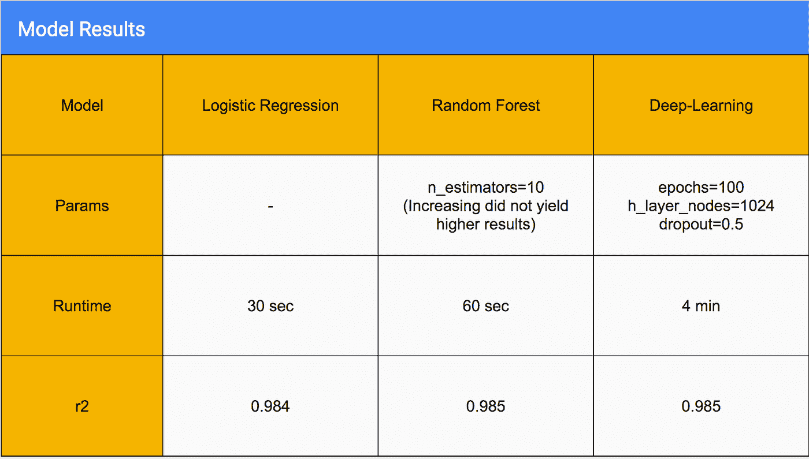

# 预测未来农药样品结果，促进智能农药使用

> 原文：<https://towardsdatascience.com/predicting-future-pesticide-sample-results-to-promote-intelligent-pesticide-use-66badaa0baa1?source=collection_archive---------2----------------------->

**DeepFarm 概述**

DeepFarm 是一家科技初创公司，正在寻求将深度学习应用于精准农业，以获得可操作的见解。这些见解将来自广泛的领域，包括水和能源使用、杂草控制、运营成本以及我们今天的主题——农药使用。在更大的范围内，DeepFarm 正在寻求发展成为一个端到端的系统，负责自动收集、处理、可视化和实现数据驱动的结果。

**问题陈述**

建立一个分类器，能够最好地预测给定食品样品中农药残留的实验室结果，以促进高效和安全的农药使用。

**项目目标**

在完成手头的问题时，我还想测试这个特定数据集的各种算法(传统的和高级的)的准确性和效率，并比较每个算法的业务用例。

**数据**

该项目使用的数据由美国农业部(USDA)采购，作为其农药数据计划的一部分，并发布到 Kaggle(链接如下)。该数据库(仅 2015 年，2013–2014 年也可用)包括约 230 万份实验室样本，总数据量为 89MB。我们的分类器的基线是 98.31%，因为所有样品中只有 1.69%被归类为农药残留超过可接受的阈值。尽管改善的幅度很小，但 1.69%的结果是大约 40，000 个样本超过了农药的可接受阈值，可能会对消费者造成健康后果。对这一基线的任何改进都会导致成百上千的样本被正确识别。

数据链接:[https://www . ka ggle . com/usdeptofag/pesticide-DATA-program-2015](https://www.kaggle.com/usdeptofag/pesticide-data-program-2015)

**型号选择**

对于传统模型，我选择使用逻辑回归和随机森林。这些代表了传统模型谱的极端，并将为与高级深度学习模型进行比较提供完整的基础。对于深度学习 3 层模型，我在隐藏层使用了 1024 个节点，dropout 为 0.5，ReLU 激活。

**实施**

逻辑回归和随机森林模型都使用 SciKit-Learn，神经网络是使用 TensorFlow 后端和 Keras 前端包装器构建的。

**结果**

正如我们从下面的幻灯片中看到的，随着模型复杂性的增加，准确性也在增加。然而，这种准确性是以时间为代价的，这一因素应由利益相关者根据具体情况进行评估。逻辑回归模型是我们的模型中最简单的，同时表现得相当好，并提供了最易于人类阅读的输出和对系数的访问。随机森林增加了额外的复杂性，输出只有树，但有增加我们的模型准确性的优势。我们的前馈神经网络与我们的随机森林具有相同的精度，但是我相信随着额外的数据和处理能力，这个结果可以增加到甚至更精确。

Model Results