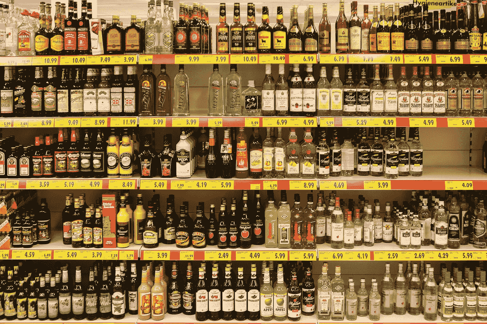
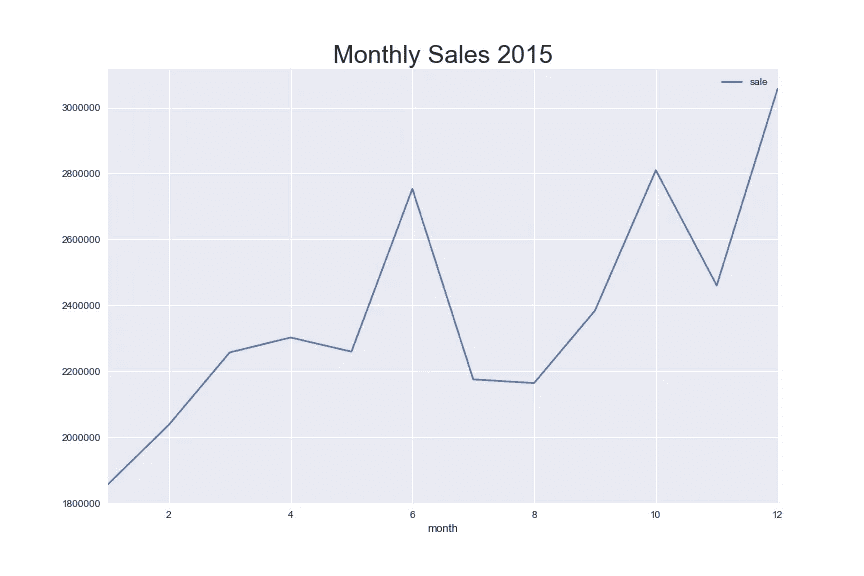

# 预测爱荷华州的酒类销售

> 原文：<https://towardsdatascience.com/predicting-iowa-liquor-sales-787f5d471edb?source=collection_archive---------3----------------------->

爱荷华州在其网站上提供了许多数据集，其中一个包含了该州从 2015 年 1 月到 2016 年 3 月所有酒类商店的交易。有了这些信息，我的目标是分析数据并建立一个线性回归模型来预测 2016 年剩余时间的销售额。为了更好地理解数据，每一行或每一个观察都描述了某一天某一特定商店销售了多少单位的某种商品。还包括附加信息，例如商店编号、城市、邮政编码和商店所在的县、商品描述、商品的酒类、瓶子的大小、售出的瓶子数量、瓶子的零售价格、收入等。

在提供的数据集中有很多缺失的数据，所以我寻找处理这些缺失值的方法。其中大多数都在 county 列中，所以我根据在其他观察中找到的所有唯一的市县对，通过将城市映射到相应的县，为这些观察分配了正确的县。我发现了解每个商店属于哪个县很有价值，因为按县划分销售额是汇总数据的好方法。在进一步分析数据后，我注意到销售数字有很大的季节性。

上图直观地展示了 2015 年整个州的酒类销售额逐月大幅波动的情况。就这一点对预测 2016 年销售的价值而言，可以有把握地假设 2016 年的销售将遵循类似的趋势。因此，我决定预测 2016 年最后三个季度销售额的最佳方法是建立一个模型，描述 2015 年第一季度销售额和 2016 年第一季度销售额之间的关系，然后使用 2015 年第二至第四季度的销售额来预测 2016 年第二至第四季度的销售额。从那时起，我必须决定是要对每个商店还是每个县进行销售预测。

我绘制了 2015 年第一季度销售额与 2015 年第一季度销售额在商店和县两个层面的对比图。正如您从上面的回归图中看到的，两个时间段的县销售额密切相关，而商店级别的销售数字则有很大的差异。此外，在研究数据时，我注意到在整个 15 个月中有许多商店关闭和开业，这可能会提供不准确的预测。因此，我使用按县汇总的销售数字来构建我的模型。为了详细说明该模型到底在做什么，计算机开发了一个等式来表示 2015 年第一季度销售额和 2016 年第一季度销售额之间的关系。然后，为了进行预测，我们输入每个县第 2-4 季度的销售额，模型使用它开发的公式返回每个县 2016 年的预测。

我将数据分为一个训练集和一个测试集，并能够仅使用训练集成功构建一个线性回归模型，该训练集占县销售数据集的 70%。该模型的结果预测 2016 年全年总销售额将增长约 3.62%，这是有道理的，因为我们看到 2015 年至 2016 年第 1 季度的销售额有所增长。当在测试集上测试时，该模型获得了 0.9938 的准确度分数。这个数字代表实际值和预测值之间的均方误差或 R 平方值。一个完美的模型应该有 1 分，所以我的模型表现得非常好！

我对我的模型的结果非常满意。我考虑过不仅仅使用销售数字来生成预测，例如总售出升数或总售出瓶数，但是由于这些特性与销售高度相关，我决定不使用它们以避免多重共线性。还有，我做了一个假设，销量是未来销量最好的预测指标！