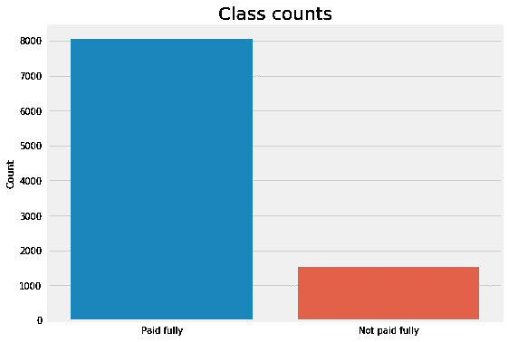
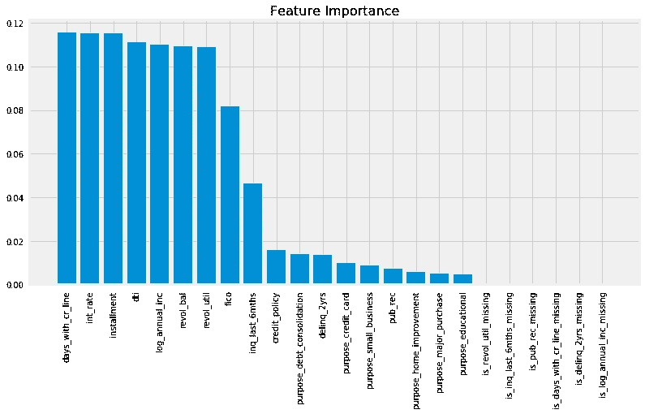
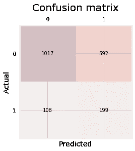

# 预测贷款偿还

> 原文：<https://towardsdatascience.com/predicting-loan-repayment-5df4e0023e92?source=collection_archive---------3----------------------->


# 介绍

借贷行业最关键的两个问题是:1)借款人的风险有多大？2)考虑到借款人的风险，我们是否应该借给他/她？第一个问题的答案决定了借款人的利率。利率衡量借款人的风险，即借款人风险越大，利率越高。考虑到利率，我们可以确定借款人是否有资格获得贷款。

投资者(贷款人)向借款人提供贷款，以换取带息还款的承诺。这意味着只有当借款人还清贷款时，贷款人才能获利(利息)。但是，如果他/她不偿还贷款，那么贷款人就赔钱了。

我们将使用来自 LendingClub.com 的公开数据。该数据涵盖了 2007 年 5 月至 2010 年 2 月期间该平台资助的 9，578 笔贷款。我们为每个借款人提供利率。因此，我们将通过预测借款人是否会在到期日偿还贷款来间接回答第二个问题。通过这个练习，我们将阐述三个建模概念:

*   如何处理丢失的值。
*   用于不平衡分类问题的技术。
*   说明如何使用两种方法建立一个集合模型:混合和堆叠，这很可能会提高我们的性能。

以下是数据集中每个特征的简短描述:

*   **credit_policy** :如果客户符合 LendingClub.com 的信用核保标准，则为 1，否则为 0。
*   **用途**:借款用途，如:信用卡、债务合并等。
*   **int_rate** :贷款的利率(比例)。
*   **分期付款**:如果贷款有资金，借款人所欠的每月分期付款($)。
*   **log_annual_inc** :借款人年收入的自然对数。
*   **dti** :借款人的债务收入比。
*   **fico** :借款人的 fico 信用评分。
*   **days_with_cr_line** :借款人拥有信用额度的天数。
*   **循环余额**:借款人的循环余额。
*   **revolu _ util**:借款人的循环额度使用率。
*   **inq_last_6mths** :借款人最近 6 个月被债权人查询的次数。
*   **de inq _ 2 yers**:在过去的 2 年中，借款人逾期还款超过 30 天的次数。
*   **pub_rec** :借款人的贬损公开记录数。
*   **not _ fully _ payed**:表示贷款是否没有全部偿还(借款人违约或借款人被认为不可能偿还)。

让我们加载数据并检查:

*   每个特征的数据类型
*   如果我们有缺失的值
*   如果我们有不平衡的数据

创建这个帖子的源代码可以在[这里](https://nbviewer.jupyter.org/github/ImadDabbura/blog-posts/blob/master/notebooks/Predicting-Loan-Repayment.ipynb)找到。


**Figure 1**: Data types/missing values



**Figure 2:** Class counts

```
Positive examples = 1533
Negative examples = 8045
Proportion of positive to negative examples = 19.06%
```

看起来我们只有一个分类特征(“目的”)。此外，六个要素有缺失值(标注中没有缺失值)。此外，数据集如预期的那样非常不平衡，正面例子(“未全额支付”)只有 19%。在下一节中，我们将在概述集成方法之后解释如何处理所有这些方法。

# 建模

**集成方法**可以定义为将几个不同的模型(基础学习器)组合成最终模型(元学习器)以减少泛化误差。它依赖于这样一个假设，即每个模型都将着眼于数据的不同方面，从而获取部分事实。将独立训练的表现良好的模型组合起来，将比单个模型捕捉到更多的事实。因此，这将导致更准确的预测和更低的泛化误差。

*   当我们添加更多的模型时，集合模型的性能几乎总是得到改善。
*   尝试组合尽可能不同的模型。这将降低模型之间的相关性，这将提高集合模型的性能，从而显著优于最佳模型。在所有模型完全相关的最坏情况下，集成将具有与最佳模型相同的性能，如果一些模型非常差，有时甚至更低。因此，选择尽可能好的模型。

Different 集合方法以 different 方式构建模型的集合。以下是最常见的方法:

*   混合:平均所有模型的预测。
*   打包:在不同的数据集上建立不同的模型，然后从所有模型中获得多数票。给定原始数据集，我们使用替换进行采样，以获得与原始数据集相同的大小。因此，每个数据集平均将包括 2/3 的原始数据，其余 1/3 将是重复的。由于每个模型都将建立在不同的数据集上，因此可以将其视为不同的模型。*随机森林*通过减少每次分割时挑选强特征的可能性来改进默认的装袋树。换句话说，它将每次分割时可用的特征数量从 *n* 个特征减少到例如 *n/2* 或 *log(n)* 个特征。这将减少相关性–>减少方差。
*   推进:按顺序构建模型。这意味着每个模型都要学习前一个模型的残差。输出将是由学习率λ加权的每个单个模型的所有输出。它通过从先前树(模型)的残差中顺序学习来减少由 bagging 导致的偏差。
*   堆叠:构建被称为基础学习者的 k 模型。然后将模型拟合到基础学习器的输出，以预测最终输出。

由于我们将使用随机 Fores (bagging)和梯度推进(Boosting)分类器作为集成模型中的基础学习器，因此我们将仅说明平均和堆叠集成方法。因此，建模部件将由三部分组成:

*   应对价值观缺失的策略。
*   处理不平衡数据集的策略。
*   建立集合模型。

在继续之前，以下数据预处理步骤将适用于所有模型:

1.  从特性“目的”创建虚拟变量，因为它是名义(非序数)分类变量。这也是一个很好的做法，放弃第一个，以避免产生的特征之间的线性依赖，因为一些算法可能会与这个问题作斗争。
2.  将数据分为训练集(70%)和测试集(30%)。训练集将用于拟合模型，测试集将用于评估最佳模型，以获得泛化误差的估计。我们将使用 10 重交叉验证，而不是设置验证来调整超参数和评估不同的模型，因为这是对泛化误差更可靠的估计。
3.  将数据标准化。我们将使用`RobustScaler`,这样标准化将更少受到异常值的影响，即更健壮。它将数据集中在中间值周围，并使用*四分位距(IQR)* 对其进行缩放。这一步将作为转换器包含在每个模型的管道中，因此我们不会单独进行。

```
# Create dummy variables from the feature purpose
df = pd.get_dummies(df, columns=["purpose"], drop_first=True)
```

# 应对价值观缺失的策略

现实世界的数据集几乎总是有缺失值。例如，这可能是由于用户没有填写表单的某些部分，或者在将数据发送给您之前收集和清理数据时发生了一些转换。有时缺失值是有信息的，并不是随机生成的。因此，添加二进制要素来检查每个有缺失值的要素的每一行中是否有缺失值是一种很好的做法。在我们的例子中，六个特征有缺失值，所以我们将添加六个二进制特征，每个特征一个。例如，“log_annual_inc”要素缺少值，因此我们将添加一个采用值∈ {0，1}的要素“is_log_annual_inc_missing”。好的一面是缺失值只存在于预测值中，而不存在于标注中。以下是处理缺失值的一些最常见的策略:

*   只需删除所有缺少值的示例。如果缺失值与数据集的大小相比非常小，并且缺失值是随机的，则通常会这样做。换句话说，添加的二进制特征并没有改进模型。这种策略的一个缺点是，当测试数据在预测中有缺失值时，模型会抛出错误。
*   分别使用每个要素的平均值估算缺失值。
*   分别使用每个要素的中值来估算缺失值。
*   使用*链式方程多元插补(小鼠)*。鼠标的主要缺点是我们不能在 sklearn 管道中将其用作转换器，并且在输入缺失值时需要使用完整的数据集。这意味着会有数据泄露的风险，因为我们同时使用训练集和测试集来估算缺失值。以下步骤解释了鼠标的工作原理:

1.  第一步:分别使用每个特征的平均值来估算缺失值。

2.第二步:对于每个具有缺失值的特征，我们将所有其他特征作为预测值(包括具有缺失值的特征),并尝试使用例如线性回归来预测该特征的值。预测值将替换该要素的旧值。我们对所有具有缺失值的要素都执行此操作，即每个要素将被用作一次目标变量来预测其值，其余时间用作预测其他要素值的预测值。因此，一旦我们运行模型$k$次来预测具有缺失值的$k$要素，就会完成一次完整的循环(迭代)。对于我们的数据集，每次迭代将运行 6 次线性回归来预测 6 个特征。

3.第三步:重复第二步，直到预测之间没有太大的变化。

*   使用 K-最近邻估算缺失值。我们计算数据集中所有示例(不包括缺失值)之间的距离，并取每个缺失值的 k 个最近邻的平均值。sklearn 中还没有实现它，计算它的效率很低，因为我们必须遍历所有的例子来计算距离。因此，我们将在本文中跳过这一策略。

为了评估每种策略，我们将使用*随机森林*分类器，其超参数值由[数据驱动建议指导，用于将机器学习应用于生物信息学问题](https://arxiv.org/pdf/1708.05070.pdf)。

让我们首先为缺失值创建二元要素，然后为上面讨论的每个策略准备数据。接下来，我们将使用训练数据计算所有模型的 10 重交叉验证 *AUC* 分数。

```
Original data shapes: ((7662, 24), (1916, 24))
After dropping NAs: ((7611, 18), (1905, 18))
MICE data shapes: ((7662, 24), (1916, 24))Baseline model's average AUC: 0.651 
Mean imputation model's average AUC: 0.651
Median imputation model's average AUC: 0.651
MICE imputation model's average AUC: 0.656
```

让我们绘制特征重要性图，以检查添加的二元特征是否为模型添加了任何东西。



**Figure 3:** Random Forest feature importance

在 10 倍交叉验证 *AUC* 分数的指导下，看起来所有策略都有可比较的结果，缺失值是随机产生的。此外，当绘制来自*随机森林*分类器的特征重要性时，添加的六个二元特征没有显示出重要性。因此，可以安全地丢弃这些特征，并在管道中使用*中值插补*方法作为转换器。

```
# Drop generated binary features
X_train = X_train[:, :-6]
X_test = X_test[:, :-6]
```

# 处理不平衡数据集的策略

大多数现实应用中的分类问题都有不平衡的数据集。换句话说，正面例子(少数阶级)比负面例子(多数阶级)少得多。我们可以看到，在垃圾邮件检测，广告点击，贷款审批等。在我们的例子中，正面例子(没有完全付款的人)只占全部例子的 19%。因此，对于不同的模型，准确度不再是性能的良好度量，因为如果我们简单地预测所有的例子都属于负类，我们达到 81%的准确度。不平衡数据集的更好指标是*AUC*(ROC 曲线下的面积)和 f1 分数。但是，这还不够，因为类不平衡会在训练期间影响学习算法，通过隐式学习基于数据集中的多数类优化预测的模型，使决策规则偏向多数类。因此，我们将探索不同的方法来克服阶级不平衡的问题。

*   欠采样:通过使正例数和反例数相等，对有或无替换的多数类进行欠采样。欠采样的缺点之一是它忽略了很大一部分具有有价值信息的训练数据。在我们的例子中，它将丢失大约 6500 个例子。但是，训练起来很快。
*   过采样:通过使正例与反例的数量相等，用或 w/o 替换对少数类进行过采样。我们将使用这种策略从训练数据集中添加大约 6500 个样本。这比欠采样的计算量大得多。此外，由于重复的例子，它更适合修剪。
*   EasyEnsemble:从多数类中采样几个子集，在每个采样数据的基础上构建一个分类器，并组合所有分类器的输出。更多细节可以在[这里](http://cs.nju.edu.cn/zhouzh/zhouzh.files/publication/tsmcb09.pdf)找到。
*   合成少数过采样技术(SMOTE):它对少数类进行过采样，但使用合成样本。它在特征空间而不是数据空间上操作。它是这样工作的:

1.  计算所有少数样本的 k-最近邻。
2.  随机选择 1-k 之间的数字
3.  对于每个功能:

a.计算少数样本与其随机选择的相邻样本之间的差异(来自上一步)。

b.将差值乘以 0 到 1 之间的随机数。

c.将获得的特征添加到合成的样本属性中。

4.重复以上步骤，直到我们得到所需的合成样本数。更多信息可以在[这里](https://www.jair.org/media/953/live-953-2037-jair.pdf)找到。

还有其他一些方法，比如`EditedNearestNeighbors`和`CondensedNearestNeighbors`，我们不会在这篇文章中讨论，而且在实践中也很少用到。

在大多数应用中，错误分类少数类(假阴性)比错误分类多数类(假阳性)的代价要大得多。在贷款的情况下，向更有可能无法全额还贷的高风险借款人贷款而损失资金，比错过向值得信任的借款人(风险较低)贷款的机会要昂贵得多。因此，我们可以使用`class_weight`来改变损失函数中误分类正例的权重。此外，我们可以使用不同的分界点将示例分配给各个类。默认情况下，0.5 是截止值；然而，在贷款等应用中，我们更经常看到截止值小于 0.5。注意，改变缺省值 0.5 会降低整体准确性，但是可以提高预测正/负样本的准确性。

我们将使用我们在缺失值部分中使用的相同的*随机森林*分类器，评估上述所有方法以及没有重采样的原始模型作为基线模型。

```
Original model's average AUC: 0.652 
Under-sampled model's average AUC: 0.656 
Over-sampled model's average AUC: 0.651 
EasyEnsemble model's average AUC: 0.665 
SMOTE model's average AUC: 0.641
```

EasyEnsemble 方法具有最高的 10 倍 CV，平均 AUC = 0.665。

# 构建集合模型

我们将使用三种不同的模型作为基础学习者来构建集合模型:

*   梯度推进
*   支持向量分类器
*   随机森林

集合模型将使用两种不同的方法构建:

*   混合(平均)集合模型。使基础学习者适应训练数据，然后在测试时，对所有基础学习者生成的预测进行平均。使用来自 sk 的 VotingClassifier 了解:

1.  使所有基础学习者适应训练数据
2.  在测试时，使用所有基础学习者来预测测试数据，然后取所有预测的平均值。

*   堆叠集成模型:使基础学习者适合训练数据。接下来，使用那些经过训练的基础学习者来生成元学习者使用的预测(元特征)(假设我们只有一层基础学习者)。有几种不同的训练堆叠集合模型的方法:

1.  使基础学习者适应所有训练数据，然后使用用于适应这些学习者的相同训练数据来生成预测。这种方法对过拟合更为有效，因为元学习者会给记忆训练数据更好的基础学习者更多的权重，即元学习者不会产生好的结果，并且会过拟合。
2.  将训练数据分成 2 到 3 个不同的部分，用于训练、验证和生成预测。这是一种次优的方法，因为保留的集合通常具有较高的方差，不同的分割会产生不同的结果，并且学习算法需要训练的数据较少。
3.  使用 k 倍交叉验证，将数据分成 k 倍。我们将基础学习者拟合到(k -1)折叠，并使用拟合的模型来生成保持折叠的预测。我们重复该过程，直到我们生成所有 k 倍的预测。完成后，让基础学员适应完整的培训数据。这种方法更可靠，并且给记忆数据的模型更小的权重。因此，它可以更好地概括未来的数据。

我们将使用逻辑回归作为堆叠模型的元学习器。注意，我们可以使用 k-folds 交叉验证来验证和调整元学习者的超参数。我们不会调整任何基础学习者或元学习者的超参数；然而，我们将使用[宾夕法尼亚州基准测试论文](https://arxiv.org/pdf/1708.05070.pdf)推荐的一些值。此外，我们不会在训练中使用 EasyEnsemble，因为经过一些实验后，它不会将 Ensemble 模型的 AUC 平均提高超过 2%,并且它在计算上非常昂贵。在实践中，如果模型在计算上变得更加复杂，我们有时愿意放弃小的改进。因此，我们将使用`RandomUnderSampler`。此外，我们将估算缺失值并预先标准化数据，以便缩短集合模型的代码并允许避免使用`Pipeline`。此外，我们将使用测试数据绘制 ROC 和 PR 曲线，并评估所有模型的性能。


**Figure 4:** ROC and PR curves

从上面的图表可以看出，堆叠系综模型并没有提高性能。一个主要原因是基础学习者高度相关，尤其是*随机森林*和*梯度增强*(参见下面的相关矩阵)。

```
# Plot the correlation between base learners probs_df = pd.DataFrame(meta_features, columns=["xgb", "svm", "rf"]) corrmat(probs_df.corr(), inflate=True);
```


**Figure 5:** Correlation matrix

此外，对于假阴性比假阳性昂贵得多的分类问题，我们可能希望有一个高召回率而不是高精确度的模型。下面是混淆矩阵:



**Figure 6:** Confusion matrix

让我们最后检查部分依赖图，看看最重要的特征是什么，以及它们与借款人是否最有可能在数据成熟前全额支付贷款的关系。为了便于阅读，我们将只列出前 8 个特征。请注意，部分图基于梯度推进模型。


**Figure 7:** Partial dependence plots

正如我们所料，年收入较低和 FICO 分数较低的借款人不太可能全额偿还贷款；然而，利率较低(风险较高)和分期付款较少的借款人更有可能全额支付贷款。

# 结论

现实世界中的大多数分类问题都是不平衡的。此外，几乎所有数据集都有缺失值。在这篇文章中，我们讨论了处理缺失值和不平衡数据集的策略。我们还探索了在 sklearn 中构建合奏的不同方式。以下是一些要点:

*   对于在任何情况下使用哪种算法，没有明确的指南。适用于某些数据集的方法不一定适用于其他数据集。因此，总是使用交叉验证来评估方法，以获得可靠的估计。
*   有时我们可能愿意放弃对模型的一些改进，如果这会增加复杂性，远远超过对评估度量改进的百分比变化。
*   在一些分类问题中，*假阴性*比*假阳性*要昂贵得多。因此，我们可以减少分界点，以减少假阴性。
*   当构建集成模型时，尝试使用尽可能不同的好模型来减少基础学习者之间的相关性。我们可以通过添加*密集神经网络*和一些其他类型的基本学习器以及向堆叠模型添加更多层来增强我们的堆叠集成模型。
*   EasyEnsemble 通常比任何其他重采样方法执行得更好。
*   缺失值有时会给模型添加比我们预期更多的信息。一种捕获方法是为每个具有缺失值的要素添加二进制要素，以检查每个示例是否缺失。

*原载于 2018 年 3 月 15 日*[*imaddabbura . github . io*](https://imaddabbura.github.io/posts/predict-loan-repayment/Predicting-Loan-Repayment.html)*。*