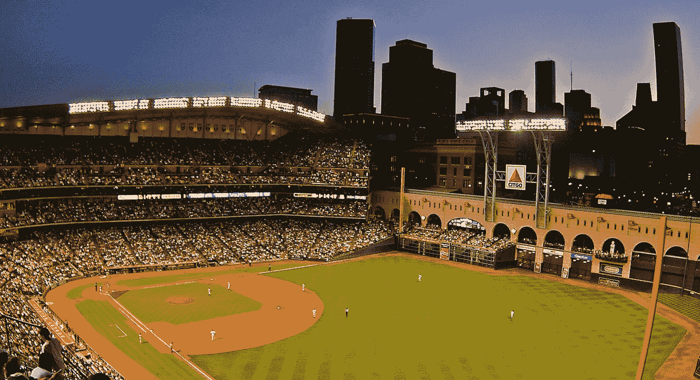
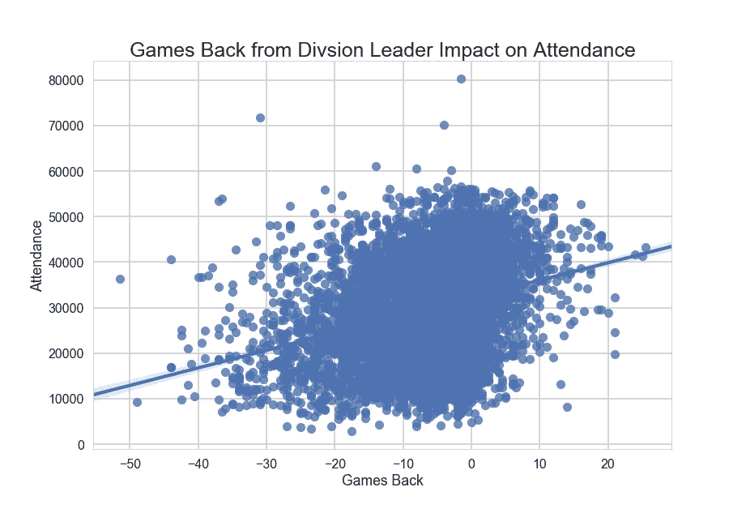
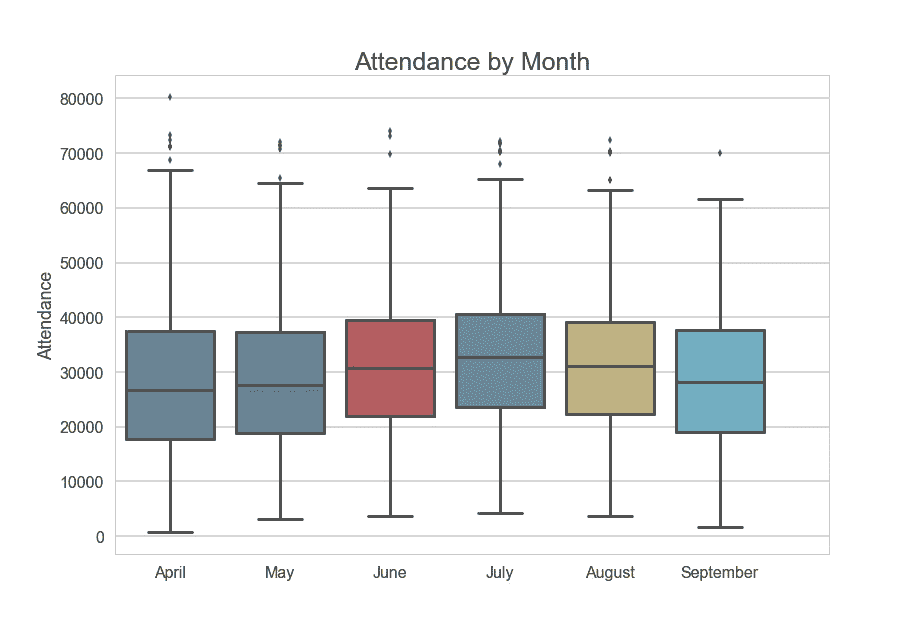
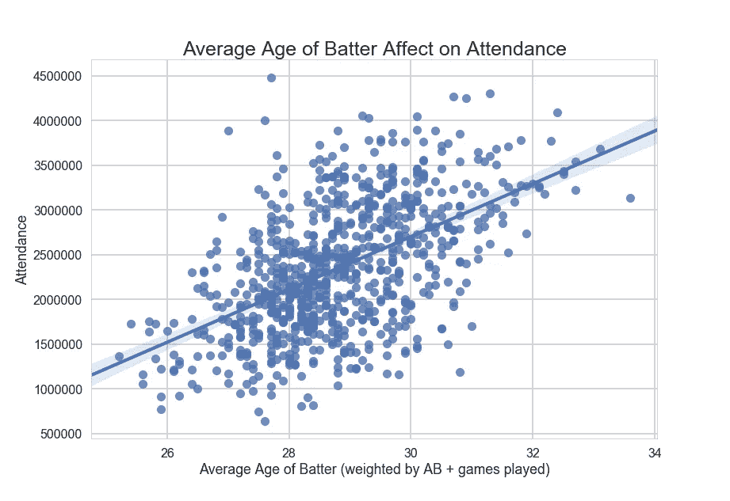
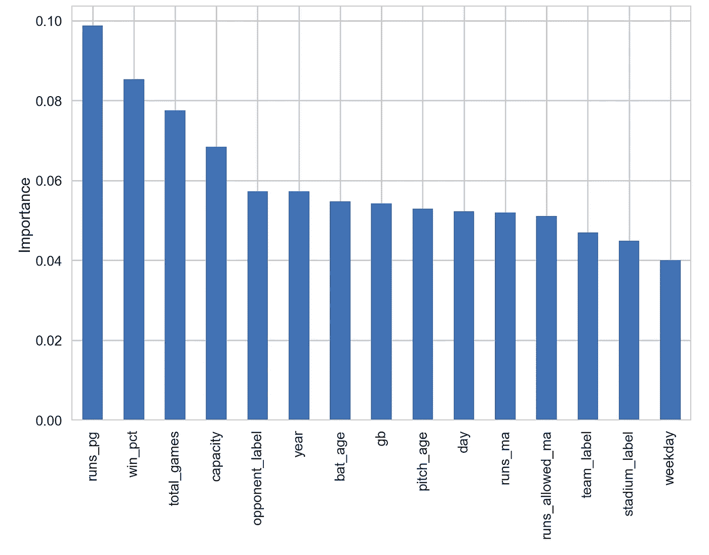

# 预测 MLB 比赛的上座率

> 原文：<https://towardsdatascience.com/predicting-mlb-game-attendance-c36cdc1b8de6?source=collection_archive---------5----------------------->

Minute Maid Park, Houston, TX

每支 MLB 球队在大约六个月的时间里每个赛季打 162 场比赛，这意味着在整个赛季中，我们很可能会看到球迷的上座率有相当大的差异。我决定看看历史比赛数据，看看哪些因素可能在球迷投票率中发挥作用，然后根据我的发现建立一个模型来预测给定比赛的上座率。当试图想象什么会影响出席率时，我想到了一些事情。第一个对我来说很明显，那就是谁在比赛，但更具体地说，主队是谁。不同的球迷群体有不同的倾向，这意味着这些球队的上座率将有不同的分布。除此之外，我还想象了许多其他因素对上座率的影响，比如球队在和谁比赛，球队在那个赛季表现如何，他们比赛的体育场的容量，一年中的时间，以及比赛在一周中的哪一天进行。

我通过刮 baseball-reference.com 收集了 1990 年到 2016 年所有 MLB 游戏的游戏数据。棒球参考有很多关于每场比赛的重要信息，例如球队在赛季中该点的记录，以及他们的连胜记录，分区排名，他们落后多少场比赛，是晚上的比赛还是白天的比赛等等。在收集数据时，我设计了一些我认为可能与出勤率相关的特征，例如球队的总体胜率、他们十场比赛的胜率、球队每场比赛的平均得分次数，以及过去五场比赛中允许的平均得分次数。Baseball-reference.com 也有每个球队的赛季总结数据，其中有有趣的信息，如该赛季球队的经理，球队的最佳球员(通过战争衡量)，以及球队球员的平均年龄(按击球手和投手细分)。

当我探索数字变量时，不出所料，我发现一个团队的表现与出勤率直接相关。这些变量包括胜率、比赛场次和分区排名，虽然它们显示出是球迷投票率的预测因素，但上座率仍有很大的差异，如上图所示。查看分类变量，一年中的时间和一周中的日期显示了粉丝出席率的不同分布。正如你在下图中看到的，游戏通常在周末和夏季更受欢迎，这并不令人吃惊。

我分析了赛季总结数据，看看是否有其他变量对出勤率有影响，我对我的发现感到非常惊讶。数据显示，球队击球手/投手的平均年龄与出勤率之间有很强的正相关关系。因此，随着球队击球手平均年龄的增加，每年的出勤率也会增加。我们可以想象一下，如果一支球队由已经在联盟呆了很长时间的球员组成，或者更好的是，在那个特定的球队呆了很长时间，那么球迷可能会喜欢那些球员，这可能会鼓励他们去看更多的比赛。平均年龄也与胜率正相关，这可能是另一个解释。

有了这些知识，我继续构建模型来预测出席率。我决定包括我所有的变量，我建立了一个随机森林回归模型，以及一个梯度推进回归模型。最终，梯度推进模型表现最佳，实现了 0.833 的 R 平方值，这表示实际出席值与拟合的回归线有多接近。下面是我的模型的特征重要性的视觉效果——是粉丝出席率的最大预测因素的前 15 个变量。与球队表现相关的变量，不出所料地出现在这里，比如每场比赛的得分，胜率，以及比赛的回报。总场次代表了一个球队赛季进行到什么程度。令我惊讶的是，团队变量并没有比原来更强的预测力。

**Feature Importances**

总之，我对我的结果感到满意，并发现这个项目非常有趣。我认为，如果建模过程是为每个团队单独完成的，它可以产生更准确的结果。至于将这些结果应用到现实世界的场景中，我相信一个团队可能会发现这些预测对于制定有效的营销或促销策略非常有用。我做了一些关于比较 MLB 粉丝基础的进一步分析，但是我必须把它留到我的下一篇文章中。

和往常一样，为了让我的分析更深入，这里有一个到我的 [jupyter 笔记本](https://github.com/tkh5044/portfolio/tree/master/capstone-predicting-game-attendance/code)的链接。我希望你喜欢这篇文章！