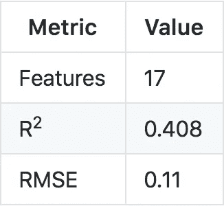
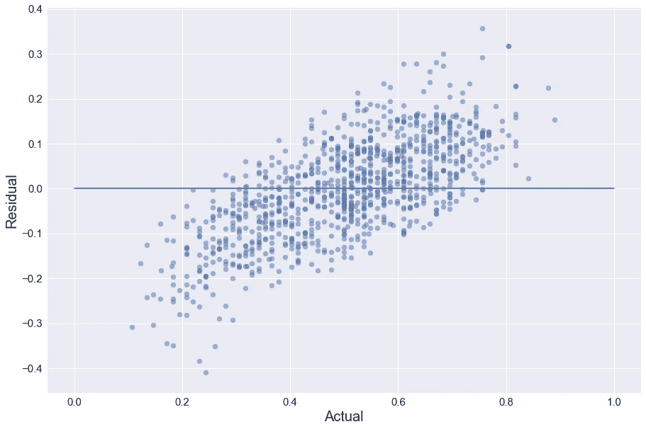

# 预测 NBA 胜率

> 原文：<https://towardsdatascience.com/predicting-nba-winning-percentage-in-upcoming-season-using-linear-regression-f8687d9c0418?source=collection_archive---------5----------------------->

我们在 Metis 的第二个项目叫做 Project Luther，它是关于网络抓取和线性回归的。

我是一个超级篮球迷，所以我立即想办法把这项运动和这个项目结合起来。经过几个小时的头脑风暴后，我决定尝试创建一个模型，在赛季开始前预测某个 NBA 球队的胜率。我的目标是尝试采用这种模式，看看是否有人可以利用它通过赌博赚钱。

# 数据采集和初始步骤

我想使用前几个赛季的球队统计数据和任何其他在赛季开始时可以得到的球队信息。我决定从网站 [basketball-reference](https://www.basketball-reference.com/) 获取我的统计数据和信息。这个网站有过去几十年每一季的大量统计数据。我最终获得了大约 40 年的各种统计数据，包括整体球队统计数据、教练信息和球员信息。我用 BeautifulSoup 从网站上搜集了这些信息。

一旦我有了一个熊猫数据框架中的数据，我立即分离出一部分数据用于最终测试。我选择搁置 2018 赛季，因为我想把我对那一年的预测与赌博数据结合起来。然后，我运行一个基线线性模型来获得一个起点。我选择的特征是上一个赛季的平均胜率，因为我觉得这可以很好地预测下一个赛季的成功。

# 微调我的模型

我的下一步是尝试运行我所有的功能在一起。这稍微增加了我的 R 值，但是我的模型现在有超过 30 个特征。我开始删除那些似乎无法改善我的模型的功能。事实证明，有相当多的功能，我可以删除，而不会降低我的 R 值非常多。

在缩小了我的特征列表后，我尝试添加多项式项，看看是否可以改进我的模型。大多数情况下没有，但有两个特定的多项式要素略微增加了 R。在我的要素工程中，我使用套索交叉验证来测试我的模型，并继续移除不需要的要素。

# 最终模型

最终，我的最终模型包含了套索正则化，并包含了球员的平均年龄、胜率、得分数、回归球员数和盖帽数等特征。

Metrics for final model

R 没有我希望的那么高，但是考虑到这个问题，这可能是可以预期的。均方根误差乍一看很棒，直到你记得我预测的是一个百分比。RMSE 相当于一个赛季 82 场比赛中的 9 场，这是相当可变的。该模型最重要的特征是胜算和玩家的平均年龄，这并不奇怪。

# 将模型应用于赌博

我的下一个问题是，这种模式可以用来赌博赢钱吗？我从一个[赌博网站](http://www.vegasinsider.com/nba/story.cfm/story/1865923)刮来了超额/欠额赌注。如果你不熟悉体育博彩，我将简要解释过度/不足投注。维加斯给每支球队在即将到来的赛季中的预期胜场数，然后你打赌这支球队会赢更多的比赛(多)或赢更少的比赛(少)。如果你最终是正确的，你就赢了。

我最初根据赌博信息测试了我对所有球队的预测，只有 50%是正确的，就像掷硬币一样。有趣的是，如果我只关注我的模型预测非常接近拉斯维加斯超额/不足数的八支球队，我的正确率为 87.5%。这看起来很棒，但在相信这个数字不是偶然之前，我想在其他年份进行测试。

# 模型错在哪里？

由于我的模型不擅长预测，我决定看看是否有具体的原因。下面的残差图表明，我的模型在实际胜率较低时预测过度，在实际胜率较高时预测不足。

我挑选了几个我的模型预测非常错误的例子，并发现有一致的原因。下表显示了球队，年份，我的预测和实际胜率的差异，以及我的预测如此错误的原因。

Examples of when model prediction was very different from actual winning percentage

总的来说，当我的模型严重高估时，球队因为某种原因失去了最好的球员。当我的模型严重低估时，球队在休赛期增加了最好的球员。虽然我的模型考虑了回归球员的数量，但它没有区分超级明星和替补球员。我相信如果我整合了这些信息，我的模型会是一个更好的预测器。