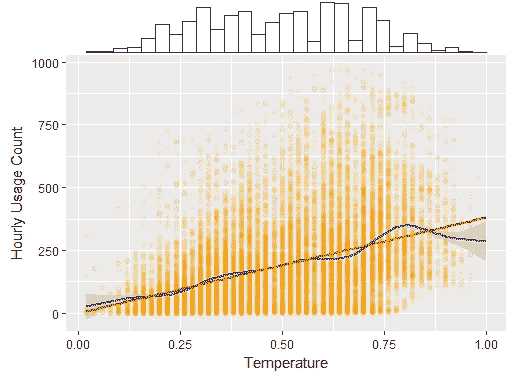
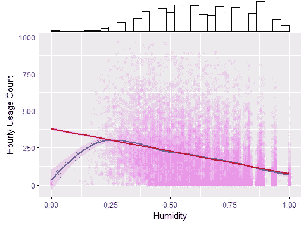
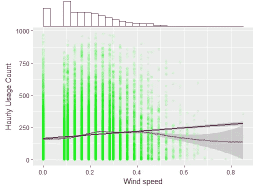
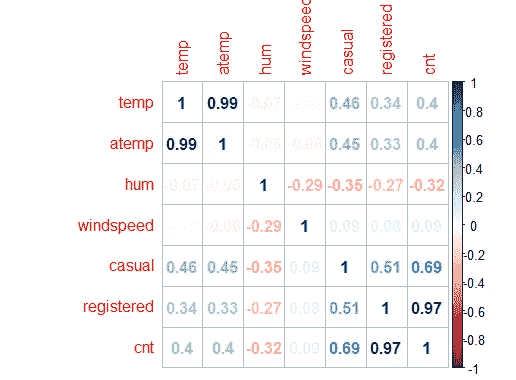
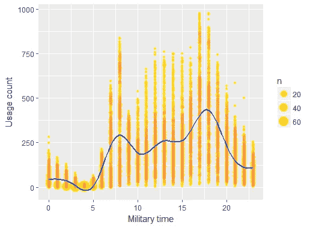
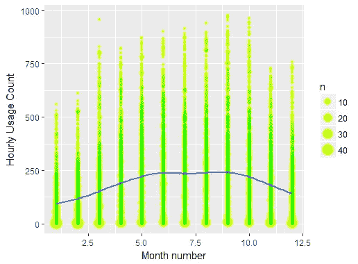
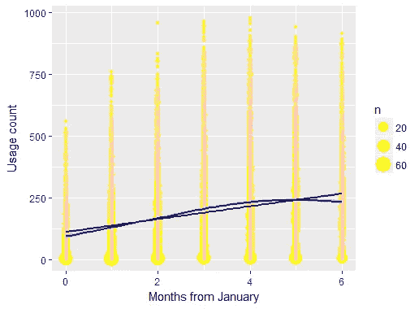
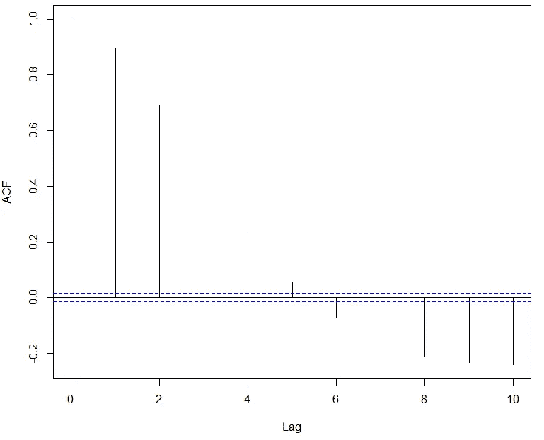
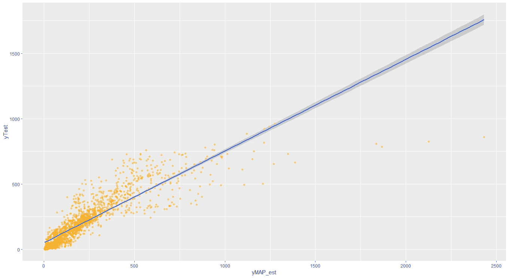
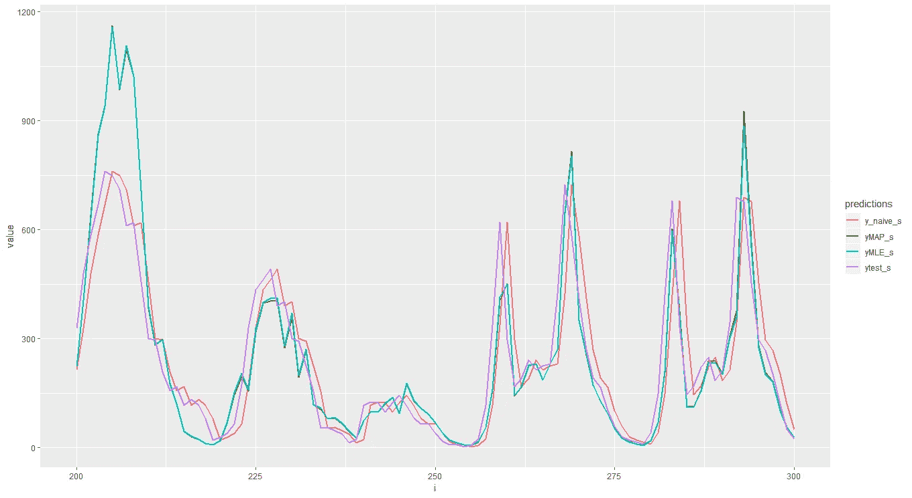

# 预测自行车共享用户的数量

> 原文：<https://towardsdatascience.com/predicting-no-of-bike-share-users-machine-learning-data-visualization-project-using-r-71bc1b9a7495?source=collection_archive---------2----------------------->

## 用监督机器学习解决的经典回归问题

# **背景**

这个项目始于我为机器学习课程( [EE 660](https://web-app.usc.edu/soc/syllabus/20173/30460.pdf) )所做的最后一个班级项目。随着我对机器学习(ML)概念和实践的理解变得成熟，我彻底更新了它，并在这个过程中将代码从 Matlab 转移到 R 中。我使用的 R 脚本、数据集和图片都可以在我的 [Github](https://github.com/nadir2115/Bikesharing-prediction-ML-Regression) 上公开获取。事不宜迟，让我们开始吧。

Photo by [Kelly Sikkema](https://unsplash.com/@kellysikkema?utm_source=medium&utm_medium=referral) on [Unsplash](https://unsplash.com?utm_source=medium&utm_medium=referral)

# 定义问题和项目目标

[**自行车共享系统**](https://en.wikipedia.org/wiki/Bicycle-sharing_system) 是一项服务，用户可以付费或免费短期租赁/使用可供共享使用的自行车。目前，全世界有超过 500 个自行车共享项目。此类系统通常**旨在通过在城市地区提供免费/负担得起的自行车短途出行，而不是机动车，来减少拥堵、噪音和空气污染**。对于这样的系统，任何一天的用户数量都可能有很大的变化。预测每小时用户数量的能力可以允许监管这些系统的实体(企业/政府)以更高效和成本有效的方式管理它们。我们的**目标**是使用和优化机器学习模型，这些模型能够有效地**预测在任何给定的 1 小时时间段内将使用的共乘自行车的数量，**使用关于该时间/天的可用信息。

# **使用的数据集**

我们使用的数据集来自加州大学欧文分校的[机器学习库](https://archive.ics.uci.edu/ml/datasets/bike+sharing+dataset#)。数据集编制者使用了华盛顿首都自行车共享系统 2011 年和 2012 年两年历史日志中的部分信息。该信息[可公开获得](http://capitalbikeshare.com/system-data)。编译器每小时和每天汇总数据(供任何有兴趣深入研究的人使用)。接下来，他们从这里提取并添加所有相应的天气和季节信息[。](http://www.freemeteo.com)

我们的数据集是一个 csv 文件(可在 my [Github](https://github.com/nadir2115/Bikesharing-prediction-ML-Regression) 上获得),包含 731 天中 17，379 个小时的信息，每个小时有 16 个特征(信息类别)。其特点是:

1.  *记录索引*
2.  *日期*
3.  *季节(1:春天，2:夏天，3:秋天，4:冬天)*
4.  *年份(0: 2011，1:2012)*
5.  *月份(1 至 12)*
6.  小时(0 到 23)
7.  *节假日:当天是否为节假日*
8.  *工作日:一周中的某一天*
9.  *工作日:如果一天既不是周末也不是节假日，则值为 1。否则为 0*
10.  *天气情况:
    — 1:晴，少云，局部多云，局部多云
    — 2:雾+多云，雾+碎云，雾+少云，雾
    — 3:小雪，小雨+雷雨+散云，小雨+散云
    — 4:大雨+冰盘+雷雨+雾，雪+雾*
11.  *以摄氏度为单位的归一化温度。数值分为 41(最大值)*
12.  *归一化的感觉温度，以摄氏度为单位。数值分为 50(最大值)*
13.  *归一化湿度。这些值分为 100(最大值)*
14.  *归一化风速。这些值被分为 67(最大值)*
15.  *临时用户计数*
16.  *注册用户数*
17.  *租赁自行车总数，包括休闲自行车和注册自行车*

从一开始看，数据点远远超过特征的数量，这使得这是一个“瘦”数据集，被认为是 ML 的理想选择。

# 探索性数据分析

在开始用算法处理数据集之前，直观地探索它总是一个好主意。本项目我们将使用****。使用 [**ggplot2**](https://cran.r-project.org/web/packages/ggplot2/ggplot2.pdf) 和[**gg extra**](https://cran.r-project.org/web/packages/ggExtra/README.html)**包，我们可以快速绘制一些图表来研究可用功能如何影响自行车使用计数。现在我们来看一些图表。******

************

********Scatter plot- Adjusted Temperature vs Usage********

************

********Scatter plot- Temperature vs Usage********

******从上面的散点图可以看出，在大部分温度范围内，使用温度和调整温度之间存在正相关关系，线性拟合与最佳拟合曲线相差不远。这在直觉上应该是有意义的，因为人们不太可能在寒冷的天气骑车外出。对于最高温度，这似乎是数据的一个小的子集，在这条曲线上有一个下降。同样，这应该是有意义的，因为当外面太热时，用户也可能不愿意骑自行车。******

************

********Scatter plot- Humidity vs Usage********

******湿度和使用率之间似乎存在负相关，线性拟合非常接近所有数据的最佳曲线拟合(排除一些湿度非常低的异常值)。这可以用 DC 华盛顿州的气候来解释，那里的气候是出了名的潮湿。较高的湿度与较高的降雨机会相关。我们还可以假设，由于高湿度而增加的排汗会阻止人们在户外骑自行车。基于目前为止的想象，我们假设天气状况会影响自行车的使用，降雨会阻碍自行车的使用，这并不是不合理的。我们下面的图表在一定程度上支持了这个假设。从直方图(在 x 轴上)中注意到，晴天(天气等级 1)比阴天或雨天(天气等级 2 或 3)多得多。******

************

********Scatter plot- Weather Situation vs Usage********

************

********Scatter plot- Wind Speed vs Usage********

******然而，查看风速数据并不能给我们一个关于它如何影响使用的清晰解释。这两个因素之间的相关性充其量是微弱的。下面是到目前为止讨论的所有连续变量的相关矩阵，它为我们观察到的趋势增加了一些数字。******

************

********注意:**有趣的是，临时使用计数与连续变量更相关，并且与我们之前的假设更一致。如果我们想一想，这是有道理的，因为使用自行车上下班的注册用户不太可能受到不舒服的天气条件的影响。我们可以得出这样的结论:分别预测这两个计数，然后将计数相加得到总计数，这样更有意义。然而，当我尝试这样做时，我发现最终的预测不如我们简单地预测总计数得到的准确。因此，对于项目的其余部分，我们将忽略注册的和临时的计数，只将总计数作为输出。如果你愿意，你可以在我的 [Github](https://github.com/nadir2115/Bikesharing-prediction-ML-Regression) 上访问数据集和我的代码，并尝试包含这些变量，看看你是否能找到更好的结果。继续下一点。让我们来看看时间和日期是如何影响使用的。******

********

****从时间的影响来看，使用率最低的似乎是深夜(凌晨 4-5 点之间最低),高峰是上午 8-9 点和下午 5-7 点，这是 DC 的高峰时段。这种拟合远远不是线性的。但是，通过一些简单的数据操作(下一节将详细介绍)，我们可以根据到凌晨 4 点的时间距离来表示使用率，并找到某种程度上的线性拟合(见下文)。
*注意:具有线性预测结果的特征是理想的，因为它减少了对复杂的非线性 ML 算法的需要。*****

********

****在月份与使用情况图(如下)中也可以观察到类似的趋势，在夏季较温暖的月份使用率明显较高，而在一月份使用率最低。通过类似于上一个图的一些操作，该数据也可以用于表示基于到一月份的时间距离的使用情况。然而，这种相关性没有被操纵的时间图那么强。****

****************

****最后，查看“年份”变量(如下)，可以看到使用率从第 1 年到第 2 年上升，这可能表明该系统越来越受欢迎。使用此变量时需要注意的一个重要事项是，尽管它在提供的年份范围(2011-12 年)内进行预测时可能有用，但该算法必须进行大量外推才能预测它对未来日期(2018 年及以后)的影响，这可能会使此变量成为不同时间段的不太可靠的预测器。****

********

# ******预处理:数据清理&特征工程******

****对于任何 ML 项目，预处理数据都是至关重要的一步。该过程通常是广泛遵循的预处理实践的积累，以及根据模型设计人员的判断对数据进行的特定案例调整。如果数据争论不正确或不充分，它可能导致训练不当的 ML 算法提供不准确或(充其量)次优的结果。古老的谚语“垃圾进来，垃圾出去”在这里很适用。这个过程的一个重要部分是特征工程，它包括将可用的数据特征转化为更有用的变量，帮助我们预测结果。让我们走一遍我们正在采取的步骤:****

1.  ****使用先验知识来删除不添加重要信息的特征，在这种情况下，这只是“索引”特征。****
2.  ****从日期中提取星期数。在所提供的格式中，日期本身不是我们的算法可以处理的。但是，从这个日期开始，我们可以提取周数(对于特定的年份)并使用该变量作为使用计数的预测值。****
3.  ****[一个热编码](https://hackernoon.com/what-is-one-hot-encoding-why-and-when-do-you-have-to-use-it-e3c6186d008f)，这是将非二进制分类特征(月、周数、小时、天气状况、季节、工作日)分割成多个二进制子特征的过程，其中每个子特征指示原始特征的某个类别是否为真(1 或 0)。如果可能的话，在不使数据集变得“胖”的情况下，最好将每个多分类特征分成多个二进制特征。由于我们有一个包含 17，000 多个数据点的大规模数据集，我们可以扩展这些功能，并且仍然有一个“瘦”数据集，这样我们就不会有过度拟合的风险。请注意，这确实显著增加了我们的数据集的维数，并增加了我们的计算时间，其系数大于 5X。由于我们在这个项目中只使用非复杂的回归算法，我们可以增加计算的复杂性，以提高预测的准确性。****
4.  ****修改循环变量值以表示距单个时间点的时间距离。正如我们在数据可视化部分看到的，对于循环变量(月/周-数字/小时)，试图找到变化值的精确线性模式可能很困难。尽管第 1 周中的数据点在时间上非常接近第 53 周中的数据点，但是与第 53 周相比，第 1 周的最佳线性模型拟合在第 1 周中可能具有非常不同的值。我们通过更改这些值来表示与固定时间点的时间距离来解决这个问题。根据我们在探索性数据分析部分的发现，将基本时间点设置在最少使用时间是合理的。因此，我们使用的时间距离是从凌晨 4 点开始计算小时，从一月中旬开始计算星期和月份。****

# ****说明时间序列的随机性****

****到目前为止，我们一直在处理时间序列数据的确定性方面。对于那些需要复习的人来说，[确定性系统](https://en.wikipedia.org/wiki/Deterministic_system)是一个在系统未来状态的发展中不涉及随机性的系统。换句话说，确定性模型总是从给定的起始条件或初始状态产生相同的输出。另一方面，如果一个系统是[随机的](https://www.cds.caltech.edu/~murray/courses/cds101/fa02/faq/02-10-07_stochastic.html)，这个系统的一个或多个部分也具有随机性。我们观察到的大多数时间序列数据通常最好用确定性和随机成分的组合来建模。到目前为止，我们一直在处理我们的模型的确定性方面。现在让我们来看看建模的随机性。****

****将一个[自回归模型](https://en.wikipedia.org/wiki/Autoregressive_model)整合到我们的特征中是一种解决系统中随机性的简单方法。这是基于这样一个假设，即任何给定小时的用户数取决于之前特定小时数的用户数。这种假设在时间序列数据中通常是有效的。****

*******Ex****:Y(t)= B0+B1 * Y(t-1)+B2 * Y(t-2)+*…****

****然而，为我们的模型选择正确数量的滞后值是很重要的。[自相关](https://en.wikipedia.org/wiki/Autocorrelation)是指一个时间序列中的观测值相互关联的方式，通过当前观测值(Yt)与当前观测值之前的 p 个观测值(Y(t-p))之间的简单相关性来衡量。R 中的自相关函数(ACF)告诉我们当前值和滞后值之间的自相关，并允许我们决定在模型中包含多少滞后值。****

********

****ACF results on the count per hour****

****不出所料，在一小时内的用户数和之前的 2 个滞后值之间确实存在强正相关，在一小时内的用户数和第 3 个滞后值之间存在中等正相关。因此，我们**将 3 个滞后值添加到我们的数据集，作为新特征**。****

****我们最终用 **117 个特征**从 **17，377 个数据点**中预测**每小时自行车使用量**。****

# ****应用机器学习算法****

****对于这个项目，我们将使用两个比较著名的回归算法:**最大似然估计**和**最大后验概率**。对于线性回归，我们感兴趣的是找到最佳的参数/权重， ***w*** ，使得给定我们的特征，***X*** ，我们的预测结果，****Y _ predict = X***w***，尽可能接近真实结果， ***Y_test********

********关于构造训练+测试集的注意事项:*** *在大多数回归问题中，当我们在查看横截面数据时，我们会在选择训练和测试集之前随机化数据点的顺序。然而，当我们处理时间序列数据时，我们必须进行时序检验，因为时间序列排序很重要。我们不能在我们的数据中间切出一块作为测试集，并在这部分之前和之后的数据上进行训练。我们需要在一组比测试数据更老的数据上进行训练。******

*****R 和 Python 中的包允许我们用两三行代码方便地应用 ML 算法。虽然这种方法有其优势，但我认为理解 ML 算法背后的基本统计和概率概念也很重要，以便更好地理解我们的结果。与神经网络等更复杂的模型不同，我们将使用的算法更容易理解和解释。因此，我将非常简要地介绍一下他们每个人正在做什么，如果你愿意，你可以查看我在 [Github](https://github.com/nadir2115/Bikesharing-prediction-ML-Regression) 上的注释代码，一步一步地了解我们正在做什么。*****

# *******1)最大似然估计*******

*****[最大似然估计](https://en.wikipedia.org/wiki/Maximum_likelihood_estimation) (MLE)用于估计概率分布设置中的某个变量。假设我们有一个似然函数， ***P(D|w)*** 。这是拥有我们整个数据集的可能性， ***D*** ，给定某个符合数据集特征的 **w** ， ***X*** ，到数据集结果， ***y*** 。当我们对 ***w*** 进行 MLE 时，我们试图推断的参数是:
***w _ MLE****=***argmax w****P(D | w)*********

******换句话说，我们要找到最大化可能性的 ***w*** ， ***P(D|w)。*** 从这里开始，我们可以做一点线性代数，想出一个我们需要的 [**成本/损失函数**](https://en.wikipedia.org/wiki/Loss_function) ，以便计算出最佳权重，然后使用导数最小化这个函数(回忆微积分)来寻找最佳权重。有了几个[基本假设](https://www.albert.io/blog/key-assumptions-of-ols-econometrics-review/)，我们可以使用下面公式中总结的一种叫做 [**普通最小二乘法(OLS)**](https://en.wikipedia.org/wiki/Ordinary_least_squares) 的方法找到最佳参数/权重:******

************

******Ordinary Least Squares formula******

******使用 OLS，我们在称为**训练集**的数据子集上找到最佳参数。然后，我们在不同的独立数据子集上测试这些参数，称为**测试集**，以查看我们的预测 yMLE 与实际输出 yTest 相比如何。******

******我在这里有意加快了数学步骤，因为:a)有免费的在线资源比我更深入地解释了这些方法，b)在本文中，我们更关注这些算法的应用，而不是它们如何工作背后的统计数据。请注意，您需要对微积分、线性代数和概率分布有扎实的理解，才能彻底理解 MLE 或 MAP。******

# ******2)最大后验概率******

******除了 MLE，我们还将尝试另一种叫做[最大后验概率(MAP)](https://en.wikipedia.org/wiki/Maximum_a_posteriori_estimation) 的方法。地图由贝叶斯统计得出，贝叶斯统计是一个基于**贝叶斯定理**的统计领域:******

************

******与基于频率统计的 MLE 不同，MAP 基于这样一种观点，即假设我们对分布有一些有用的先验知识。顾名思义，这适用于后验分布，而不仅仅是可能性。从上面的公式中，我们可以导出由以下公式定义的后验分布:******

*********P(w | D)=(P(D | w)* P(w))/P(D)*********

******假设 ***P(D)*** 或者我们的数据集的分布保持不变，我们可以得出结论:******

*********P(w | D)***∧***P(D | w)* P(w)*********

******第一部分， ***P(D|w)*** ，就是我们之前处理过的可能性项。并且我们假设 ***P(w)*** 遵循高斯分布，使得:******

************

********weights/parameters are assumed to follow a Gaussian distribution********

******由于我们实际上没有任何关于权重的先验信息，我们不知道权重分布应该遵循什么样的 **m_w** (均值)或**τ平方**(方差)。因此，我们使用嵌套的 for 循环来尝试这些术语的值的一千种不同组合，以在我们的**验证集上测试我们的算法。**验证集最好定义为训练集的子集，用于在最终测试集上测试参数之前微调参数。遵循我们为 MLE 概述的线性代数、微积分和概率步骤，我们发现每个训练集的*由以下公式计算:*******

**************

*******在对验证集的参数进行微调后，我们使用测试集特征上的这些参数来预测地图结果，并将这些预测与 yTest 值进行比较。*******

# *******评估结果和模型的性能*******

**************

*********Scatter plot of MLE predictions for y VS real yTest values*********

**************

*********Scatter plot of MAP predictions for y VS real yTest values*********

*********汇总统计评测:
*MLE*** 运行时间:0.70 秒
中值预测误差:27.05
平均预测误差:56.53
R 平方值:0.65*******

*********图*** 运行时间:258.36 秒
中值预测误差:27.93
平均预测误差:57.85
R 平方值:0.63******

******一个有用的方法是将我们的模型的性能与[天真的预测](http://www.businessdictionary.com/definition/na-ve-forecasting.html)进行比较。简单预测是一种估计技术，其中上一期的值用作本期的预测，没有任何试图建立因果关系的调整。******

********朴素预测模型** 中位预测误差:37
平均预测误差:69.9
R 平方值:0.65******

************

********Examining how MLE, MAP and Naive Forecast predictions vary from the real data using a sub-set of the Test data********

# ********讨论********

******从上面的图和值可以看出，MAP 和 MLE 给出了非常相似的结果，正如我们在没有任何关于我们试图导出的目标函数的先验信息的情况下使用 MAP 时所预期的那样。我们发现我们的预测误差中值约为 27，预测误差平均值约为 57。这明显优于朴素预测模型，朴素预测模型的中值预测误差为 37，平均预测误差为 69.9。请注意，用户计数的总体范围是从 0 到几乎 800。******

******两个模型和原始预测的 R 平方值约为 0.63-0.65。因此，当看这个指标时，我们的模型并不比天真的预测表现得更好。穿过散点图的最佳拟合线非常接近理想值，即穿过原点的梯度为 1 的线。请注意，我们的预测没有一个小于零，因为我们假设使用计数遵循[泊松分布](https://en.wikipedia.org/wiki/Poisson_distribution)，并且我们使用了[泊松回归](https://en.wikipedia.org/wiki/Poisson_regression)模型。******

******进一步研究一下，让我们看看我们的测试数据的一个子集，它只有 100 个数据点。我们看到，当总使用计数较低时，MAP 和 MLE 都可以很好地预测用户计数，但当使用计数超过 450 时，就不那么好了。这些点导致具有大误差的异常值，这解释了为什么我们的平均误差比中值误差大得多。******

******考虑到我们的中值和均值误差比天真的预测低得多，我们可以得出结论，我们已经创建了预测每小时自行车共享用户数量的有效模型。当然还有进一步改进的空间，尤其是在用户数量较高的时段。因此，如果您对如何改进这些模型有任何建议，请随时告诉我。我们在这里的工作到此结束。感谢您的阅读。******

******如果你已经做到了这一步，我希望你能像我喜欢写这篇文章一样喜欢读这篇文章。我也希望你比以前更了解探索性的数据分析和机器学习。如果你认为这对你认识的人来说是有趣或有教育意义的，请与他们分享。如果你喜欢这篇文章，有什么想和我分享的，请随时评论或通过电子邮件联系我，地址是 nadir.nibras@gmail.com 或 https://www.linkedin.com/in/nadirnibras/**。我致力于改进我的方法、分析或数据集，所以如果你有任何建议，请告诉我。如果你想关注我在数据科学方面的更多工作，请在 Medium 和 Linkedin 上关注我。
如果你是数据科学或其在理解世界中的应用的粉丝，请联系我。和其他统计爱好者聊天总是很有趣，我很乐意在项目上合作:)********