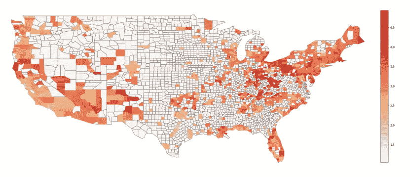
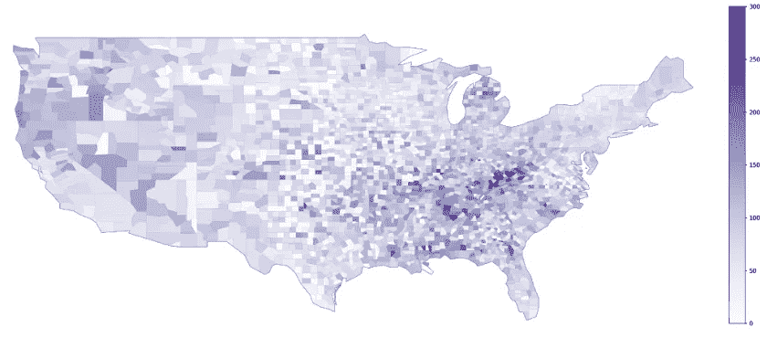
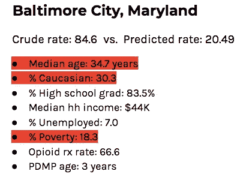
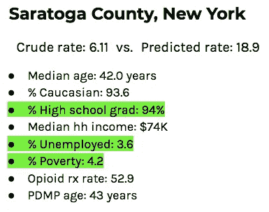

# 预测美国各县的用药过量死亡率

> 原文：<https://towardsdatascience.com/predicting-overdose-mortality-per-us-county-8ec0871004a7?source=collection_archive---------11----------------------->

# 背景和动机

阿片类药物的流行已经成为这一代美国人的主要公共健康灾难之一。类似于烟草/吸烟或艾滋病毒/艾滋病对前几代人的影响，阿片类药物的流行似乎是这个时代的决定性公共健康危机。我想看看是否有可能建立一个模型来预测一个县一个县的阿片类药物相关死亡率，因为这种类型的模型可能会让我们深入了解在哪里以及如何进行干预。

我怀疑，美国受危机影响最大的地区的相当大的差异可能可以用人口或经济因素来解释，但我实际上更好奇的是，其他更容易修改的预测因素是否会变得重要。例如，常见的说法是，阿片类药物危机始于 20 世纪 90 年代医生开始更自由地开阿片类止痛药，部分原因是制药公司向医生保证这些止痛药成瘾性低，副作用少，但这两者都不是事实。但是阿片类药物处方率仍然是阿片类药物过量死亡的主要驱动因素吗？还是有其他变量是更强的预测因素，例如，海洛因或芬太尼等非法阿片类药物的量可能是更强的预测因素？

# 设计

该项目的目标是使用多元线性回归模型预测定量目标变量。该项目的设计相当简单:确定一个适当的目标变量，然后找到公开可用的数据集，这些数据集将提供我认为有用和适当的预测信息。然后，我计划使用这些独立变量/预测因子建立一个多元线性回归模型，然后进行特征选择，以查看哪些预测因子是最重要的。最后，我在维持测试数据集上测试了该模型，以查看该模型的性能如何。

# 数据

在探索了 CDC 对他们公共数据库的描述后，我决定使用 CDC WONDER 数据库来刮取我的目标变量，即 2016 年每个县因药物过量而导致的粗死亡率。关于使用这个作为目标变量的决定的一些评论:我最初想预测每个州的死亡率，但那只会给我 50 个记录。CDC MCD(多种死亡原因)数据库实际上允许您查询具体由于阿片类药物过量导致的死亡(您甚至可以更具体，例如查询由于海洛因、阿片类镇痛剂和其他类型的阿片类药物导致的死亡数量)，但对于个别类别来说，数字变得如此之小，以至于更容易获得由于药物过量导致的总体死亡率的实际数字，而无需指定药物类型。这是因为当每个县的总死亡人数在 10-20 之间时，CDC 会给你死亡人数，但不会计算粗略或经年龄调整的死亡率，因为他们声称这个小数字导致“不可靠”的统计数据。如果总死亡人数在 0-9 之间，那么他们根本不会给出一个数字，而是会声明结果是“被抑制的”，因为在一个小县的少量死亡人数，可能会识别出个别患者。

因此，最容易获得每个县因药物过量而导致的粗死亡率数据，可用的最新数据集是 2016 年。从统计学上来说，比较年龄调整死亡率会更准确，但 CDC 没有提供任何县的年龄调整死亡率，因为它给出了“不可靠”的结果(10-20 岁之间的总死亡人数)，而且没有每个年龄段死亡人数的具体细分，我无法直接计算年龄调整死亡率。看起来确实有间接计算年龄调整死亡率的方法，但我决定继续使用粗略死亡率，然后使用每个县的中位年龄作为预测值，作为一种粗略的方法来说明这一点。这意味着即使美国有大约 3000 个县，因为我最终有 1000 个记录(没错！)实际上可以计算出这些县的粗略死亡率。

Overdose-related crude mortality rate per 100,000 in 2016

就我的自变量而言，大致来说，它们分为 4 类:

人口统计学的

*   白种人百分比
*   %高中毕业或以上(指至少高中毕业的人的百分比)
*   年龄中值

经济的

*   家庭收入中位数
*   贫困百分比
*   失业率%

医学的

*   该州的 PDMP 年龄(处方药监控计划)
*   每 100 人阿片类药物处方率

地理学的

*   美国人口普查地区部

人口和经济数据都是使用美国人口普查 API 查询 ACS(美国社区调查)5 年 2016 数据集获得的。确定要查询哪个美国人口普查数据集，然后确定如何构建查询，这无疑是一个学习过程。美国人口普查提供了如此多的信息，看起来似乎有可能获得你想要的精确、具体记录的极其细粒度的查询，但缺点是，一开始弄清楚如何提取甚至简单的数据是相当困难的！无论如何，在查看了我的预测值的配对图后，我意识到我得到的经济数据彼此之间具有相对较高的相关性，例如%贫困和%失业，尽管它们测量的不是完全相同的东西，但它们显然彼此相关。我认为这可能是导致共线性的一个大问题，但回想起来，我认为拥有所有这些变量实际上是没问题的——当我到达结果部分时，我将讨论我认为设计一个结合经济信息的变量可能对构建更好的模型更有用。

每 100 人的阿片类药物处方率来自 CDC，CDC 向[表](https://www.cdc.gov/drugoverdose/maps/rxrate-maps.html)提供了过去十多年来每个县每 100 人的年度阿片类药物处方率。一些数字令人瞠目结舌；在弗吉尼亚州诺顿县，2014 年每 100 人有 563 份阿片类药物处方。没错，那个县的人均阿片类药物处方超过 5 张！许多县的数字没有提供，所以我最后用该州的平均比率来代表这些数字。我加载了 2014 年、2015 年和 2016 年每个县的处方率，当查看相关矩阵时，2014 年的处方率与死亡率具有最强的原始相关性，因此我最终使用 2014 年的阿片类药物处方率而不是其他年份作为我的预测器。由于每年的处方率非常相似，因此没有必要包括所有 3 年。

Opioid prescription rate per 100 people in 2014

处方药监控计划是州级计划(密苏里州除外！)收集和监测关于某些药物处方的信息，特别是阿片类药物和苯二氮卓类药物。不同的州在不同的年份实施了 PDMPs，在 2000 年代，许多州开始实施电子 PDMPs，以便医生、药剂师和其他机构可以访问这些数据。从处方提供者和药剂师的角度来看，PDMP 的主要目标之一是防止患者“逛医生”和去多个提供者那里收集大量阿片类药物或苯并咪唑类药物的处方。如果 PDMPs 真的对减少阿片类药物过量处方有很强的作用，那么希望这可以转化为较低的阿片类药物过量死亡率，因此人们可以假设，总的来说，在有较老的 PDMPs 的州，过量死亡率会较低。

最后，我认为地理区域也可能是粗死亡率的一个有用的预测指标，因为这个国家的一些地区比其他地区受到的打击更大。人们可能会争论如何细化，例如时区、区域、部门，甚至是州与州之间的划分(尽管对于州来说，问题在于州与州之间的大小差异很大)。我最终使用了美国人口普查的地区划分，因为这似乎是宏观/微观之间的一个很好的折衷，因为有 10 个地区。这最终被编码为伪变量，为了避免伪陷阱，我删除了“新英格兰”区域的伪变量。

# 算法

我们被分配使用的模型是多元线性回归模型。这可以使用 sklearn 或 statsmodels 直接实现，尽管 statsmodels 提供了更多关于模型的信息。考虑到所有的预测因素，我认为 R 平方在 0.3 左右。Damien 然后帮助我使用 sklearn 的多项式特性转换预测因子，以生成二次组合，然后将预测因子的数量从 16 个(8 个定量预测因子，8 个虚拟变量)增加到 53 个，包括定量预测因子的所有交互项。这将整个数据集的 R 平方增加到大约 0.43，这清楚地表明相互作用项确实提供了信息。

下一步是执行特征选择。我最后尝试了两种方法，带交叉验证的后向淘汰法，在每一轮中，每个交叉投票选择一个系数 p 值最高的变量，然后我去掉投票最多的变量。我选择的最终模型是平均验证误差最小的模型。我尝试的另一个策略是使用 sklearn 的 LassoCV 进行特征选择；我再次选择了验证误差最小的套索模型。

有趣的是，LassoCV 和逆向排除法都选择“年龄”作为最重要的预测因子，但之后的四个最重要的预测因子是不同的。此外，逆向排除法选择了几个相当重要的虚拟变量，而 lasso 仍然将它们包括在最终模型中，但它们不那么重要了。他们都给出了相似的 R2 值，大约 0.41 到 0.42，以及大约相同的验证 MSE，0.17 到 0.18。两个模型的最终维持测试数据集的测试 MSE 也大致相同；对于逆向淘汰模型，它是 0.181，对于套索模型，它是 0.184。

# 工具

为了获得预测值和目标变量数据，我对没有提供 API 的变量使用了 Selenium 和 BeautifulSoup，然后对他们的数据使用了美国人口普查 API。清理数据是在熊猫身上完成的，为了进行分析，我使用了 sklearn 和 statsmodels。

# 结果

我查看了两个模型中值最大的前 5 个正系数。如下图所示，它们非常相似。反向消除包括组合系数“家庭收入中位数 x 阿片类药物处方率”，而 lasso 包括“%贫困”，但除此之外，它们共有 4 个共同的系数。不出所料，阿片类药物的处方率是前五个积极的预测因素之一，尽管我没有包括任何关于非法药物使用的数据，如海洛因、芬太尼等。我不清楚非法药物使用或处方药是否是过量死亡的更强预测因素。我确实认为组合预测很有趣。家庭收入中值乘以失业率是一个强有力的正预测因子，比任何一个单独的特征都强，这有点奇怪，因为你会认为如果家庭收入中值上升，失业率就会下降，它们会相互抵消。但这可能不是一个真实的假设，因为如果有收入不平等程度高的县，富人变得更富，家庭收入中位数可能会上升(特别是在有收入的家庭)，但失业率也可能上升，因为社会经济光谱相反一端的人也可能同时失业。

我还在完整的数据集上重新调整了向后消除，然后将残差映射到 choropleth 图。我想看看这个模型是否有高估或低估粗死亡率的地理模式。上面的 choropleth 地图是使用 GeoPandas 创建的，geo pandas 是一个为处理空间和地理数据而构建的模块，并带有绘图方法以允许制图。然而，有另一个叫做 follow 的库，它允许你创建交互式地图，并把它们保存为 html 页面，所以我用 follow 创建了一个剩余地图。不幸的是，我不能将互动地图嵌入到一个中等帖子中，但如果你感兴趣，链接是[这里](https://rawgit.com/jl56923/project_2/master/pics/resid_map.html)。粉红色表示模型高估了该县的用药过量死亡率，而绿色表示模型低估了死亡率；颜色越深，残差越大。

在查看残差数据框架并按残差大小排序后，我可以看到具有最大正残差(意味着模型对真实粗死亡率的低估最严重)的县是马里兰州的巴尔的摩市。负残差最大的县(意味着模型的高估程度最差)是纽约州的萨拉托加县。

如你所见，该模型低估了巴尔的摩的真实过量死亡率 64 人/100K！在萨拉托加县，它被高估了一个较小的数量级，但我认为查看这两个异常值的每个要素的值是很有趣的，因为我认为它提供了一些关于为什么模型对这些县不太适用的见解。首先，我没有意识到美国人口普查局认为巴尔的摩市是自己的县，但它显然是这样的，与该国其他地区相比，巴尔的摩的白人人口比例非常低，请记住，白人比例在向后排除和 lasso 线性回归模型中是第二或第三重要的预测因素。2016 年贫困率为 18.3%，而全国贫困率为 12.7%。最后，巴尔的摩的中位年龄低于全国的中位年龄 38 岁，而且由于年龄是两个模型中最重要的预测因素，这也可能导致模型低估了用药过量的死亡率。

对于萨拉托加县，高中或更高学历的比例显然相当高，达到 94%。同样，失业率%和贫困率%都是全国平均水平；就贫困率而言，你可以看到它比 12.7%的全国贫困率低很多。

我认为，观察这些异常值告诉我，我的模型缺少某种整体经济福祉/繁荣或整体生活质量衡量指标，这可能没有在二次多项式回归的交互项中得到充分体现。巴尔的摩因其高犯罪率而臭名昭著，我认为非法阿片类药物肯定有可能是过量死亡的驱动因素，但该模型无法使用，因为我没有包括任何数据来源。在光谱的另一端，在查找了一些关于萨拉托加县的信息后，它显然是纽约州北部“技术谷”的中心，有大量的国际高科技和电子公司在那里设有校区，这也可以解释它的高教育率和低贫困率和失业率。创建包含更多经济变量(例如教育率 x 贫困率 x 失业率)的交互项可能会为模型带来更大的预测能力。

通过查看残差图，我注意到的另一件事是，该模型似乎倾向于低估城市县(或至少包括主要城市的县)的死亡率，而高估了非城市县的死亡率。我确实考虑过将美国人口普查的 2013 年城市/农村分类纳入我的模型，但人口普查提供的数据并不是哪些县是“城市”和哪些县是“农村”的一对一映射，当我想到这一点时，已经接近这个项目的截止日期，并且需要花费太长时间来弄清楚如何对信息进行编码。

# 结论

我从这一分析中得出的总体结论是，使用我选择的预测因子来解释用药过量死亡率的一些差异是可能的，但我制作的模型肯定不能解释所有的差异。模型的学习曲线表明，它们处于高偏差状态，我仍然对数据拟合不足，需要更多的特征。同样，我认为找到能提供不同国家非法阿片类药物流动信息的数据源将是有用的，我认为特征工程提出一个更全面的变量来捕捉整体生活质量或经济繁荣将是有用的。此外，该模型在城市和农村的表现之间似乎确实存在差异，因此添加这一功能也可能会增加该模型的预测能力。

我的大多数预测因素是经济或人口数据，但如果我要扩展模型，我认为真正有趣的是使用不同的公共卫生干预措施作为下一年过量死亡率的预测变量，看看这些干预措施的存在与否(或年龄)是否是死亡率的强负预测因素。许多州和县正在尝试不同的干预措施，例如发布纳洛酮命令，使用“活体控制法庭”，开设美沙酮诊所等。我试图通过在我的模型中使用 PDMP 的年龄来做到这一点，但它不是一个强有力的预测器。我认为这方面的一个问题是，我获得信息的 PDMP 网站给出了任何 PDMP 开始的年份，但提供商和药剂师可以实时查询的电子 PDM 直到 2000 年才真正开始，因此 PDM 可能至少在那之前无法影响向公众发布的阿片类药物的实际数量。因此，可能有必要进行更多的研究，为 PDMPs 找到一个更好的功能，而不仅仅是程序的年龄，例如，找出电子 PDMP 首次实施的年份，或者甚至获得一些可以表明每个 PDMP 使用了多少的方法。

最后，另一件有趣的事情是阿片类药物危机是如何随着时间的推移而演变的。我认为随着时间的推移，随着不同的驱动程序接管，不同的功能变得或多或少重要是完全可能的。为了进行这种分析，有必要为每一年建立不同的模型，并计算出一些预测因子的适当时滞；例如，长期纳洛酮命令的存在可能对一个县 1 或 2 年内的死亡率具有强烈的负相关性，但不一定是命令发布的那一年。在这个问题上肯定还有很多工作要做！