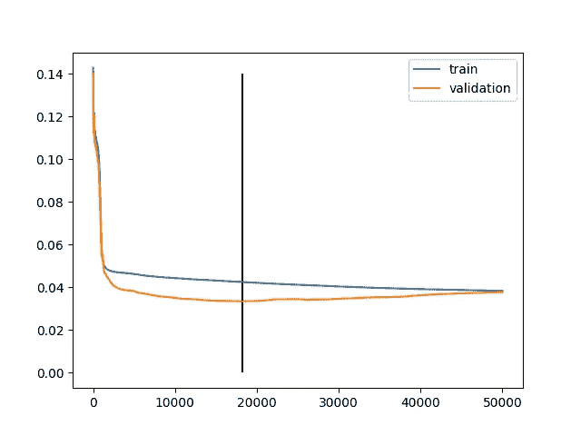
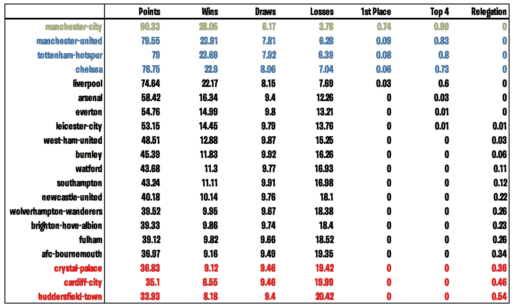

# 使用 EA 球员评分和 Tensorflow 预测足球比赛

> 原文：<https://towardsdatascience.com/predicting-premier-league-odds-from-ea-player-bfdb52597392?source=collection_archive---------3----------------------->

Photo by [Mario Klassen](https://unsplash.com/@marioklassen?utm_source=medium&utm_medium=referral) on [Unsplash](https://unsplash.com?utm_source=medium&utm_medium=referral)

# **快速警告**

因为我用顶峰体育的收盘赔率作为我的目标，你可以说我只是在建模。然而，假设是到比赛开始的时候，Pinnacle 的线会移动足够多，因为人们打赌赔率应该非常接近*真实的*概率。有点像群体智慧效应。这是否是一个好的假设…？我要说的是，它不仅效果很好，而且达到了我希望的效果，我将在后面解释。

# 这个想法

去年我开发了一个预期目标(xG)模型——只是为了好玩和做一些 Python 编程。这在很大程度上受到了两个人的启发，他们是我在推特上关注的[迈克尔·凯利](https://twitter.com/MC_of_A)和[特德·克努特森](https://twitter.com/mixedknuts)。在我看来，xG 绝对是梦幻般的。如果你想知道更多的细节，你应该看看迈克尔的推特。然而，和所有的足球分析方法一样，它也有缺点。迈克尔又一次更深入地探讨了这些问题，但我将快速地列出它们，让大家了解为什么我决定做一些不同的事情。首先，它没有考虑参与游戏的玩家。例如，如果埃登·阿扎尔在切尔西缺阵(一个令人悲伤的事实)，你显然会期望切尔西的 xG 会更低，然而没有真正的方法来解释这一点。其次，在赛季开始时，当新球员到来时，xG 无法衡量这个新球员会对球队产生什么样的影响。最后，我还没有看到一个 xG 模型可以很好地适用于所有的五大联盟(这是我还没有尝试用我的模型做的事情，但它是我在某个时候要实现的一个扩展)。

我的 xG 模型也很晚才问世——它已经问世 4、5 年了，所以我的模型不是以前没有人做过的东西。我想尝试创造一些东西，a)可以预测足球比赛的结果，b)我以前从未见过，c)使用某种形式的球员数据。我可能大错特错，但我还没有看到很多人将神经网络应用于足球问题的例子。因此，考虑到以上所有因素，我决定在 [Tensorflow](https://www.tensorflow.org/) 中写点东西，尝试根据一个球队的首发 11 人预测足球比赛的结果。

# 数据

最明显的玩家评级系统是 EA Sport 的 FIFA 游戏。它们每年都会更新，它们独立于联盟之外，而且它们足够准确(以至于我从来没有听到有人这样谈论它们)。我只使用了整体评分，但可能是其他评分的组合(防守，进攻等。)可能效果更好。我收集了过去 5 年来自 https://www.fifaindex.com/的[的英超终极团队评分。我还需要知道哪些玩家开始了哪些游戏。对于这一点，【http://www.betstudy.com/】的](https://www.fifaindex.com/)[是一个伟大的资源。它提供了过去 5 年英超联赛中所有比赛的 11 名首发球员的姓名、号码和国籍。来自 *fifaindex* 的名字与在 *betstudy* 上看到的名字并不完全匹配，所以我使用了名字、号码、球队和国籍的组合来匹配球员。一旦匹配完成，我有 22 个评分(11 个主场球员和 11 个客场球员)，在过去 5 年的英超联赛中的每场比赛都在 50 到 100 之间。这是一个好的开始。](http://www.betstudy.com/)

What a vector would look like for a Chelsea line-up of Courtois; Moses, Rudiger, Alonso, Christensen, Azpilicueta; Fabregas, Kante; Hazard, Morata, Willian.

然而，仅仅使用这 22 个数字就意味着我们失去了潜在的重要信息。当糟糕的球队对阵优秀的球队时，他们往往会通过启动更多的防守球员来停止比赛——我希望我的模型能够考虑到这种变化。因此，我选择用一个大小为 18 的向量来模拟每个从 11 开始的值。在每个 18 维向量中，第一个分量是对守门员的评分，接下来的六个分量是对后卫的评分——如果只有四名后卫，其中两个分量为零。我在上面加了一张图，试图帮助想象这个 18 维向量在给定切尔西阵容的情况下会是什么样子。根据同样的方法，中场球员有七个组成部分，前锋有四个组成部分。输入的这种结构应该允许从地层中得出一些推论。例如，如果有六名防守球员在比赛，很可能这支球队正在寻找停巴士的机会，因此应该相应地计算赔率。基本上，团队的形成改变了向量的哪些分量被保留为 0，并允许神经网络从中进行推断。此外，当我们将这些数据传递给神经网络时，我们会将它们作为一个大型的 36 维向量进行传递——主队占据前 18 维，客场队占据最后 18 维。通过使用这种结构，网络也可以占据主场优势。

最后，模型的输出将是匹配的 1X2 赔率。我使用了顶尖体育赔率，这些赔率是由 http://www.football-data.co.uk/ T2 的约瑟夫·布赫达尔多年来收集的。

# 具有训练和验证损失的模型

The neural network architecture. Drawn using [http://alexlenail.me/NN-SVG/index.html](http://alexlenail.me/NN-SVG/index.html)

收集并格式化所有数据后，必须确定网络的“内部”结构。我最初在 2013-2014、2014-2015、2015-2016 和 2016-2017 英超赛季训练该模型，以便我可以在 2017-2018 赛季回测它。在 1540 个游戏中，我保留了 50 个作为验证集。然后我训练这个模型，使用[退出](https://en.wikipedia.org/wiki/Dropout_(neural_networks))和[提前停止](https://en.wikipedia.org/wiki/Early_stopping)使用多种不同的网络结构。实现最小验证误差的是具有两个隐藏层的网络，第一层具有 16 个节点，第二层具有 8 个节点。训练集和验证集的误差图如下所示，垂直线表示提前停止。我不会过多地讨论神经网络的细节，但如果有人对此感兴趣，可以在 GitHub(底部的链接)上找到所有代码。一旦我对模型进行了回溯测试(我在下面展示了回溯测试的一些结果)，我就对包括 2017-2018 赛季在内的所有数据重新训练了网络，为今年做好了准备。

A plot to show the training and validation losses (y-axis) against the number of iterations (x-axis). The vertical line represents the early stopping

# 回溯测试

为了进行回溯测试，我从一个 100 人的虚拟银行开始，并使用[凯利标准](https://www.pinnacle.com/en/betting-articles/Betting-Strategy/How-to-use-kelly-criterion-for-betting/2BT2LK6K2QWQ7QJ8)来确定股份大小。我没有下赔率大于 3.2 的赌注，也没有下根据模型期望值小于 2%的赌注。在 2017-2018 赛季，该模型实现了 11%的投资回报率。这*好得离谱*好。我多次重新运行它，多次重新训练该模型，并不断得出相同的结果。所以我也深入研究了这些数字:

*   我赢了 50%的赌注
*   巅峰时期的平均赔率是 2.37
*   平均预测赔率为 2.01
*   赌注的平均价值为 7.23%，最高为 21.3%

这么大的投资回报率肯定是偶然的，但上面的观察似乎很有希望，总的来说，该模型将会盈利。我在我的资金下面绘制了一段时间的情况，以及赌注大小，如果有人特别感兴趣，我可以分享更多关于实际赌注的信息。

A plot to show the bank and stake sizes (y-axis) against the number of bets (x-axis).

# 2018/19 赛季

鉴于回溯测试的良好结果，我重新培训了包括 2017-2018 赛季在内的模型。使用这个新模型，我可以模拟整个赛季，但有几个注意事项。首先，我必须猜测每支球队最有可能的阵容(这很好，但这些显然会在整个赛季中发生变化)。其次，我不得不使用 2017-2018 年 EA 球员评级，这不是一个大问题，但有像萨拉赫这样的球员，他们的评级肯定会在 FIFA 19 中发生变化-我会用新的评级更新这个模拟，并在 FIFA 19 出来时重新运行模拟。此外，转会窗口仍然开放，这是有问题的，因为它看起来几乎肯定会有一些球员离开-像危险。无论如何，带着这个想法，我运行了这个赛季 100 万次(在我的笔记本电脑上大约需要 8 分钟)，并计算了平均积分、胜败和平局。然后，我计算了 1，000，000 个赛季中球队获得第一名、前 4 名和降级区的百分比。成绩在下面，看起来符合人们的普遍预期。

Predicted Premier League table averaged over 1,000,000 simulated seasons

进一步来说，我可以开始和团队混在一起。举个例子，假设哈扎德离开了，切尔西改打威利安。与哈扎德的 91 分相比，威利安的得分为 84 分。在模拟赛季中交换这一点，切尔西会下降大约 4 分！我们可以对曼联做同样的事情，把德基换成罗梅罗，他们平均下降 3 分。这些积分差异肯定与你的预期有关——没有哈扎德的切尔西是一支更差的球队，没有德基的曼联更差。(我还没有重新运行这个，包括利物浦所有的新签约——但这是我接下来要做的事情)。

总的来说，我对这种工作方式非常满意。这显然不是模拟足球比赛的完美方式。有很多因素需要考虑——教练、天气、疲劳、赛季末和赛季初等等。这个模型不可能捕捉到潜在的分布。然而，这很有趣，事实上像切尔西这样的球队在你拿走他们的明星球员后会丢分，这表明这实际上是按计划进行的。下一步肯定是看利物浦的预测如何变化，当我加入他们的新球员时。然后我想让它设置为自动使用 Smarkets API，并自动下注。最后，当我大学毕业时，我想在过去的 5 个赛季里，在所有 5 个欧洲顶级联赛中训练它，看看我是否能够产生一个“适合所有人的模式”。这也将允许我在世界杯和欧锦赛上使用这个模型——这将非常有趣。

编辑:我做了一个快捷的网络应用，如果你想自己尝试一下的话——[https://pl-predictor-tensorflow.herokuapp.com](https://pl-predictor-tensorflow.herokuapp.com)

如果你在推特之外的地方发现了这个-[https://twitter.com/BradleyGrantham](https://twitter.com/BradleyGrantham)。

如果有人对实际代码感兴趣，这些都在 GitHub 上-【https://github.com/BradleyGrantham/fifa-stats-scraper 