# 预测泰坦尼克号乘客的生存

> 原文：<https://towardsdatascience.com/predicting-the-survival-of-titanic-passengers-30870ccc7e8?source=collection_archive---------1----------------------->


在这篇博文中，我将介绍在著名的 Titanic 数据集上创建机器学习模型的整个过程，这个数据集被世界各地的许多人使用。它提供了泰坦尼克号上乘客的命运信息，按照经济地位(阶级)、性别、年龄和存活率进行汇总。

我最初在 kaggle.com 上写这篇文章，作为“泰坦尼克号:从灾难中学习的机器”竞赛的一部分。在这个挑战中，我们被要求预测泰坦尼克号上的一名乘客是否会生还。

# 皇家邮轮泰坦尼克号

> 皇家邮轮泰坦尼克号是一艘英国客轮，1912 年 4 月 15 日凌晨在从南安普敦到纽约市的处女航中与冰山相撞后沉没在北大西洋。据估计，船上有 2224 名乘客和船员，超过 1500 人死亡，这是现代史上最致命的和平时期商业海上灾难之一。皇家邮轮泰坦尼克号是当时最大的水上船只，也是白星航运公司运营的三艘奥运级远洋客轮中的第二艘。泰坦尼克号由贝尔法斯特的哈兰和沃尔夫造船厂建造。她的建筑师托马斯·安德鲁斯死于这场灾难。


# 导入库

```
*# linear algebra*
**import** **numpy** **as** **np** 

*# data processing*
**import** **pandas** **as** **pd** 

*# data visualization*
**import** **seaborn** **as** **sns**
%matplotlib inline
**from** **matplotlib** **import** pyplot **as** plt
**from** **matplotlib** **import** style

*# Algorithms*
**from** **sklearn** **import** linear_model
**from** **sklearn.linear_model** **import** LogisticRegression
**from** **sklearn.ensemble** **import** RandomForestClassifier
**from** **sklearn.linear_model** **import** Perceptron
**from** **sklearn.linear_model** **import** SGDClassifier
**from** **sklearn.tree** **import** DecisionTreeClassifier
**from** **sklearn.neighbors** **import** KNeighborsClassifier
**from** **sklearn.svm** **import** SVC, LinearSVC
**from** **sklearn.naive_bayes** **import** GaussianNB
```

# 获取数据

```
test_df = pd.read_csv("test.csv")
train_df = pd.read_csv("train.csv")
```

# 数据探索/分析

```
train_df.info()
```

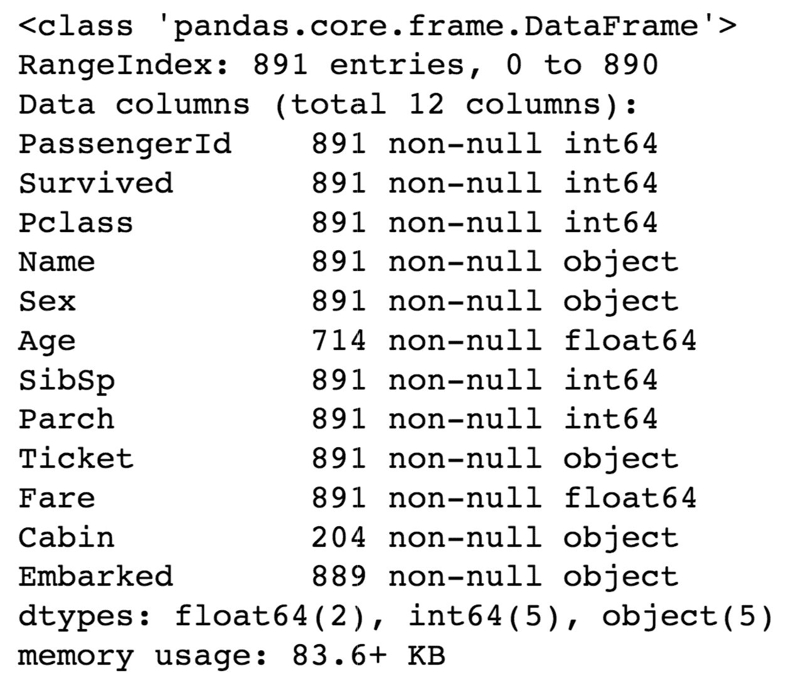

**训练集有 891 个样本，11 个特征+目标变量(存活)**。其中 2 个特性是浮点数，5 个是整数，5 个是对象。下面我列出了这些特性并做了简短的描述:

```
survival:    Survival 
PassengerId: Unique Id of a passenger. 
pclass:    Ticket class     
sex:    Sex     
Age:    Age in years     
sibsp:    # of siblings / spouses aboard the Titanic     
parch:    # of parents / children aboard the Titanic     
ticket:    Ticket number     
fare:    Passenger fare     
cabin:    Cabin number     
embarked:    Port of Embarkationtrain_df.describe()
```

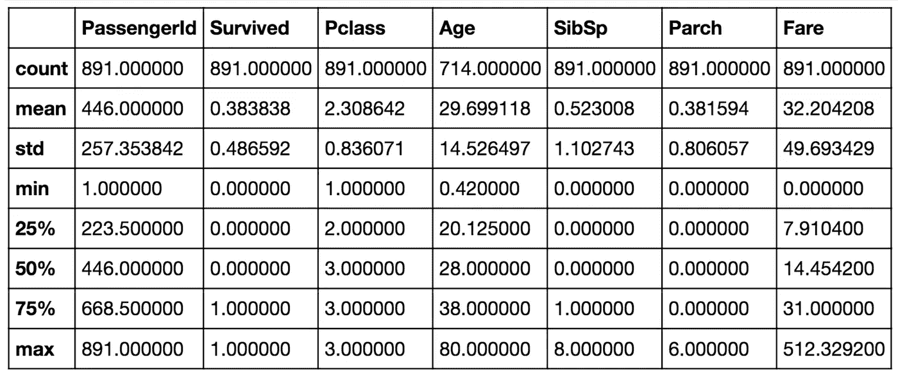

从上面我们可以看到 **38%的训练组成员在泰坦尼克号**中幸存。我们还可以看到乘客年龄从 0.4 岁到 80 岁不等。除此之外，我们已经可以检测到一些包含缺失值的特征，比如“年龄”特征。

```
train_df.head(8)
```

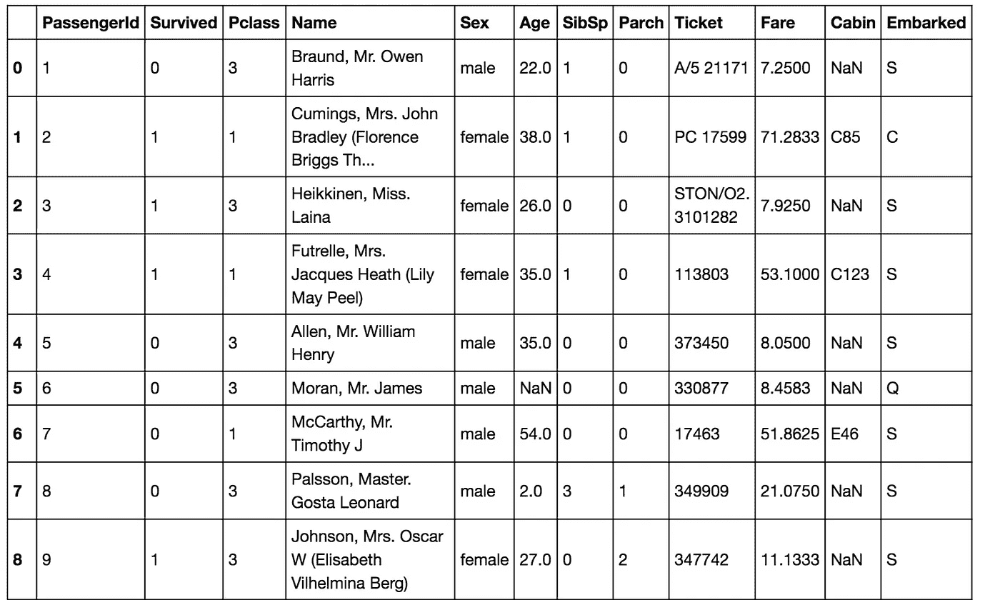

从上表中，我们可以注意到一些事情。首先，我们**需要稍后将大量特征转换为数字**特征，以便机器学习算法可以处理它们。此外，我们可以看到**特性具有非常不同的范围**，我们需要将其转换成大致相同的比例。我们还可以发现更多的包含缺失值(NaN =非数字)的特性，我们需要处理这些特性。

**让我们更详细地看看实际上缺少什么数据:**

```
total = train_df.isnull().sum().sort_values(ascending=**False**)
percent_1 = train_df.isnull().sum()/train_df.isnull().count()*100
percent_2 = (round(percent_1, 1)).sort_values(ascending=**False**)
missing_data = pd.concat([total, percent_2], axis=1, keys=['Total', '%'])
missing_data.head(5)
```

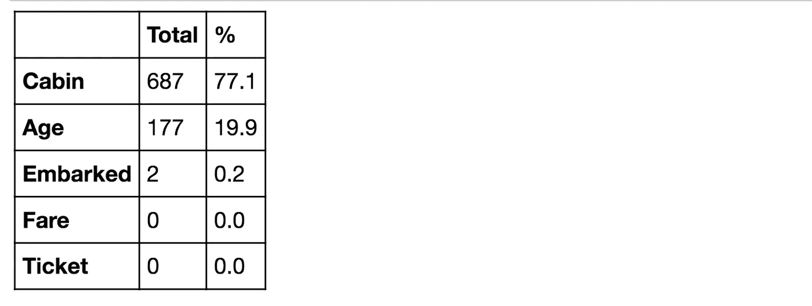

已装载特征只有两个缺失值，可以很容易地填充。处理“年龄”特性要复杂得多，它缺少 177 个值。“小屋”功能需要进一步调查，但看起来我们可能要从数据集中删除它，因为它的 77 %丢失了。

```
train_df.columns.values
```


上面你可以看到 11 个特征+目标变量(幸存)。哪些特征有助于提高存活率？

对我来说，如果除了“乘客 Id”、“车票”和“姓名”之外的一切都与高存活率相关联，那就说得通了。

**1。年龄性别:**

```
survived = 'survived'
not_survived = 'not survived'
fig, axes = plt.subplots(nrows=1, ncols=2,figsize=(10, 4))
women = train_df[train_df['Sex']=='female']
men = train_df[train_df['Sex']=='male']
ax = sns.distplot(women[women['Survived']==1].Age.dropna(), bins=18, label = survived, ax = axes[0], kde =**False**)
ax = sns.distplot(women[women['Survived']==0].Age.dropna(), bins=40, label = not_survived, ax = axes[0], kde =**False**)
ax.legend()
ax.set_title('Female')
ax = sns.distplot(men[men['Survived']==1].Age.dropna(), bins=18, label = survived, ax = axes[1], kde = **False**)
ax = sns.distplot(men[men['Survived']==0].Age.dropna(), bins=40, label = not_survived, ax = axes[1], kde = **False**)
ax.legend()
_ = ax.set_title('Male')
```

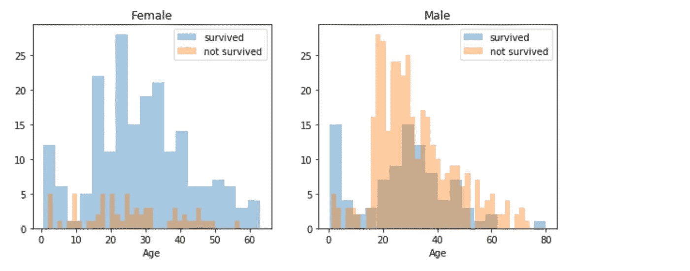

你可以看到男性在 18 岁到 30 岁之间存活的概率很大，女性也是一点点但不完全对。对于 14 至 40 岁的女性来说，存活的几率更高。

对于男性来说，在 5 岁到 18 岁之间存活的概率非常低，但对于女性来说并非如此。另一件要注意的事情是，婴儿也有更高的存活率。

由于似乎有**特定的年龄，这增加了生存的几率**，并且因为我希望每个特征都大致在相同的范围内，我将稍后创建年龄组。

**3。登船，Pclass 和 Sex:**

```
FacetGrid = sns.FacetGrid(train_df, row='Embarked', size=4.5, aspect=1.6)
FacetGrid.map(sns.pointplot, 'Pclass', 'Survived', 'Sex', palette=**None**,  order=**None**, hue_order=**None** )
FacetGrid.add_legend()
```


上船似乎与生存相关，取决于性别。

Q 端口和 S 端口的女性生存几率更高。反之亦然，如果他们在港口 C。男人有很高的生存概率，如果他们在港口 C，但低概率，如果他们在港口 Q 或 s。

Pclass 似乎也与存活率相关。我们将在下面生成另一个图。

**4。Pclass:**

```
sns.barplot(x='Pclass', y='Survived', data=train_df)
```

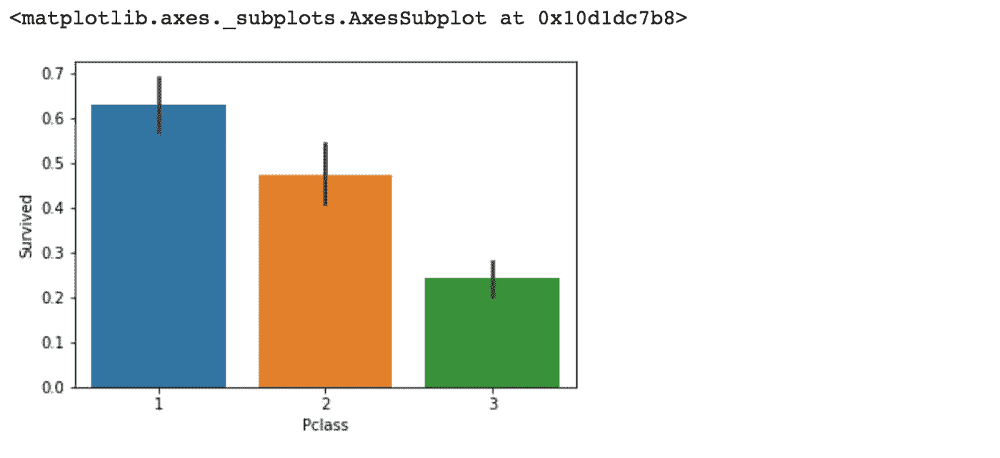

这里我们清楚地看到，Pclass 增加了一个人的生存机会，特别是如果这个人在 1 类。我们将在下面创建另一个 pclass 图。

```
grid = sns.FacetGrid(train_df, col='Survived', row='Pclass', size=2.2, aspect=1.6)
grid.map(plt.hist, 'Age', alpha=.5, bins=20)
grid.add_legend();
```

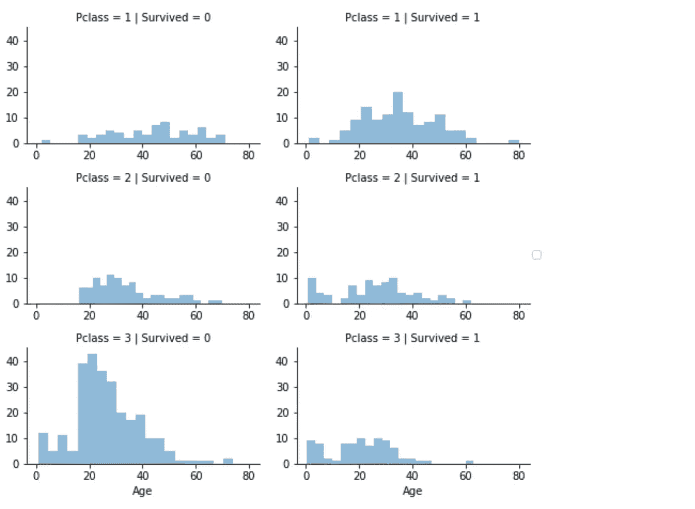

上面的图证实了我们对 pclass 1 的假设，但我们也可以发现 pclass 3 中的人很有可能无法存活。

**5。SibSp 和 Parch:**

SibSp 和 Parch 作为一个组合特征更有意义，它显示了一个人在泰坦尼克号上的亲属总数。我将在下面创建它，也是一个如果有人不孤单时播种的特征。

```
data = [train_df, test_df]
**for** dataset **in** data:
    dataset['relatives'] = dataset['SibSp'] + dataset['Parch']
    dataset.loc[dataset['relatives'] > 0, 'not_alone'] = 0
    dataset.loc[dataset['relatives'] == 0, 'not_alone'] = 1
    dataset['not_alone'] = dataset['not_alone'].astype(int)train_df['not_alone'].value_counts()
```


```
axes = sns.factorplot('relatives','Survived', 
                      data=train_df, aspect = 2.5, )
```

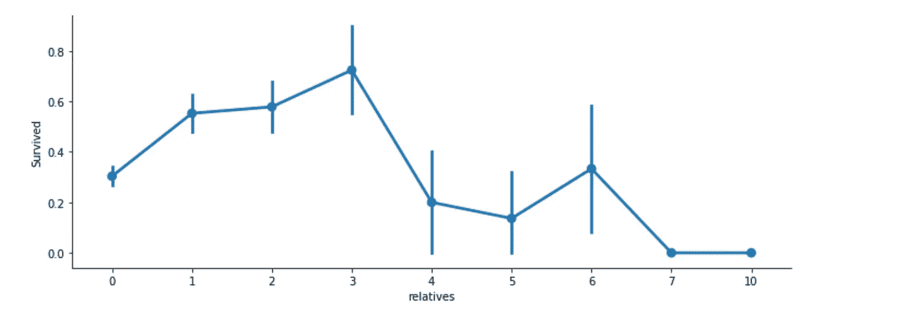

在这里我们可以看到，你有 1 到 3 个亲属的存活概率很高，但如果你的亲属少于 1 个或多于 3 个，存活概率就较低(除了一些有 6 个亲属的情况)。

# 数据预处理

首先，我将从训练集中删除“PassengerId ”,因为它对一个人的生存概率没有贡献。我不会把它从测试集中删除，因为提交时需要它。

```
train_df = train_df.drop(['PassengerId'], axis=1)
```

## 缺失数据:

**小屋:** 提醒一下，我们要处理小屋(687)、登船(2)和年龄(177)。首先我想，我们必须删除“小屋”变量，但后来我发现了一些有趣的东西。一个舱号看起来像‘C123’，字母**指的是甲板**。因此，我们将提取这些并创建一个新的功能，其中包含一个人的甲板。我们将把这个特征转换成一个数字变量。缺少的值将被转换为零。在下面的图片中，你可以看到泰坦尼克号的实际甲板，从 A 到 g。

```
**import** **re**
deck = {"A": 1, "B": 2, "C": 3, "D": 4, "E": 5, "F": 6, "G": 7, "U": 8}
data = [train_df, test_df]

**for** dataset **in** data:
    dataset['Cabin'] = dataset['Cabin'].fillna("U0")
    dataset['Deck'] = dataset['Cabin'].map(**lambda** x: re.compile("([a-zA-Z]+)").search(x).group())
    dataset['Deck'] = dataset['Deck'].map(deck)
    dataset['Deck'] = dataset['Deck'].fillna(0)
    dataset['Deck'] = dataset['Deck'].astype(int)*# we can now drop the cabin feature*
train_df = train_df.drop(['Cabin'], axis=1)
test_df = test_df.drop(['Cabin'], axis=1)
```

**Age:** 现在我们可以解决 Age 特性缺少值的问题。我将创建一个包含随机数的数组，这些随机数是根据平均年龄值计算的，与标准偏差和 is_null 有关。

```
data = [train_df, test_df]

**for** dataset **in** data:
    mean = train_df["Age"].mean()
    std = test_df["Age"].std()
    is_null = dataset["Age"].isnull().sum()
    *# compute random numbers between the mean, std and is_null*
    rand_age = np.random.randint(mean - std, mean + std, size = is_null)
    *# fill NaN values in Age column with random values generated*
    age_slice = dataset["Age"].copy()
    age_slice[np.isnan(age_slice)] = rand_age
    dataset["Age"] = age_slice
    dataset["Age"] = train_df["Age"].astype(int)train_df["Age"].isnull().sum()
```


**着手进行:**

由于已装载特征只有两个缺失值，我们将只使用最常见的值来填充它们。

```
train_df['Embarked'].describe()
```


```
common_value = 'S'
data = [train_df, test_df]

**for** dataset **in** data:
    dataset['Embarked'] = dataset['Embarked'].fillna(common_value)
```

## 转换功能:

```
train_df.info()
```

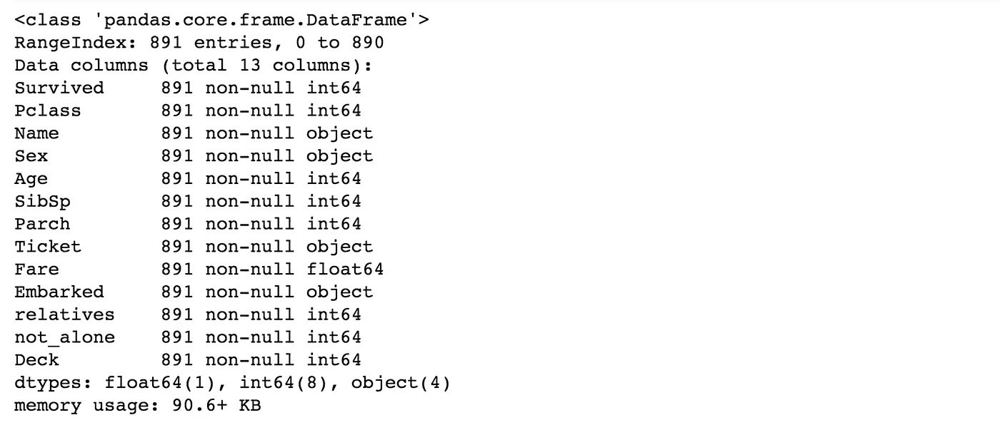

上面你可以看到“票价”是一个浮动，我们必须处理 4 个分类特征:姓名、性别、车票和上船。让我们一个接一个地调查和转换。

**Fare:** 使用 pandas 提供的函数“astype()”将“Fare”从 float 转换为 int64:

```
data = [train_df, test_df]

**for** dataset **in** data:
    dataset['Fare'] = dataset['Fare'].fillna(0)
    dataset['Fare'] = dataset['Fare'].astype(int)
```

**Name:** 我们将使用 Name 特性从名称中提取标题，这样我们就可以从中构建一个新的特性。

```
data = [train_df, test_df]
titles = {"Mr": 1, "Miss": 2, "Mrs": 3, "Master": 4, "Rare": 5}

**for** dataset **in** data:
    *# extract titles*
    dataset['Title'] = dataset.Name.str.extract(' ([A-Za-z]+)\.', expand=**False**)
    *# replace titles with a more common title or as Rare*
    dataset['Title'] = dataset['Title'].replace(['Lady', 'Countess','Capt', 'Col','Don', 'Dr',\
                                            'Major', 'Rev', 'Sir', 'Jonkheer', 'Dona'], 'Rare')
    dataset['Title'] = dataset['Title'].replace('Mlle', 'Miss')
    dataset['Title'] = dataset['Title'].replace('Ms', 'Miss')
    dataset['Title'] = dataset['Title'].replace('Mme', 'Mrs')
    *# convert titles into numbers*
    dataset['Title'] = dataset['Title'].map(titles)
    *# filling NaN with 0, to get safe*
    dataset['Title'] = dataset['Title'].fillna(0)train_df = train_df.drop(['Name'], axis=1)
test_df = test_df.drop(['Name'], axis=1)
```

**性别:** 将‘性别’特征转换为数值。

```
genders = {"male": 0, "female": 1}
data = [train_df, test_df]

**for** dataset **in** data:
    dataset['Sex'] = dataset['Sex'].map(genders)
```

**票:**

```
train_df['Ticket'].describe()
```


由于门票属性有 681 个独特的门票，这将是一个有点棘手的转换成有用的类别。所以我们将把它从数据集中删除。

```
train_df = train_df.drop(['Ticket'], axis=1)
test_df = test_df.drop(['Ticket'], axis=1)
```

**已装船:** 将‘已装船’特征转换成数值。

```
ports = {"S": 0, "C": 1, "Q": 2}
data = [train_df, test_df]

**for** dataset **in** data:
    dataset['Embarked'] = dataset['Embarked'].map(ports)
```

# 创建类别:

我们现在将在以下功能中创建类别:

**年龄:** 现在我们需要转换‘年龄’特性。首先我们将把它从浮点数转换成整数。然后，我们将创建新的“年龄组”变量，将每个年龄分为一组。请注意，关注如何组成这些组是很重要的，因为您不希望 80%的数据归入组 1。

```
data = [train_df, test_df]
**for** dataset **in** data:
    dataset['Age'] = dataset['Age'].astype(int)
    dataset.loc[ dataset['Age'] <= 11, 'Age'] = 0
    dataset.loc[(dataset['Age'] > 11) & (dataset['Age'] <= 18), 'Age'] = 1
    dataset.loc[(dataset['Age'] > 18) & (dataset['Age'] <= 22), 'Age'] = 2
    dataset.loc[(dataset['Age'] > 22) & (dataset['Age'] <= 27), 'Age'] = 3
    dataset.loc[(dataset['Age'] > 27) & (dataset['Age'] <= 33), 'Age'] = 4
    dataset.loc[(dataset['Age'] > 33) & (dataset['Age'] <= 40), 'Age'] = 5
    dataset.loc[(dataset['Age'] > 40) & (dataset['Age'] <= 66), 'Age'] = 6
    dataset.loc[ dataset['Age'] > 66, 'Age'] = 6
 *# let's see how it's distributed* train_df['Age'].value_counts()
```


**Fare:** 对于‘Fare’特性，我们需要做与‘Age’特性相同的事情。但这并不容易，因为如果我们将票价值的范围分成几个同样大的类别，80%的值将属于第一类。幸运的是，我们可以使用 sklearn 的“qcut()”函数，我们可以使用它来查看我们如何形成类别。

```
train_df.head(10)
```

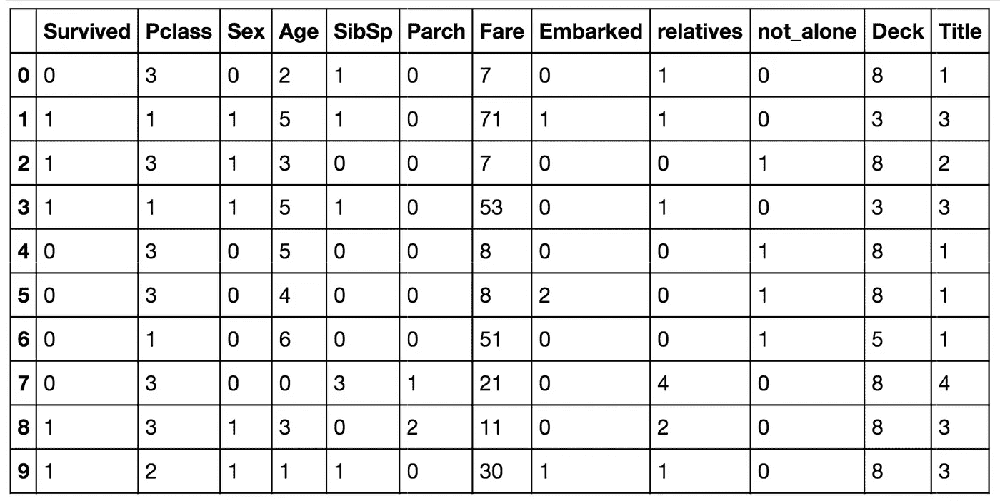

```
data = [train_df, test_df]

**for** dataset **in** data:
    dataset.loc[ dataset['Fare'] <= 7.91, 'Fare'] = 0
    dataset.loc[(dataset['Fare'] > 7.91) & (dataset['Fare'] <= 14.454), 'Fare'] = 1
    dataset.loc[(dataset['Fare'] > 14.454) & (dataset['Fare'] <= 31), 'Fare']   = 2
    dataset.loc[(dataset['Fare'] > 31) & (dataset['Fare'] <= 99), 'Fare']   = 3
    dataset.loc[(dataset['Fare'] > 99) & (dataset['Fare'] <= 250), 'Fare']   = 4
    dataset.loc[ dataset['Fare'] > 250, 'Fare'] = 5
    dataset['Fare'] = dataset['Fare'].astype(int)
```

# 创建新功能

我将向数据集中添加两个新要素，这两个新要素是从其他要素中计算出来的。

**1。时代时代班**

```
data = [train_df, test_df]
**for** dataset **in** data:
    dataset['Age_Class']= dataset['Age']* dataset['Pclass']
```

**2。每人票价**

```
**for** dataset **in** data:
    dataset['Fare_Per_Person'] = dataset['Fare']/(dataset['relatives']+1)
    dataset['Fare_Per_Person'] = dataset['Fare_Per_Person'].astype(int)*# Let's take a last look at the training set, before we start training the models.*
train_df.head(10)
```


# 构建机器学习模型

现在我们将训练几个机器学习模型，并比较它们的结果。请注意，因为数据集没有为它们的测试集提供标签，所以我们需要使用训练集的预测来相互比较算法。稍后，我们将使用交叉验证。

```
X_train = train_df.drop("Survived", axis=1)
Y_train = train_df["Survived"]
X_test  = test_df.drop("PassengerId", axis=1).copy()
```

**随机梯度下降(SGD):**

```
sgd = linear_model.SGDClassifier(max_iter=5, tol=**None**)
sgd.fit(X_train, Y_train)
Y_pred = sgd.predict(X_test)

sgd.score(X_train, Y_train)

acc_sgd = round(sgd.score(X_train, Y_train) * 100, 2)
```

**随机森林:**

```
random_forest = RandomForestClassifier(n_estimators=100)
random_forest.fit(X_train, Y_train)

Y_prediction = random_forest.predict(X_test)

random_forest.score(X_train, Y_train)
acc_random_forest = round(random_forest.score(X_train, Y_train) * 100, 2)
```

**逻辑回归:**

```
logreg = LogisticRegression()
logreg.fit(X_train, Y_train)

Y_pred = logreg.predict(X_test)

acc_log = round(logreg.score(X_train, Y_train) * 100, 2)
```

**K 最近邻:**

```
*# KNN* knn = KNeighborsClassifier(n_neighbors = 3) knn.fit(X_train, Y_train)  Y_pred = knn.predict(X_test)  acc_knn = round(knn.score(X_train, Y_train) * 100, 2)
```

**高斯朴素贝叶斯:**

```
gaussian = GaussianNB() gaussian.fit(X_train, Y_train)  Y_pred = gaussian.predict(X_test)  acc_gaussian = round(gaussian.score(X_train, Y_train) * 100, 2)
```

**感知器:**

```
perceptron = Perceptron(max_iter=5)
perceptron.fit(X_train, Y_train)

Y_pred = perceptron.predict(X_test)

acc_perceptron = round(perceptron.score(X_train, Y_train) * 100, 2)
```

**线性支持向量机:**

```
linear_svc = LinearSVC()
linear_svc.fit(X_train, Y_train)

Y_pred = linear_svc.predict(X_test)

acc_linear_svc = round(linear_svc.score(X_train, Y_train) * 100, 2)
```

**决策树**

```
decision_tree = DecisionTreeClassifier() decision_tree.fit(X_train, Y_train)  Y_pred = decision_tree.predict(X_test)  acc_decision_tree = round(decision_tree.score(X_train, Y_train) * 100, 2)
```

# 哪个是最好的型号？

```
results = pd.DataFrame({
    'Model': ['Support Vector Machines', 'KNN', 'Logistic Regression', 
              'Random Forest', 'Naive Bayes', 'Perceptron', 
              'Stochastic Gradient Decent', 
              'Decision Tree'],
    'Score': [acc_linear_svc, acc_knn, acc_log, 
              acc_random_forest, acc_gaussian, acc_perceptron, 
              acc_sgd, acc_decision_tree]})
result_df = results.sort_values(by='Score', ascending=**False**)
result_df = result_df.set_index('Score')
result_df.head(9)
```

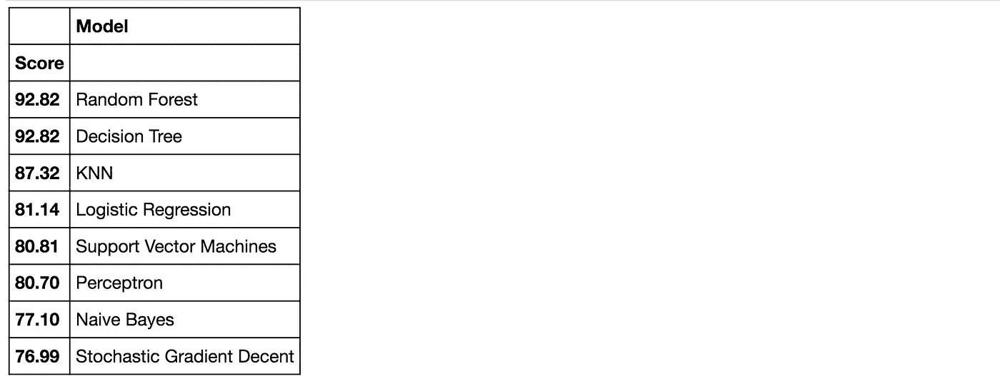

正如我们所看到的，随机森林分类器放在第一位。但是首先，让我们检查一下，当我们使用交叉验证时，random-forest 是如何执行的。

# k 倍交叉验证:

K-Fold 交叉验证将训练数据随机分成称为折叠的 K 个子集**。假设我们将数据分成 4 份(K = 4)。我们的随机森林模型将被训练和评估 4 次，每次使用不同的折叠进行评估，而它将在剩余的 3 个折叠上被训练。**

**下图显示了这个过程，使用了 4 次折叠(K = 4)。每行代表一个培训+评估过程。在第一行中，模型 get 在第一、第二和第三子集上被训练，并且在第四子集上被评估。在第二行中，模型 get 在第二、第三和第四个子集上训练，并在第一个子集上评估。K-Fold 交叉验证重复这个过程，直到每个折叠作为一个评估折叠进行一次。**

****

**我们的 K-Fold 交叉验证示例的结果将是包含 4 个不同分数的数组。然后我们需要计算这些分数的平均值和标准差。**

**下面的代码对我们的随机森林模型执行 K-Fold 交叉验证，使用 10 个折叠(K = 10)。因此，它输出一个有 10 个不同分数的数组。**

```
**from** **sklearn.model_selection** **import** cross_val_score
rf = RandomForestClassifier(n_estimators=100)
scores = cross_val_score(rf, X_train, Y_train, cv=10, scoring = "accuracy")print("Scores:", scores)
print("Mean:", scores.mean())
print("Standard Deviation:", scores.std())
```

****

**这看起来比以前真实多了。我们的模型平均准确率为 82%，标准偏差为 4 %。标准差告诉我们，估计值有多精确。**

**这意味着在我们的例子中，我们的模型的精度可以相差 **+** — 4%。**

**我认为准确性仍然很好，因为随机森林是一个易于使用的模型，我们将在下一节中尝试进一步提高它的性能。**

# **随机森林**

## **什么是随机森林？**

**随机森林是一种监督学习算法。就像你已经从它的名字中看到的，它创造了一个森林，使它变得随机。它构建的“森林”是决策树的集合，大部分时间是用“打包”方法训练的。bagging 方法的一般思想是学习模型的组合增加了整体结果。**

**用简单的话来说:随机森林构建多个决策树，将它们合并在一起，得到一个更加准确稳定的预测。**

**随机森林的一个很大的优点是，它可以用于分类和回归问题，这构成了当前机器学习系统的大多数。除了少数例外，随机森林分类器具有决策树分类器的所有超参数以及 bagging 分类器的所有超参数，以控制整体本身。**

**随机森林算法在生长树时给模型带来了额外的随机性。它不是在分割节点时搜索最佳特征，而是在随机特征子集中搜索最佳特征。这个过程产生了广泛的多样性，这通常会产生一个更好的模型。因此，当您在随机森林中种植树时，只考虑要素的随机子集来分割节点。您甚至可以通过在每个特征的基础上使用随机阈值，而不是像普通决策树那样搜索最佳阈值，来使树更加随机。**

**下面你可以看到有两棵树的随机森林的样子:**

**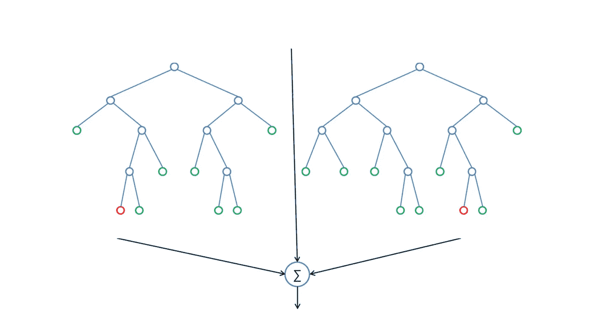**

## **特征重要性**

**随机森林的另一个优点是，它使得测量每个特征的相对重要性变得非常容易。Sklearn 通过查看使用该特征的树节点平均减少杂质的程度(跨越森林中的所有树)来测量特征的重要性。它会在训练后自动计算每个特征的分数，并对结果进行缩放，使所有重要度之和等于 1。我们将在下面讨论这个问题:**

```
importances = pd.DataFrame({'feature':X_train.columns,'importance':np.round(random_forest.feature_importances_,3)})
importances = importances.sort_values('importance',ascending=**False**).set_index('feature')importances.head(15)
```

**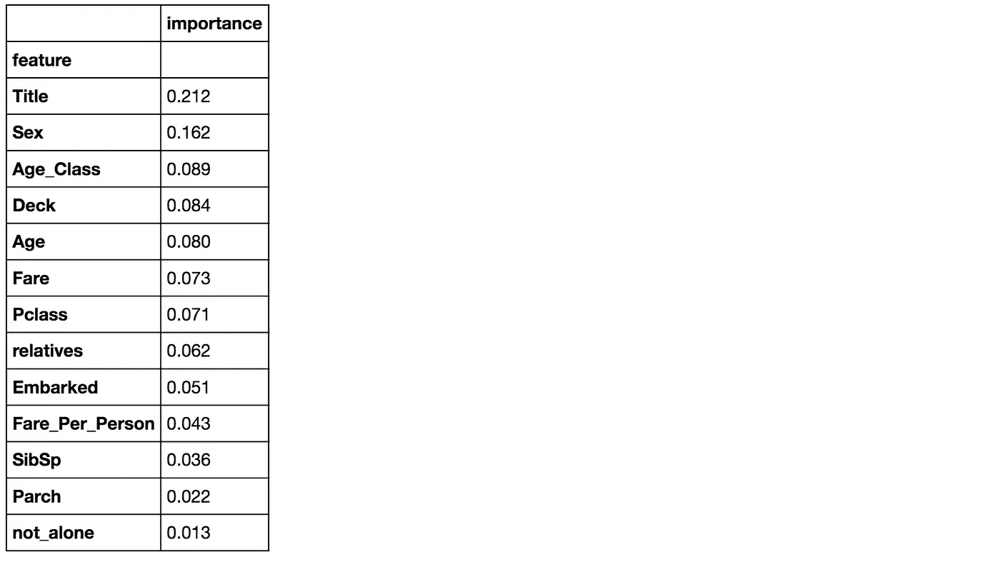**

```
importances.plot.bar()
```

**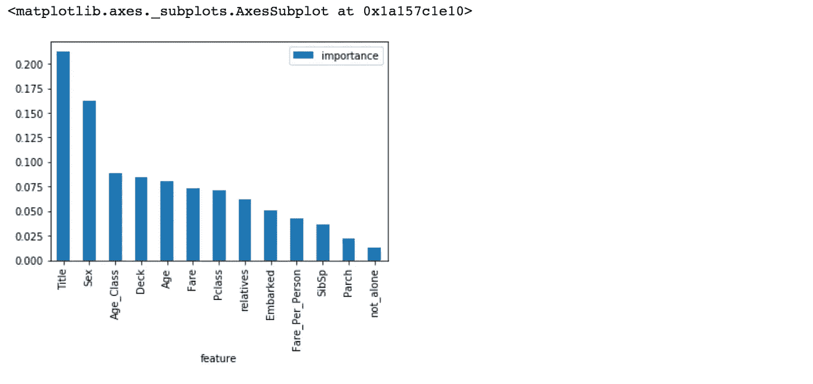**

## ****结论:****

**not_alone 和 Parch 在我们的随机森林分类器预测过程中不起重要作用。因此，我将把它们从数据集中删除，并再次训练分类器。我们也可以删除更多或更少的特性，但是这需要更详细地研究特性对我们模型的影响。但是我觉得只单独取出炒一下就可以了。**

```
train_df  = train_df.drop("not_alone", axis=1)
test_df  = test_df.drop("not_alone", axis=1)

train_df  = train_df.drop("Parch", axis=1)
test_df  = test_df.drop("Parch", axis=1)
```

****再次训练随机森林:****

```
*# Random Forest*

random_forest = RandomForestClassifier(n_estimators=100, oob_score = **True**)
random_forest.fit(X_train, Y_train)
Y_prediction = random_forest.predict(X_test)

random_forest.score(X_train, Y_train)

acc_random_forest = round(random_forest.score(X_train, Y_train) * 100, 2)
print(round(acc_random_forest,2,), "%")
```

**92.82%**

**我们的随机森林模型预测和以前一样好。一般来说，**你拥有的功能越多，你的模型就越有可能过度拟合**，反之亦然。但我认为我们的数据目前看起来不错，没有太多特征。**

**还有另一种方法来评估随机森林分类器，这可能比我们之前使用的分数更准确。我说的是**出袋样本**估计泛化精度。我不会在这里详细介绍它是如何工作的。只需注意，使用与训练集大小相同的测试集，可以获得非常准确的估计。因此，使用袋外误差估计消除了对预留测试集的需要。**

```
print("oob score:", round(random_forest.oob_score_, 4)*100, "%")
```

**oob 分数:81.82 %**

**现在我们可以开始调整随机森林的超参数了。**

# **超参数调谐**

**下面您可以看到参数标准的超参数调整代码，min_samples_leaf、min_samples_split 和 n_estimators。**

**我将这段代码放在 markdown 单元格中，而不是 code 单元格中，因为运行它需要很长时间。在它的正下方，我放了一个 gridsearch 输出的截图。**

```
param_grid = { "criterion" : ["gini", "entropy"], "min_samples_leaf" : [1, 5, 10, 25, 50, 70], "min_samples_split" : [2, 4, 10, 12, 16, 18, 25, 35], "n_estimators": [100, 400, 700, 1000, 1500]}from sklearn.model_selection import GridSearchCV, cross_val_scorerf = RandomForestClassifier(n_estimators=100, max_features='auto', oob_score=True, random_state=1, n_jobs=-1)clf = GridSearchCV(estimator=rf, param_grid=param_grid, n_jobs=-1)clf.fit(X_train, Y_train)clf.best*params*
```

**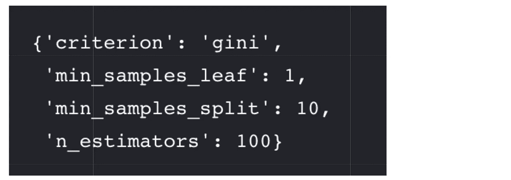**

****测试新参数:****

```
*# Random Forest*
random_forest = RandomForestClassifier(criterion = "gini", 
                                       min_samples_leaf = 1, 
                                       min_samples_split = 10,   
                                       n_estimators=100, 
                                       max_features='auto', 
                                       oob_score=**True**, 
                                       random_state=1, 
                                       n_jobs=-1)

random_forest.fit(X_train, Y_train)
Y_prediction = random_forest.predict(X_test)

random_forest.score(X_train, Y_train)

print("oob score:", round(random_forest.oob_score_, 4)*100, "%")
```

**oob 分数:83.05 %**

**现在我们有了一个合适的模型，我们可以开始以更准确的方式评估它的性能。以前我们只使用准确性和 oob 分数，这只是准确性的另一种形式。问题是，评估一个分类模型比评估一个回归模型更复杂。我们将在下一节中讨论这一点。**

# **进一步评估**

## **混淆矩阵:**

```
**from** **sklearn.model_selection** **import** cross_val_predict
**from** **sklearn.metrics** **import** confusion_matrix
predictions = cross_val_predict(random_forest, X_train, Y_train, cv=3)
confusion_matrix(Y_train, predictions)
```

****

**第一行是关于未幸存的预测: **493 名乘客被正确分类为未幸存**(称为真阴性) **56 名乘客被错误分类为未幸存**(假阳性)。**

**第二行是关于幸存预测: **93 名乘客被错误地分类为幸存**(假阴性)，而 **249 名乘客被正确地分类为幸存**(真阳性)。**

**混淆矩阵给了你很多关于你的模型表现如何的信息，但是有一种方法可以得到更多，比如计算分类器的精度。**

## **精确度和召回率:**

```
**from** **sklearn.metrics** **import** precision_score, recall_score

print("Precision:", precision_score(Y_train, predictions))
print("Recall:",recall_score(Y_train, predictions))
```

**精度:0.801948051948
召回:0.8000000001**

**我们的模型预测 81%的时间，一个乘客生存正确(精度)。这份回忆告诉我们，它预测了 73 %的幸存者。**

## **f 分数**

**你可以把精确度和召回率结合成一个分数，叫做 F 分数。F 分数是用精确度和召回率的调和平均值来计算的。请注意，它将更多的权重分配给低值。因此，如果召回率和精确度都很高，分类器将只获得高 F 值。**

```
**from** **sklearn.metrics** **import** f1_score
f1_score(Y_train, predictions)
```

**0.7599999999999**

**好了，77 %的 F 分。分数没有那么高，因为我们的召回率是 73%。但不幸的是，F-score 并不完美，因为它倾向于具有相似精度和召回率的分类器。这是一个问题，因为你有时想要高精度，有时想要高召回率。事实是，精确度的增加，有时会导致回忆的减少，反之亦然(取决于阈值)。这被称为精确度/召回率的权衡。我们将在下一节讨论这一点。**

## **精确召回曲线**

**对于随机森林算法必须分类的每个人，它基于函数计算概率，并将该人分类为幸存(当分数大于阈值时)或未幸存(当分数小于阈值时)。这就是为什么门槛很重要。**

**我们将使用 matplotlib 绘制精度和召回与阈值的关系:**

```
**from** **sklearn.metrics** **import** precision_recall_curve

*# getting the probabilities of our predictions*
y_scores = random_forest.predict_proba(X_train)
y_scores = y_scores[:,1]

precision, recall, threshold = precision_recall_curve(Y_train, y_scores)**def** plot_precision_and_recall(precision, recall, threshold):
    plt.plot(threshold, precision[:-1], "r-", label="precision", linewidth=5)
    plt.plot(threshold, recall[:-1], "b", label="recall", linewidth=5)
    plt.xlabel("threshold", fontsize=19)
    plt.legend(loc="upper right", fontsize=19)
    plt.ylim([0, 1])

plt.figure(figsize=(14, 7))
plot_precision_and_recall(precision, recall, threshold)
plt.show()
```

****

**从上图可以清楚地看到，召回率正在迅速下降，大约在 85%左右。因此，在此之前，您可能希望选择精度/召回率之间的权衡——可能在 75 %左右。**

**您现在可以选择一个阈值，为您当前的机器学习问题提供最佳的精确度/召回率权衡。例如，如果您想要 80%的精度，您可以很容易地查看这些图，并看到您将需要 0.4 左右的阈值。然后你就可以用这个阈值训练一个模型，并得到你想要的精确度。**

**另一种方法是将精确度和召回率相互对比:**

```
**def** plot_precision_vs_recall(precision, recall):
    plt.plot(recall, precision, "g--", linewidth=2.5)
    plt.ylabel("recall", fontsize=19)
    plt.xlabel("precision", fontsize=19)
    plt.axis([0, 1.5, 0, 1.5])

plt.figure(figsize=(14, 7))
plot_precision_vs_recall(precision, recall)
plt.show()
```

**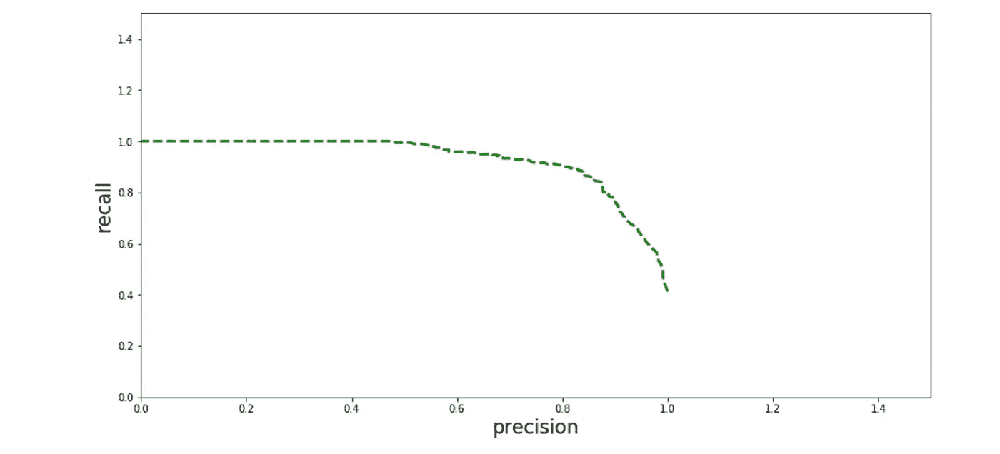**

## **ROC AUC 曲线**

**ROC AUC 曲线提供了评估和比较二元分类器的另一种方法。该曲线绘制了真阳性率(也称为召回率)对假阳性率(错误分类的阴性实例的比率)，而不是绘制了精度对召回率。**

```
**from** **sklearn.metrics** **import** roc_curve
*# compute true positive rate and false positive rate*
false_positive_rate, true_positive_rate, thresholds = roc_curve(Y_train, y_scores)*# plotting them against each other*
**def** plot_roc_curve(false_positive_rate, true_positive_rate, label=**None**):
    plt.plot(false_positive_rate, true_positive_rate, linewidth=2, label=label)
    plt.plot([0, 1], [0, 1], 'r', linewidth=4)
    plt.axis([0, 1, 0, 1])
    plt.xlabel('False Positive Rate (FPR)', fontsize=16)
    plt.ylabel('True Positive Rate (TPR)', fontsize=16)

plt.figure(figsize=(14, 7))
plot_roc_curve(false_positive_rate, true_positive_rate)
plt.show()
```

**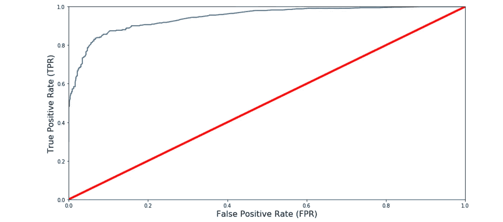**

**中间的红线代表一个纯粹随机的分类器(例如抛硬币)，因此你的分类器应该尽可能远离它。我们的随机森林模型似乎做得很好。**

**当然，我们在这里也有一个权衡，因为分类器产生的假阳性越多，真阳性率就越高。**

## **ROC AUC 得分**

**ROC AUC 得分是 ROC AUC 曲线的相应得分。它只是通过测量曲线下的面积来计算，该面积称为 AUC。**

**100%正确的分类器的 ROC AUC 得分为 1，完全随机的分类器的得分为 0.5。**

```
**from** **sklearn.metrics** **import** roc_auc_score
r_a_score = roc_auc_score(Y_train, y_scores)
print("ROC-AUC-Score:", r_a_score)
```

**ROC_AUC_SCORE: 0.945067587**

**不错！我认为这个分数足以将测试集的预测提交给 Kaggle 排行榜。**

# **摘要**

**我们从数据探索开始，对数据集有所了解，检查缺失的数据，了解哪些特征是重要的。在这个过程中，我们使用 seaborn 和 matplotlib 来做可视化。在数据预处理部分，我们计算缺失值，将特征转换为数值，将值分组并创建一些新特征。之后，我们开始训练 8 个不同的机器学习模型，选择其中一个(随机森林)并对其进行交叉验证。然后我们讨论了随机森林是如何工作的，看看它对不同特性的重要性，并通过优化它的超参数值来调整它的性能。最后，我们查看了它的混淆矩阵，并计算了模型的精度、召回率和 f 值。**

**下面您可以看到“train_df”数据帧的前后图片:**

**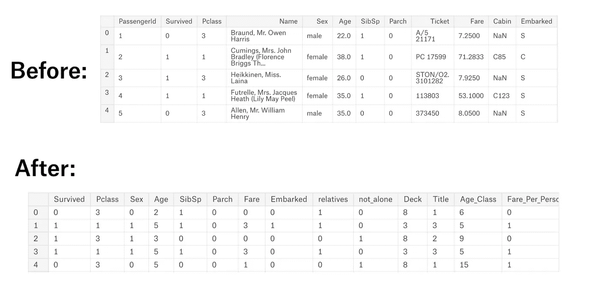**

**当然，仍有改进的空间，如通过相互比较和绘制特征并识别和去除有噪声的特征，进行更广泛的特征工程。另一个可以改善 kaggle 排行榜整体结果的事情是对几个机器学习模型进行更广泛的超参数调整。你也可以做一些整体学习。**