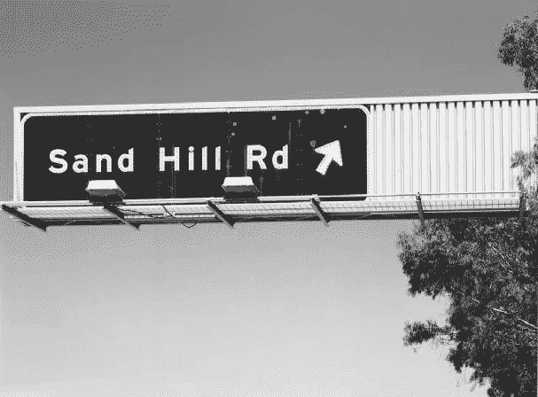
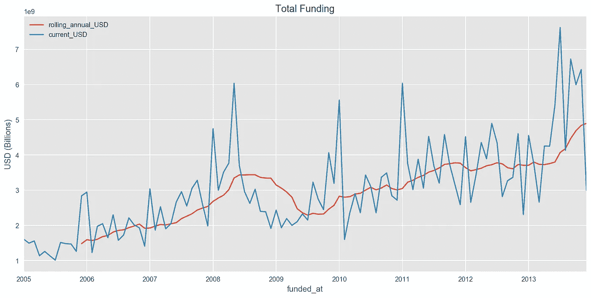
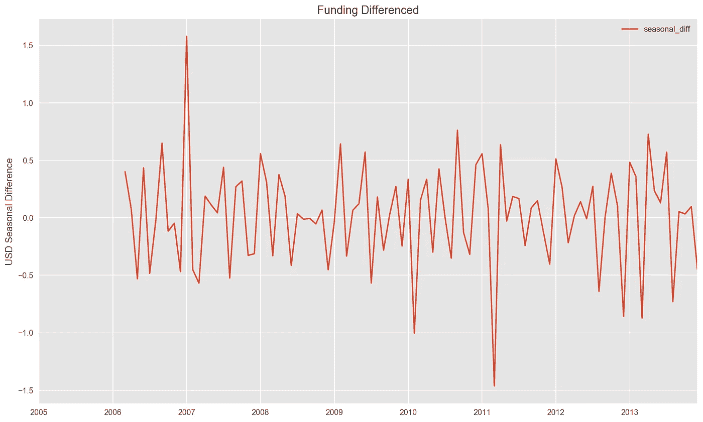
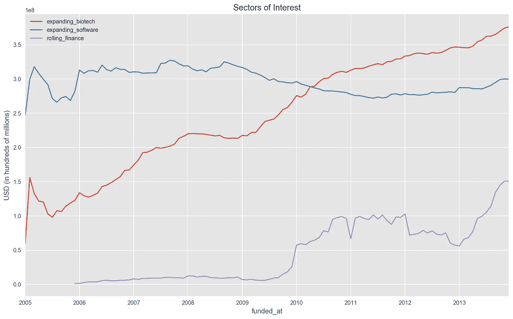

# 预测风险投资的前景

> 原文：<https://towardsdatascience.com/predicting-the-venture-capital-landscape-4e3496f8b92f?source=collection_archive---------1----------------------->

[“Nearly every top Silicon Valley company has been the beneficiary of early funding from firms on Sand Hill Road.”](https://en.wikipedia.org/wiki/Sand_Hill_Road#cite_note-bloomberg12042014-3)

# 介绍

市场将走向何方？资金会放缓还是会激增？哪些行业正在崛起或陷入困境？

生活在旧金山，初创企业会淡出人们的讨论，也会活跃起来，就像它们在新闻和市场上一样。作为湾区的大多数居民，我搬到这里是为了实现梦想，成为硅谷崛起的变革浪潮中的一员。从我早期对创业公司的迷恋，我感到有动力更好地了解创业公司，并从资金开始。

# 行动纲要

通过使用机器学习，我能够相对自信地预测整个风险资本市场的趋势以及哪些领域最有前途。利用 2013 年的 Crunchbase 数据，我能够预测 2014 年初的资金数额。此外，我预测当时最有希望的行业是生物技术，最差的行业是社会服务。如果给定 Crunchbase 当前的专有数据，我可以很容易地预测 2017 年剩余时间的资金。

# 数据收集

Crunchbase 保存了关于初创公司的信息，包括这些公司何时得到了资助，由谁资助，属于哪个行业，以及创始人有什么样的公司背景。Crunchbase 始于 2007 年，由用户贡献的内容运营，这些内容在被列入网站之前会经过审查。Crunchbase 以 MySQL 格式免费提供他们的一些数据，提供他们所有的信息，直到 2013 年底。为了获得访问权，一个人必须注册成为研究员。然而，一个人必须注册成为一家企业，并每年支付大约 6000 美元来访问他们当前的数据。因此，我的研究范围将是免费获取的信息，以收集过去的见解，如果有最新的数据，这些见解可以很容易地复制。

## 数据本身

非常方便的是，我能够在 11 个文件中通过一系列 MySQL 查询轻松地提取和研究数据。在对所有文件进行了大量研究之后，我使用了一些连接来处理一个数据集:funding。有一次，在一个数据帧中，我重新组织了结构，把它放入一个时间序列中。所以我的变量是 2005-2013 年的月度时间序列数据。

Crunchbase began in 2007 and has a significant amount of information for 2005 and onward.

我限制范围的选择是基于观察每年独特投资数量的直方图。值得注意的是，用户可以贡献过去的信息，这个直方图有目的地缩小，因为投资条目可以追溯到 20 世纪 70 年代。

Y Combinator, Techstars and SV Angel are the top three. Andreessen Horowitz rests in the middle with 76 commitments.

SV Angel, First Round Capital and Sequoia Capital. Although not shown, Sequoia Capital leads for the most number of commitments for Series B and in third for Series C.

以上两个图表显示了所有投资者至少有 50 个承诺。顶级投资者因融资阶段而异。Y Combinator 在种子期融资方面领先，而 SV Angel 在首轮融资中排名第一，在种子期融资中排名第三。

# 型号选择

我想从两个角度来看初创企业的状况。一个视角是观察整个创业市场的表现，另一个视角是进一步观察行业水平。

## 整体市场(ARMA)

“市场观点”分析了从 2005 年初到 2013 年底每个月的融资总额。由于这是一个简单的时间序列，我认为自回归-移动平均(ARMA)模型将是合适的。ARMA 结合了两个模型，其中每个值都根据其过去的值进行回归，并将以前的误差项作为输入，并根据与以前预测的偏差来预测下一个值。误差项是预测值和实际值之间的差异。ARMA 模型是分析时间序列数据的标准工具。

Total Funding as reported from Crunchbase. The blue line is the monthly raw data in billions of inflation-adjusted USD and the red line shows the market trend (or the annual average).

该图显示了 2009 年前后融资额的下降，这在大萧条时期是有道理的。然后，资金稳步增加，直至 2013 年底。

即使我每个月都有资金，建立 ARMA 模型的第一步是诱导平稳性。将数据转换为平稳时间序列背后的理论是通过与相关时间进行差分来合并数据的内在相关结构。也就是说，一次资金稍微依赖去年，稍微依赖上月。( [2](https://people.duke.edu/~rnau/411sdif.htm)

Each point is the difference while taking into account last month’s change (t-1) and last year’s change (t-12) and last year’s last month change (t-13) for each time (t).

上图是一个平稳的时间序列，能够模拟和预测未来的资金。该序列的平均值非常接近于零，并且大多具有恒定的方差，这是平稳性的两个要求。所示的两次跳跃将限制我的预测的可信度，然而在给定稍微麻烦的数据的情况下，预测仍然是可能的。在我讨论整体市场的结果之前，我们先来关注一下板块层面。

## 个别部门(LSTM)

Crunchbase 有 42 个预定义的行业标签(如硬件、旅游、体育)。为了保持一致性，我将每个行业放入 2005 年至 2013 年的时间序列中。对于这种类型的数据，我认为长短期记忆(LSTM)递归神经网络(RNN)会工作得很好。LSTM 是专门为长时间“记忆”信息而设计的。一个简单的 RNN 接受一个输入，并通过一组权重(一个层)创建一个输出，同时还通过这些输入进行循环，然后更新权重。除了图层有四个相互关联的更新之外，LSTM 的操作方式与此相同。这四个中最重要的部分是遗忘之门，过去的信息要么被保留，要么被丢弃。另外三个交互创建输入的过滤版本作为输出。( [3](http://colah.github.io/posts/2015-08-Understanding-LSTMs/) 这整个过程是一个历元，其中训练数据在一个迭代周期内更新权重。

Trends of the biotech, the software and the finance industry. The finance sector shows significant increase after the financial crisis signaling increased skepticism of current financial institutions.

2009 年后，软件行业的融资出现下滑，而 2010 年后，金融行业的融资大幅增加。生物技术在这整个时期增长了三倍。对所有这些不同的扇区使用 LSTM 的一个很大的优点是，由于神经网络可以学习数据的潜在依赖性，因此不需要进行差分。

# 结果

对于整个市场来说，我最好的 ARMA 模型的 R 平方统计值是 0.452。R 平方统计值的范围从 0 到 1，表示模型捕捉到的数据方差。ARMA 模型做了下降的工作，但似乎不能完全解释两个方向的大峰值。它似乎捕捉到了某种形式的跳跃，但在预测上保持保守。

就单个行业而言，我的 LSTM 模型在训练数据和测试数据上的 R 平方值分别为 0.604 和 0.382。训练集由 2005 年到 2012 年组成，测试集是 2013 年的全部。两张图中的蓝线分别是测试集的 R 平方统计值和损失函数值。损失函数应最小化，因为这是预测值和实际值之间偏差的度量。R 平方(r2)图显示了 LSTM 模型如何快速学习，然后在大约 400 个历元处稳定下来，并略有改善。“损失”图显示了训练集和测试集如何收敛。

For both graphs, the x-axis is the number of epochs.

R 平方的红色十字准线显示了我的模型在哪里以及在什么值下性能最好。我可以运行这个模型更多的时期；但是，测试集开始增加其方差，表明模型开始过度拟合训练数据，因此不会很好地推广到预测。

# 解释

整体市场在 2012 年后稳步增长，我的模型预测这种情况将持续到 2014 年初。根据 Crunchbase 的数据，初创企业已经从 2008 年的金融危机中迅速复苏。

预计数亿美元将流入生物技术、清洁技术、软件、企业、电子商务、移动和医疗部门。生物技术、清洁技术和医疗尤其令人感兴趣，因为它们在这段时间内增长最快。软件、企业、电子商务和移动是资金最多、资金流最可靠的行业。

另一方面，公共关系、非营利、法律、地方和政府部门是最没有前途的部门，预计所有这些部门每月基本上都没有资金。围绕这些部门的共同线索是，它们属于一个更大的社会服务类别。然而，这是否意味着创新在这里是不可能的？我坚信这些行业不需要更多的创新；然而，这些行业的盈利能力可能很低。

# 结论

2012 年后，随着资金的稳定流入，市场保持了增长。在此期间，生物技术部门成为最有前途的部门，而社会服务部门缺乏创新的代表性。

接下来，我打算将我的关注点进一步缩小到个别公司及其投资者，以更好地理解创业精神，并衡量某些投资者是否对结果有重大影响。最重要的是，我计划体验一下企业家的生活，了解市场动向对一个人的公司有重大价值。