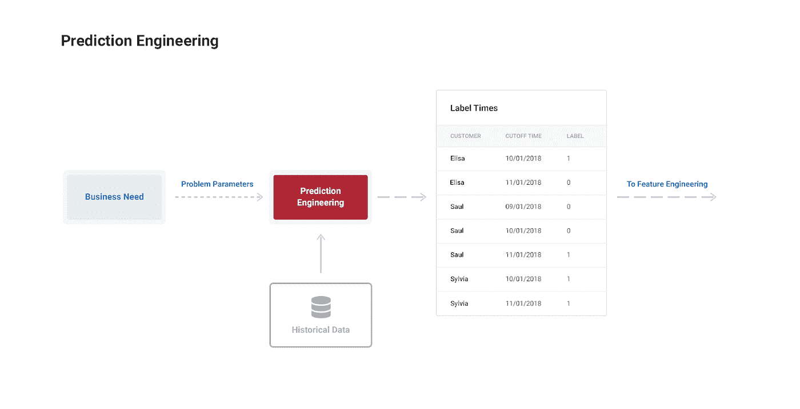
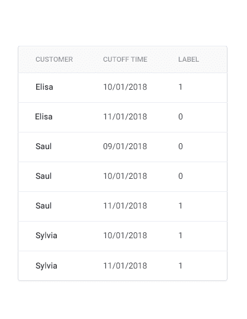
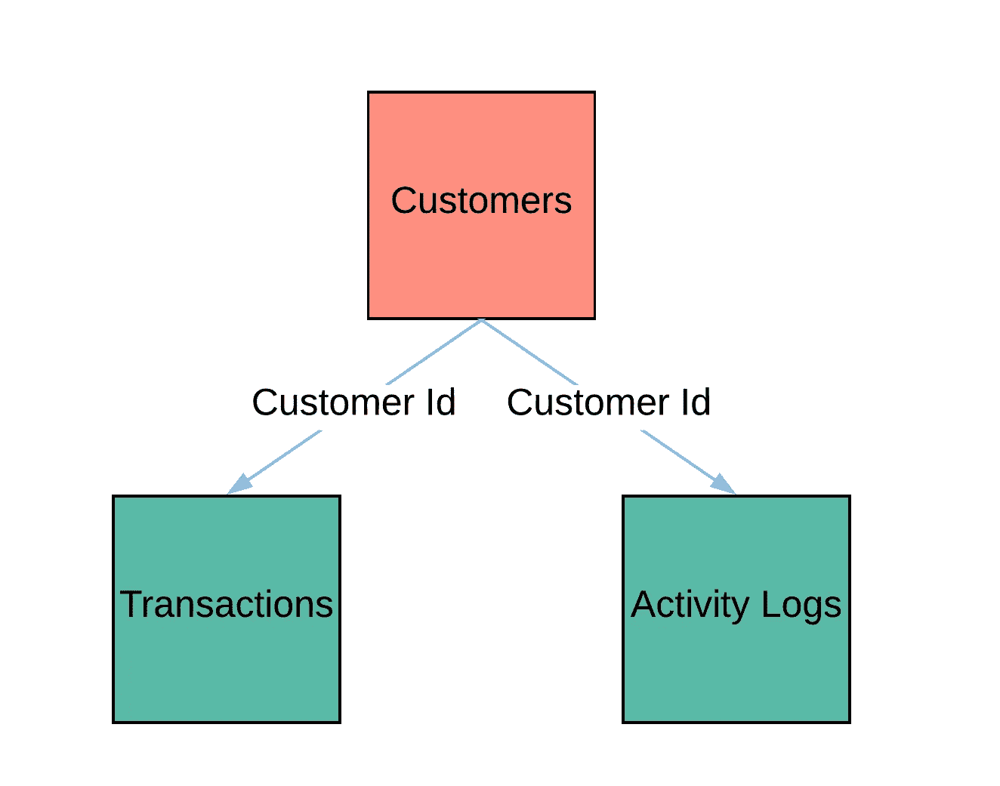
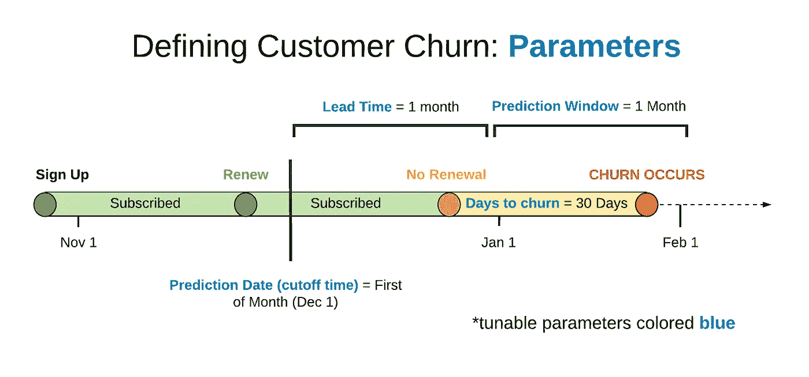

# 预测工程:如何设置你的机器学习问题

> 原文：<https://towardsdatascience.com/prediction-engineering-how-to-set-up-your-machine-learning-problem-b3b8f622683b?source=collection_archive---------2----------------------->


## 用机器学习解决问题的第一步的解释和实现

这是关于我们如何在[功能实验室](https://www.featurelabs.com)进行机器学习的四部分系列中的第二部分。这套物品是:

1.  [概述:机器学习的通用框架](https://medium.com/@williamkoehrsen/how-to-create-value-with-machine-learning-eb09585b332e)
2.  预测工程(本文)
3.  [特征工程:机器学习的动力](https://medium.com/@williamkoehrsen/feature-engineering-what-powers-machine-learning-93ab191bcc2d)
4.  [建模:教授算法进行预测](https://medium.com/@williamkoehrsen/modeling-teaching-a-machine-learning-algorithm-to-deliver-business-value-ad0205ca4c86)

这些文章将涵盖应用于预测客户流失的概念和完整实现。project [Jupyter 笔记本在 GitHub](https://github.com/Featuretools/predicting-customer-churn/tree/master/churn) 上都有。(完全披露:我在 Feature Labs 工作，这是一家初创公司开发工具，包括 [Featuretools](https://github.com/Featuretools/featuretools) ，用于解决机器学习的问题。这里记录的所有工作都是用开源工具和数据完成的。)

## 预测工程概念

当在机器学习任务中使用真实世界的数据时，*我们定义问题，*这意味着*我们必须开发自己的标签——*我们想要预测的历史示例——来训练监督模型。制作我们自己的标签的想法最初可能对数据科学家(包括我自己)来说是陌生的，他们从 Kaggle 竞赛或教科书数据集开始，其中已经包含了答案。

预测工程背后的概念——制作标签来训练有监督的机器学习模型——并不新鲜。然而，它目前还不是一个标准化的流程，而是由数据科学家在*按需完成*。这意味着，对于每一个新问题，即使是相同的数据集，也必须开发一个新的脚本来完成这项任务，导致解决方案无法适应不同的预测问题。

更好的解决方案是编写能够灵活改变业务参数的函数，允许我们为许多问题快速生成标签。这是数据科学可以从软件工程中学到[的一个领域:解决方案应该是可重用的，并接受不断变化的输入。在本文中，我们将看到如何实现一种可重用的方法来解决机器学习问题的第一步——预测工程。](https://www.cs.utexas.edu/~mitra/csSummer2014/cs312/lectures/bestPractices.html)

## 预测工程的过程

预测工程既需要从业务的角度得到指导，以找出要解决的正确问题，也需要从数据科学家的角度得到指导，以确定如何将业务需求转化为机器学习问题。预测工程的输入是定义业务需求预测问题的*参数*，以及寻找我们想要预测的例子的*历史数据集*。



Process of prediction engineering.

预测工程的输出是一个*标签时间*表:一组标签，其中包含从过去数据中获得的负面和正面示例，以及相关的*截止时间*，指示我们何时必须停止使用数据来为该标签创建特征(稍后将详细介绍)。

对于我们将在本系列中完成的用例——客户流失——我们将业务问题定义为通过降低流失率来增加每月活跃用户。机器学习问题是建立一个模型，利用历史数据预测哪些客户会流失。这项任务的第一步是制作一组过去客户流失案例的标签。

构成客户流失的参数以及我们希望进行预测的频率将根据业务需求而有所不同，但在本例中，假设我们希望在每个月的第一天进行预测，客户将在预测后的一个月内流失。流失将被定义为超过 31 天没有活跃会员。

> 重要的是要记住，这只是与一个业务问题相对应的客户流失的一种定义。当我们编写函数来制作标签时，它们应该接受参数，这样它们就可以快速地改变为不同的预测问题。

我们预测工程的目标是如下的标签时间表:



Example of label times table

根据历史数据，这些标签对应于客户是否有过交易。每个客户都被多次用作训练示例，因为他们有几个月的数据。即使我们没有多次使用客户，因为这是一个与*时间相关的*问题，我们也要正确地实现*截止时间的概念。*

## 截止时间:如何确保要素有效

没有*截止时间*标签就不完整，截止时间代表*当我们不得不停止使用数据为标签制作特征*时。因为我们在每个月的第一天预测客户流失，我们*不能使用第一个*之后的任何数据来制作那个标签的特征。因此，我们的截止时间都在每月的第一天，如上面的标签时间表所示。

每个标签的所有特征必须使用该时间之前的数据，以防止数据泄露的问题。截止时间是对时间序列问题建立成功解决方案的关键部分，许多公司没有考虑到这一点。使用无效数据来制作特性会导致模型在开发中表现良好，但在部署中失败。

想象一下，我们没有将我们的特征限制在每个标签的月 1 日之前发生的数据上。我们的模型会计算出在该月有付费交易的客户不可能在该月有交易，因此会记录较高的指标。然而，当需要部署模型并对未来一个月进行预测时，*我们无法访问未来的交易*，我们的模型将表现不佳。这就像一个学生在家庭作业上做得很好，因为她有答案，但在考试中却没有相同的信息。

## 客户流失数据集

现在我们有了概念，让我们来研究一下细节。 [KKBOX](https://www.kkbox.com/) 是亚洲领先的音乐流媒体服务，为超过 1000 万会员提供免费和按月付费的订阅选项。KKBOX 提供了一个[数据集](https://www.kaggle.com/c/kkbox-music-recommendation-challenge/data)用于预测客户流失。有 3 个略超过 30 GB 的数据表，由下面的模式表示:



Relational diagram of [data](https://www.kaggle.com/c/kkbox-music-recommendation-challenge/data).

这三个表格包括:

*   客户:背景信息，如年龄和城市(msno 是客户 id):


*   交易:每个客户每次付款的交易数据:


*   活动日志:客户倾听行为的日志:


这是订阅业务的典型数据集，是结构化关系数据[的一个示例](https://en.wikipedia.org/wiki/Relational_database):行中的观察值、列中的特性以及通过主键和外键连接在一起的表:客户 id。

# 查找历史标签

使预测工程适应不同问题的关键是遵循从数据集中提取训练标签的可重复过程。概括来说，这一点概括如下:

1.  根据关键业务参数定义正面和负面标签
2.  搜索过去的数据，寻找正面和负面的例子
3.  制作一个截止时间表，并将每个截止时间与一个标签相关联

对于客户流失，参数是

*   *预测日期*(截止时间):我们做出预测的时间点，也是我们停止使用数据为标签制作特征的时间点
*   *用户被视为流失前没有订阅的天数*
*   *提前期*:我们希望预测的未来天数或月数
*   *预测窗口*:我们想要预测的时间段

下图显示了每一个概念，同时用我们将要研究的问题定义来填充细节。



Parameters defining the customer churn prediction problem.

在这种情况下，客户在一月份已经有 30 多天没有订阅了。因为我们的提前期是一个月，预测窗口也是一个月，所以流失的标签与 12 月 1 日的截止时间相关联。对于这个问题，我们因此教导我们的模型提前一个月预测客户流失*，以给客户满意度团队足够的时间与客户接触。*

对于一个给定的数据集，我们可以从中做出无数的预测问题。我们可能希望预测不同日期或频率的流失，例如每两周一次，提前两个月，或者将流失定义为没有活动成员的较短持续时间。此外，我们可以用这个数据集解决其他与流失无关的问题:预测客户下个月会听多少首歌；预测客户群的增长率；或者，根据聆听习惯将客户划分为不同的群体，以定制更加个性化的体验。

当我们开发用于创建标签的函数时，我们将输入作为参数，这样我们就可以从数据集中快速生成*多组标签。*

> 如果我们开发一个拥有参数而不是硬编码值的管道，我们可以很快地采用它来解决不同的问题。当我们想要改变客户流失的定义时，我们需要做的就是改变管道的参数输入并重新运行它。

## 标签实施

为了制作标签，我们开发了 2 个功能(全部代码在笔记本中):

```
label_customer(customer_transactions, prediction_date = "first of month", days_to_churn = 31, lead_time = "1 month", prediction_window = "1 month") make_labels(all_transactions, prediction_date = "first of month", days_to_churn = 31, lead_time = "1 month", prediction_window = "1 month")
```

`label_customer`函数接收客户的交易和指定的参数，并返回一个标签时间表。该表包含一组预测时间(截止时间)和对应于单个客户的每个截止时间的预测窗口中的标签。

例如，我们的客户标签如下所示:


Label times for one customer.

然后,`make_labels`函数接收所有客户的交易和参数，并返回一个表，其中包含每个客户的截止时间和标签。

## 后续步骤

当正确实现时，预测工程的最终结果是一个可以通过改变输入参数为多个预测问题创建标签时间的函数。这些标注时间(截止时间和关联标注)是下一阶段的输入，在该阶段中，我们为每个标注创建要素。本系列的下一篇文章描述了特征工程如何工作。

# 结论

我们还没有发明预测工程的过程，只是给它起了个名字，并为管道中的第一部分定义了一个可重用的方法。

预测工程的过程分为三个步骤:

1.  确定可以用可用数据解决的业务需求
2.  将业务需求转化为有监督的机器学习问题
3.  根据历史数据创建标注时间

获得正确的预测工程至关重要，需要业务和数据科学两方面的投入。通过编写预测工程的代码来接受不同的参数，如果我们公司的需求发生变化，我们可以快速地改变预测问题。

更一般地说，我们解决机器学习问题的方法在标准化每个输入和输出的同时，将流水线的不同部分分段。正如我们将看到的，最终结果是我们可以在预测工程阶段快速改变预测问题，而不需要重写后续步骤。在本文中，我们已经开发了一个框架的第一步，该框架可用于解决机器学习的许多问题。

如果构建有意义的、高性能的预测模型是你所关心的事情，那么请通过[功能实验室](https://www.featurelabs.com/contact/)与我们联系。虽然这个项目是用开源的 Featuretools 完成的，但[商业产品](https://www.featurelabs.com/product)为创建机器学习解决方案提供了额外的工具和支持。