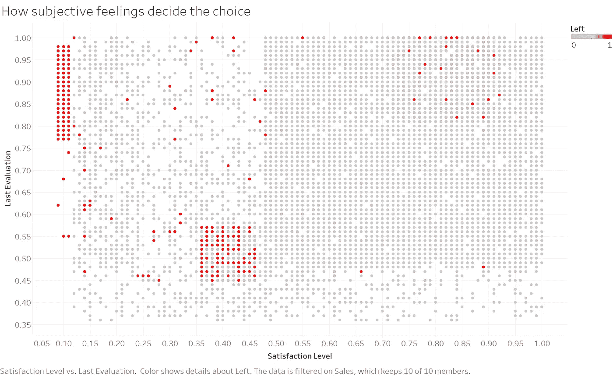
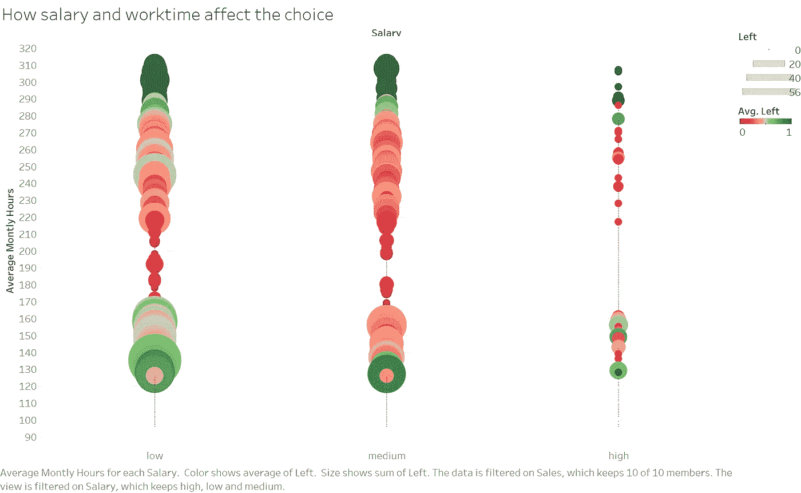
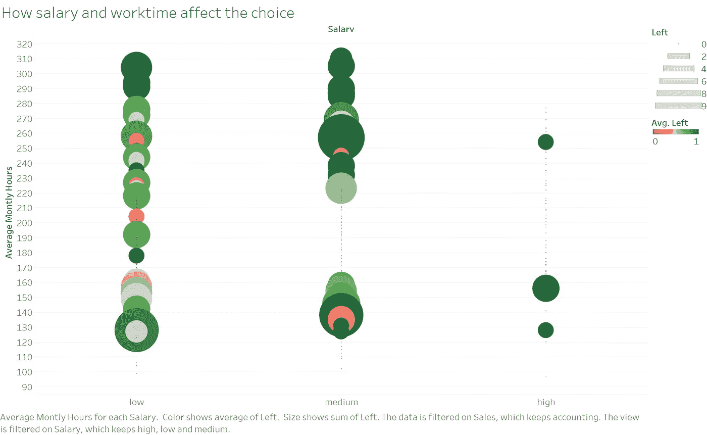
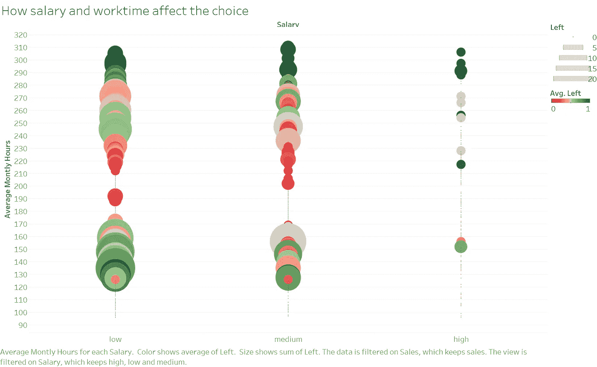
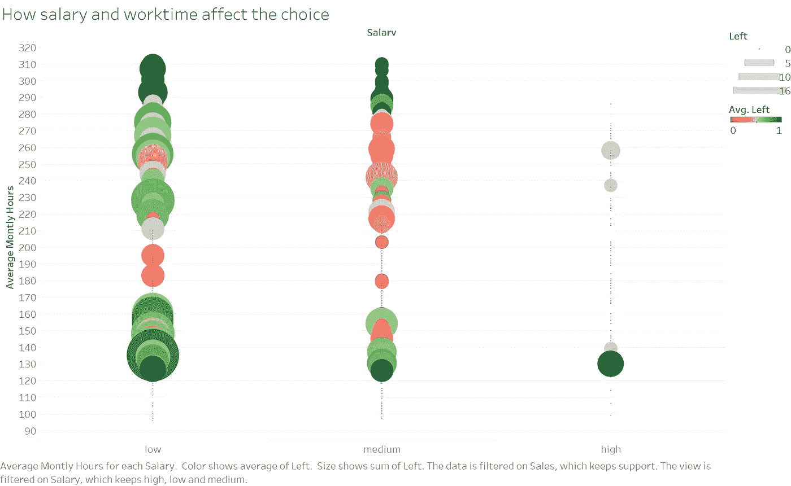
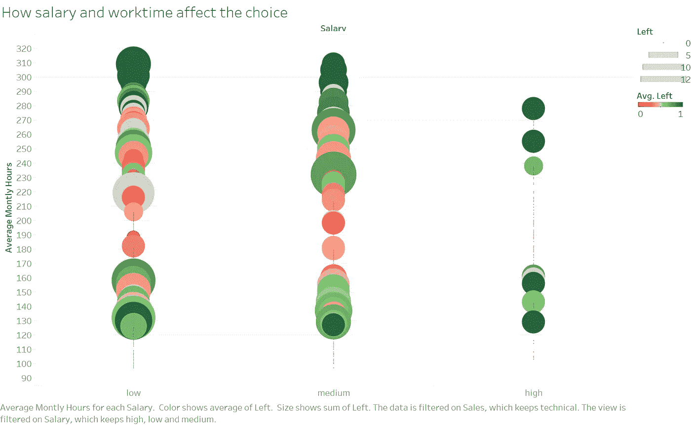
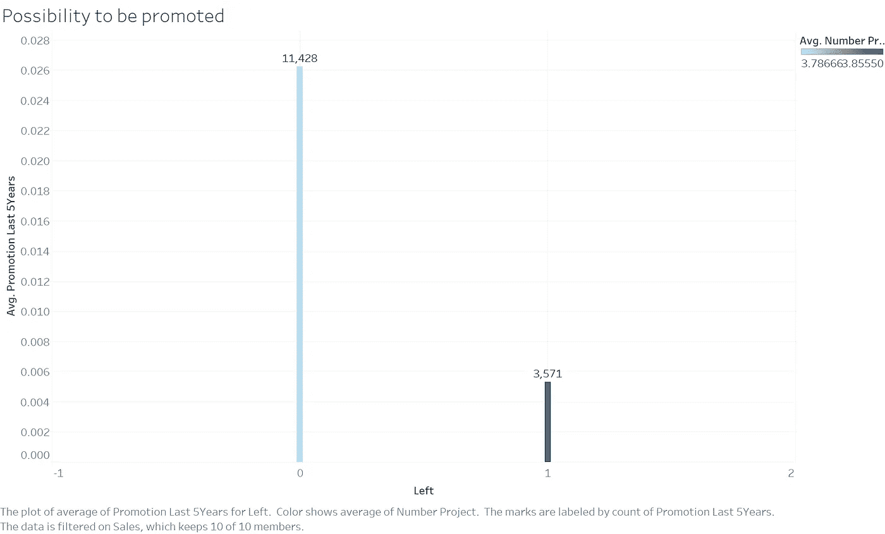

# 预测性员工流动分析第一部分

> 原文：<https://towardsdatascience.com/predictive-employee-turnover-analytics-b3d89526a06c?source=collection_archive---------0----------------------->

Kaggle 上有一个名为**人力资源分析**的新数据集。(【https://www.kaggle.com/ludobenistant/hr-analytics)这可能是一个探索不同机器学习工具的好机会，看看它们在预测二元变量的能力方面有何不同。更重要的是，这是一个公司迟早会遇到的真实情况。把它作为一个真实的商业分析案例会很有见地。在 Tableau 的帮助下，很容易快速而深入地查看数据集，它可以进一步帮助我决定在以后的学习中使用哪些机器学习工具。第一次做，从机器学习开始，到 Tableau 结束。然而，理想的过程是以非常直接和直观的方式查看原始数据。所以我真的应该从 Tableau 开始，然后去统计。

# 对数据的快速浏览

好的，我们开始吧。整个数据集包含 14999 行和 10 列。“左”列是我们知道雇员是否已经离开的地方。除“销售”之外的所有其他栏目都直接或间接与员工的选择有关。从“销售”我们知道一个雇员属于哪个部门。

A first look at the data

我选择计算他们的相关矩阵作为第一步。在 R 和 Excel 中很容易做到这一点，这给人一种它们之间如何相互关联第一印象。因为我知道它们实际上是相互关联的，所以将它们全部包含在分析中是安全的。

Correlation matrix

用黄色突出显示的行包含与响应相关联的相关性。尽管一些数字非常小，低至 0.006567，但在统计上仍然是显著的。我将在这里省略卡方检验。下一步我会去 Tableau 看看故事背后有没有商业本能。

# 谁要离开公司？

Fraction of leaving in each department

这张图表让观众大致了解了这家公司的情况以及营业额的来源。深蓝色部分代表周转率，用数字记为 1，否则记为 0。总更替率为 0.238，各部门之间的比率与整体比率非常接近。销售、技术和支持是三个最大的部门，大部分人员流动都发生在那里。

## 主观感受和客观表现如何决定选择

我们将研究个人满意度和员工评价如何影响离职选择。

x 轴表示满意度，y 轴表示绩效。灰色圆点代表较小的周转率，红色越多，周转率越高。请注意，在此图中有三个红色的主要集群。第一个在左上角。它包含高绩效和不太满意的人。广义来说，满意度低于 0.11 的人离职的可能性很大。还要注意，当满意度低于 0.11 时，很少有人工作出色。这一群人在我的警报系统中被标记为“极有可能离开”，HR 可以用它来识别那些考虑明天不再回来的人。第二个星团在中部偏左的某个地方。他们的满意度介于 0.36 和 0.46 之间，评价介于 0.45 和 0.57 之间。很难找到一个理由来证明他们的动机。他们似乎无法与他们的邻居区分开来。另一件要注意的事情是，这个区域的点变得非常密集。这个问题需要进一步调查，因为我不知道它为什么会发生。从数据中得到的唯一线索是，这里的点变得更密集，但在它右边延伸到右上角的另一个更密集的部分没有显示出类似的模式。在这个大而密集的区域，有一个部分比它的周围有更高的周转概率。为什么即使他们对工作非常满意，他们也很努力，但他们还是想离开？尽管他们不像右边的人那样“完全”满意，但他们也不像左边的人。他们当然表现得很好，但是这个事实如何让他们的离开成真呢？也许这两个指标并不能完美地解释失误者的行为。我可能忽略了一个更大的画面。另一个要问的问题是为什么要有集群？我可以理解低满意度产生了离开的动力。但是当有一群人不如一个人满足和努力的时候，为什么他更倾向于离开？这不是一个容易回答的问题，所以我将把它留在这里。我会试着去不同的部门看看，以便对公司有更详细的了解。由于与上面的整体图相似的图表显示了不同的部门，我将只显示人力资源部门。

上图在很大程度上复制了这一模式。令人惊讶的是，在不同的部门，人们至少在离职方面有着相似的动机。有没有可能 it 或技术部门比销售和管理部门更喜欢久坐，因此他们的心态和看待彼此的方式会有所不同？数据没有告诉我们这一点。既然这是模拟数据，也许本身就有偏差。或者，可能有一些东西长期以来对人们隐藏着。使用数据的目的实际上是让我们能够发现未被充分重视的秘密。

## 工资和工作量如何影响选择

工作并获得报酬。这是一枚硬币的两面。是时候从这个角度看了。

由圆圈组成的三个长图形包含从低到高的工资信息。在每个图形上，绿色圆圈越多，换手率越高，圆圈越大，总换手率越高。每个圆圈代表一群每月工作相同时间的人。

首先，我们将讨论公司层面。每幅图都有两个讨论，一个是关于营业额的可能性，另一个是关于营业额的数量。

**可能性**。在低工资水平上，处于两端的人很可能会离开，这意味着工作过度或工作不足、收入微薄的人辞职的频率更高。在极端情况下，当人们疯狂地长时间工作(超过 290 小时/月)时，离职率可以达到 100%。当工资提高到中等水平时，同一批人也更倾向于离开。但这一次，与收入较低的同行相比，收入较低的人不太可能离开。然而，有一点需要注意，那些仍然长时间疯狂工作的人几乎肯定会离开公司。随着薪水越来越高，辞职的人越来越少，但还是可以看到同样的模式。

**号**。收入较低的人有助于提高员工流动率，部分原因是薪资结构应该像金字塔一样。

接下来我会下到部门级别。会计是第一个上来的。

这张图看起来很“绿色”，与公司图不同。只要有人离开，这个圈子的可能性就很大。中等收入的人辞职很多，而且几乎可以肯定。然后是 HR 部门。

另一个“绿色”和独特的图形。然后就来了。

一个更加丰富多彩但仍然不同的画面。在低工资水平下，只要员工工作不到一定的时间，就有可能辞职。但是当那个人挣得更多的时候，除非他/她疯狂地过度工作或者无所事事，辞职是不可能发生的。接下来是管理。

描述正在发生的事情是一件容易的事情，但是请注意不同之处。下一步，我想展示三张图来展示数据分析的一个非常重要和普遍的部分。

这三个部分依次是销售、支持和技术。它们看起来与上面的图表非常不同，但与公司级图表相似。这解释了为什么上面的图看起来不同，它们受到这三个的影响。请记住，在开始时我说过这三个部门是公司中最大的三个部门，当然它们在很大程度上决定了公司级图表的外观。如果我不深入研究，这个部门特有的模式将永远不会被发掘出来。数据分析器永远不会遗漏细节。

接下来的部分将集中讨论晋升如何影响离职的选择。首先是图表:

不辞职的决定与高达 2.6%的晋升可能性有关，而明显辞职的那组人的晋升可能性不到 0.6%。使用统计数据，我可以告诉如果保证金是显着的，我不会在这里这样做。上图只显示了相关关系，而不是因果关系。我没有忘记在部门一级做我的研究，但我不会在这里展示它。IT 和营销在这方面有很大的不同。

我也研究过工伤事故在这里扮演的角色，但我不会在本文中说明，因为它可以比作晋升。

使用 Tableau 进行了大量的预先研究，以找出营业额数据中隐藏的秘密。就我个人而言，我学到了很多关于如何使用 Tableau 的知识，至少在两个方面，它确实不同于简单地使用统计数据来做研究。第一，当我经常分解数据集时，Tableau 功能更强大，使用起来更快捷。很容易立即切换、添加、更改内容。第二，Tableau 以一种耸人听闻的方式将数据与我联系起来。有时候看起来挺可爱的。

在接下来的第二部分，我将使用 logit 回归，KNN 和决策树来建立一个更科学的设置，我应该如何看待数据。