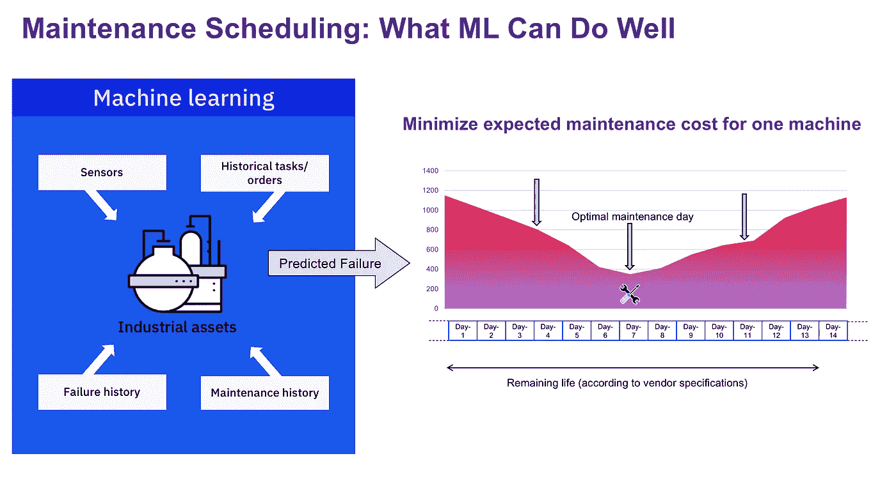
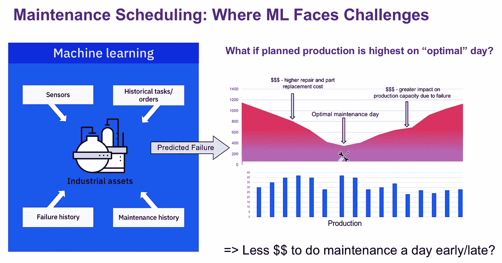
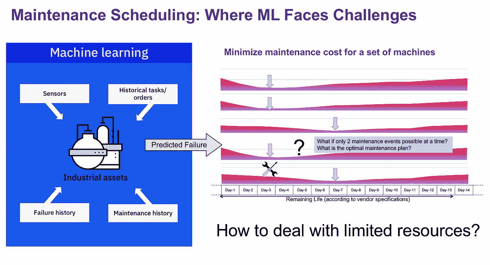
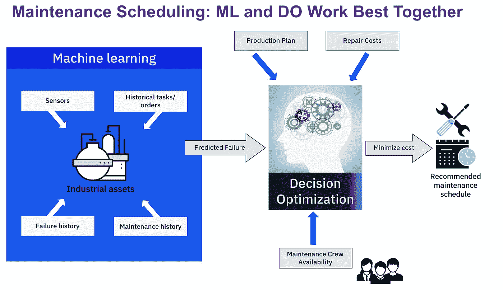
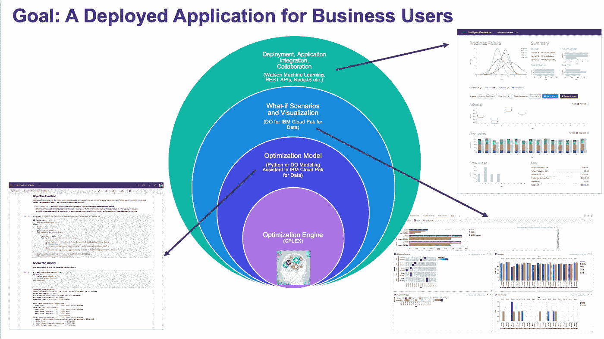
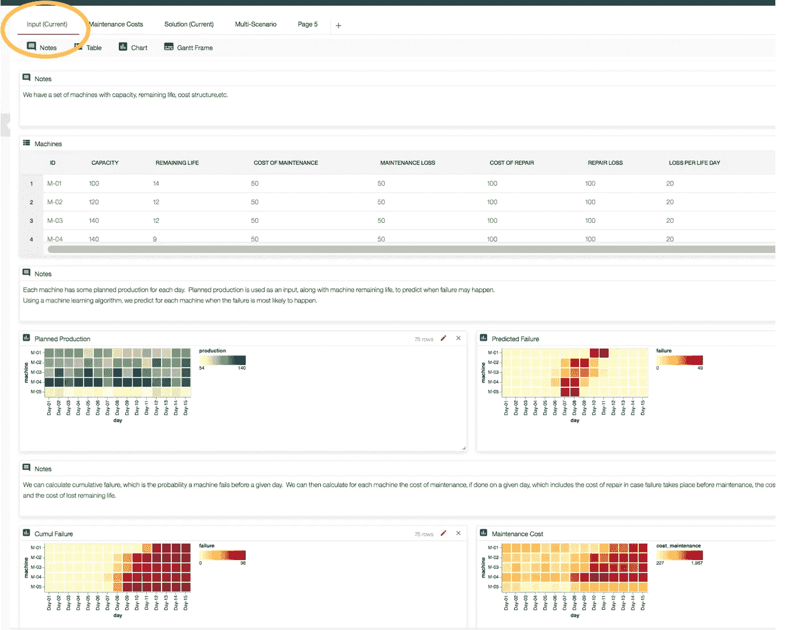
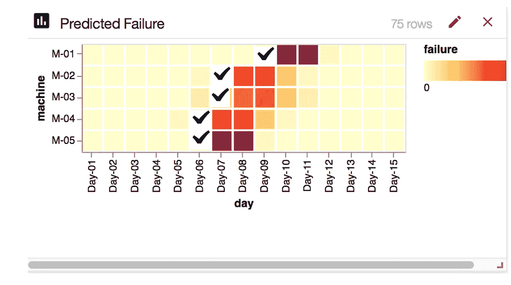
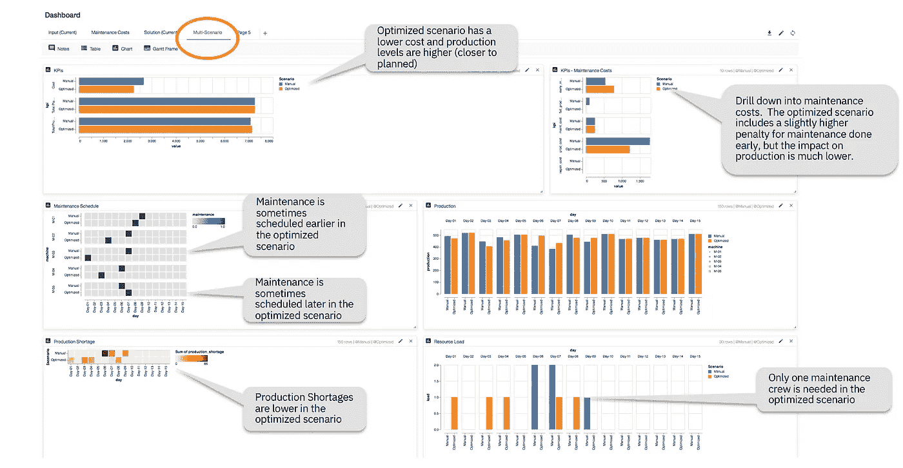
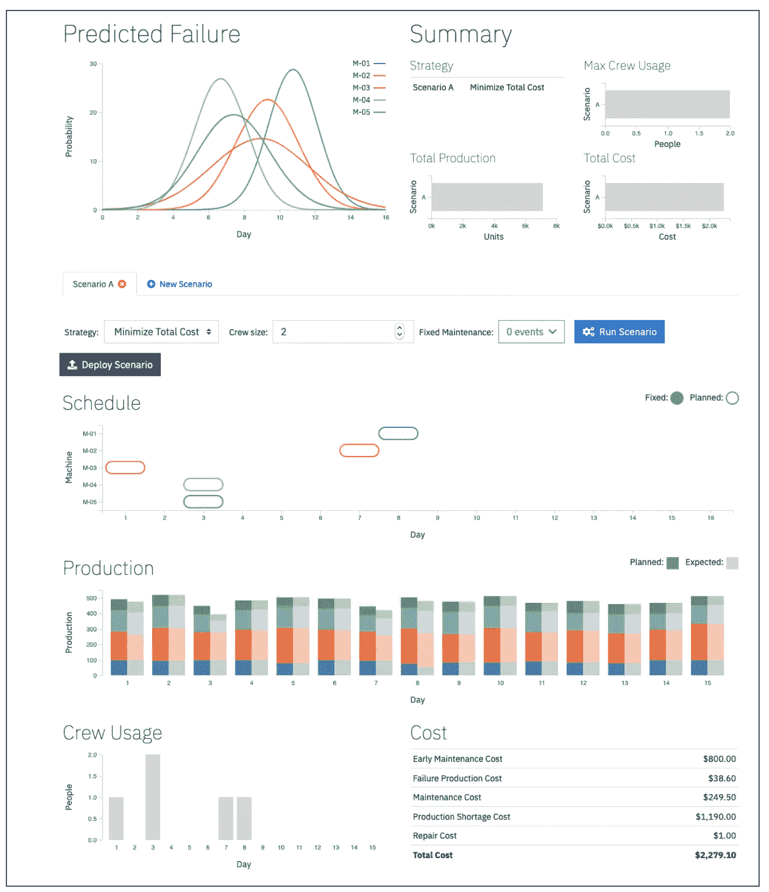
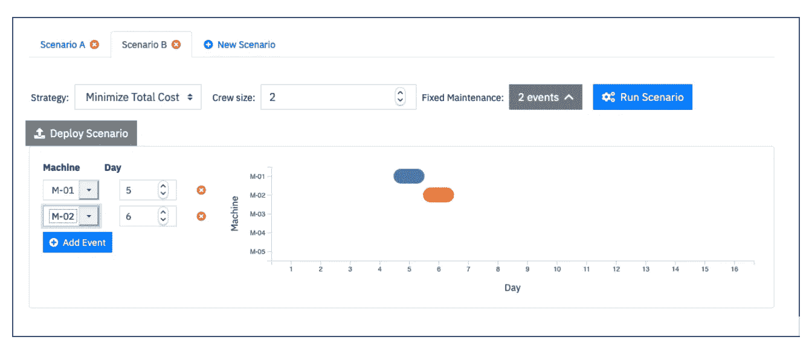

# 具有人工智能和决策优化的预测性维修计划

> 原文：<https://towardsdatascience.com/predictive-maintenance-scheduling-with-ibm-data-science-experience-and-decision-optimization-25bc5f1b1b99?source=collection_archive---------4----------------------->

## 如何通过在*准确的*时间安排维护来保持您的资产健康并降低维修成本

Photo by [Jacek Dylag](https://unsplash.com/@dylu?utm_source=medium&utm_medium=referral) on [Unsplash](https://unsplash.com?utm_source=medium&utm_medium=referral)

# 什么是预测性维护？

计划外维护是许多资产密集型行业(如制造业、石油和天然气业以及运输业)的一个关键问题。由于长时间的生产停工期，成本可能非常高。它们不仅导致高度紧急的维修和新机器和零件的投资，而且意外的生产损失可能影响供应商的义务并迫使公司从其竞争对手那里购买产品，从而导致巨大的意外成本。根据 Automation.com(2016)，每年因计划外维修造成的损失高达 200 亿美元。

预测性维护使用预测性分析和机器学习(ML)来确定机器的寿命以及机器在某一天发生故障的可能性。其理念是在设备出现故障之前，而不是在实际需要之前，利用这些信息来安排维护，从而避免与维修和生产损失相关的不必要成本(图 1)。根据行业的不同，资产的类型可以有所不同，从汽车和卡车到风力涡轮机、起重机和石油平台。

Figure 1: Predicting likelihood of failure helps determine the optimal time for machine maintenance

值得注意的是，与预防性维护相比，预测性维护具有真正的优势，预防性维护使用固定的更换和维修周期，通常基于供应商的规格。后者没有考虑机器的实际状态或机器运行的特定环境，例如生产水平或其他运行条件。因此，预防性维护通常是不准确的，并且由于修理计划太晚或太早而导致过高的成本。另一方面，预测性维护可以考虑历史数据，以便更准确地预测故障的可能性。

# 为什么预测故障是关键，但不足以解决维护计划的挑战？

机器学习模型可以考虑所有可用的信息，例如传感器数据、历史任务和订单、过去的故障历史和维护历史。因此，它可以根据每台机器的具体特征帮助确定最佳维护日(图 2)。

Figure 2: Predicting optimal maintenance day using ML (one machine at a time)

当我们一次考虑一台机器并且没有冲突优先级时，这种方法非常有效。然而，一旦我们开始引入一些复杂性、依赖性和有限的资源，确定最优的时间表就变得更加具有挑战性。例如，如果计划产量恰好在我们预测维护最佳的那一天达到最高(图 3)，该怎么办？在这种情况下，提前一天安排维修可能会降低成本，因为这样我们可以避免高峰生产损失。

Figure 3: An “optimal” maintenance day may not be optimal if scheduled production numbers are high

更重要的是，我们如何处理有限的资源？如果我们的 ML 模型预测第 3 天是三台机器的最优维修日(图 4)，但是只有两个维修组可用，我们该怎么办？

Figure 4: “Optimal” predicted maintenance day for each machine may not be feasible due to limited resources

# 决策优化有什么帮助(分三步)？

虽然机器学习可以考虑所有可用的数据和过去的历史来预测给定机器发生故障的可能性，但决策优化(DO)可以更进一步，生成一个对一组机器而言是*最优的调度，该调度受到有限资源*(例如，维护人员可用性)*其他约束和依赖性*(生产计划和维修成本)*和优化指标*(最小化总成本，最大化客户满意度/满足计划生产，最小化后期维护)*。*它不仅为我们提供了有价值的见解，而且还生成了*一个可操作的时间表或计划*(图 5)。

Figure 5: Combining the Power of Machine Learning & Decision Optimization for Maintenance Scheduling

与任何业务解决方案一样，仅仅创建一个模型是不够的。我们的最终目标应该是在业务用户和决策者手中交付一个解决方案。无论使用什么技术都是如此，方法也是相似的。在这里，作为一个例子，我们概述了 IBM Cloud Pak for Data (CPD)，即 IBM 数据和人工智能平台，如何用于构建预测性维护计划解决方案。关键步骤如下(图 6):

Figure 6: Decision Optimization application development and deployment using IBM Cloud Pak for Data

**步骤 0** :收集所有需要的数据，包括机器和故障率的历史信息。构建并部署一个机器学习模型来预测某一天发生故障的可能性。在 IBM Cloud Pak for Data 中，这可以通过多种方式完成，包括使用 AutoAI 自动选择和调整最佳模型，使用 scikit-learn 等开源包的 Python 或 R 中的模型，或者使用 SPSS Modeler 的图形用户界面。一旦模型被训练、验证和测试，它就可以被部署为在线模型，使用 REST APIs 进行访问。剩下的步骤集中在实现和部署优化模型和 web 应用程序上:

1.  建立一个 DO 模型来安排维护。在 IBM Cloud Pak for Data 中，这可以使用 CPLEX Python API 来完成。DO 模型的输入将包括 ML 模型的输出，即机器故障预测。
2.  配置可视化仪表板并执行假设分析，即并排创建和比较不同的场景。在 IBM Cloud Pak for Data 中，这可以使用决策优化*仪表盘*轻松完成，在仪表盘中，您可以通过更改输入、重新运行模型和可视化输出来创建和比较不同的场景。准备好之后，与业务用户共享仪表板，以获得关于模型和场景演示的反馈。
3.  一旦业务用户有机会查看仪表板和测试场景，就可以通过 REST API 将优化模型部署为可执行的在线模型。现在，您可以简单地构建和部署一个 web 应用程序(例如 Node.js ),或者在现有的应用程序中嵌入服务，并通过访问 ML 和 DO 在线模型来生成您的维护计划。

让我们更详细地看一下前三个步骤。

## 步骤 1:建模业务需求

决策优化模型的关键要素是*优化指标、约束和决策变量。*

优化指标定义了我们优化的目标(最小化/最大化)。在预测性维护的情况下，这些指标可以是以下任何一个或组合:

*   最小化成本(维护、劳动力)
*   最大限度减少后期维护
*   最大化生产
*   最大限度提高客户满意度

优化模型需要考虑许多约束条件，包括:

*   机器故障的预测可能性(ML 模型的输出)
*   维护对生产的影响(我们可能希望避免在计划生产水平最高的日子进行维护)
*   维护人员的可用性
*   机器特性(维修成本、剩余部件寿命成本等)。)

最后，需要做出的决策(建模为决策变量)决定了每台机器计划维护的日期/时间。这些值*不是*我们输入数据的一部分，而是由优化引擎作为解决方案的一部分自动确定。

## 第二步:形象化并并排比较场景

决策优化仪表板显示我们 DO 模型的输入和输出。“输入”选项卡可能如下所示:

DO for Cloud Pak for Data Dashboard — scenario inputs

在这里，我们可以看到一些关于机器及其特性、每日计划生产水平、预测故障(ML 模型的输出)和维护成本的数据。特别令人感兴趣的是预测故障图，它可以提供一些线索，说明何时安排维护是有意义的。假设我们想使用一种启发式方法，并计划“就在它变得太红之前”，这意味着机器很可能发生故障的前一天。我们将此视为我们的“手动”场景，并将维护事件定义如下(勾号表示维护事件):

Using a heuristic to determine the optimal maintenance day for each machine

我们还定义了一个没有固定维护事件的“优化”场景，并让优化引擎自动确定时间表。解决这两个方案后，我们可以在仪表板的多方案选项卡中并排比较解决方案:

DO for Cloud Pak for Data Dashboard — compare manual vs optimized scenarios side-by-side

显然，优化的方案导致更低的总成本和更少的生产短缺。查看维护时间表，很容易发现最佳维护日期并不明显，因为在某些情况下，最好提前几天安排维护，而在其他情况下，甚至推迟一天(机器 6)。优化方案还更好地利用了资源——与“手动”方案中的两个维护组相比，只需要一个维护组。优化的好处显而易见，即使是在一个非常小的问题上(6 台机器，15 天，和少量的约束)。想象一下，当一个问题很大时(成百上千的机器和大量的约束条件)，找到一个好的解决方案会有多难！

## 步骤 3:部署模型并将它们嵌入到您的应用程序中

一旦模型准备好，经过测试，业务决策者已经审查了场景，就可以在线部署了，剩下要做的就是开发和部署我们的 web 应用程序。我们的演示是使用简单的 Node.js 应用程序实现的。

如果需要，机器、生产水平和维护成本的最新数据将加载到单独的数据选项卡中以供参考:

在主“维护计划”选项卡下，我们连接到 ML 可执行服务以获得预测。每条曲线的顶部告诉我们每台机器最有可能出现故障的时间:

Connect to the executable ML service and obtain failure predictions

我们现在已经准备好调用优化服务，并通过单击按钮生成最佳维护计划*:*

Connect to the online DO model and obtain the optimal maintenance schedule in one click!

现在我们已经获得了最佳维护计划，我们可以通过创建新的场景并指定事件来轻松地手动修复一些维护事件(相当于上面讨论的 Cloud Pak for Data DO 控制面板中的“手动”场景):

再次求解该场景并将结果与原始结果进行比较，证实了最优解优于手动解(成本为 2，279 美元对 2，471 美元):

Solving the Manual scenario (using a simple heuristic to schedule maintenance) and comparing the results

当然，这只是一个使用 IBM Cloud Pak 实现数据、决策优化和 Node.js 的演示的简单示例。至于您可以做什么以及如何在自己的应用程序中呈现信息，可能性是无限的。

# 摘要

预测性维护计划是许多资产密集型行业的关键领域。创建最佳维护计划是一个具有挑战性的问题，最好使用机器学习和决策优化的组合能力来解决。虽然机器学习可以考虑所有可用的数据和过去的历史，以预测每台机器发生故障*的可能性，但决策优化可以更进一步，根据有限的资源、其他约束和依赖性以及优化指标，生成对一组机器而言*最优的时间表。*优化不仅能提供有价值的见解，还能生成*可行的时间表或计划。**

使用良好的预测性维护解决方案的好处是巨大的，包括但不限于:

*   更低的成本和更高的客户满意度
*   减少规划/调度时间和工作量
*   提高资产的可靠性和可用性
*   提高单个资产的运营效率

根据世界经济论坛和埃森哲的研究，预测性维护解决方案的商业价值是:

*   **-12%的调度成本**
*   **-30%的维护费用**
*   **-70%的非计划停机时间**

如果您的公司正在寻找更好的方法来优化维护计划或解决其他预测和优化挑战，请不要犹豫，寻求帮助。IBM 数据科学精英团队的使命是帮助我们的客户在数据科学之旅中取得成功，作为这一使命的一部分，我们免费提供初始客户服务。我们很高兴在数据科学/人工智能相关项目上与您合作。更多信息请参考[https://www . IBM . com/analytics/global elite/IBM-analytics-data-science-elite-team](https://www.ibm.com/analytics/globalelite/ibm-analytics-data-science-elite-team)。

如果你对更多的技术细节感兴趣，请继续关注这篇博客的后续文章。在下一篇文章中，我们将揭开 ML 和 DO 模型的面纱，探索一些真正的魔法！

# 附加链接

 [## 预测性维护在工业自动化中的重要性

### “每年因计划外停机造成的损失高达 200 亿英镑”(Automation.com，2016)。使用预测的有效方法…

www.linkedin.com](https://www.linkedin.com/pulse/importance-predictive-maintenance-within-industrial-dani%C3%ABl-visser/)  [## 付费项目:制造商如何实现顶级绩效

### 今天的工业组织承受着巨大的压力，不仅要保持竞争力，还要建立…

partners.wsj.com](https://partners.wsj.com/emerson/unlocking-performance/how-manufacturers-can-achieve-top-quartile-performance/)  [## IBM 分析数据科学精英团队| IBM

### 编辑描述

www.ibm.com](https://www.ibm.com/analytics/globalelite/ibm-analytics-data-science-elite-team)  [## IBM Cloud Pak for Data -概述

### IBM Cloud Pak for Data 是一个数据平台，它统一并简化了数据的收集、组织和分析

www.ibm.com](https://www.ibm.com/products/cloud-pak-for-data)  [## 智能维护加速器

### 查看所选文档的详细信息

community.ibm.com](https://community.ibm.com/community/user/cloudpakfordata/viewdocument/intelligent-maintenance-prediction?CommunityKey=c0c16ff2-10ef-4b50-ae4c-57d769937235&tab=librarydocuments)