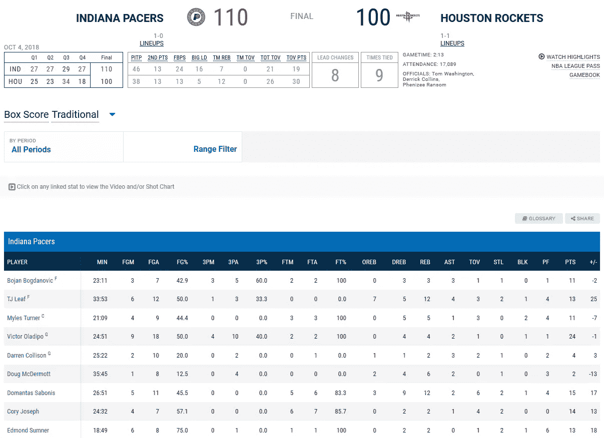
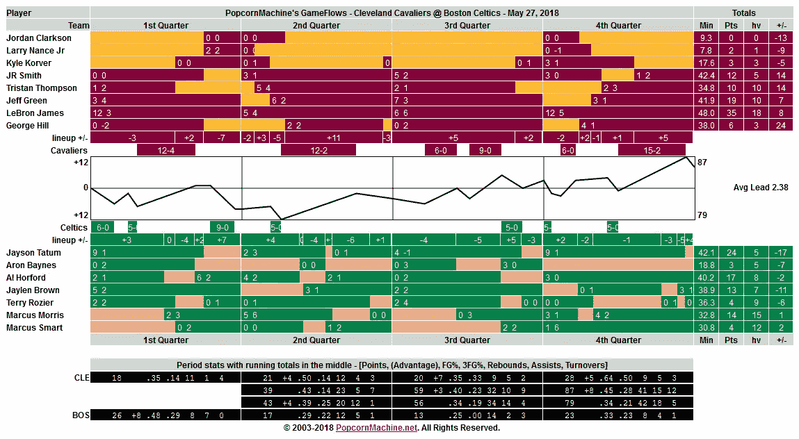
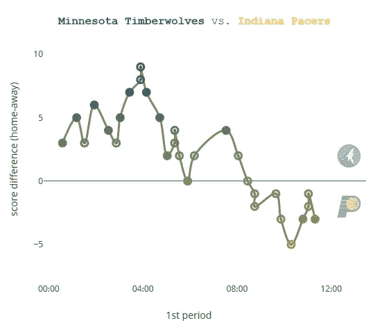

# 用 Python 假装了解 NBA

> 原文：<https://towardsdatascience.com/pretending-to-know-about-the-nba-using-python-699177a58685?source=collection_archive---------11----------------------->

*如何在不剥夺睡眠的情况下跟踪每年 1300 场 NBA 比赛？在*[*NBA . papiotis . info*](http://nba.papiotis.info/)*查看结果，如果你对背景故事感到好奇，请继续阅读。*

我从来都不是一个喜欢运动的人。正如大多数认识我的人可能猜到的那样，我更喜欢坐在电脑前，试图解决一些(自己造成的)编程难题，或者玩视频游戏。事实上，我作为一个“体育迷”的第一次经历是关注 [DOTA2 电子竞技](https://www.redbull.com/us-en/og-ti8-winners-dota-2)，也就是说，看人们玩电子游戏比我玩得好得多。

The Greek Freak casually flying over a 1.98m man.

然而，在 2018 年初，我的注意力被篮球神童[扬尼斯·阿德托昆博](https://en.wikipedia.org/wiki/Giannis_Antetokounmpo)(又名*希腊怪胎*)所吸引。对于那些不了解他的人来说，詹尼斯是一名尼日利亚血统的希腊篮球运动员，23 岁的他正在 NBA 掀起巨大的涟漪。詹尼斯在雅典艰难的条件下(轻松地说)成长，进入 NBA，并以其令人难以置信的运动能力成为联盟中最好的球员之一，不断给球迷和分析师带来惊喜，这真的激励我去了解更多关于他的进步。

当然，这意味着我必须了解 NBA 是如何运作的，更重要的是，找到一种方法来跟踪每个赛季大约 1300 场比赛。让我们暂时记住这个数字: *1300。火柴。这还没有考虑到这样一个事实，对于生活在西欧的人来说，大多数比赛都在 02:00 到 04:00 之间开始——这不是一个理想的场景，除非你是一个失眠症患者。*

所以，我找到了一个新的标题:一个简单、容易理解的 NBA 比赛摘要，人们可以简单地浏览一下，并立即感受到比赛的进展。

# 外面有什么

在深入研究原型制作之前，我想先了解一下已经可用的东西——还有什么比直接找到来源更好的方法呢:[NBA 自己的统计页面](http://stats.nba.com)。

Thanks NBA, I *totally understand all of these.*

现在，让我澄清一下:我很感谢 NBA 统计页面。它本质上是一个开放的海量数据存储库，任何人都可以通过各种方式进行咨询，以获得关于这个季节的深入信息。但是你知道 NBA 的统计页面有什么不好吗？

新人。

NBA 统计页面充斥着带有神秘缩写名称的统计数据，对于新人来说，这根本不是一个了解昨晚比赛的好地方。甚至每场比赛的盒子分数(结果总结)也向你显示了最终分数，每个季度末的分数，然后是一系列我的 NBA 新手大脑无法处理的数字和字母。

Me trying to understand the stats page for a single match.

当然，最后的分数可以告诉你谁赢了，但是每天有 5-10 场比赛，那只是一个数字。它不会告诉你这场比赛是否有趣到足以让你去看视频集锦或者看完整场比赛；它没有传达很酷的故事情节，比如一个队在整场比赛落后后在最后一分钟获胜。

浏览了一下，我发现了一些更好的选择，如[爆米花机的 GameFlow](http://popcornmachine.net/) 或 basketball-reference.com 的。这些更受欢迎，传达了游戏进展的感觉，但仍然充满了我无法理解的统计数据，在我看来，有点刺眼。

Popcorn Machine’s GameFlow: much better, but still too ‘stats-y’ for my taste.

因此，基于我自己的需求和对当前产品的想法，我开始为我想做的东西确定一些要求:

*   **简单。**没有统计数据，没有深入的信息。反正我是不会理解的(至少在那一点上不会)！如果有人想找到详细的统计数据，已经有很多很好的选择。
*   **目测。只要看一眼摘要就能知道比赛中发生了什么。此外，最终结果应该是光滑和悦目的，因为这个想法是每天检查多个摘要。**
*   **互动。由于把可视化做得太简单，我冒了让它变得肤浅和无趣的风险。交互性可以让我为用户增加一些额外的奖励，而不用一开始就把它推到他们面前。**

# 我做了什么

最终结果可在 [nba.papiotis.info](http://nba.papiotis.info) 获得。它看起来是这样的:

Example visualization for a match. The difference in score is plotted as a line along time, with markers for each successful shot. The color of the line and markers change according to which team is ahead at any given moment.

你可以从日历中选择一个**日期**，下拉菜单会列出该日期的所有 NBA 比赛**。选择一个匹配项会在下面显示出来。为了方便起见，当您第一次打开页面时，会自动选择最近的匹配项，这样就可以很容易地快速查看最新的匹配项，如果您想赶上进度，还可以返回旧的匹配项。**

可视化本身是一条**线**代表两队之间的**比分差异**，每一次成功射门都有**标记**。我决定使用分数差，因为这样很容易看出**谁领先**，以及领先**多少**。这样，一条在整场比赛中始终高于零的线显示了一场一边倒的比赛，主队在整场比赛中占据主导地位；相反，一条不断在零附近振荡的线表明比赛很接近，两队都没有取得绝对领先。为了避免混淆图的哪一侧对应于哪支球队，每支球队的标志都显示在图的右侧。

An eventful first period in the Timberwolves vs. Pacers match from 22/10/2018.

线和标记的**颜色**会随着时间的推移而变化，这取决于哪支球队领先，通过查看可视化标题，您可以快速看出哪种颜色对应于哪支球队——在左侧的示例中，明尼苏达森林狼队主场迎战印第安纳步行者队。看看这条线的颜色是如何渐变的，从蓝色(森林狼领先)，到绿色(比分扳平)，最后是黄色(步行者领先)。

如前所述，你可以看到圆形标记，表示每一个成功的拍摄。将鼠标悬停在这些标记上方会给出每个事件的简短描述，如下图所示:

Details about each successful shot are revealed by hovering over with the mouse.

悬停文本为您提供有关当前比分的信息，以及由 NBA API 自动生成的简短文本描述，例如:

> 格兰特 24 英尺 3 分跳投(8 分)(威斯布鲁克东部时间 4 分)

这告诉我们的是，****三分跳投*** 距离 ***24 英尺远*** 把他的 ***总得分提高到了 8*** 。他是由*的 ***助攻*** 的，包括这个传球在内，到目前为止在比赛中已经给了 ***4 次助攻*** 。**

**简短的描述有助于快速获得所有必要的信息，而不必像上面的解释性句子那样阅读完整的句子，但它有点枯燥。来点赏心悦目的东西让事情变得更愉快怎么样？**

**到目前为止，您可能已经注意到，虽然所有的乐谱标记都是圆形的，但其中一些标记填充了颜色，而另一些标记是空的。这是因为**点击满标记显示该特定镜头的视频高亮**！**

****

**Clicking on a marker shows a video highlight, as well as a more-human readable description of that play.**

**不幸的是，NBA 不会为每一个镜头提供精彩镜头，但平均来说，大约 60%的镜头都伴随着视频精彩镜头。此外，我还解析了短格式的文本描述，并将其转换为更容易阅读的句子，例如: *X 在 y 的帮助下完成了转身跳投。*这样您可以两全其美:悬停时的快速编码描述，以及点击时对该事件的更丰富的描述。**

**仅此而已！比赛每小时自动更新一次，当前可用的可视化比赛可以追溯到 2017-2018 赛季初。**

**我很乐意看到这对其他人有用，所以去 http://nba.papiotis.info/的[开始你的 NBA 吧！](http://nba.papiotis.info/)**

# **可以添加一些很酷的额外功能**

**虽然快速赶上 NBA 比赛的基本目的已经包含在上面了，但是我不能停止想一些额外的东西&我可能会添加的新功能。以下是我目前为止的一些想法:**

1.  ****自动集锦卷**
    因为我已经有了一个及时订购的视频集锦列表，所以很容易添加一个“显示所有集锦”按钮，一个接一个地播放它们，以创建一个即兴的比赛集锦卷。**
2.  ****按关键词过滤事件**
    如果我能输入“Antetokounmpo dunk”或“Curry 3PT”就能看到詹尼斯扣篮或斯蒂芬·库里投进三分的所有瞬间，岂不是很酷？**
3.  ****分享比赛和/或集锦**
    有时我想分享一场特定的比赛，因为可视化真实地传达了它是如何来回的。或者，浏览视频集锦，看到一些只是很脏，需要分享的东西。我可以分享视频文件本身的链接，但是如果在 URL 栏中有一个显示页面当前状态的代码(比如/*m = match id&h = highlight id)*就更酷了，它可以立即被复制和分享。**

**当然，在我实际实现这些之前，它们都是科幻小说——也就是娱乐性的！所以，请在下面的评论中提出你想要的任何建议(或者给我发电子邮件)，我们可以一起构思出最酷的 NBA 视觉化东西(但不保证会实现)。**

**感谢阅读，
- [帕诺斯](http://papiotis.info)**

# **笔记**

1.  **在美国体育运动中，传统上客场球队的名字排在第一位，主场球队的名字排在第二位，而在欧洲体育运动中，通常情况正好相反。在意识到这个小怪癖之前，我就开始以欧洲风格开发一切东西，并决定保持这种方式。**
2.  **和大多数体育联赛一样，每支球队的特点是多达**三种颜色**(主场、客场、替补)；为了创造一个漂亮、突出的配色方案，我用 [CIE94 公式](https://en.wikipedia.org/wiki/Color_difference)为客队选择与主队主色**最不一样的**颜色。**

# **额外阅读:实现细节**

**还在读书？酷毙了。这里有一些关于技术部分的细节，以防你好奇。**

**我毫不怀疑，从一开始，这需要一个基于浏览器的原型。基于不断更新的在线数据的交互式可视化几乎注定要存在于浏览器中；智能手机应用程序是一个不错的选择，但这意味着一些样板文件和部署问题，我并不急于接受。另外，我想在大屏幕上欣赏这个。**

**现在，有很多开发环境可以开发基于浏览器的软件，但是 **Python** 几年来一直是我的个人爱好(对 [@chaosct](https://twitter.com/chaosct) 大声喊出来，因为它把我推向了那个方向)。Python 使得在 Jupyter 笔记本[中立即开始原型化和尝试不同的东西变得很容易，并且将原型的好的部分转移到部署就绪的解决方案中从来都不是一件痛苦的事情。几乎所有的东西都有记录良好且持续支持的库，还有一个很棒的开发者社区，他们乐于以可重用的方式分享他们的创作。](https://jupyter.org/)**

**在用 [Matplotlib](https://matplotlib.org/) 的交互模式和[散景](https://bokeh.pydata.org)进行了一些快速研究和测试后，我最终决定使用 [plot.ly](https://plot.ly/) 来创建可视化效果。大量的文档、示例及其绝对令人惊叹的姐妹框架 [Dash](https://plot.ly/products/dash/) 意味着我可以在一个生产就绪的 web 框架内创建强大的交互式可视化，该框架与我的所有其他 Python 代码配合良好，可以抓取、清理和检索匹配数据。**

**这就把我们带到了下一点:获取数据。NBA 提供了一个 RESTful API，包含每场比赛的统计数据，虽然数据丰富，但几乎没有文档。事实上，现存的少量文档是由与 NBA 无关的其他开发者提供的。我很幸运地发现了 [nba_py，](https://github.com/seemethere/nba_py)一个整洁的 NBA stats API 的小 python 包装器，它为 API 端点提供了一点文档，并与 [Pandas](https://pandas.pydata.org/) 集成，这使得清理和组织数据变得轻而易举。**

**最大的挑战之一是 NBA 统计 API **在收集了几场比赛的数据后封锁了我的 IP** 。NBA 禁止 IP 的方式是简单地让请求无限期挂起，这比得到 403 错误或类似的错误更令人讨厌——这样我就知道我被 IP 阻止了，而不是花大量时间调试，最终发现 NBA 对我冷淡。**

**除了在家里屏蔽我的个人 IP(没错，我自己不能访问 stats.nba.com)，NBA stats API 还会自动屏蔽来自 AWS 或 GCP 等已知提供商的任何 IP。这是一个大问题——我应该在哪里主持这个东西，这样 NBA 就不会阻止它了？如果我把它放在某个地方，只刮了几根火柴就被屏蔽了呢？**

**最后，我用 Python 编写了一个代理旋转器，这样每个发送到 NBA stats API 的请求都来自不同的 IP。为了避免再次被封锁，我不会透露太多关于具体细节的信息，但如果你很好奇，可以在这里查看这类事情的演练:[https://www . screphero . com/how-to-rotate-proxy-and-IP-addresses-using-python-3/](https://www.scrapehero.com/how-to-rotate-proxies-and-ip-addresses-using-python-3/)。**

**整个 shebang 托管在 [Python Anywhere](https://www.pythonanywhere.com/) 上，使用起来超级简单，总体来说是一次非常愉快的体验。这项服务很便宜，设置只花了我 10 分钟，在少数情况下，我需要一些客户支持，他们反应很快，很友好。100%推荐！**

**这大概是对技术栈的总结。如果你对体育数据可视化感兴趣，我推荐 Perin 等人的这篇优秀的综述。**