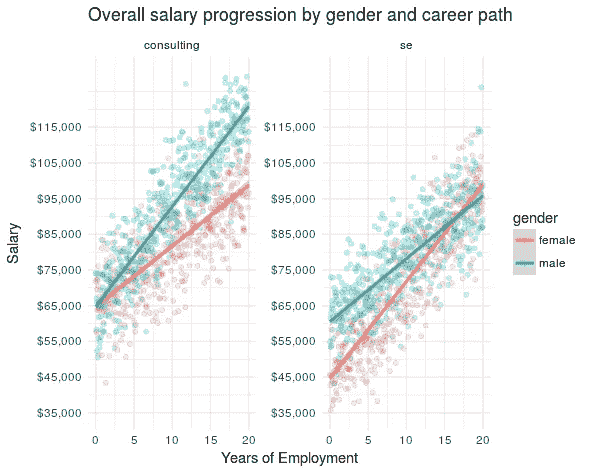

# 防止机器学习偏差

> 原文：<https://towardsdatascience.com/preventing-machine-learning-bias-d01adfe9f1fa?source=collection_archive---------5----------------------->

机器学习算法越来越多地用于围绕评估员工绩效和流动率、识别和防止累犯以及评估工作适用性做出决策。这些算法的规模很小，有时在充满高质量研究和工具的环境中开发起来也很小。不幸的是，这些算法没有阻止和自动化的一件事是，如何以一种不会导致偏见和负面自我强化循环的方式来构建你的数据和训练管道。这篇文章将涵盖使用**偏差感知**而不是**盲目**方法忠实消除算法偏差的解决方案。

Photo by [moren hsu](https://unsplash.com/photos/VLaKsTkmVhk?utm_source=unsplash&utm_medium=referral&utm_content=creditCopyText) on [Unsplash](https://unsplash.com/search/photos/math?utm_source=unsplash&utm_medium=referral&utm_content=creditCopyText)

# **为什么防止偏见很重要**

来自算法的预测通常不会在真空中使用。相反，它们被用来驱动决策和优化某些结果。如果你处理的数据有一些固有的偏差，模型不仅会学习这些偏差，而且最终会放大它们。有了有偏见的数据，模型的结果将以自我实现的预言而告终，这在许多情况下会导致灾难性的后果。我不认为我能对人工智能中的道德话题给出足够的报道，因为我想提供更多实用的解决方案，告诉人们如何设计他们的训练管道，使其对偏见更加鲁棒。相反，我强烈推荐阅读来自 fast.ai 的 Rachel Thomas 的[人工智能伦理资源](http://www.fast.ai/2018/09/24/ai-ethics-resources/)，以获得关于该主题的更详细的讨论。

# **盲算法**

从算法中移除偏差的最常见方法是显式移除与偏差相关的变量。例如，如果您想预测某个职位应该雇用谁，您可以包括相关的输入，如申请人拥有的技能和经验，并排除不相关的信息，如性别、种族和年龄。这种方法的问题在于它不起作用。您想要包含的一些变量会受到潜在输入的影响。换句话说，你不能一边说“让我们把种族从模型中排除”一边又包括另外二十个有助于编码某人种族的变量。我将提供两个像这样盲目的方法失败的例子。

**亚马逊招聘**

最近[路透社报道](https://www.reuters.com/article/us-amazon-com-jobs-automation-insight/amazon-scraps-secret-ai-recruiting-tool-that-showed-bias-against-women-idUSKCN1MK08G)亚马逊一直在试图开发一种工具来自动化简历筛选和招聘。这个项目不得不被取消，因为它显示出对女性的严重偏见。我相当肯定，从事该模型工作的工程师没有使用任何明确的变量来识别某人的性别。尽管如此，要消除该模型识别与性别相关的其他潜在变量的能力，并且不歧视简历中包含“女子象棋俱乐部队长”的求职申请，是一项挑战。换句话说，如果数据有偏差(在这种情况下很有可能出现这种情况),当给定一组大而全面的特征时，模型会找到一种方法来对该信息进行编码。

**预测累犯**

两年前，Pro Publica 为[提供了一个很好的分析软件，用于预测累犯率。他们发现，嵌入该软件的模型在非裔美国人中的假阳性率比白人高得多。开发该软件的公司指出，他们用来评估一个人再犯风险的 137 个问题中没有一个将种族作为输入。尽管如此，如果你看一下问卷，不需要太多的洞察力就能注意到一些主题可能与种族相关，并在判断申请人的风险时鼓励偏见。例如，当你问某人他们的父母是否在成长过程中被分开，你是在间接地编码他们的种族。al，2015，来理解不同种族的离婚率有多么惊人的不同。这又是一个盲目的方法不起作用的例子，因为没有考虑到潜在的变量。](https://www.propublica.org/article/machine-bias-risk-assessments-in-criminal-sentencing)

# **偏差感知算法**

我建议我们反其道而行之，而不是去除与有偏见的结果直接相关的变量。换句话说，**为了知道你的数据中存在多少偏差，你需要让你的模型正确地测量它，然后减去偏差对结果的影响**。我将通过一个人为的模拟来检验这种技术的有效性。

我们的模拟数据将包含以下特征:性别(我们将关注大多数性别:男性和女性)、经验年限和职业(我们将关注两种职业，软件工程和咨询)。我们的目标是预测给定这些特征的人我们应该支付多少薪水。

我们的数据将具有以下关系:

*   总的来说，工作年限和薪水之间有明显的正相关关系
*   相对于做软件工程师来说，做顾问会让你赚更多的钱
*   身为男性会比身为女性赚更多的钱
*   我们要考虑几个关键的相互作用。在咨询行业，男性和女性的起薪相同，但男性的工资增长高于女性。换句话说，对于每一年的工作经验(或每一次晋升)，男性的工资预期会增加
*   在软件工程领域，女性从低端起步，然后必须经历一段时间的追赶

你可以在下面找到上面描述的所有关系。

请注意，我们有目的地创建一个“看起来”真实的场景，并描述不同层次的交互，因为我想展示偏见意识方法在推广到具有数百个变量和多层复杂性的问题时的优势。

为了消除数据中偏见的影响，我们需要建立一个忠实代表性别偏见的模型。在下面的代码中，我们有一个非常简单的训练管道来完成这个任务。

下面你可以在测试集上找到模型预测。正如你所看到的，这个模型概括得非常好，并且设法捕捉到了数据中所有的主要影响和相互作用。

接下来，我将提取特定于预测的相互作用，以消除它们的影响。在这种情况下，我使用的是 [XGBoost](https://xgboost.readthedocs.io/en/latest/) ，它已经实现了[Shapley Additive explain](https://github.com/slundberg/shap)方法，这是一种在单个预测级别提取特征贡献的一致、快速和确定的方法。这个方法在其他流行的 boosting 库中已经可用，比如 CatBoost 和 LightGBM。如果你的预测中不存在决定论的问题，你也可以使用[时间](https://github.com/marcotcr/lime)，或者如果你使用其他类型的算法，如 L1 或 L2 线性回归导数，从手工编码的交互中提取权重。

“交互”对象将包含一个 numpy 形状数组(n_samples，n_features + 1，n_features + 1)，其中包括所有主要效果、交互和截距。下面是测试集中第一次观察时该数组的样子:

Note that the numbers look small because the outcome was log-transformed before training.

接下来，我们简单地取消所有由性别变量驱动的影响。

然后，我们可以计算我们的预测，并绘制它们。我们可以立即看到，任何偏见的迹象都被完全消除了，该模型忠实地捕捉到了由多年的就业和职业道路所驱动的变化。

感知偏差的建模方法可以应用于其他类型的输入数据:文本、图像、声音。如果您使用依赖于实体嵌入的 NLP 模型，您可以显式地编码更敏感的概念，并跟踪与这些概念相关的嵌入如何与其他嵌入交互。请注意，谷歌似乎也使用了类似的方法。

# 结论

我想从一开始就指出，毫无疑问，这种方法会导致验证数据的模型性能下降。在我们设计的例子中，对于编码偏差的预测，RMSPE 是 12%,对于去除性别因素的预测，是 14%。尽管如此，在许多情况下，这种性能下降是可以接受的，也是受到鼓励的。毕竟，你的模型的目的不仅仅是做出好的预测，而且还能让你找到利用杠杆的方法，比如修改你网站上的用户行为，或者在诊断疾病时防止有害的事情发生。因此，如果你想建立一个不受数据偏见影响的模型，让模型首先测量偏见的数量，然后将所有偏见因素重置为零是不会错的。