# 价格弹性:首先是数据理解和数据探索！

> 原文：<https://towardsdatascience.com/price-elasticity-data-understanding-and-data-exploration-first-of-all-ae4661da2ecb?source=collection_archive---------2----------------------->

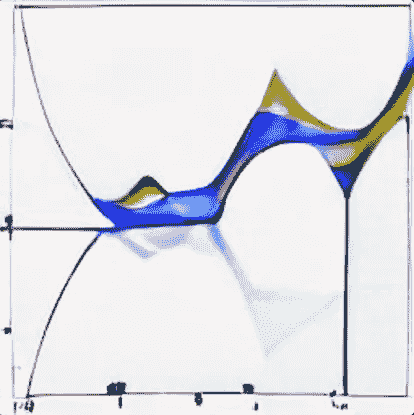

在我之前的一篇文章[中，我描述了如何使用最常用的指标和图表来评估回归。我举了一个关于价格弹性建模的](http://tiny.cc/evaluate-regressions)[实验](https://gallery.azure.ai/Experiment/Modeling-Price-Elasticity-Part-3-Price-Elasticity-with-Combo-and-External-Factors-1)为例，在用残差图分析模型后，发现测试数据集在 9 月 1 日之后出现了问题:

fig. 1 — The calendar_date variable vs residuals plot shows that something strange happens after the 1st of September (by the author)

本文将展示 R 中用于更好的数据探索的工具，展示为高性能预测建模准备数据的好方法。这也是试图解释之前出现的问题的唯一方法。

如果你想从数据集开始而不使用上面建议的实验，你可以在这里得到它们[。](https://1drv.ms/u/s!AtgrmeCPhKh7kYIacOREVS-3gUjxZw)

# 千万不要照原样把所有的都放进锅里

打开*Azure Machine Learning Studio*中的价格弹性实验，我们可以看到，在三个不同数据集之间的连接之后，在所有数据转移到建模阶段之前，只有很少的基本数据转换:

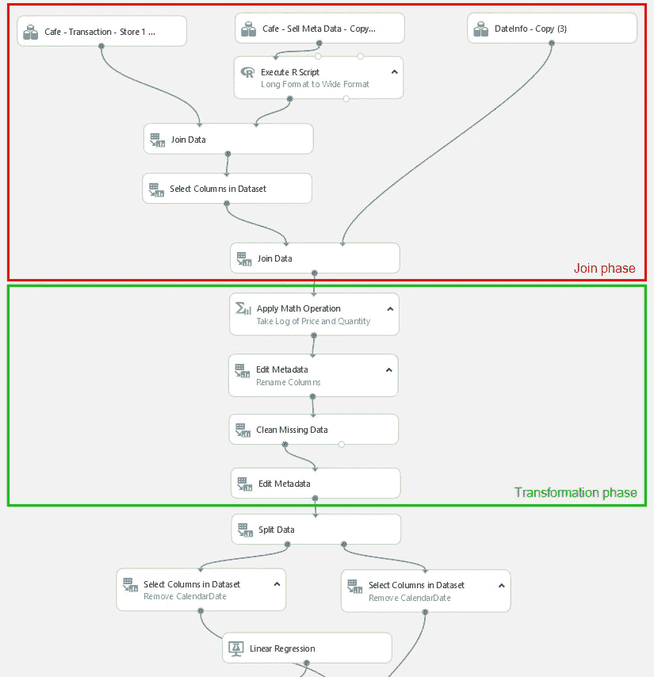

fig.2 — Join and Transformation phases in the price elasticity experiment (by the author)

看起来数据还没有被很好的分析和理解，因为这个实验只是为了演示。但是，一般来说，对预测模型中使用的数据有信心是很重要的，因为，正如 *Techopedia* 在其“[数据预处理](https://www.techopedia.com/definition/14650/data-preprocessing)”一节中所说:

> 真实世界的数据通常是**不完整的**、**不一致的**，和/或**在某些**行为或趋势**中缺少**，并且很可能包含许多**错误**。

一般来说，几乎所有信息系统的问题都是“垃圾进，垃圾出”。如前所述，由于数据集可能包含大量潜在陷阱，在机器学习实验的任何建模阶段之前，必须应用详细的*数据探索*。

# 数据背后是什么

用作实验起点的三个数据集来自一家*汉堡咖啡馆*进入中国微软大楼的交易。成本压力使得有必要重新审视超额价格。对微软来说，了解商店对汉堡的需求对价格上涨的反应是很重要的。换句话说，为了知道价格可以提高多少，了解商店里汉堡的*(需求)价格弹性*是很重要的。事实上，价格弹性是一种产品的价格影响其需求的程度。

fig. 3 — Price elasticity of demand (by the author)

从上图可以清楚的看到，如果价格定在 3.000 美元，卖出的产品是 400 万；相反，如果价格增加到 4.000 美元，售出的产品只有 200 万。

根据其斜率，需求曲线可以是*弹性*或*非弹性*。

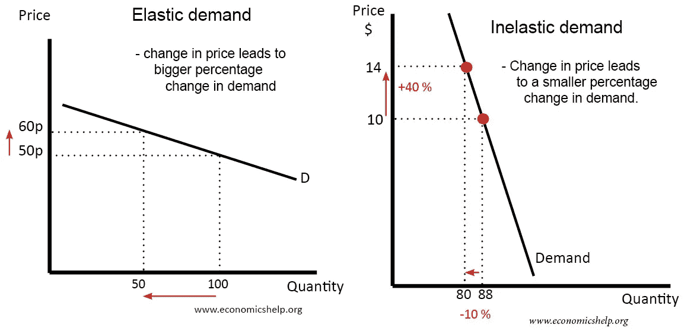

fig. 4 — Elastic and inelastic demand curve

在左图中的弹性需求下，如果价格从 50 便士增加到 60 便士，大量物品的数量减少(这对于卖方是最坏的情况，对于买方是最好的情况)；相反，如果需求是无弹性的，如右图所示，将价格提高 40%将导致数量的小幅减少(在这种情况下，卖方可以在价格上做文章，因为买方需要该商品)。

fig. 5 — Buyer behavior in case of a good that follows an inelastic demand and that undergoes an increase in price (from [https://bit.ly/3OtlIZo](https://bit.ly/3OtlIZo))

现在，回归只有两个变量*价格*和*数量*的需求曲线非常简单。当涉及到更多的变量时，它就变得更加复杂了(比如和其他产品一起卖汉堡)。由于机器学习，我们将收集所有需要的信息，以了解在不导致收入大幅下降的情况下价格可以提高多少。

# 数据探索拯救世界

要做的第一件事是努力让*最好地理解*数据。这是通过使用一些特定的统计工具来探索它而获得的。

全面的数据探索指南超出了本文的范围。一个非常好的由*分析 Vidhya* 可以在[这里](https://www.analyticsvidhya.com/blog/2016/01/guide-data-exploration/)找到。从本指南中，我们可以了解获得合理数据感受的步骤:

1.  变量识别
2.  单变量分析
3.  双变量分析
4.  缺失值处理
5.  异常值处理
6.  变量变换
7.  变量/特征创建

让我们从第一步开始。

# 变量识别

有三组数据需要分析。让我们看看每一个中包含的变量。

## “咖啡馆-交易-商店 1”数据集

组成这个数据集的变量可以直接在 Azure Machine Learning Studio 中进行分析(从数据集的输出 pin 中单击“Visualize”)，它们就是下图中显示的那些变量。

fig. 6 — Variables in the “Cafè — Transaction — Store 1” data set (by the author)

每一行都是一个聚合事务，它对 SELL_ID 标识的特定产品在特定一天的销售量进行求和。假设那天那个产品的价格不会变化。

详细来说:

*   **STORE** :分类变量，在本例中只包含标识商店 1 的值“1”
*   **CALENDAR_DATE** :日期/时间变量，时间总是设置为上午 00:00
*   **价格**:数字变量，与 SELL_ID 标识的产品价格相关联
*   **QUANTITY** :一个数字变量，与销售的产品数量相关联，由 SELL_ID 标识
*   **SELL_ID** :分类变量，所售产品的标识符
*   **SELL_CATEGORY** :分类变量，所售产品的类别

## “咖啡馆——出售元数据”数据集

这是这个数据集的变量。

fig. 7 — Variables in the “Cafè — Sell Meta Data” data set (by the author)

详细来说:

*   **SELL_ID** :与之前数据集中显示的已售出产品的标识符相同
*   **SELL_CATEGORY** :上一个数据集中显示的已销售产品的同一类别。看图现在很清楚，类别“0”标识单个产品；类别“2”标识组合
*   **ITEM_ID** :分类变量，产品中包含的项目的标识符
*   **ITEM_NAME** :分类变量，标识项目的名称

正如上图中突出显示的，同一个 SELL_ID 的多个实例与不同的 ITEM _ IDs 相对应，这使我们认为 SELL_ID 是产品的标识符，可以是单个项目，也可以是项目的组合*。例如，SELL_ID = 2053 的组合是由汉堡、可乐和咖啡组成的。SELL_ID 为 1070、3028、3055 和 3067 的产品是单一商品。*

## *“日期信息”数据集*

*这个数据集包含带有一些外部数据的日历信息。*

**

*fig. 8 — Variables in the “DateInfo” data set (by the author)*

*详细来说:*

*   ***CALENDAR_DATE** :日期/时间变量，表示日历的日期*
*   ***年**:数字型变量，表示对应 CALENDAR_DATE 的年份*
*   ***假日**:分类变量，表示对应的 CALENDAR_DATE 是否为假日*
*   ***IS_WEEKEND** :分类变量，表示对应的 CALENDAR_DATE 是否为周末*
*   ***IS_SCHOOLBREAK** :分类变量，表示对应的 CALENDAR_DATE 是否为学校放假*
*   ***AVERAGE_TEMPERATURE** :数值型变量，表示对应 CALENDAR_DATE 日的平均华氏温度*
*   ***IS_OUTDOOR** :分类变量，我不知道它的意思。它可能是一个标志，指示温度是在室外测得的(值 1)还是在建筑物内测得的(值 0)，因为它是外部数据信息的一部分，并且接近 AVERAGE_TEMPERATURE 变量*

## *将所有数据集连接在一起*

*其中一些变量可以被操纵，然后作为一个独特的数据集加入，用作我们机器学习实验的来源。这里要执行的操作:*

*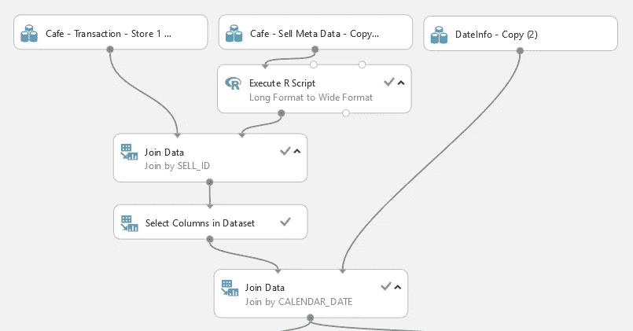*

*fig. 9 — Operations to perform in order to have a unique data set (by the author)*

*因为事务数据包含 SELL_ID 变量作为引用，所以我需要将 SELL_ID 产品的所有元数据信息放在一行中，以便与它连接。因此，我们必须将数据集从长格式转换为宽格式。这可以通过旋转“销售元数据”信息来获得。*

*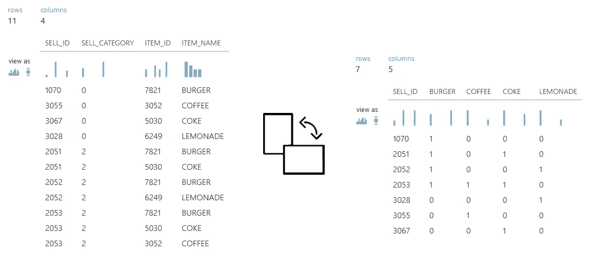*

*fig. 10 — Pivoting of a data set from a long format to a wide one (by the author)*

*这个任务在下面简单(并且相当神秘)的 R 代码片段中实现，进入图 9 中的*执行 R 脚本*模块:*

*关于此功能的任何细节，请参考[此链接](http://tiny.cc/reshape-dcast)。真诚地说，我更喜欢用*整洁的*方式来做同样的转换，只是稍微多了一点罗嗦，但是可以理解:*

*在“通过 SELL_ID 加入”模块中，有一些变量需要过滤掉。*

**

*fig. 11 — Variables to filter out from the first Join Data module (by the author)*

*变量 STORE 和 BURGER 是零方差预测器(它们的值总是 1)，所以它们不会带来任何有意义的信号。然后，由于数据集模块中的*选择列，这些变量被删除。SELL_ID 变量是一个产品标识符，一个标识交易中售出的产品的标签。因为它是一个 ID，所以很容易想到将其从数据集中删除，但是我们保留它，因为它可能对将价格和数量与售出的产品相关联很重要。来自事务的 SELL_CATEGORY 变量也被保留下来(在最初的实验中，这个变量被过滤掉了)。输出如下所示:**

**

*fig. 12 — Variables kept after the Select Columns in Dataset module (by the author)*

*然后，所有关于日期和外部因素的信息通过 CALENDAR_DATE 变量连接到“Join by SELL_ID”数据集，最终结果如下:*

**

*fig. 13 — Final data set after the Join Phase (by the author)*

*生成的数据集可以 CSV 格式在[此处](https://1drv.ms/u/s!AtgrmeCPhKh7kP5EjOgd-EhXbdSlwA)下载。如果您没有 Azure Machine Learning Studio 帐户，可以使用该文件进行以下分析。*

# *单变量分析*

*一旦我们准备好了输入数据集，就必须探究其中的每一个变量。根据变量的性质，需要不同的统计方法(集中趋势、离差度量)和图表来完成这项工作。最后，对于数据科学家来说，这项工作总是重复的。既然我们不喜欢*猴子工作*，微软的一个伟大的开源工具来拯救我们: [*交互式数据探索性分析和报告* ( **IDEAR** )](https://github.com/Azure/Azure-TDSP-Utilities/tree/master/DataScienceUtilities/DataReport-Utils) 。该工具提供了三个版本，分别适用于以下平台:*

*   *微软机器学习 R 服务器*
*   *计算机编程语言*
*   *稀有*

*在这篇文章中，我使用的是 R 的版本。特别是，我将它与 RStudio 中的 R 3.4.3 一起使用(到目前为止，IDEAR 在 R ≥3.5.0 上有一些问题)。关于如何安装和使用它的完整说明在[这里](https://github.com/Azure/Azure-TDSP-Utilities/blob/master/DataScienceUtilities/DataReport-Utils/R/team-data-science-process-idear-instructions.md)。*

*首先，我们需要以 CSV 格式导出连接的数据集。这要归功于*转换为 CSV* 模块:*

*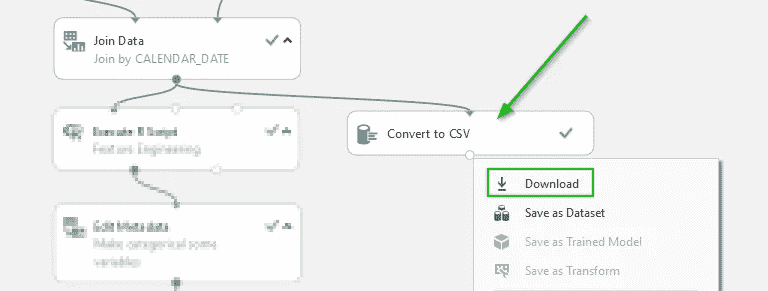*

*fig. 14 — Export the joined data set to CSV (by the author)*

*然后，根据指令中提到的 IDEAR 约定，有必要编写一个包含 CSV 文件中变量的元数据信息的 *yaml* 文件。 *yaml* 文件的内容如下:*

*打开 *Run-IDEAR 后。R* 文件并执行后，会提示一个对话框要求点击确定继续(有时会出现对话框图标，但对话框本身仍隐藏在后台；点击图标即可)。然后打开刚刚在打开对话框中创建的 *yaml* 文件，游戏就完成了:一个神奇闪亮的应用程序会出现，上面有我们需要的所有统计数据。*

*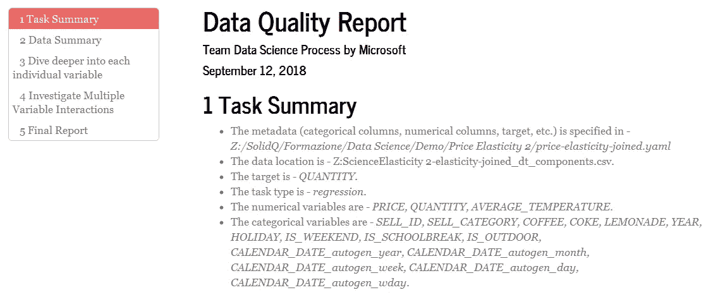*

*fig. 15 — IDEAR Data Quality Report (by the author)*

*由于我们已经在 *yaml* 文件中将 CALENDAR_DATE 变量定义为日期/时间，IDEAR 已经自动生成了其他日期/时间组件(年、月、周、日、星期日)，并在它们的名称后添加了“ *autogen_ < var >* ”后缀。这些新变量将帮助我们在多变量分析中获得更好的洞察力。*

*在“数据总结”部分(包含变量、变量类型和值的信息)之后，是“深入研究每个变量”部分，我们可以在这里进行单变量分析。*

## *分析目标变量*

*首先,“每个变量的更详细的统计数据”小节让我们快速浏览每个变量的一些基本统计数据。*

*然后“可视化目标变量”小节包含四个图，帮助理解目标变量(在我们的例子中是数量)的行为。*

*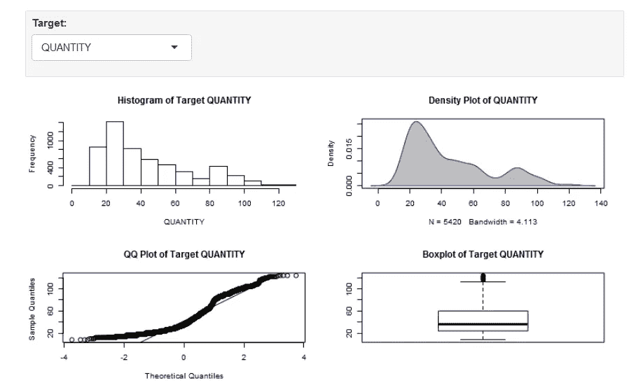*

*fig. 16 — Behavior of target variable (by the author)*

*由于分布的右偏性，数量变量似乎是双峰的(在密度图中有两个主要的隆起)，并且对于高值(查看[箱线图](/understanding-boxplots-5e2df7bcbd51))几乎没有异常值。*

## *分析数字变量*

*由于“可视化数字变量”小节，可以研究所有的数字变量:价格、数量(刚刚分析的)和平均温度。*

*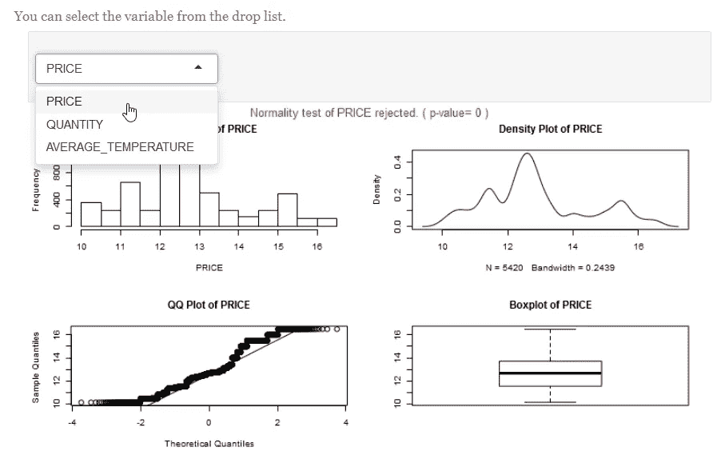*

*fig. 17 — Behavior of the PRICE variable (by the author)*

*价格变量似乎也是双峰的，只是有点向右倾斜。箱线图显示没有异常值。*

*平均温度也是双峰的。这一次，分布有点左倾*

*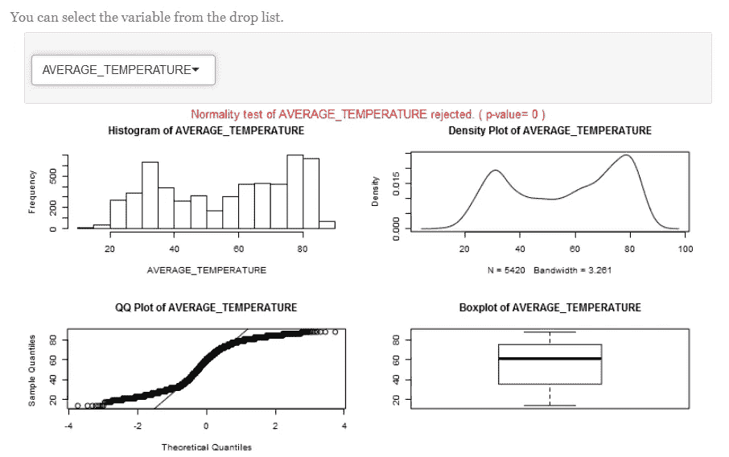*

*fig. 18 — Behavior of the AVERAGE_TEMPERATURE variable (by the author)*

*稍后，我们将对这些变量进行一些转换，以便尽可能地调整它们的偏斜度，试图在不消除异常值的情况下减轻它们的影响。*

## *分析分类变量*

*感谢“可视化分类变量”小节，我们也可以探索分类变量。CALENDAR_DATE 中自动生成的变量也是分类变量。例如，有趣的是看到交易数量在一年的最后一个季度下降。*

*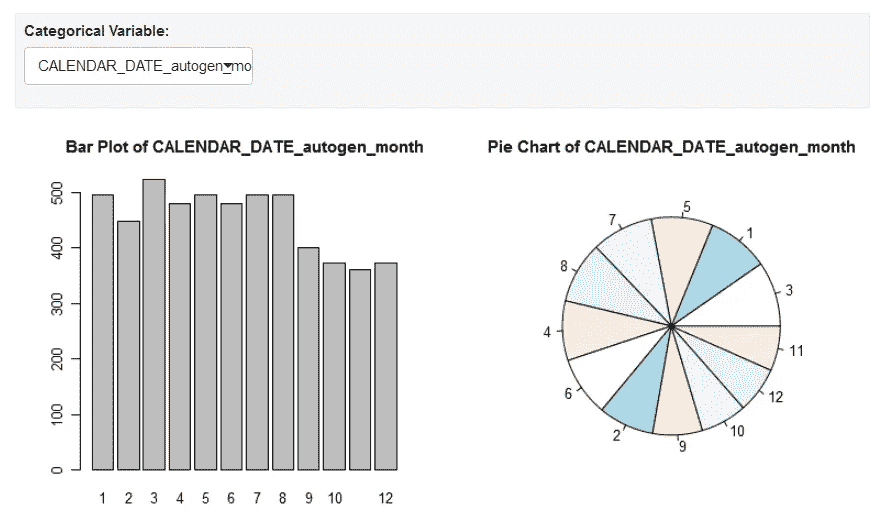*

*fig. 19 — Exploration of the CALENDAR_DATE_autogen-month variable (by the author)*

*查看 SELL_ID 分类变量，我们有以下图表:*

*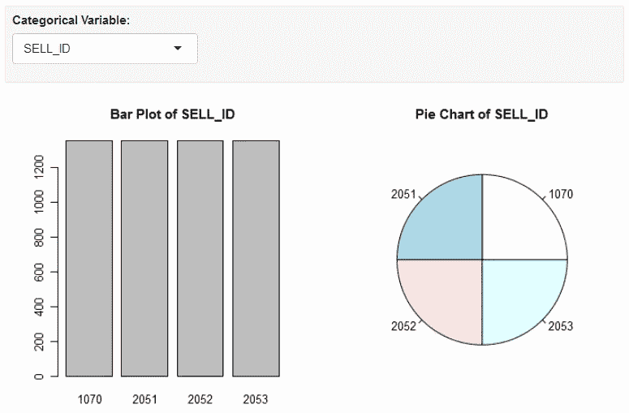*

*fig. 20 — Exploration of the SELL_ID variable (by the author)*

*只卖四种产品(单个汉堡，1070；汉堡+可乐套餐，2051；汉堡+柠檬水套餐，2052；汉堡+可乐+咖啡组合，2053)。奇怪的是，所有这些产品的销售数量完全相同。可能是交易的数据集已经衍生出一个更完整的数据集。*

# *多变量分析*

*当探索两个变量的相互作用时，事情变得有趣了。*

## *等级变量*

*首先，IDEAR 为我们提供了“等级变量”小节，这有助于理解哪些变量与所选变量的关联最强。不同的度量标准分别用于分类变量和数值变量。*

*   *使用[η平方度量](https://en.wikiversity.org/wiki/Eta-squared)计算分类变量和数值变量之间的关联。*
*   *使用[克拉默 V 度量](https://en.wikipedia.org/wiki/Cram%C3%A9r%27s_V)计算分类变量之间的关联。*

*选择 6 作为与数量相关的顶级分类变量的数量后，结果如下:*

**

*fig. 21 — Strength of association between variables in the data set (by the author)*

*x 轴上的变量标签被截断了一点。为了清楚起见，接下来是排序为最强相关的第一个的数字和分类变量的列表。*

***数值变量***

1.  *价格*
2.  *温度*

***分类变量***

1.  *出售标识*
2.  *销售 _ 类别*
3.  *柠檬汁*
4.  *焦炭*
5.  *日历日期自动生成日*
6.  *是周末*

*有趣的是注意到 SELL_ID 和 SELL_CATEGORY 变量的强度，它们意外地没有包括在原始实验的训练数据集中。此外，星期几(从 1 到 7)与目标变量之间的关联是一个意想不到的发现。*

## *两个分类变量之间的相互作用*

*IDEAR 使用*马赛克图*来比较两个分类变量。乍一看，对于不了解一些统计概念的人来说，这可能有点令人困惑。例如，下面是变量 SELL_CATEGORY 和 COKE 的镶嵌图:*

**

*fig. 22 — Mosaic plot for SELL_CATEGORY vs COKE (by the author)*

*由于这个图，我们可以说组合产品(SELL_CATEGORY = 2)几乎总是包含可乐(COKE = 1)。事实上，不含可乐(可乐= 0)的组合产品(SELL_CATEGORY = 2)与它们之间独立的情况(红色)相比，较少出现在交易中。与此同时，可以肯定地说，单一产品(SELL_CATEGORY = 0)不含可乐。*

*关于如何绘制镶嵌图的更详细的解释，请参考[本帖](/mosaic-plot-and-chi-square-test-c41b1a527ce4)。*

## *两个数值变量之间的相互作用*

*比较两个数值变量最常用的图是*散点图*。比较 IDEAR 中的价格和数量变量很有意思:*

**

*fig. 23 — Scatter plot for PRICE vs QUANTITY (by the author)*

*有两条线可以帮助您查看变量之间的任何关系:*红色的简单回归模型*线(线性模型， *lm* )，以及蓝色的 [*局部加权散点图平滑*](http://www.statisticshowto.com/lowess-smoothing/) (LOWESS)线。前者是一种*参数*方法来拟合曲线(您预先假设数据符合某种类型的分布)，而后者是一种*非参数*策略，试图找到最佳拟合曲线，而不假设数据必须符合某种分布形状。*

*图上显示的相关值是两个变量之间的[皮尔逊相关](https://www.statisticssolutions.com/correlation-pearson-kendall-spearman/)。*

*对于等于或大于 14 美元的价格，数量似乎有不同的表现。可能有另一个变量使这种情况发生。我们稍后会对此进行调查。*

*如果我们想研究价格和数量相对于平均温度的行为，我们会发现没有特别的关联:*

**

*fig. 24 — Scatter plot for AVERAGE_TEMPERATURE vs PRICE (by the author)*

*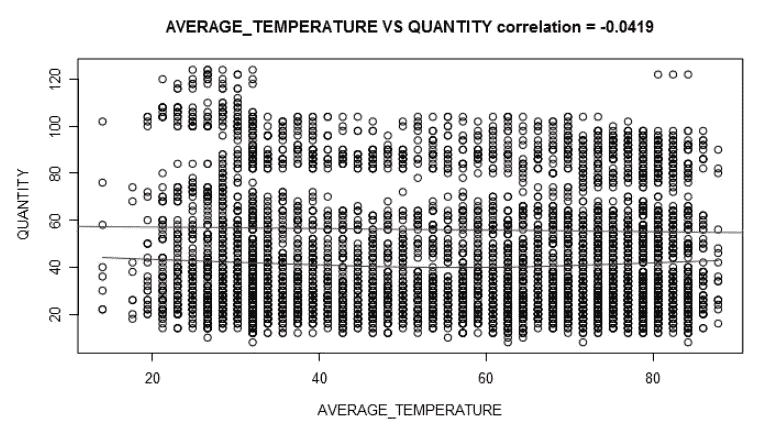*

*fig. 25 — Scatter plot for AVERAGE_TEMPERATURE vs QUANTITY (by the author)*

## *数值变量之间的相关性*

*IDEAR 中的这一部分允许根据 Pearson、Kendall 和 Spearman 计算两个数值变量之间的[相关性](https://www.datascience.com/blog/introduction-to-correlation-learn-data-science-tutorials)。可以为绘图选择几种配置(顺序、形状、布局)。*

*与标准皮尔逊相关相比，[肯德尔的τ](https://www.stata-journal.com/sjpdf.html?articlenum=st0007) 对极端观测值和非线性更加稳健。让我们看看 AVERAGE_TEMPERATURE 变量是否以非线性方式与其他数值变量相关联:*

*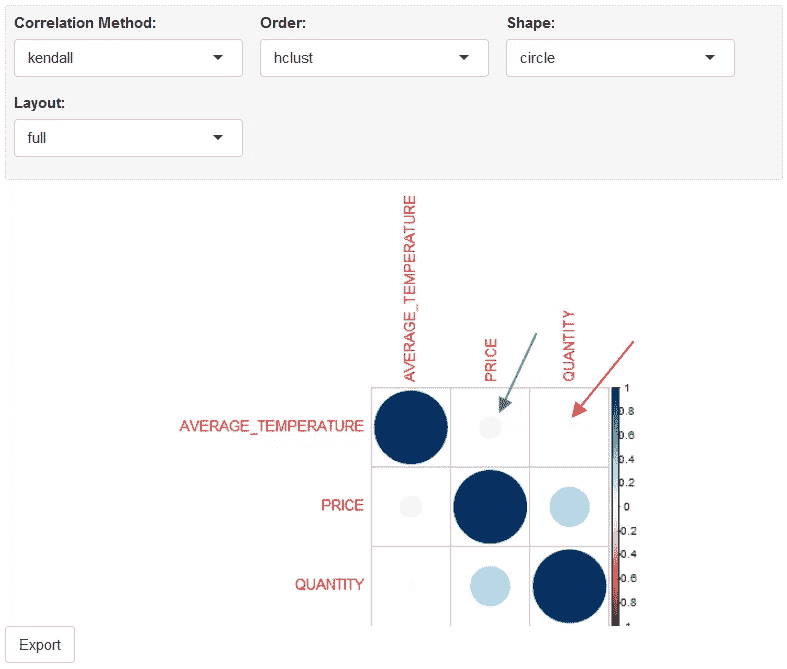*

*fig. 26 — Kendall’s correlation for numeric variables (by the author)*

*平均气温和价格之间出现了意想不到的小联系。有数量的可以忽略不计。*

## *数字变量和分类变量之间的相互作用*

*IDEAR 通过箱线图可视化数字和分类变量之间的关联。这是检查数值变量的分布在分类变量的不同级别是否有显著差异的常用方法。同时，检验了*零假设*，即数值变量在分类变量的不同级别上具有相同的平均值。进行两个变量之间的单向方差分析( [*ANOVA*](http://www.statisticshowto.com/probability-and-statistics/hypothesis-testing/anova/) )。在 *ANOVA* 测试中由 F 值返回的 *p* 值帮助我们*接受*(箱线图的平均值具有相同的值)或*拒绝*(箱线图的平均值具有不同的值)零假设。*

*例如，让我们检查价格变量分布是否在 SELL_ID 变量(销售产品标识符)的不同级别有所不同:*

*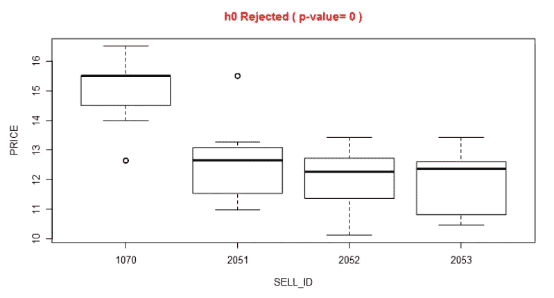*

*fig. 27 — Interaction between PRICE and SELL_ID (by the author)*

*从上图中可以清楚地看到，单个汉堡(SELL_ID = 1070)决定了价格的净增长(零假设被拒绝)。出现了一些值得关注的异常值。*

*数量分布也随着 SELL_ID 级别的不同而显著变化:*

*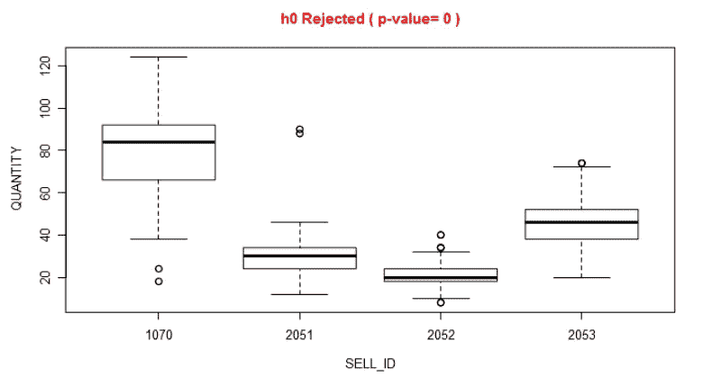*

*fig. 28 — Interaction between QUANTITY and SELL_ID (by the author)*

*从上图可以看出，汉堡+可乐组合产品(SELL_ID = 2051)出现了一些明显的异常值。*

*当分析 SELL_CATEGORY 和 COKE 变量与价格的关系时，发现了其他有趣的异常值:*

*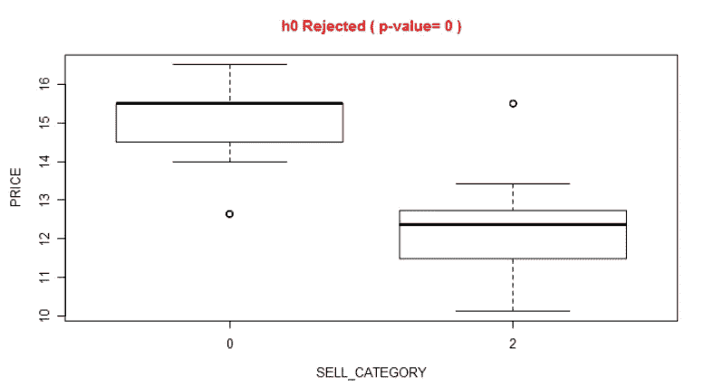*

*fig. 29 — Interaction between PRICE and SELL_ID (by the author)*

*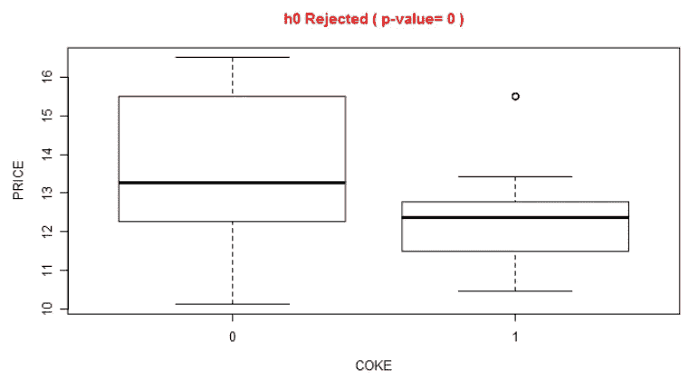*

*fig. 30 — Interaction between PRICE and COKE (by the author)*

# *缺失值处理*

*我们的数据集很幸运:我们没有缺失值，正如您在 IDEAR 的“检查数据质量”部分看到的，选择了所有 18 个变量进行分析:*

**

*fig. 31 — Missing values analysis (by the author)*

*这个情节是对 r 中 *levelplot()* 的巧妙运用，作为类似的例子，看看[这个链接](http://www.rensenieuwenhuis.nl/r-sessions-30-visualizing-missing-values/)。*

# *异常值处理*

*从单变量分析中我们发现，单个变量没有如此明显的异常值。在多变量分析中，当比较数值变量和分类变量时，情况会发生变化。*

*从图 27 中，我们看到有单个汉堡(SELL_ID = 1070)以低于 14 美元出售的交易。让我们更深入地了解这个案例。您会在代码中找到注释。*

*我们很幸运地发现了一个数据问题，只是检查异常值。移除错误的交易行我们也移除了之前显示的所有极端异常值。所以，我们刚刚一石多鸟！*

# *变量变换*

*有时变量分布中的异常值并不是错误的度量，它们可能是变量本身固有的性质，尤其是当变量[偏斜](http://www.statisticshowto.com/probability-and-statistics/skewed-distribution/)时。从分布中删除这些值会删除对成功预测建模有用的信息。因此，最好转换变量以减轻偏斜度，尝试使其分布更接近正态分布。减少非正态性通常也会减少非线性，即使变换后的分布不完全正态，它通常也是对称的。*

*当分布是右偏的时，通常使用 [*对数*变换](http://onlinestatbook.com/2/transformations/log.html)。但是如果是左倾呢？幸运的是，有一种转换非正态分布的通用方法:Box-Cox 转换。它将仅应用于价格和数量，因为 AVERAGE_TEMPERATURE 已经是对称的(对其进行 Box-Cox 变换不会改变其分布，因为它不能在正常情况下进行变换)。*

**var_distribution* 函数为我们提供了四个图，与“可视化数字变量”部分中的 IDEAR 用法相同(只需按“导出”将代码导入*price-elasticity-joined . log . r*文件，并声明为 YAML 文件)。*

**boxcox_transf* 函数返回一个列表，其中包含转换后的数据和由 Box-Cox 转换计算出的 lambda 值。*

*下面是原始价格变量和 Box-Cox 转换变量(T-PRICE)的曲线图。*

**

*fig. 32 — Distribution plots for PRICE and transformed PRICE (T-PRICE) (by the author)*

*如您所见，转换后的密度图显示出更加对称的曲线，转换后的 Q-Q 图更接近法线。用于转换价格变量的 lambda 值为-1.1。*

*这是数量变量的相同曲线。*

*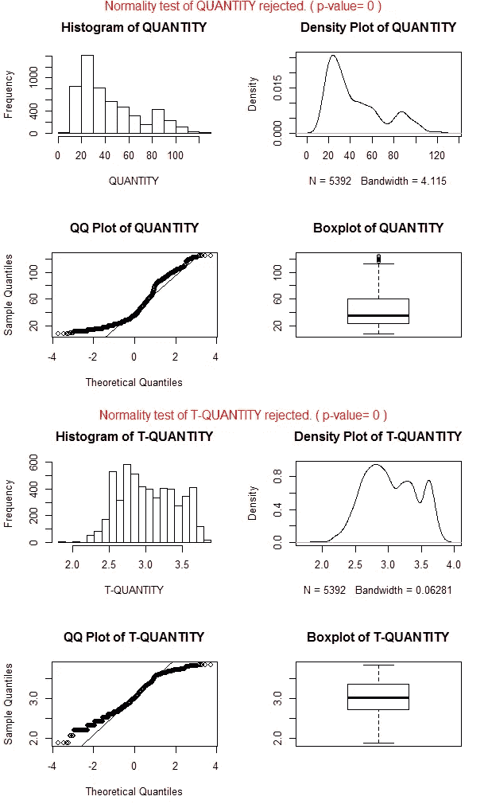*

*fig. 33 — Distribution plots for QUANTITY and transformed PRICE (T-QUANTITY) (by the author)*

*用于转换数量变量的λ值为-0.1。在这种情况下，正如您从 T-QUANTITY 箱线图中看到的，由于转换，异常值已经消失，而没有被移除。*

# *变量创建*

*这是数据科学项目中最具创造性的阶段，也被称为*特性工程*。三言两语(来自[这篇博文](https://medium.com/mindorks/what-is-feature-engineering-for-machine-learning-d8ba3158d97a)):*

> *这是使用数据的*领域知识*来创建使机器学习算法工作的特征的过程。如果特征工程做得正确，它可以通过从原始数据中创建有助于促进机器学习过程的特征来提高机器学习算法的预测能力。特征工程是一门艺术。*

## *新的日期/时间变量*

*特征工程的第一个例子是从一个日期变量创建多个变量。正如我们在本文开头看到的，IDEAR 会自动为我们进行这种转换，以便更好地分析我们的数据集。*

*提取一个新的变量来表示从我们在数据集中找到的第一天开始的天数也是很有用的。通常，日期/时间变量是循环的(例如，月份数从 1 到 12；天数从 1 到 31)。机器学习算法不会考虑变量的周期性。因此，表示时间流逝的天数计数器是一个很好的添加变量，因为它可以帮助算法捕捉自活动开始以来的任何销售增长。*

*这里是从 CALENDAR_DATE 变量中提取这些变量的 R 代码(它是由 *read_csv* 函数在日期列中自动解析的)。*

## *新分类变量*

*让我们来看看这个情节:*

**

*fig. 34 — Interaction between QUANTITY and HOLIDAY (by the author)*

*似乎在工作日(HOLIDAY = "NULL ")的销售量要比节假日期间大得多。因此，一个名为 IS_HOLIDAY 的新虚拟变量(1，如果事务发生在节假日；否则为 0)可能有助于机器学习算法以更好的方式执行。*

*还有一些 factor 列必须转换成 [*one-hot 编码变量*](https://hackernoon.com/what-is-one-hot-encoding-why-and-when-do-you-have-to-use-it-e3c6186d008f) (如您所见，我们的数据集中已经有了其中的一些:咖啡、柠檬水、…)。独热编码变量(或*虚拟*变量)是数值变量，因为它们代表存在(1)或不存在(0)的特征。在我们的分析中，它们经常被转换成分类变量，以便于图形化表示。在 R 中，由于使用了 *model.matix* 函数，可以实现一键编码变量。*

*([在这里](https://stats.stackexchange.com/q/174976/138616)你可以找到原因“-1”)*

## *新的数值变量*

*在组合产品中有一个商品数量的变量可能是决定价格变化的一个重要特征。因此，就在“长格式到宽格式”执行脚本模块之后，您可以在图 2 中看到，数据集是图 10 中的数据集。这里可以添加变量 NO_ITEMS，定义如下:*

# *清理数据后的进一步分析*

## *假期分析*

*在删除假日列之前，如前面代码中所述，检查每个假日在我们每年的数据集中是如何表示的是很有趣的。怎么做呢？ [*海盗团*](https://cran.r-project.org/web/packages/yarrr/vignettes/pirateplot.html) 前来救援。在使用这个图之前，为了更好的可视化表示，我们将添加一个新变量(HOLIDAY_ABBR ),每个假日都有缩写标签。*

*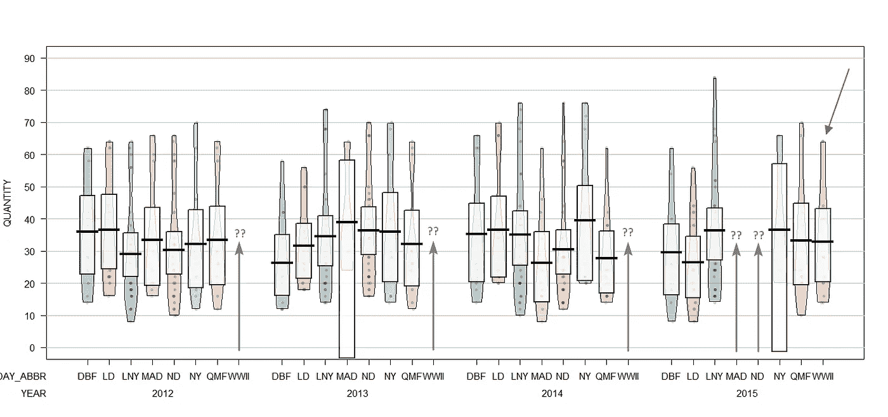*

*fig. 35 — Pirateplot for QUANTITY versus SELL_ID and YEAR (by the author)*

*如你所见，某一年缺少一些假期:*

*   **2015 年中秋节*不见了*
*   **2015 年国庆节*不见了*
*   **2012 年、2013 年和 2014 年没有二战庆典*(第二次世界大战结束)*

*很容易证明 2015 年没有前两个假期是合理的。我们在数据集中登记的交易的最大日期是 2015 年 9 月 10 日。所以这些假期比最大日期晚。*

*在 2015 年之前的几年里，二战庆祝活动不见了。由于数据集是由微软中国的一家汉堡店的交易产生的，我在网上搜索了一下，发现了这个帖子。似乎中国决定从 2015 年开始庆祝二战的结束。因此，2015 年之前的年份缺乏的原因得到了解释。*

## *SELL_ID 对需求曲线的影响*

*我们想知道汉堡的销售是否遵循线性需求。在图 23 中，我们假设有另一个变量打破了数量和价格之间的线性关系。让我们深入分析来回答这个问题。*

*要考虑的第三个变量是 SELL_ID(一个分类变量)。假设不同的产品以不同的价格和数量出售是合理的。从图 23 中可以明显看出，价格为 14 美元或更高的产品会出现不同的行为。让我们考虑一个新变量 IS_PRICE_HIGH，如果价格为 14 美元或更多，则设置为 1，否则为 0。因此，现在我们需要绘制一个数字变量(数量)和两个分类变量(SELL_ID 和 IS_PRICE_HIGH)。海盗团会再次帮助我们。*

*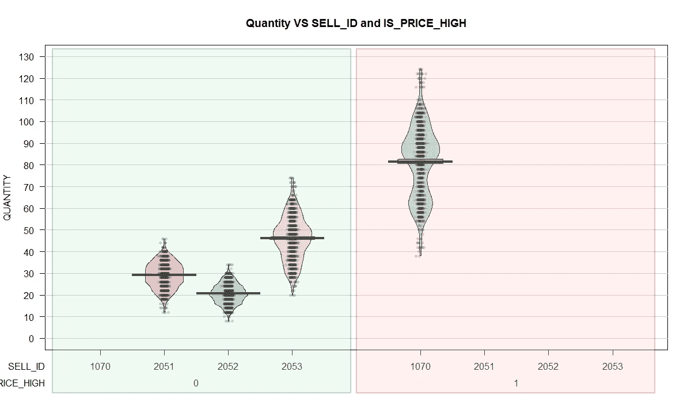*

*fig. 36 — Pirateplot for QUANTITY versus SELL_ID and IS_PRICE_HIGH (by the author)*

*查看该图，只有 SELL_ID 1070 出现在 IS_PRICE_HIGH 区域中，对应于等于或大于$14 的价格，并且平均值周围的推断带不重叠，这似乎证实了由 SELL_ID 标识的每个产品都以 9%置信度的平均数量销售，并且高价格标识特定的 SELL_ID。*

*如果我们绘制每个 SELL_ID 的价格分布图，每个 SELL_ID 的价格也非常不同。*

*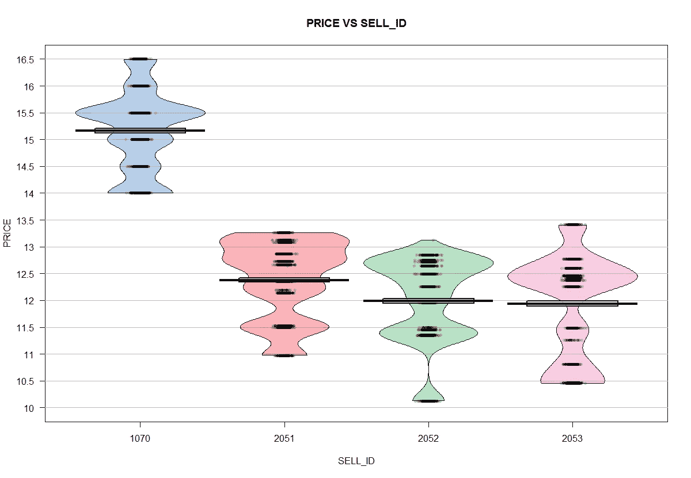*

*fig. 37 — Pirateplot for PRICE versus SELL_ID (by the author)*

*SELL _ IDs 2052 和 2053 的平均置信水平是重叠的，所以它们在价格上很难区分。*

*让我们看看每个 SELL_ID 的需求曲线是如何表现的。*

*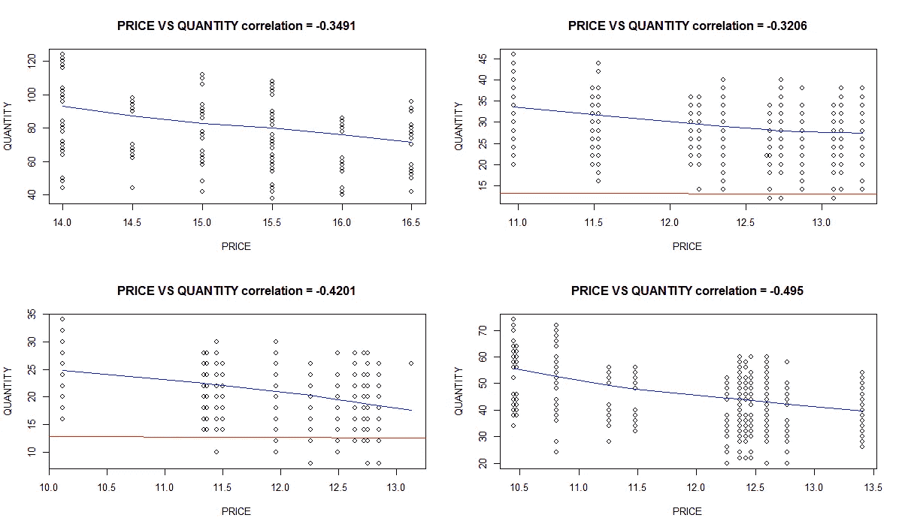*

*fig. 38 — Scatter plots between PRICE and QUANTITY for each SELL_ID value (by the author)*

*看起来我们实际上可以用线性回归来塑造需求曲线。*

# *结论*

*在没有首先仔细分析输入数据集的情况下，面对一个机器学习问题是完全错误的。数据必须得到真正的理解和恰当的“处理”,这样它才能显示所有的洞察力。只有在完全理解数据之后，数据科学家才能转换和创建新的变量，这些变量对于机器学习算法的良好运行非常有用。*

*在这篇文章中，我们加深了对汉堡咖啡馆交易数据集的了解。在下一篇文章中，我们将应用这些知识在 Azure Machine Learning Studio 中实现一个新的机器学习模型，我们将检查:*

*   *这些表现比[上一篇](https://medium.com/wandering-in-advanced-analytics/how-to-better-evaluate-the-goodness-of-fit-of-regressions-990dbf1c0091)中的表现要好*
*   *残差图相对于 CALENDAR_DATE(参见本文的前言)中出现的问题在应用于数据集的转换后是否得到解决*