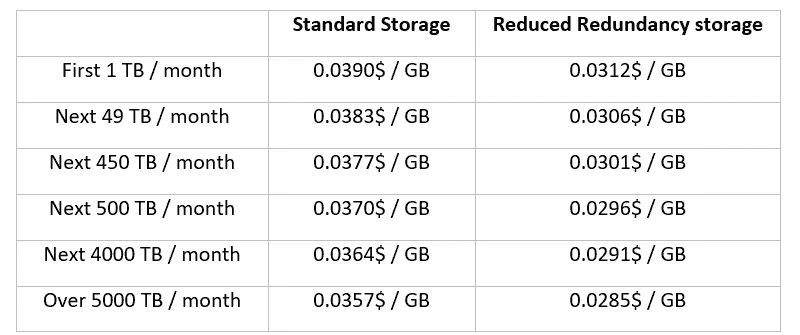
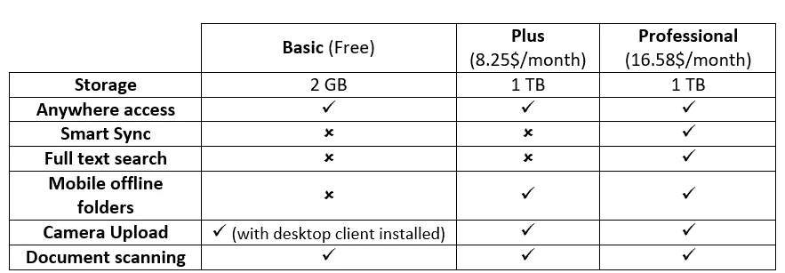
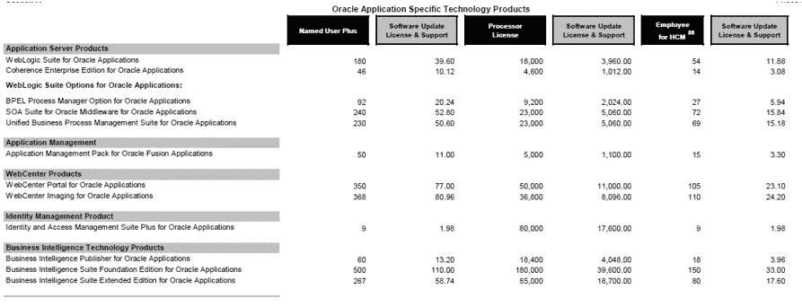
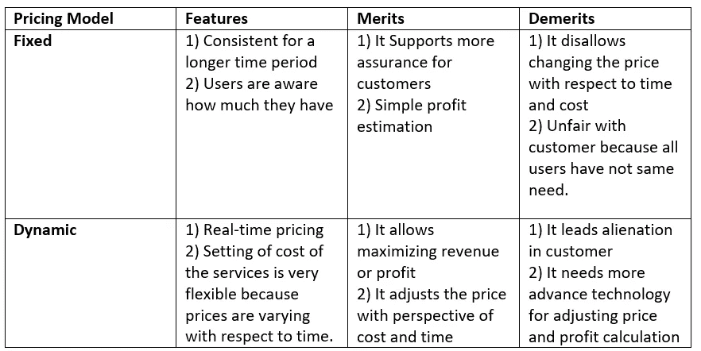
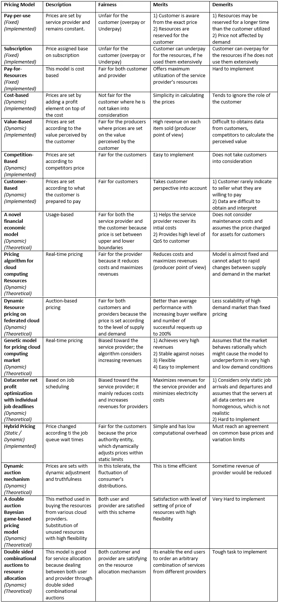

# 云定价

> 原文：<https://towardsdatascience.com/pricing-on-the-cloud-9a2d3f61b67f?source=collection_archive---------7----------------------->

Photo by [C Dustin](https://unsplash.com/@dianamia?utm_source=medium&utm_medium=referral) on [Unsplash](https://unsplash.com?utm_source=medium&utm_medium=referral)

# 1.介绍

云计算是在线提供计算资源作为服务的重要实践。此外，根据牛津在线词典的定义，它是*“使用互联网上托管的远程服务器网络来存储、管理和处理数据的实践，而不是本地服务器或个人计算机”* [18]。

云上提供多种类型的服务:基础设施即服务(IaaS)、平台即服务(PaaS)、软件即服务(IaaS)、存储即服务(STaaS)、安全即服务(SECaaS)、测试环境即服务(TEaaS)等等。

云计算提供商的目标是最大化其收入，而客户的目标是以可接受的价格获得良好的服务质量。因此，满足双方需要一个最优的定价方法。

本报告主要基于以下研究论文:

*   “云计算中的定价方案:综述”，*2017 年出版* [1]
*   《云计算中的定价方案:概述》，*2016 年出版* [3]
*   《云计算定价模式:调查》，2013 年出版[2]

我将尝试对所有列出的定价模型给出一个更全面的观点，比较它们，并显示每个模型的一些优点和缺点。此外，我将简要讨论这三篇论文的内容，并给出建议。

# 2.云定价

当谈论云定价时，需要考虑许多因素，首先是服务提供商的目标是实现利润最大化，而客户正在寻求更低价格、更高质量的服务。其次，在云上销售服务竞争非常激烈，因为有大量的提供商在销售相同的服务。此外，价格还受到以下因素的影响:

*   租赁期，可视为供应商和客户之间的合同时间。
*   资源的初始成本
*   折旧率，意味着这些资源被使用了多少次
*   服务质量
*   资源的年龄
*   维护费用

# 3.定价模型

云上使用的定价模型有很多，从变化周期的角度可以分为两大类:固定的和动态的。

# 3.1.固定定价模型

固定定价模型也称为静态定价模型，因为价格长期稳定。云上最著名的服务提供商如 Google、Amazon Web Services、Oracle、Azure 等都使用固定的定价模式。

固定价格使用户意识到做生意和消耗资源的成本。然而，另一方面，这种定价方式对顾客来说是不公平的，因为他们可能会多付或少付他们的需求。另外，它不受需求的影响。

有许多固定的定价方式，如“按使用付费”、订阅、价目表……在这一部分，我将简要介绍这些定价模式:

# 3.1.1.按使用付费模式

在这种模式下，用户只需为他们使用的东西付费。顾客根据他在特定服务上花费的时间或数量付费。如表 1 和表 2 所示的亚马逊网络服务(AWS) [13]、Salesforce [19]使用这种模型。

Table 1 — Amazon S3 storage pricing

Table 2 — Salesforce Cloud pricing

# 3.1.2.签署

在这种模式下，用户需要定期付费，以在线服务的形式访问软件，从而从服务中获利。客户订购使用预先选择固定和长期服务单位组合，通常是每月和每年。

Dropbox[16]——如表 3 所示——使用这种模型。

Table 3 — Dropbox pricing

# 3.1.3.混合物

该模型是按使用付费和订阅定价模型的组合，在该模型中，所有服务价格都使用订阅模型来设置，但是当超过使用限制时，则使用按使用付费定价。

谷歌应用引擎[12]使用这个模型，如表 4 所示。

Table 4 — Google app engine pricing

3.1.4.为资源付费

在这种模式中，客户为使用的资源付费。微软 Azure 在基础设施即服务定价中使用该模型，如表 5 所示[14]。

Table 5 — Windows Azure IaaS pricing

# 3.1.5.价格表

在这个模型中，服务提供商在一个表格/列表中列出所有价格及其详细信息。此外，它可以作为文档(PDF)下载。Oracle [15]使用了这个模型，如图 1 所示。

Figure 1 — Oracle products price Lists

# 3.2.动态定价

动态定价模型也称为实时定价，这些模型非常灵活，它们可以被认为是一个函数的结果，该函数将成本、时间和其他参数(如位置、用户感知价值等)作为参数。

在动态定价中，只要有请求，就根据定价机制计算价格。与固定价格相比，反映实时供需关系的动态定价代表了一种更有前途的收费策略，可以更好地利用用户支付潜力，从而为云提供商带来更大的利润收益。

例如，亚马逊每 10 分钟改变一次价格，百思买和沃尔玛每个月改变价格超过 50000 次。

有许多动态定价模型，如:

*   以成本为基础的模式，将利润与成本水平相结合。
*   基于价值，考虑用户感知价值的基础
*   基于竞争，考虑竞争对手的服务价格
*   以客户为基础，考虑客户愿意支付的价格。
*   基于位置，根据客户位置设定价格。

# 3.3.固定定价与动态定价

在表 6 中，列出了固定定价和动态定价的主要区别[1]。

Table 6 — Fixed pricing VS dynamic pricing

# 3.4.几种定价模型的比较

在表 7 中，列出了所有定价模型及其优缺点[1]。

Table 7 — Pricing Models Comparison

# 4.讨论和结论

我们正在总结的三篇论文讨论了动态定价，它们将使收入最大化，并且对客户和提供商更加公平。然而，客户无法预测动态定价模型，而且大多数情况下，客户无法接受动态定价模型，尤其是在谈到云计算服务时。为此，云服务提供商不使用动态定价；亚马逊、全球速卖通、沃尔玛等在线零售商使用它们。

然而，有许多供应商正在使用带有一些动态性的固定价格；可以称之为混合定价。因此，价格在很长一段时间内是静态的，但它会受到资源成本以外的其他参数的影响，如位置、客户、竞争和其他因素。

如图 2、3、4 所示，微软认证价格是固定的，但随着地点或客户类型的变化而变化[17]。

Figure 2 — MCSA exam price in Lebanon on December 2017

Figure 3 — MCSA exam price in United States on December 2017

Figure 4 — MCSA exam price will decrease for students

但是，在这种混合方法中，固定定价的主要缺点仍然存在，因此客户可能会多付或少付资源的费用。为此，我们建议在分析每个定价模型中使用的参数的基础上设计预测分析模型，以帮助客户更好地了解价格变化。

此外，即使找到了预测分析模型，有一点我们不能忘记的是，服务提供商是选择定价模型的人，因此所使用的定价模型总是偏向服务提供商。这增加了建立国际定价标准的需要，以便在顾客的权利和销售者的目标之间进行协调。

# 5.参考

*   [1] A Soni 和 M Hasan，“云计算中的定价方案:综述”，《国际高级计算机研究杂志》，第 7 卷，2017 年 2 月 20 日
*   [2]M . Al-Roomi、S . Al-Ebrahim、S . Buqrais 和 I Ahmad，“云计算定价模型:调查”，《国际网格和分布式计算杂志》第 6 卷，2013 年 6 月 5 日
*   [3]A . Mazrekaj 和 I Shabani 和 B Sejdiu，“云计算中的定价方案:概述”，《国际高级计算机科学与应用杂志》，第 7 卷，2016 年
*   [4] C. D. Patel 和 A. J. Shah，数据中心规划、开发和运营的成本模型，惠普技术报告-HPL-2005–107(r . 1)，2005 年。
*   [5] Pal，r .和 Hui，p,《云服务市场的经济模型:定价和容量规划》。理论计算机科学 496，113–124，七月。2013.
*   [6]王文伟，张平，T. Lan 和 V. Aggarwal，具有单个作业截止期的数据中心净利润优化，Proc .信息会议。科学与系统 2012。
*   [7] C. S. Yeoa，S. Venugopalb，X. Chua 和 R. Buyyaa，公用计算服务的自主计量定价，下一代计算机系统。，第 26 卷，第 8 期，2010 年。
*   [8] M .马西亚斯和 j .吉塔特，云计算市场定价的基因模型，Proc .第 26 届交响乐。应用计算，2011 年。
*   [9] H. Li，J. Liu 和 G. Tang，云计算资源的定价算法，Proc .里面的网络计算与信息会议。安全，2011 年。
*   [10] B. Sharma，R. K. Thulasiram，P. Thulasiraman，S. K. Garg 和 R. Buyya,《云计算商品定价:一种新的金融经济模型》, Proc .IEEE/ACM Int。症状。关于集群、云和网格计算，2012 年。
*   [11]卢米先生。Al-Ebrahim，S. Buqrais 和 I. Ahmad,《云计算定价模型:调查》,《国际网格和分布式计算杂志》第 6 卷第 5 期，第 93–106 页，2013 年。
*   [12]谷歌应用引擎，[https://cloud.google.com/appengine/,](https://cloud.google.com/appengine/,)最近一次访问是在 2015 年 11 月 12 日。
*   [13]http://aws.amazon.com/,[亚马逊网络服务](http://aws.amazon.com/,)最近一次访问时间为 2015 年 10 月 12 日。
*   [14]微软 Azure 网站，[https://Azure . Microsoft . com/en-us/pricing/details/cloud-services/](https://azure.microsoft.com/en-us/pricing/details/cloud-services/)，最后访问时间:2017 年 12 月 5 日
*   [15]甲骨文公司网站，[http://www . Oracle . com/us/corporate/pricing/price-lists/index . html](http://www.oracle.com/us/corporate/pricing/price-lists/index.html)，最后访问时间:2017 年 12 月 5 日
*   [16] Dropbox 网站，[https://www.dropbox.com/business/pricing](https://www.dropbox.com/business/pricing)，最近访问时间:2017 年 12 月 5 日
*   [17]微软网站，[https://www . Microsoft . com/en-us/learning/mcsa-windows-server-2016-certification . aspx](https://www.microsoft.com/en-us/learning/mcsa-windows-server-2016-certification.aspx)，最后访问时间:2017 年 12 月 5 日
*   [18]牛津在线词典
*   [19]销售团队网站，[https://www.salesforec.com，](https://www.salesforec.com,)最近访问时间:2015 年 10 月 12 日