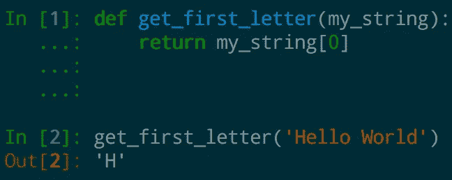
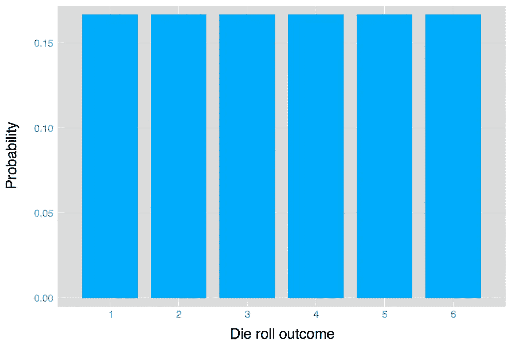
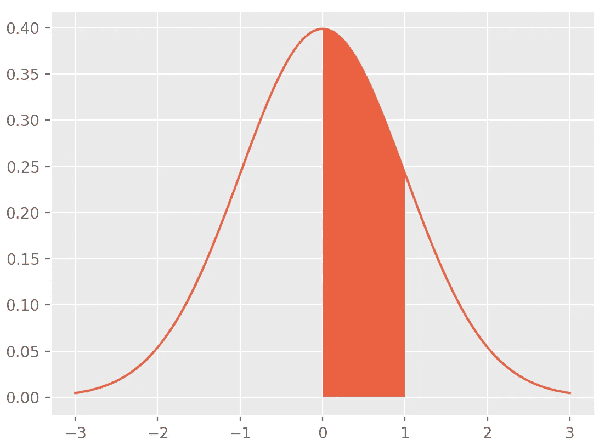
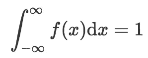

# 概率概念讲解:概率分布(导论第 3 部分)

> 原文：<https://towardsdatascience.com/probability-concepts-explained-probability-distributions-introduction-part-3-4a5db81858dc?source=collection_archive---------1----------------------->

在我的[第一篇](/probability-concepts-explained-introduction-a7c0316de465)和[第二篇](/probability-concepts-explained-rules-of-probability-introduction-part-2-2a9d5a1a9df4)介绍性文章中，我介绍了符号、基本概率定律和公理。这些都是让数学家兴奋的事情。然而，当我们使用概率分布时，概率论在实践中经常是有用的。

概率分布被用于许多领域，但我们很少解释它们是什么。通常假设读者已经知道了(我假设的比我应该假设的更多)。所以我将在这篇文章中解释它们是什么。

# 什么是概率分布？

回想一下，**随机变量**的值是随机事件的结果(如果这对你没有任何意义，请参阅第一篇[介绍文章](/probability-concepts-explained-introduction-a7c0316de465))。例如，随机变量可能是掷骰子或掷硬币的结果。

*一个* ***概率分布*** *是一个随机变量的所有可能结果及其对应概率值的列表。*

举一个具体的例子，这里是一个公平的 6 面骰子的概率分布。

The probability distribution for a fair six-sided die

明确地说，这是一个有限支持的**离散单变量概率分布的例子**。这有点拗口，所以让我们试着把这句话分解并理解它。

这意味着如果我选择任何两个连续的结果。我找不到介于两者之间的结果。例如，如果我们认为 1 和 2 是掷出六面骰子的结果，那么我不能有介于两者之间的结果(例如，我可以有 1.5 的结果)。在数学中，我们会说结果列表是可数的(但我们不要沿着定义和理解可数和不可数集合的道路走下去。变得很奇怪)。你大概能猜到当我们得到连续概率分布时，情况就不再是这样了。

**单变量=** 表示我们只有一个(随机)变量。在这种情况下，我们只有掷骰子的结果。相反，如果我们有不止一个变量，那么我们说我们有一个*多元分布*。在我们有两个变量的特定情况下，我们经常说这是一个*二元分布*。

这意味着结果的数量是有限的。*支持*本质上是定义了概率分布的结果。所以我们例子中的支撑是。一、二、三、四、五、六。由于这不是无限数量的值，这意味着支持是有限的。

# 函数介绍

## 为什么我们要讨论函数？

在上面滚动六面骰子的例子中，只有六种可能的结果，所以我们可以在表格中写下整个概率分布。在许多情况下，结果的数量可能要大得多，因此写一个表格会很乏味。更糟糕的是，可能的结果的数量可能是无限的，在这种情况下，祝你好运写一张表。

为了解决为每个分布写一个表的问题，我们可以定义一个函数来代替。*该函数允许我们简洁地定义概率分布*。

因此，让我们首先定义一个函数，然后我们将移动到用于概率分布的函数。

## 什么是函数？

在非常抽象的层面上，函数是一个接受输入并返回输出的盒子。在绝大多数情况下，函数实际上必须对输入做一些事情，以使输出有用。

让我们定义我们自己的函数。假设这个函数接受一个数字作为输入，在输入的数字上加 2，然后返回新的数字作为输出。我们的函数(作为一个盒子)看起来像这样:

The abstract depiction of a function as a box that takes input and returns an output. In this case, the function adds 2 to the input.

因此，如果我们的输入是 5，我们的函数会将它加上 2，并返回输出 5+2 = 7。

## 函数符号

现在，为我们想要创建的每个函数绘制上面的图表是很乏味的。相反，我们使用符号/字母来表示图表，使其更加简洁。我们不用“输入”这个词，而是用“x”；我们不用“函数”这个词，而是用“f”；我们不用“输出”这个词，而是用“f(x)”。所以上图现在可以写成

Our function is written with symbols instead of words to make this more concise

这更好，但是，我们仍然有一个问题，我们必须画一个图来理解这个函数在做什么。但是我们是数学家，我们不想因为画一个盒子而浪费宝贵的能量，所以我们想出了一个更好的写函数的方法，这意味着我们不需要画任何东西。我们可以从数学上定义我们的函数为

Our function is now written without having to draw arrows and boxes.

这相当于上图，因为我们可以清楚地看到函数 f 的输入是 x，我们已经调用了函数 f，我们知道该函数将 2 加到输入中，并返回 x + 2 作为输出。

值得注意的是，函数和输入的字母选择是任意的。我可以说“a”是输入，我可以调用函数“add_two ”,所以我的函数是

Another way of writing the same function

而这个完全等同于上面的功能。

其中一个主要的收获是，通过一个函数，我们可以看到如何转换任何输入。对于函数 f(x) = x+ 2，我们知道如果输入是 x=10 或者输入是 x=10000 该怎么办。所以我们不需要像之前那样写下一个表格。

我想在这里说明的最后一点是，我们将要使用的函数只能将数字作为输入和输出。但是，函数可以把你喜欢的任何东西作为输入，输出你喜欢的任何东西(甚至不输出任何东西)。例如，我们可以用编程语言编写一个函数，将一个文本字符串作为输入，输出该字符串的第一个字母。以下是 Python 编程语言中此函数的一个示例

## 用图形表示函数

假设函数的主要好处之一是让我们知道如何转换任何输入，我们也可以使用这些知识来显式地可视化函数。让我们坚持我们的例子 f(x) = x+2。图形看起来是这样的:

Graphical representation of our function f(x) = x + 2

我们可以沿着底部的水平轴读取，因为我们的输入数字和左侧垂直轴上的相应数字是输出值 f(x) = x+2。例如，我们可以看到，代表函数的蓝线与垂直(白色)线在 x=1 处与水平(白色)线 f(x) = 3 相交的点相交。这从图形上说明了 f(1) = 1 + 2 = 3。

## 函数的参数

函数最重要的特征之一是参数。参数是你在函数中找到的数字，你不需要把它作为输入。在我们的例子中，f(x) = x + 2，数字“2”是一个参数，因为我们需要它来定义函数，但我们没有把它作为函数的输入。

参数之所以重要，是因为它们在决定输出时起着直接的作用。比如我们定义另一个函数 h(x) = x+3。函数 f(x) = x+2 和我们的新函数 h(x) = x+3 之间的唯一区别是参数的值(我们现在有了“3”而不是“2”)。这种差异意味着对于相同的输入，我们得到的输出是完全不同的。让我们用图表来看一下。

The difference between our functions f(x) = x + 2 and h(x) = x + 3

参数可以说是概率(分布)函数最重要的特征，因为它们定义了函数的输出，告诉我们随机过程中某些结果的可能性。在数据科学中出现的问题中，我们经常试图估计参数，我以前写过两种方法可以用来估计它们:[最大似然估计](/probability-concepts-explained-maximum-likelihood-estimation-c7b4342fdbb1)和[贝叶斯推断](/probability-concepts-explained-bayesian-inference-for-parameter-estimation-90e8930e5348)。

现在我们准备用函数的语言来讨论概率分布。

# 概率质量函数:离散概率分布

当我们使用概率函数来描述离散概率分布时，我们称之为**概率质量函数**(通常缩写为 pmf)。

记得在[关于概率概念的第一篇介绍文章](/probability-concepts-explained-introduction-a7c0316de465)中，我们用大写字母 X 表示的随机变量的概率，取一个小写字母 X 表示的值，记为 P(X=x)。因此，如果我们使用掷骰子作为随机变量，我们可以将骰子落在数字 3 上的概率写成 P(X=3) = 1/6。

概率质量函数，我们称之为 f，返回一个结果的概率。因此，概率质量函数写为:

我知道这变得有点可怕和数学化，但是请原谅我。我们上面看到的等式说，概率质量函数“f”只是返回结果 x 的概率。

所以让我们回到公平的 6 面骰子的例子(你可能已经厌倦了这个例子)。概率质量函数 f 只返回结果的概率。因此掷出 3 的概率是 f(3) = 1/6。就是这样。

因为概率质量函数返回概率，所以它必须遵守我在之前的文章中描述的[概率规则(公理)。也就是说，概率质量函数输出 0 和 1 之间的值，并且所有结果的概率质量函数(pmf)之和等于 1。数学上我们可以把这两个条件写成](/probability-concepts-explained-rules-of-probability-introduction-part-2-2a9d5a1a9df4)

我们已经看到，我们可以把离散概率分布写成表格和函数。我们也可以用图形来表示骰子滚动的例子

Graphical representation of the probability distribution for outcomes of rolling a fair six-sided die

## 离散概率分布示例:伯努利分布

一些概率分布出现得如此频繁，以至于它们被广泛研究并被命名。一种经常出现的离散分布叫做伯努利分布。它描述了有两种可能结果的过程的概率分布。这方面的一个例子是掷硬币，结果是正面或反面。

伯努利分布的概率质量函数为

这里，x 表示结果，取值为 1 或 0。所以我们可以说正面= 1，反面= 0。p 是表示结果为 1 的概率的参数。因此，在一个公平的硬币的情况下，正面或反面落地的概率是 0.5，我们将设置 p = 0.5。

通常我们想明确概率密度函数中包含的参数，所以我们写

请注意，我们使用分号来分隔输入变量和参数。

# 概率密度函数:连续概率分布

有时我们关心有连续结果的随机变量的概率。例子包括从人群中随机选取的成年人的身高，或者出租车司机在下一份工作之前必须等待的时间。对于这些例子，随机变量最好用连续概率分布来描述。

当我们用一个概率函数来描述一个连续的概率分布时，我们称之为**概率密度函数**(通常缩写为 pdf)。

概率密度函数在概念上比概率质量函数稍微复杂一些，但是不要担心，我们会实现的。我认为最简单的方法是从一个连续概率分布的例子开始，然后讨论它的性质。

## 连续概率分布示例:正态分布

正态分布可能是所有概率和统计中最常见的分布。它出现如此频繁的一个主要原因是由于中心极限定理。我们不会在这篇文章中深入探讨，但这里有一篇由[卡森·福特](https://medium.com/u/24104a01fc98?source=post_page-----4a5db81858dc--------------------------------)撰写的名为“[科学家需要知道的唯一定理数据](/the-only-theorem-data-scientists-need-to-know-a50a263d013c)”的好文章，它解释了什么是定理以及它与正态分布的关系。

正态分布的概率密度函数定义为

其中，参数(即分号后的符号)代表总体的均值μ(分布的中心点)和标准差σ(分布的分布程度)。

如果我们将平均值设为 0(μ= 0)，标准差设为 1 (σ=1)，那么我们得到的分布如下所示

Normal distribution with mean = 0 and standard deviation equal to 1

正态分布是一个具有无限支持度的*连续单变量概率分布的例子*。所谓无限支持，我的意思是我们可以计算负无穷大和正无穷大之间所有结果的概率密度函数值。在数学中，我们有时会说它被支撑在*整实线上。*

## 连续概率分布的性质

首先要注意的是，纵轴上的数字从零开始向上。这是一个概率密度函数必须遵守的规则。概率密度函数的任何输出值都大于或等于零。用数学术语来说，我们会说输出是非负的，或者用数学方法写成

然而，与概率质量函数不同，概率密度函数的输出是**而不是概率值。这是一个非常重要的区别，其中一个我很抱歉忘记了。**

为了从概率密度函数中得到概率，我们需要找到曲线下的面积。因此，从均值= 3、标准差= 1 的分布示例中，我们可以通过找到下图中所示的面积来确定结果介于 0 和 1 之间的概率

The area shaded is the probability of the outcome being between 0 and 1.

数学上我们可以这样写

我们可以把这个理解为“*(左手边)0 和 1 之间的概率密度函数的积分等于随机变量的结果在 0 和 1 之间的概率(右手边)*”。

请原谅我没有明确地介绍积分以及它们是如何工作的(在我的[关于边缘化的帖子](/probability-concepts-explained-marginalisation-2296846344fc)中，我对积分有一个简短的概念性介绍，但它没有教你如何计算它们)。如果你不知道它们，那么你现在需要知道的是，这是一种求曲线下面积的数学方法，在这种情况下，它给出了结果的概率。也许我需要写一个简短的系列来介绍微积分。

我们现在已经看到了概率密度函数的另一个性质。也就是说，两个结果之间的概率，比如‘a’和‘b’，是这两个点之间的概率密度函数的积分(这相当于找到由‘a’和‘b’点之间的概率密度函数产生的曲线下的面积)。数学上这是

请记住，我们仍然必须遵循概率分布规则，即所有可能结果的总和等于 1 的规则。如果我们把范围从“负无穷大”一直设置到“正无穷大”，我们就可以涵盖所有可能的值。因此，要使函数成为概率密度函数，以下条件必须成立

这表示负无穷大和正无穷大之间曲线下的面积等于 1。

关于连续概率分布，需要知道的一件重要事情(从概念上来说，这可能很难理解)是，随机变量等于特定结果的概率是 0。例如，如果我们试图得到结果等于数字 2 的概率

这可能在概念上看起来很奇怪，但是如果你理解微积分，那么它应该会更有意义。我不打算在这篇文章中讨论微积分。相反，我想让你们从这个事实中得到的是，我们只能谈论发生在两个值之间的概率。或者我们可以问一个结果大于或小于特定值的概率。我们**不能**询问一个结果等于特定值的概率。

眼尖的读者可能已经注意到，我使用了“小于()”符号，而不是“小于或等于(≤)”和“大于或等于(≥)”符号。对于连续的概率分布，这实际上并不重要，因为它们是相同的。我的意思是

所以随机变量在 a 和 b 之间取值的概率等于它在 a 和 b 之间取值的概率。

## 参数的重要性

我们看到参数值可以改变函数的输出值，概率分布也一样。

Two normal distributions with different parameters give completely different probability outcomes.

在上图中，我们绘制了两个正态分布的概率密度函数。蓝色分布的参数值μ=0，σ=1，而红色分布的参数值μ=2，σ=0.5。

现在可以更清楚地看到为什么使用错误的参数值会产生与您预期的结果相差很大的结果。

# 摘要

哇！那比我预期的要长得多。让我们总结一下要点:

*   概率分布是结果及其相关概率的列表。
*   我们可以用表格写小分布，但是用函数概括大分布更容易。
*   代表离散概率分布的函数称为**概率质量函数**。
*   代表连续概率分布的函数称为**概率密度函数。**
*   代表概率分布的函数仍然必须遵守[概率规则](/probability-concepts-explained-rules-of-probability-introduction-part-2-2a9d5a1a9df4)
*   *概率质量函数的输出是概率*，而*由概率密度函数产生的曲线下的面积代表概率*。
*   概率函数的参数在定义随机变量结果的概率中起着核心作用。

我最初想在这篇文章中讨论多元分布，但它太长了，所以我们将在以后的文章中讨论它。

现在你已经对概率分布有了基本的了解，看看[肖恩·欧文](https://medium.com/u/c145ff55eeea?source=post_page-----4a5db81858dc--------------------------------)的[这篇伟大的文章](https://medium.com/@srowen/common-probability-distributions-347e6b945ce4)，它涵盖了数据科学中常用的概率分布。他出色地解释了为什么数据科学中会出现每种分布，所以这是对概率分布更实际的观察。更详细的概率分布列表，请查看[维基百科页面](https://en.wikipedia.org/wiki/List_of_probability_distributions)(列表很长)。

一如既往，感谢你读到这里。我希望这是有用的，你从中学到了一些东西。请随时留下您的意见、建议和问题。