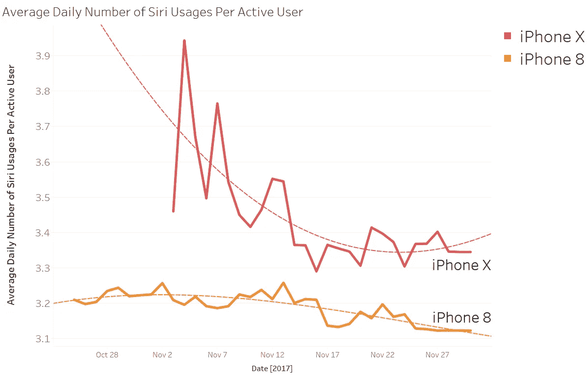

# 产品分析偏差和 KPI

> 原文：<https://towardsdatascience.com/product-analytics-bias-and-kpis-6aa160aa8c20?source=collection_archive---------3----------------------->

产品分析是一个具有挑战性的领域，它是产品、产品经理和用户之间的连接层。它要求你理解产品的技术层面，以及如何量化用户对它的反应。
产品分析最大限度地利用了数字中的硬性事实和用户的软性主观接受。你面临着天平的两端——这些数字是否显示了我们的期望，如果没有，为什么？

你的用户不是代码行。他们是独立的，多样的，有时是出乎意料的。关于我们用户的先验知识，结合心理学和社会假设，就像统计一样，是你工具箱的一部分。

在这篇文章中，我将回顾我在过去的分析项目中遇到的一些社会偏见事件。

[Vitruvian Man](https://en.wikipedia.org/wiki/Vitruvian_Man)

**早期采用者偏见**

你的用户希望每个版本都有更好的产品，而公司正在努力满足他们。产品版本之间的比较，无论是新的硬件版本、应用程序版本还是新的设计，通常都以时间线图的形式进行，比较显示新版本与旧版本的关键指标。这种比较通常会在最初的几天或几周内显示出强烈的积极迹象，最终会减少并变得积极，但不如最初几天那么强烈。
让我们假设苹果发布了一款新的 iPhone 设备，它拥有更好的 Siri(苹果个人助理)算法。为了表明改变的成功，决定使用的 KPI 是“每个活跃用户每天使用 Siri 的平均次数”,这表明一个更好的算法将使用户更经常地使用 Siri。

同样，这是一个假设的图表，我们将使用它作为早期适配器偏差的例子。我们可以看到，在最初的几天里，所选择的度量天空火箭也有很高的方差，直到两个星期过去了，度量仍然高于以前的版本，但没有最初几天那么高。

Hypothetical Graph — Siri Usages per Active User

这张图表没有显示的是谁是新 iPhone X 的用户？他们是持有之前 iPhone 8 版本的同一批用户吗？
第一批接触任何产品新版本的用户被称为早期采用者，他们不同于一般人群。他们致力于产品，并等待看到它的变化。[能不能把 iPhone 死忠粉丝](http://www.dailymail.co.uk/news/article-5045773/Thousands-Apple-fans-queue-outside-stores-iPhone-X.html)和广大用户比一比？

削弱这种偏差的一种方法是将采用率与测量图平行，并消除版本之间的过渡时间，或者将比较限制在同一人群中。只看最终采用新版本的用户，将允许我们在假设任何变化都是由于用户与新版本的交互方式而不是由于选择性用户偏见的情况下，在 iPhone 版本之间进行比较。然而，同样的用户在遇到变化时也会有不同的反应，这就给我们带来了下一个心理偏差。

**新奇效果**

来自 [*维基百科*](https://en.wikipedia.org/wiki/Novelty_effect):
“**新奇效应**是指当新技术开始实施时，绩效最初有所提高的趋势，这不是因为学习或成就的任何实际提高，而是对新技术兴趣增加的反应”

这是发布新版本或新功能后多次看到的另一种心理反应。用户会部分地与变化互动，只是因为它是新的，而不是它的价值。这种偏见倾向于损害我们对用户短期和长期影响的观点。你会发现，一旦 AB 测试获得所需的显著性值，这种偏差也会停止 AB 测试，事实上，如果实验运行更长时间，P 值将稳定在非显著性水平。有关这方面的更多信息，请点击此处:

 [## 社会产品实验挑战

### 当谈到社交应用功能时，你会发现有太多关于用户如何接受新的或改变的观点…

towardsdatascience.com](/social-product-experimentation-challenges-3298546a6b0f) 

**默认效果**

产品经理广泛使用产品中的默认设置，这是一个强有力的工具，可以将用户推向期望的行为。这就是让用户先决定或替用户选择与要求用户通过选择加入或选择退出默认选项来主动实施更改之间的区别。你可能在购买机票时见过这种情况，航空公司会自动将行李保险添加到你的订单中，而无需询问，你需要明确取消这一选择。
回到产品分析，更改产品中的默认设置将推动衡量标准的变化，但不是因为用户已经更改或发现了产品中的新价值。您的用户会倾向于坚持默认设置，因为需要做出改变，并且当他们不确定如何评估手头的其他选项时。

**平衡 KPI**

KPI(关键绩效指标)是以稳健清晰的方式衡量您朝着目标前进的最佳方式。一些关键绩效指标在不同行业中是通用的，如 MAU(每月活跃用户),而一些更具体，如市场的平均订单价值(AOV)。
就像偏见的例子一样，KPI 也可能讲述一个可能误导或不能展现全貌的故事。
受平均订单价值 KPI 驱动的市场公司可能会尝试推荐价格更高的产品，或者在漏斗中添加另一个步骤，以推荐向购物车添加更多商品，从而增加最终订单价值。只看 AOV 会显示所选 KPI 的改进，但会忽略另外两个 KPI:

完成订单漏斗的用户百分比——因漏斗中引入的额外步骤而降低。
回头客的百分比——由于推荐价格更高的产品而不是最符合用户需求的产品而下降。

使用相互平衡的多个 KPI 是看到全貌的方法，并且可以避免会增加一个 KPI 而降低另一个 KPI 的极端行为。一些文章将这些 KPI 称为计数器 KPI。

这三篇文章很好地列出了一般应用程序、市场和创业公司的不同 KPI。

 [## 产品管理和分析:你应该测量什么指标？

### 产品组织越来越多地谈论数据如何成为他们决策过程的核心。但是，什么…

medium.com](https://medium.com/product-breakdown/product-management-analytics-what-metrics-should-you-be-measuring-241609b1950d)  [## 10 个重要的市场 KPI

### 市场是非常强大的。他们席卷了我们经济的方方面面，改变了商品和…

medium.com](https://medium.com/@algovc/10-marketplace-kpis-that-matter-22e0fd2d2779)  [## 十二金刚:在推销你的创业公司之前，你必须知道的 12 个关键绩效指标

### 对于一家公司的创始人来说，深入了解公司的关键绩效至关重要…

medium.com](https://medium.com/startupsco/the-dirty-dozen-12-kpis-you-must-know-before-pitching-your-startup-9791192bbda5) 

让我们以主要在数量和质量之间平衡的 KPI 元组列表结束。当然，一些 KPI 可以有多个选项。

ARPU(每用户平均收入)
与
活跃用户中付费用户的百分比
**你的优质产品与你的所有用户相关**

CPI(每次安装成本)或 CAC(客户获取成本)
与
LTV(生命周期价值)
**您的 CPI 活动是否会导致用户质量下降**

从所有交易中防止欺诈交易(真阳性)
与
合法交易丢失(假阳性)
**您是否在防止欺诈的同时也伤害了合法用户**

完成购买漏斗的用户百分比
与来自购买用户的返回购买用户百分比
**推动购买，同时忽略用户不满**

解决的支持票证百分比
与
重新打开的票证百分比
**支持数量或质量**

感谢阅读，
[哈雷尔·雷查维娅](http://linkedin.com/in/harelrechavia)，
Viber 数据分析师