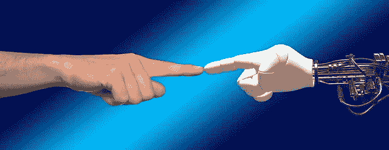

# 人工智能时代的产品定义

> 原文：<https://towardsdatascience.com/product-definition-in-the-age-of-ai-619a417e3415?source=collection_archive---------4----------------------->

十年前，软件正在吞噬世界。但是，现在看起来人工智能正在吞噬世界。没有一天不发布新的算法、框架或库，使得将复杂的数学转化为杀手级产品变得更加容易。然而，有一点似乎很明显，那就是人工智能软件的产品定义。

原因并不太难理解。定义人工智能产品很难，也没有行业标准的方法论可言。在这篇文章中，我不会试图提供任何银弹，而只是分享一些想法和经验。但是在我们跳到基于人工智能的软件的具体例子之前，让我们先来看两个来自软件世界的典型例子。

## 传统软件开发

我们对产品定义的大部分直觉和方法来自传统的软件开发。在理想的情况下，构建软件产品包括以下步骤:从关于消费者行为的业务假设开始，从假设中导出规范，根据规范构建软件，测试软件是否符合规范，在生产中部署软件，以及确定假设的有效性。

一个电子商务网站的商业假设的例子可能是“如果我们实现一次点击结账过程，那么这将导致更高的转化率”。商业假设是对商业直觉的编纂，这可能是由大量的市场研究提供的。然而，一旦一个假设被公式化，它的前提(如果和那么之间的部分)的范围通常是非常狭窄和简单的。

产品规格只不过是满足商业假设前提的必要和充分条件的表示。对于上述假设，相应的规范可以是一键结账流程的线框。注意，我们可以明确地从假设中推导出规格说明。根据规范构建软件是一件复杂的事情。然而，一旦构建完成，检查它是否满足规范是相对简单的。该规范为构建和测试软件提供了充分的基础。

规范和测试之间的联系尤其重要。为了测试的目的，一个软件被视为一个给定输入产生输出的系统。传统的软件测试依赖于一个完整的、独立的测试预言的存在，即枚举所有可能的输入并为每个输入生成预期输出的方法，独立于软件本身。鉴于此，测试的目标是“简单地”验证软件是否为每个输入产生正确的输出。测试预言来自规范，而规范又来自假设的前提。因此,(前提)假设的简单性和狭隘性在传统软件开发的可行性中起着决定性的作用。

在传统的软件开发中，开发团队的目标是通过根据业务直觉构建软件来为业务产生价值。业务假设和产品规范一起构成了业务和软件之间的重要桥梁，也是每个人交互的共同基础。因此，假设和规范需要以产品经理、软件开发人员和测试人员可以理解的方式编写。

在传统的做事方式(即瀑布)中，不同的步骤(如假设生成或规范)是为整个产品顺序执行的。每个步骤都由不同的专家小组执行，并在不同步骤之间进行详细交接。事实证明这是一种相当低效的做事方式。因此，在更现代的敏捷/精益方法中，产品在短时间的迭代中被构建成小块。名义上，整个团队参与执行每个切片的所有步骤。典型地，假设和规范被编纂在一个用户故事或一个近亲中。

## 学术科学计算

另一端是在物理学和相关领域常见的高性能科学计算。例子包括预测亚原子粒子行为的晶格量子色动力学，以及许多学科中的计算流体动力学。在科学计算中，编写一个软件来寻找某个问题的(通常是近似的)答案。

科学计算很少考虑到上面提到的假设/规范分裂。考虑晶格量子色动力学的例子。这里的基本假设是“如果我们用量子色动力学理论来计算物理量，那么它们将非常接近我们从实验中得到的结果”。构建一个软件来测试这一假设的规范可能包括量子色动力学方程和“构建一个软件来根据这些方程计算物理量”的戒律。这实际上是对晶格量子色动力学的合理描述，但作为规范并不好，因为它对我们测试软件没有帮助。

使用不同技术的组合来执行科学计算的测试:精确可解的情况(可能有一些输入的输出可以使用替代方法精确计算)，限制条件(通常结果在某些限制下容易计算，例如输入趋向于零或无穷大)，以及试探法(给定以前的经验，输出是否“有意义”)。与商业软件测试相比，科学计算中的测试覆盖率，即测试中包含的(输入，输出)对的比例，通常要低得多。此外，测试方法需要对领域有非常深刻的理解。通常，这不是一个问题，因为软件的构建和测试通常是由科学家完成的，而他们恰好也是领域专家。

一般来说，科学计算中的假设和软件之间没有明确的解耦。这导致了规范的概念没有多大用处。因此，完整而独立的测试预言是不存在的:软件是根据输入(问题)来计算输出(答案)的。如果我们有另一种计算答案的方法，那么我们就不需要首先编写软件了！

## 人工智能产品

就其核心而言，人工智能软件开发非常类似于学术科学计算，因为假设与软件紧密耦合，导致不存在测试预言。然而，基于人工智能的商业产品的构建方式与传统软件开发非常相似；受商业直觉的驱使。此外，基于人工智能的产品往往是在看起来非常类似于传统软件开发团队的团队中开发的，只是增加了一个或多个数据科学家。其核心性质和开发方法之间的这种阻抗使得产品定义对于基于人工智能的产品来说非常具有挑战性。

具体来说，让我们考虑一个电子商务网站推荐系统的典型例子。基于商业直觉的一个可能的假设可能是“如果向客户展示相关产品，那么转换率将会增加”。这个几乎显而易见的假设抓住了建立推荐系统背后的基本动机。此外，它的优点是任何参与构建电子商务软件的人都容易理解。它也足够广泛，可以支持非常强大的人工智能算法的开发。

但是，从定义产品的角度来看，这个假设并不好。不可能从中得出明确的规范。问题在于“相关”一词的模糊性——在这种情况下什么是相关的？当涉及到派生产品规格，以及构建和测试软件时，它并不是非常有用。

那么这给我们留下了什么？在我们继续深入之前，让我们试着去理解构建一个商业假设所涉及的不同维度。我认为，我们需要考虑两个主要的相关方面。

第一个维度是假设的一般性。传统的软件开发基于这样一种假设，即可以将市场研究和商业直觉提取到一组狭窄但有用的假设中，然后用这些假设来构建软件。另一方面，基于人工智能的算法的全部力量来自于能够从非常一般的假设出发。考虑前面提到的推荐系统的情况。我们可以将假设缩小到“如果我们向试图购买尿布的男性用户展示啤酒，那么这将增加篮子的大小。”显然，在这种情况下，我们将能够从中导出精确的规范，并构建软件来支持它。在这种情况下，恭喜你，你刚刚建立了你的第一个基于规则的系统！如果我们要利用人工智能的力量，那么这种狭隘的假设不是答案。

第二个维度是假设的可理解性。这种可理解性是关于普通产品开发团队的所有成员都知道的公共词汇。考虑假设“给定一个上下文(由用户的历史、用户的特征、产品目录定义)，以及在具有相似上下文的历史数据上训练的两个算法，其中相似性按照*<insert _ your _ favorite _ context _ similarity _ measure>*，如果基于来自具有较高分数的算法的推荐来显示产品*<your _ favorite _ evaluation _ metric _ here>*，那么这将导致较高的*<your _ favorite _ KPI _ here>尽管上面的假设对于支持算法开发来说是足够通用的，但是在目前，对于产品开发中的非数据科学家来说，它几乎是不可理解的。*

我们需要记住另一个重要的约束。真正面向业务的数据科学人才稀缺。因此，在谷歌和脸书这样的巨头之外，基于人工智能的产品将继续被开发，至少在不久的将来，在数据科学家、商业分析师、软件开发人员和软件测试人员的多样化团队中，他们充其量对彼此的领域有着肤浅的了解。

鉴于上述限制，我们不能完全牺牲可理解性。另一方面，如果我们要利用人工智能的力量，那么我们也不能完全牺牲通用性。然而，这里要注意的重要一点是，在大多数情况下，没有必要开发“最好的”或最强大的算法。相反，我们需要的是开发一个“足够好”的解决方案。然而，当你在构建一个新的东西时，通常不可能计算出达到“足够好”阶段所涉及的工作量(根据工时),也就是说，你不能用时间框来确定一个可行的解决方案！

事实上，足够好的界限可以也应该根据商业现实来设定。缺少的是常用词汇。为了理解共享词汇的重要性，让我们考虑一下科学研究的例子，特别是科学方法。通过敏捷和精益运动，科学方法已经在软件开发社区中得到推广。很大程度上没有强调的是，在一个学科中拥有一个通用词汇对于科学方法起作用的重要性。典型的科学方法包括试图通过建立一个假设来理解一个现象，从它构建一个理论，运行模拟和实验来验证它。这些步骤中的每一步通常由不同的科学家小组执行，他们可能不深入了解彼此的工作。然而，他们详细了解的是每一部作品中的主张和结果。这是可能的，因为它们共享一个词汇表。在物理学中，这个词汇通常是建立在数学之上的。在化学方面，除了数学和化学反应的语言。其他科学学科也是如此。

我们当前的软件开发词汇很大程度上是由 web 开发设定的。这种主要由线框构成的词汇在构思基于人工智能的产品时完全没有用，可能应该是第一个需要扔出窗外的东西。

与物理学一样，人工智能的常用词汇也建立在数学之上，更重要的元素是概率论和统计、线性代数和优化原理。人工智能产品开发的词汇表必须由上述的“用户友好”子集组成。例如，一个人能够创建和解释一个线框，而不需要理解 API 调用是如何进行的，或者市场研究是如何完成的。人工智能的“线框”相当于什么？我认为一个好的起点是描述性统计，即业务假设和产品规格至少需要使用描述性统计的词汇来编写。

在人工智能时代，另一个需要受到挑战的公认观点是，市场研究和软件开发是完全不同和分离的学科，软件的目标是提供一种验证商业假设的方法，而不是提供信息。对于基于人工智能的软件来说，这个假设显然是错误的。由于基于人工智能的软件中假设和软件之间的紧密耦合，几乎不可能将学习(或探索)和实践(或利用)阶段分开。有鉴于此，重要的是不仅要把人工智能作为验证商业直觉的工具，还要把它作为建立商业直觉的工具。

事实上，一旦一个人有了足够的知识，相关的动作要么可以直接导出，要么可以经常使用现成的人工智能算法来计算出相关的动作。因此，人工智能产品假说的主要焦点可能应该是学习，而不一定是做。而什么是需要学习的信息也应该由 AI 来告知。

与任何新的范式转换技术一样，业务流程需要一段时间才能跟上。AI 也不例外。从长远来看，我相信在更广泛的产品开发社区中对人工智能的基本理解是解决方案。然而，从短期来看，我们不能指望产品经理一夜之间成为数据科学家。然而，我们可以期待他们成为数据素养。另一方面，我们应该期待数据科学家从他们的算法中抬起头来，理解企业价值创造的基础。