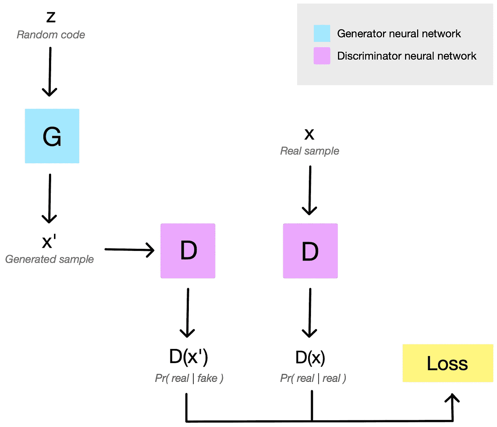
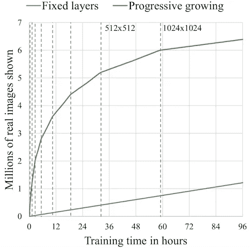
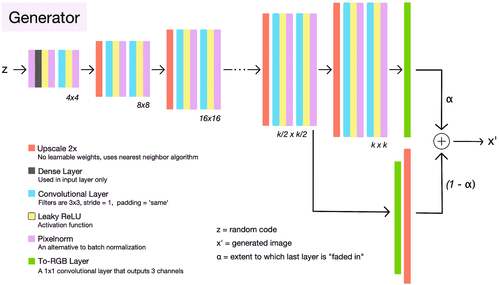
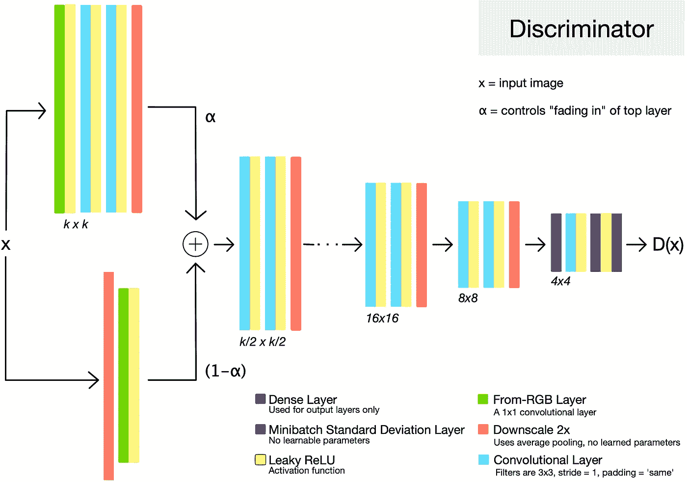

# ProGAN:NVIDIA 如何生成前所未有质量的图像

> 原文：<https://towardsdatascience.com/progan-how-nvidia-generated-images-of-unprecedented-quality-51c98ec2cbd2?source=collection_archive---------3----------------------->

Images generated by progressively growing GANs with ProGAN. These are not real people. *Image taken from the [paper](https://arxiv.org/pdf/1710.10196.pdf).

## 逐渐生长的 GANs 使它们变得更大更稳定

上面高分辨率图像中的人看起来可能是真实的，但实际上不是——他们是由一个对数百万名人图像进行训练的程序合成的。“ProGAN”是 NVIDIA 首创的一种生成性对抗网络的口语术语。Karras 等人去年在[为提高质量、稳定性和变异而进行的 GANs 渐进生长](https://arxiv.org/pdf/1710.10196.pdf)中发表了该研究。在这篇文章中，我们将通过这篇文章来了解这种类型的网络是如何工作的，它是如何产生像上面这样的图像的，以及为什么这是一个突破。

这篇文章假设你熟悉一般视觉任务的深度学习，但不是说你对 GANs 有广泛的了解。

# 甘斯简史

## 一种新的生成模型

生成敌对网络(GANs)已经存在几年了。蒙特利尔大学的 Ian Goodfellow 和他的同事在 2014 年的一篇[著名论文](https://arxiv.org/pdf/1406.2661.pdf)中介绍了它们，从那以后它们一直是一个热门的研究领域。

简而言之，GANs 是一种生成模型，它试图合成与训练数据难以区分的新数据。这是一种无监督学习的形式。它有两个竞争锁定的神经网络:一个是*发生器*，它被输入一个随机数向量并输出合成数据；一个是*鉴别器*，它被输入一条数据并输出它来自训练集的概率(与合成相对)。换句话说，生成器创建“假的”，鉴别器试图将这些“假的”样本与“真的”样本区分开来。

In a typical GAN, a random code z is fed into the generator G to produce a ‘fake’ sample. A discriminator network D is then (separately) fed both the generated sample x’, and a real sample x from the training set. It assigns a probability of being ‘real’ to each, which depends on how convincing the fake is, and how sophisticated the discriminator has become. Both these probabilities are then used to compute the adversarial loss, from which we train both D and G via backprop.

这两个网络开始时在它们的任务中表现很差，但是当训练顺利时，它们协同改进，直到生成器产生令人信服的假货。这两个网络陷入了一场零和游戏，其中一个网络的成功相当于另一个网络的失败。正因为如此，在任何给定时间损失函数的值都不能告诉我们系统整体训练得如何，只能告诉我们发生器或鉴别器相对于另一个做得如何。

我们输入到生成器中的随机代码尤其重要。它是使合成样本成为新的和独特的噪声源。它也倾向于以有趣的方式控制输出。当我们在随机码的向量空间周围进行线性插值时，相应生成的输出也进行平滑插值，有时甚至以我们人类直观的方式进行插值。

Digits obtained in a GAN trained on MNIST by linearly interpolating the random code z. As you can see, it appears to smoothly transition from a 1 to a 5, suggesting that it has learned some internal representation of these numbers. *Image taken from the [Goodfellow paper](https://papers.nips.cc/paper/5423-generative-adversarial-nets.pdf).

## 挑战和局限

虽然这对于对学习无标记数据表示的新方法感兴趣的研究人员来说非常令人兴奋，但是在实践中使用 GANs 通常是相当困难的。从一开始，从业者就注意到他们在训练中面临挑战。这很大程度上是由于一个叫做*模式崩溃*的问题。当鉴别器基本上“赢得”游戏，并且生成器的训练梯度变得越来越没用时，模式崩溃就会发生。这可能在训练期间相对较快地发生，并且当它发生时，生成器每次都开始输出几乎相同的样本。它停止变好。

就连伊恩·古德费勒也承认，他很幸运，因为他根据直觉尝试为他的第一个 GAN 选择的超参数有效——它们可能很容易失败。自那以后的几年里，研究界已经想出了许多方法来使训练更加可靠。某些体系结构似乎比其他体系结构工作得更好，并且已经探索了几种对抗性损失函数的变体。其中一些似乎比其他的更稳定。我建议[甘人生而平等吗？Lucic 等人的一项大规模研究](https://arxiv.org/pdf/1711.10337.pdf)，如果您想了解更多信息，这是一篇关于 GAN 景观的优秀综述。

然而，这些方法都没有完全消除这个问题，模式崩溃的理论原因仍然是一个积极的研究领域。

## 生成图像

图像生成的一个重大改进发生在 2016 年，当时拉德福德等人发表了[利用深度卷积生成对抗网络的无监督表示学习](https://arxiv.org/pdf/1511.06434.pdf)。他们发现了一系列 GAN 架构，可以很好地创建图像，简称为“DC GAN”。DCGANs 摆脱了某些 CNN 中使用的池层，并依靠卷积和转置卷积来改变表示大小。大多数层之后是批量规范化和泄漏 ReLU 激活。

然而，即使是 DCGANs 也只能创建特定大小的图像。图像的分辨率越高，鉴别者就越容易区分“真”图像和“假”图像。这使得模式崩溃的可能性更大。虽然合成 32x32 甚至 128x128 的图像已经成为常规的教程材料，但在实践中生成分辨率高于 512x512 的图像仍然具有挑战性。

我应该注意到，[一些图像到图像的转换技术](https://arxiv.org/pdf/1611.07004.pdf) *可以*处理高分辨率，但这是一项不同的任务，因为这些技术只学习改变输入图像的表面特征，而不是从头开始生成全新的图像。

可以想象，从零开始生成大型图像的困难严重限制了 GANs 在许多实际应用中的实用性。

# 向更高的图像分辨率发展

正是在这种背景下，NVIDIA 的团队在本文的顶部展示了由他们的新程序生成的令人震惊的 1024x1024 图像。更好的是，他们不知道为什么他们的技术不能用于合成更高分辨率的图像。这甚至比以前的 GANs 更有效率(就训练时间而言)。

## 生长 gan

该团队并没有像通常那样尝试一次训练发生器和鉴别器的所有层，而是逐渐地*生长*它们的 GAN，一次一层，以处理分辨率越来越高的图像版本。

The ProGAN starts out generating very low resolution images. When training stabilizes, a new layer is added and the resolution is doubled. This continues until the output reaches the desired resolution. By progressively growing the networks in this fashion, high-level structure is learned first, and training is stabilized.

为了做到这一点，他们首先人为地*将他们的训练图像缩小到一个非常小的起始分辨率(只有 4x4 像素)。他们创建了一个只有几层的生成器来合成这种低分辨率的图像，以及一个相应的镜像架构鉴别器。因为这些网络非常小，所以它们训练相对较快，并且只学习了在严重模糊的图像中可见的大规模结构。*

当第一层完成训练后，他们将另一层添加到 G 和 D，将输出分辨率加倍到 8×8。早期层中训练的权重被保留，但不被锁定，新层逐渐淡入以帮助稳定过渡(稍后将详细介绍)。训练继续进行，直到 GAN 再次合成令人信服的图像，这一次是在新的 8×8 分辨率下。

通过这种方式，他们继续添加图层，将分辨率提高一倍，并进行训练，直到达到所需的输出大小。

## 种植甘蔗的有效性

通过逐渐提高分辨率，我们不断要求网络学习整个问题中更简单的部分*。增量学习过程极大地稳定了训练。这与我们将在下面讨论的一些训练细节相结合，降低了模式崩溃的可能性。*

*从低到高分辨率的趋势也迫使逐渐增长的网络首先关注高级结构(在图像的最模糊版本中可辨别的模式)，然后填充细节。这通过降低网络将得到某些严重错误的高级结构的可能性来提高最终图像的质量。*

*逐渐增加网络规模也比一次初始化所有层的更传统的方法在计算上更有效。层数越少，训练速度越快，因为其中的参数越少。由于除了最后一组训练迭代之外的所有迭代都是用最终层的子集来完成的，这导致了一些令人印象深刻的效率增益。Karras 等人发现，根据输出分辨率的不同，他们的程序通常比相应的传统 GAN 快 2-6 倍。*

**

*This graph reflects the superior training efficiency of progressive growth. For a given amount of training time, ProGAN (green) was able to train on many more images than a traditional GAN (blue). The difference is most extreme in early training, since this is when the progressively grown network is smallest. *Image taken from the paper.*

# *建筑*

*除了逐渐扩大网络，NVIDIA 论文的作者还进行了其他几项架构更改，以促进稳定、高效的培训。*

*给定分辨率 *k* 的生成器架构遵循一个熟悉的高级模式:每组层都将表示大小加倍，并将通道数量减半，直到输出层创建一个只有三个对应于 RGB 通道的图像。鉴别器的作用几乎完全相反，它将制图表达的大小减半，并将每组图层的通道数加倍。在这两种网络中，通过将滤波器的数量限制在合理的值(如 512)来中断通道倍增模式，以防止参数的总数变得太高。*

*在这个意义上，ProGAN 类似于早期的图像生成 GANs。DCGAN 使用了类似的结构。*

*然而，DCGAN 使用*转置卷积*来改变表示大小。相比之下，ProGAN 使用*最近邻*进行向上扩展，使用*平均池*进行向下扩展。这些是简单的操作，不需要学习参数。然后是两个卷积层。*

**

*A detailed view of the generator architecture, when it has “grown” to resolution k. Each set of layers doubles the resolution size with a nearest neighbor upscaling operation followed by two convolutions. To stabilize training, the most recently added layer is “faded in”. This process is controlled by α, a number between 0 and 1 that is linearly increased over many training iterations until the new layer is fully in place.*

## *“淡入”新图层*

*每次在现有分辨率下完成训练时，通过添加一组新的层使分辨率加倍，网络逐渐增长。当添加新层时，先前层中的参数保持可训练状态。*

*为了防止突然增加新的顶层对先前存在的较低层造成冲击，顶层被线性“淡入”。这种淡入由参数 *α* 控制，该参数在许多训练迭代过程中从 0 线性插值到 1。如上图所示，最终生成的图像是生成器中最后一层和倒数第二层的加权和。*

## *像素标准化*

*作者使用了*像素归一化*，而不是通常使用的批量归一化。这个“pixelnorm”层没有可训练的权重。它将每个像素中的特征向量归一化为单位长度，并应用于生成器中的卷积层之后。这样做是为了防止信号幅度在训练期间失控。*

**

*The values of each pixel (*x, y)* across *C* channels are normalized to a fixed length. Here, **a** is the input tensor, **b** is the output tensor, and **ε** is a small value to prevent dividing by zero.*

## *鉴别器*

*生成器和鉴别器大致是彼此的镜像，并且总是同步增长。鉴别器获取一个输入图像 *x* ，它或者是发生器的输出，或者是缩小到当前训练分辨率的训练图像。作为典型的 GAN 鉴别器，它试图将“真实的”训练集图像与“虚假的”生成的图像区分开。它输出 D(x)，这是一个捕获鉴别器对输入图像来自训练集的置信度的值。*

**

*A detailed view of the discriminator architecture, when it has “grown” to resolution k. Here, x is the input image (either generated or from the training set), α is the extent to which the last generator layer is “faded in”, and D(x) is the probability the generator has assigned to x being from the training set. The representation size is halved at each set of layers by an average pooling operation.*

## *小批量标准偏差*

*一般来说，GANs 倾向于产生比训练集中发现的*变化少*的样本。解决这一问题的一种方法是让鉴别器计算整个批次的统计数据，并使用该信息来帮助区分“真实的”训练数据批次和“虚假的”生成的批次。这鼓励生成器产生更多的变化，使得跨生成的批次计算的统计数据更接近于来自训练数据批次的统计数据。*

*在 ProGAN 中，这是通过在鉴别器末端附近插入一个“迷你批次标准偏差”层来实现的。这一层没有可训练的参数。它计算整批特征图像素的标准偏差，并将它们作为额外通道附加。*

## *均衡学习率*

*作者发现，为了确保发生器和鉴别器之间的良性竞争，各层以相似的速度学习是至关重要的。为了达到这个*均衡学习率*，他们根据一个层的权重来缩放该层的权重。他们使用与在 [He 初始化](https://arxiv.org/pdf/1502.01852.pdf)中使用的相同公式来做这个，除了他们在训练期间每个向前传球时在*中做这个，而不仅仅是在初始化时。**

**

*Learning rates can be equalized across layers by scaling the weights before every forward pass. For example, before performing a convolution with *f* filters of size [k, k, c], we would scale the weights of those filters as shown above.*

*由于这种干预，权重初始化不需要任何花哨的技巧——简单地用标准正态分布初始化权重就可以了。*

# *损失函数*

*作者表示，损失函数的选择与他们的贡献是正交的——这意味着上述改进都不依赖于特定的损失函数。使用最近几年出现的任何流行的 GAN 损耗函数都是合理的。*

*然而，如果你希望完全遵循这篇论文，他们使用了改进的 Wasserstein 损失函数，也称为 [WGAN-GP](https://arxiv.org/pdf/1704.00028.pdf) 。这是一个比较常见的损失函数，已经被证明可以稳定训练，提高收敛的几率。*

**

*The WGAN-GP loss equations. Here, x’ is the generated image, x is an image from the training set, and D is the discriminator. GP is a gradient penalty that helps stabilize training. The **a** term in the gradient penalty refers to a tensor of random numbers between 0 and 1, chosen uniformly at random. It is common to set λ = 10\. Since we usually train in batches, the above losses are usually averaged over the minibatch.*

*需要注意的是，WGAN-GP 损失函数期望 D(x)和 D(x’)是无界的实数值。换句话说，鉴别器的输出是*而不是*预期的 0 和 1 之间的值。这与传统的 GAN 公式略有不同，后者将鉴频器的输出视为概率。*

# *结果*

*如果你已经做到了这一步，恭喜你！现在，您已经对最先进的图像生成算法之一有了很好的理解。如果你想看到更多的训练细节，有一个由 NVIDIA 团队发布的优秀的[官方实现](https://github.com/tkarras/progressive_growing_of_gans)。他们也有一个关于这个话题的[谈话](https://www.youtube.com/watch?v=ReZiqCybQPA)。*

**

*The output of ProGAN when we smoothly interpolate over the input vector, z.*

*感谢阅读！我希望这是一个有用的概述。如果你对这篇文章有任何问题、修正或建议，请留下你的评论。*