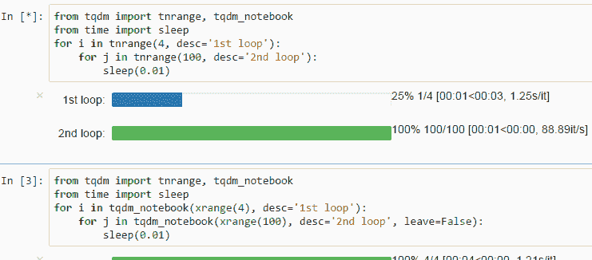

# Python 中的进度条

> 原文：<https://towardsdatascience.com/progress-bars-in-python-4b44e8a4c482?source=collection_archive---------3----------------------->

就像被监视的锅永远不会沸腾一样，被监视的循环永远不会结束。当处理大型数据集时，即使是最简单的操作也会花费*小时*。进度条有助于减少数据处理工作的麻烦，因为:

1.  你会得到一个可靠的估计需要多长时间。
2.  如果卡住了，你可以立即看到。

第一点在商业环境中尤其有价值，有一个可靠的交货估计可以让你看起来非常专业。我发现的给 Python 代码添加进度条的最好的/唯一的方法是使用 [tqdm](https://github.com/tqdm/tqdm) 。虽然 tqdm 超级容易使用，但是设置起来可能有点麻烦，尤其是如果您使用 [JupyterLab](https://jupyterlab.readthedocs.io/en/stable/) (您完全应该这样做)。



tqdm in action

在仔细研究了 StackOverflow 和一些尝试和错误之后，我想我已经找到了一个让 tqdm 启动并运行的可靠方法(即使是使用 JupyterLab)！

# 设置 tqdm

首先，用您选择的包管理器(pip、pipenv、anaconda 等)安装 tqdm。安装完成后，您可以运行以下命令来激活 JupyterLab 的 ipywidgets 插件，

```
> pip install ipywidgets 
> jupyter nbextension enable --py widgetsnbextension
> jupyter labextension install @jupyter-widgets/jupyterlab-manager
```

要在笔记本中激活 tqdm，您只需添加一个单元格，

```
%%capture
from tqdm import tqdm_notebook as tqdm
tqdm().pandas()
```

如果您只是打算在脚本中使用 tqdm，那么您可以跳过这两个步骤！

# 使用 tqdm

用`tqdm()`包装任何 iterable 都可以得到进度条。举个例子，

```
my_list = list(range(100))for x in tqdm(my_list):
    pass
```

会给你一个(非常快的)进度条。您还可以更明确地使用 tqdm，

```
my_list = list(range(100))with tqdm(total=len(my_list)) as pbar:
    for x in my_list:
        pbar.update(1)
```

还有一个熊猫的整合，

```
df.progress_apply(lambda x: pass)
```

关于使用 tqdm 的更多内容，包括嵌套进度条，请查看他们的[文档](https://github.com/tqdm/tqdm)。