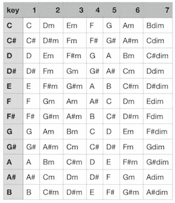
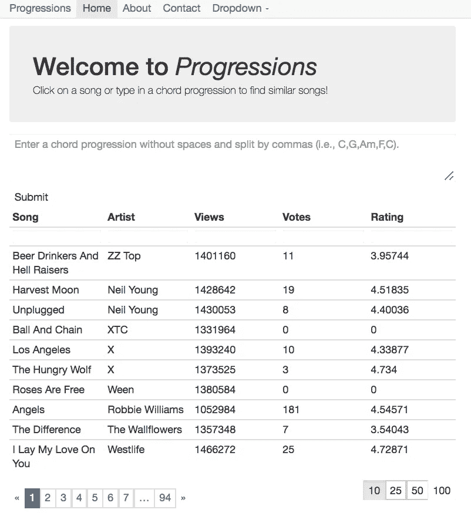
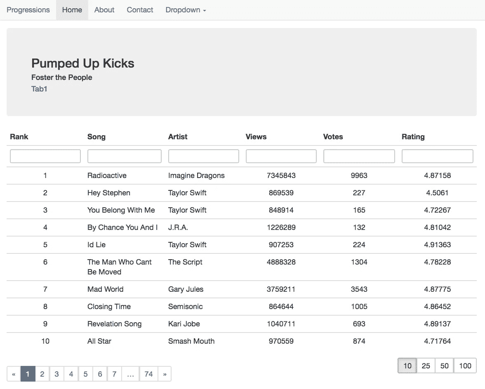

# 级数

> 原文：<https://towardsdatascience.com/progressions-eb79a573f7f1?source=collection_archive---------4----------------------->

## 利用马尔可夫链提取歌曲相似度

你和你的朋友在公路旅行，播放列表中出现了经典的 *Ice Ice Baby* 简介。为了这一刻，你已经在浴室里练习了 1000 次；这是你的重大突破。引子结束时，你突然开始一段激烈的说唱，只听到:

> “嗯，巴巴·德
> 嗯，流浪汉巴德……”——女王

这是皇后乐队的《压力下的 T3》和《T4》，在接下来的旅程中，你尴尬地沉默着，承受着谦卑的压力。

不要对自己太苛刻！许多歌曲听起来极其相似，无论是相似的旋律还是匹配的歌词。现代歌曲往往遵循同样的和弦结构。这就是为什么有时你可能会听到一首歌曲的器乐部分，并认为这是一首不同的歌曲。现代音乐并不缺乏创造力或创新，而是朝着观众认为在审美上悦耳的方向发展。

*Progressions* 是一个网络应用程序，允许你选择一首歌曲或键入和弦进行，并对和弦进行类似的其他歌曲进行排名。这对初学吉他的人来说可能是有用的，可以增加他们的弹药库，找到与他们已经知道的歌曲相似的歌曲。这也可以帮助音乐编曲者找到他们可以拼凑成一首混合曲或混搭曲的曲调。或者你可以简单地用它来探索流行歌曲之间的相似性。

*先决条件:使用术语和概念时对音乐理论的基本理解*

## 介绍

仅仅一首歌就包含了丰富的信息。每个小节、和弦、音符、节奏值和音量强度都会随时间变化。此外，每种乐器或声音都会发出不同的音调属性，从而创建数据层。除此之外，我们还有关于歌曲基调、创作时间、流派等等的元数据。音乐学家多年的研究让位于从提取主题或可识别的结构以及历史背景中识别歌曲的复杂性。自然语言处理[技术](http://delivery.acm.org/10.1145/1110000/1101255/p475-mahedero.pdf?ip=67.180.210.112&id=1101255&acc=ACTIVE%20SERVICE&key=80B0E63637265656%2ED9E958667DF7F097%2E78574B55C43443F5%2E4D4702B0C3E38B35&__acm__=1530683532_be4fe869b795fe7959aa791adefc97ec)已经被用于分析歌词，而录音的[信号处理](http://signalprocessingsociety.org/sites/default/files/uploads/publications_resources/SPM_SI_Music_SP.pdf)已经被用于诸如[流派分类](https://ieeexplore.ieee.org/abstract/document/1021072/)之类的事情。世界上有超过 9700 万首歌曲，音乐无疑提供了大数据。

音乐的时间性允许我们把一首曲子作为一系列事件来分析。例如，[约翰·科尔特兰的《大踏步》](https://www.youtube.com/watch?v=30FTr6G53VU) improv 就是一系列不同音符的简单组合，带有一点随机性。这让我们可以将音乐建模为一个随机过程，一系列发生在某个时间媒介上的随机事件。

对随机过程建模的一个简单方法是使用马尔可夫链。一阶马尔可夫链遵循下面的简单性质。

Markov Property

这就是说，序列中下一个状态的概率只是有条件地依赖于当前状态。在一段旋律中，下一个音符的值只取决于当前的音符，而不考虑之前旋律的其余部分。关于马尔可夫链更深入的解释可以在我之前的文章[这里](/https-towardsdatascience-com-markovian-blues-ba35ce9f21d4)中找到。

在这个项目中，我们将给定歌曲的每个和弦视为一阶马尔可夫模型中的一个状态。我们如何得到和弦，我们从哪里得到歌曲？

## **数据集**

数据来自于《终极吉他》,我们在那里搜集了有史以来最受欢迎的 1000 个标签。在此，我们提取了用户在该网站上列出的 1000 首歌曲的歌名、艺术家、和弦和流行度。所有的数据都存储在 MySQL 数据库中。在[报告](https://github.com/Ljfernando/Progressions)的自述文件中可以找到更详细的关于抓取方法和数据库设置的描述。

## 寻找相似之处

有了我们的歌曲集，我们希望能够选择一首歌曲，然后根据和弦进行找到与之相似的歌曲。用于存储马尔可夫模型的数据结构是转移矩阵。因此，对于每首歌，我们创建一个转换矩阵，存储从一个和弦到另一个和弦的概率。借助可靠的线性代数，我们可以找到矩阵之间的[欧几里德距离](http://dorienherremans.com/sites/default/files/paper-bagana.pdf)。

Euclidean Distance Between Transition Matrices

这个公式着眼于两个转移矩阵，用不同的概率符号表示。这给了我们歌曲之间的距离，其中固有的更短的距离意味着分布更接近(更相似)，反之亦然。

在这个项目中，我们更关注歌曲的和弦结构，而不是和弦名称或音调。比如[披头士:随遇而安](https://www.youtube.com/watch?v=2xDzVZcqtYI)沿用了[标志性的](https://en.wikipedia.org/wiki/I%E2%80%93V%E2%80%93vi%E2%80%93IV_progression)**C 调的 I-V-vi-IV** 和弦结构，和弦名称为 **C-G-Am-F** 。阿黛尔的《像你这样的人》在相似度上排名第三，并且有一个和弦进行的合唱。这也是 **I-V-vi-IV** 结构但现在在 a 调中，因此，我们可以突出显示结构相似的歌曲而不管原来的调。

## 一点数据管理

如果我们所有的歌曲都是 c 调，那么确定和弦结构就容易多了。当然，我们数据库中的歌曲并不都是同一个调。因此，我们必须想出一种方法来确定给定歌曲的基调。

当用户在 UltimateGuitarTabs 上创建标签时，他们可以选择输入他们正在跳转的歌曲的音调。尽管如此，它并不完全可靠。有些歌曲需要变音器，因此键和变音器指示品不在一条线上。一些用户输入了完全错误的密钥，而另一些用户根本没有输入密钥。

Key Table

音乐理论告诉我们，当我们处于一个特定的调时，只有某些和弦会听起来很好听。每一行都包含可能的和弦，如果一首歌曲在那个特定的调上，就可以播放这些和弦。我们所要做的就是计算每一个和弦被弹奏的次数，然后计算每一行的总和。具有最大总和的行将被标记为该歌曲的关键字。

因为这个键表只包含大调、小调和减和弦，我们还必须清理我们提取的和弦，以移除任何其他和弦质量(即，sus、7、13、aug 等)。

> 注意:这是一种启发式方法，决不会每次都给你正确的密钥，但这是我们目前能做的最好的了。

所有的抓取、存储和转换都在 Python3 中完成。现在我们有了清晰的和弦和确定相似性的方法，我们现在可以构建应用程序了！

## 建立和使用级数

我们决定使用 Flask+Angular.js 来创建应用程序。Flask 使我们能够将数据发送到前端，Angular.js 允许我们在引导 HTML 页面上很好地显示数据。我们的 Flask 功能还与 MySQL 数据库交互以查询数据。

Main View of Progressions

用户既可以点击表格中的歌曲，也可以输入自己的和弦进行！当用户点击一首歌曲时，会出现一个新页面，显示类似歌曲的列表，以及 UltimateGuitar 上原始标签的链接。当用户提供和弦进行时，显示和弦进行的估计键以及数据库中的类似歌曲。

Result after choosing Pumped Up Kicks by Foster the People

## **总结**

我们从 UltimateGuitar 上的前 1000 个排行榜中搜集和弦序列，并将所有信息存储在 MySQL 数据库中。我们*将所有和弦序列标准化为 C 调，只包含大调、小调和减和弦。使用马尔可夫模型，我们为每首歌曲的和弦序列创建了一个转移矩阵，并且能够计算歌曲之间的欧几里德距离来测量相似性。使用 Flask 和 Angular.js 通过 web 应用程序显示结果。*

## 未来的工作

*   正如我们之前所说，一阶马尔可夫链是对和弦进行序列建模的基本方法。因此，使用高阶或变阶马尔可夫模型可以改进应用。
*   我们寻找答案的方法是一种基本的音乐理论技巧。使用信号处理技术或隐马尔可夫模型来分类歌曲关键字的其他新颖方法已经被使用，但是可能不适合这个数据集。需要对音乐信息检索领域进行更多的研究。
*   去除和弦质量以仅具有大调/小调和弦降低了我们寻找相似歌曲的方法的准确性。在我们的计算中，我们可能想把复杂的弦和简化的弦都包括进去。例如，如果一首歌曲有和弦 Cmin6/G，我们可能希望在状态空间中使用该和弦及其基础 Cm。但是，在我们的转换矩阵中存储所有的和弦类型会创建非常大的稀疏填充的矩阵。计算出的距离平均会更短。
*   可以使用除欧几里得距离度量之外的其他距离度量。使用像 Kullback-Leibler (KL)散度这样的度量是比较概率分布的一种选择。我们对转移矩阵(TM)的使用使得这变得复杂，因为我们可以计算 KL-divergence 行的歌曲，但不是作为一个整体。此外，任何距离矩阵的功效都依赖于我们的建模方法，在这种情况下，这是一个简单的一阶马尔可夫链。
*   因为我们的焦点是找到具有相似和弦结构的歌曲，所以确定歌曲的真实和弦结构(即，I-V-vi-IV)并将其显示给用户也是必要的。

> 应用程序的存储库可以在这里找到。它仍然是一项正在进行中的工作，所以建议是高度鼓励！
> 
> 查看我之前在[发表的关于使用可变长度马尔可夫模型人工生成布鲁斯旋律的帖子](/https-towardsdatascience-com-markovian-blues-ba35ce9f21d4)
> 
> 如有任何问题，请随时联系 [me](https://ljfernando.github.io/) ！希望你喜欢这篇文章！